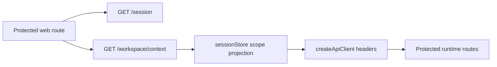
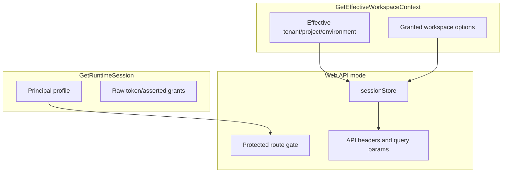

# Fowler Architecture Analysis: Web/API Remediation Branch

Date: 2026-05-10
Reviewer: Codex

## Scope

This analysis covers the current branch delta relative to `origin/main`:

- `test(engine): Normalize workflow fixture branded values`
- `docs(docs): Document web API integration gaps`
- `fix(web): Fail closed for missing workspace API rails`

It also uses the active remediation log:
`buzon/20260510-web-api-remediation-execution-log.md`.

## Executive Read

The branch improved one mature-system pattern: the web API workspace adapter now
fails closed when a backend rail does not exist. That moves the system away from
"TypeScript method exists, therefore product capability exists" and toward a
proper Gateway boundary.

The remaining architecture issue is not route parity. It is semantic authority.
The UI still has local authority over active workspace scope through env and
localStorage. A mature system separates authentication from effective workspace
context:

- authentication/session says who the principal is;
- workspace-context query says what workspace scope the backend grants now;
- command/query adapters carry that granted scope;
- browser presentation may display and cache context, but not invent it.

## Comparison With Mature Systems

| Concern             | Mature system posture                                               | Current branch posture                                                     | Gap                                                                    |
| ------------------- | ------------------------------------------------------------------- | -------------------------------------------------------------------------- | ---------------------------------------------------------------------- |
| HTTP adapter        | Gateway fails closed for missing backend capabilities.              | Improved: unsupported workspace rails throw typed errors before transport. | Good pattern, but still inside broad `IWorkspacePort`.                 |
| Session             | Session endpoint authenticates principal and grants.                | `GET /session` does this and should stay narrow.                           | Review text still permits extending `/session` with workspace context. |
| Effective workspace | Separate read model/query projects server-granted active workspace. | Missing. UI builds scope from env/localStorage.                            | Add dedicated `GetEffectiveWorkspaceContext` query.                    |
| Frontend stores     | Local stores hold presentation state only.                          | `sessionStore` holds command scope used by API headers.                    | Seed from backend in API mode before protected route render.           |
| Command/query rails | Every product capability has a rail.                                | Route parity docs identify missing rails.                                  | Add rail for effective workspace context.                              |
| Mock/demo           | Clearly fenced demo state.                                          | Mock mode still behaves like small runtime.                                | Future slice should fence demo semantics visibly.                      |

## Improved Patterns

### Gateway

`createApiWorkspaceService` now behaves like a Gateway in Fowler terms: it
adapts the presentation port to backend HTTP and rejects capabilities that have
no backend route. This is better than issuing calls to `/diff/changes`,
`/plugins`, `/admin/roles`, `/admin/audit`, or workspace file writes.

### Fail-Closed Policy

`WorkspaceApiCapabilityUnsupportedError` names both the unavailable capability
and the missing rail. That is a useful policy object: callers can distinguish
"backend denied" from "this rail does not exist".

### Deterministic Test Fixture

The engine fixture change branded plan refs and timestamps explicitly. That
removes TypeScript ambiguity and keeps deterministic plan identity in tests.

## Antipatterns Still Present

| Antipattern                       | Local evidence                                                                                      | Risk                                                                         |
| --------------------------------- | --------------------------------------------------------------------------------------------------- | ---------------------------------------------------------------------------- |
| God Port                          | `IWorkspacePort` owns graph, diff, plugins, RBAC, audit, source import, file read, file write.      | Local methods hide whether a real command/query rail exists.                 |
| Session as ambient authority      | `sessionStore` persists tenant/project/environment and `createApiClient` injects them into headers. | UI can present or send an ungranted scope before backend denial.             |
| Possible Transaction Script drift | `AuthRouteGate` currently performs session resolution inline.                                       | Adding workspace context there directly would grow component responsibility. |
| Route literal repetition          | `/session` and workspace route strings live in route code and tests without a web route catalog.    | Rename or split can drift silently.                                          |
| Mock Runtime                      | mock services create plans, runs, graph revisions, audit, imports, and files.                       | Demo behavior can masquerade as product truth.                               |

## Components To Group

### Protected Session Component

Owns: authenticate bearer token and expose principal profile.

Keep in:

- `apps/api/src/entrypoints/http/sessionRoute.ts`
- `apps/web/src/app/bootstrap/AuthRouteGate.tsx`

Do not add workspace selection or effective context here.

### Effective Workspace Context Component

Owns: server-granted active workspace scope for protected web runtime.

Create as:

- API query route: `GET /workspace/context`
- API query/read model: `EffectiveWorkspaceContext`
- Web resolver: protected route startup loads session, then workspace context
- Store handoff: `sessionStore.setSessionContext(...)` receives backend scope

### Workspace Resource Components

Split later by rail:

- graph draft read/write;
- workspace files read;
- diff read model;
- plugin catalog;
- admin RBAC read;
- admin audit read;
- source import command/query;
- artifact/provenance write.

## Drift

### Documentation Drift

The active review says "Extend `GET /session` or add a workspace context query."
After the architecture challenge, the correct decision is stricter: do not
extend `GET /session`; add `GetEffectiveWorkspaceContext`.

### Code Drift

`sessionStore` has an owned concern comment, but in API mode it is still both a
local shell selector and the source used by transport headers. That is too much
authority for a browser store unless it is seeded from server-granted context.

### Test Drift

The route-parity test validates missing workspace rails in the API adapter. It
does not yet validate the semantic invariant that protected API mode cannot
render application routes before a backend workspace context is available.

## Opportunity Applied

`GetEffectiveWorkspaceContext` has been added as a dedicated query rail for the
active remediation slice.

The slice now:

1. Keeps `GET /session` as session-only.
2. Adds `GET /workspace/context`.
3. Resolves effective workspace context from backend grants.
4. Makes the web protected route resolver apply that context before rendering.
5. Adds semantic architecture tests proving `/session` and workspace context are
   separate rails.

## Target Shape

## Responsibility Split

## Lessons For Future Slices

- Do not make session endpoints absorb adjacent read models.
- When a frontend port spans many bounded contexts, add typed unavailable
  outcomes first, then split by rail.
- Keep UI stores as projections. If they feed command scope, seed them from a
  backend read model before use.
- Architecture tests should validate semantic ownership, not only import shape.
- Feature mechanization is useful but expensive; keep slices narrow enough that
  the manifest is readable and actionable.

## Remediation Applied

Apply the `GetEffectiveWorkspaceContext` pattern.

This fixes a concrete drift without completing every future split of
`IWorkspacePort`. It also answers the prior concern: `/session` must not grow
workspace-context responsibility.

Implemented code anchors:

- `apps/api/src/application/ports/workspaceContext.ts`
- `apps/api/src/entrypoints/http/workspaceContextRoute.ts`
- `apps/api/src/infrastructure/auth/embeddedWorkspaceContextQuery.ts`
- `apps/web/src/app/services/session/protectedRouteSessionContext.ts`
- `apps/web/src/app/bootstrap/AuthRouteGate.tsx`

Implemented documentation anchors:

- `docs/adr/ADR-0055-server-owned-effective-workspace-context.md`
- `docs/architecture/components/web/appshell/effective-workspace-context-component.md`
- `docs/architecture/components/web/appshell/effective-workspace-context-user-stories.md`
- `docs/planning/proposals/mandatory/frontend-and-ux/web-api-effective-workspace-context-remediation-plan-20260510.md`
