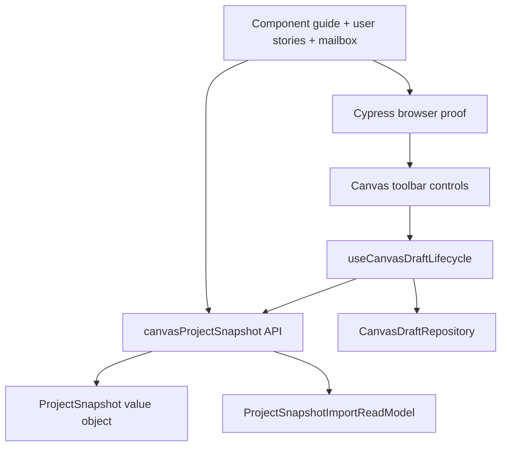
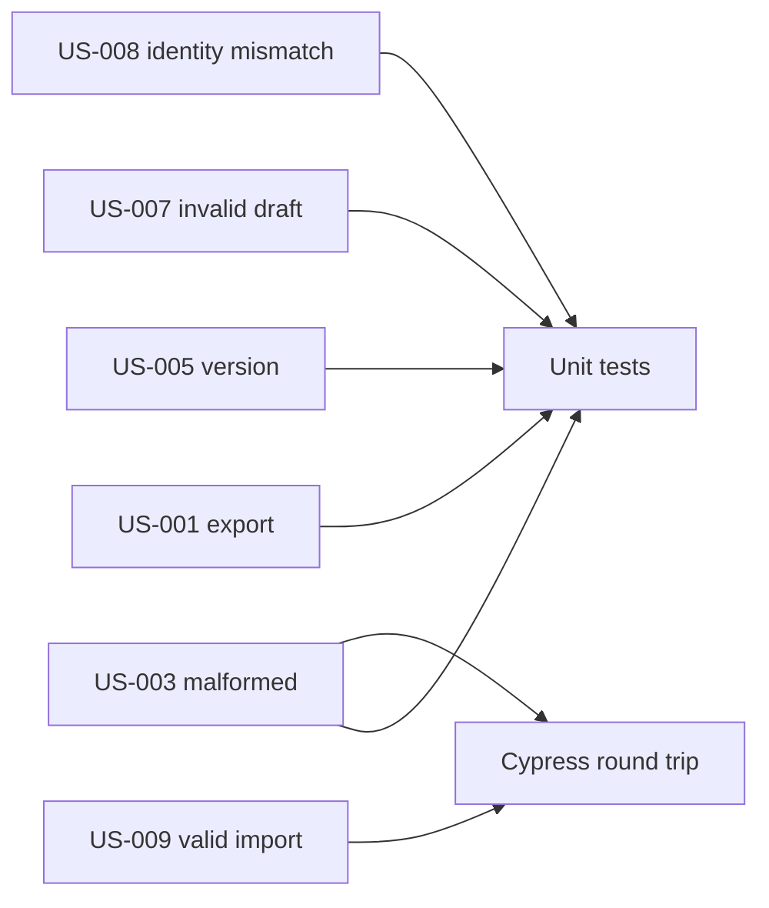

# Canvas Project Snapshot Fowler Analysis And Remediation

## Scope

This mailbox records the Fowler/DDD review for the Canvas Stage 3 project
snapshot branch.

It covers:

- project snapshot export from the persisted Canvas authoring draft;
- file-format versioning and validation before import;
- fail-closed rejection semantics;
- import through the existing protected draft save rail;
- local component documentation, user stories, diagrams, and semantic
  architecture-test closure.

It does not cover backend Project Assets, stable multi-version compatibility,
new API contracts, adapters, engine behavior, or a manual Save command.

## Governing Sources

- `AGENTS.md`
- `docs/planning/status/governance-document-rule-inventory.md`
- `docs/guides/ai-work-protocol.md`
- `docs/architecture/command-query-rail-governance.md`
- `docs/architecture/fowler-opportunity-planning-governance.md`
- `docs/architecture/components/web/graph/canvas-workbench-command-query-catalog.md`
- `docs/architecture/components/web/graph/canvas-project-snapshot-component.md`
- `docs/architecture/components/web/graph/canvas-project-snapshot-user-stories.md`
- `docs/planning/proposals/mandatory/frontend-and-ux/canvas-workbench-stage-3-project-snapshot-roundtrip-plan-20260511.md`

## Fowler Verdict

The branch improves the system by turning "download/upload JSON" into named
domain behavior: `ExportProjectSnapshot`, `ValidateProjectImport`, and
`ImportProjectSnapshot`.

The first implementation had a useful value object, but the semantic component
boundary was still under-described. The code could be read as a helper file
plus toolbar wiring instead of a local component with an API, invariants,
transitions, consumers, and browser proof. This remediation closes that gap.

## Mature-System Comparison

Mature workbench systems separate four concerns:

1. file serialization;
2. import anti-corruption;
3. domain persistence authority;
4. passive UI controls.

They do not let a file upload become a repository write directly. A mature
system first identifies the file envelope, checks version compatibility, maps
the payload to a governed domain aggregate, and only then calls the existing
application command. The Canvas branch now follows that shape:

- `ProjectSnapshot` is the file envelope value object;
- `ProjectSnapshotImportReadModel` is the validation outcome;
- `CanvasDraftRepository.saveGraphDraft` remains the persistence authority;
- toolbar controls raise commands but do not inspect snapshot internals;
- Cypress proves browser behavior without seeding the protected draft.

## Pattern Improvements

<!-- markdownlint-disable MD060 -->

| Area              | Improved pattern                    | Evidence                                                                  |
| ----------------- | ----------------------------------- | ------------------------------------------------------------------------- |
| File envelope     | Replace Primitive with Object       | `ProjectSnapshot` includes format, version, project, canvas               |
| Import boundary   | Anti-corruption Layer               | `canvasProjectSnapshot.validateImport` rejects before save                |
| Command naming    | Intention-Revealing Interface       | `ExportProjectSnapshot`, `ValidateProjectImport`, `ImportProjectSnapshot` |
| Persistence       | Service Layer over existing command | lifecycle uses `CanvasDraftRepository.saveGraphDraft`                     |
| UI surface        | Passive View                        | toolbar forwards file events and command availability                     |
| Architecture test | Semantic Fitness Function           | `canvasProjectSnapshot.architecture.test.ts` guards docs/API/rails        |

## Antipatterns Detected

| Antipattern           | Signal                                                              | Remediation                                                    |
| --------------------- | ------------------------------------------------------------------- | -------------------------------------------------------------- |
| Primitive obsession   | Snapshot JSON could become an unversioned blob.                     | Add `ProjectSnapshot.format` and `schemaVersion`.              |
| Hidden authority      | Import could write graph state before validation.                   | Validate first and reject typed failure reasons before save.   |
| Semantic under-naming | The first slice exposed helper functions without a component API.   | Add namespaced `canvasProjectSnapshot` API.                    |
| Test repetition       | Snapshot tests repeated export setup across rejection cases.        | Add one local snapshot fixture helper.                         |
| Documentation drift   | Catalog and plan named rails, but no local component guide existed. | Add guide, stories, mailbox, and architecture guard.           |
| UI feature envy       | Toolbar could have owned file semantics.                            | Keep toolbar passive; lifecycle and snapshot API own behavior. |

<!-- markdownlint-enable MD060 -->

## Component Grouping



Recommended grouping:

- component API: `canvasProjectSnapshot.ts`
- application-controller consumer: `useCanvasDraftLifecycle.ts`
- passive controls: `CanvasToolbarPrimaryControls.tsx` and shell propagation
- semantic proof: `canvasProjectSnapshot.architecture.test.ts`
- behavior proof: `canvasProjectSnapshot.test.ts` and Cypress round trip
- documentation: component guide, user stories, and this mailbox

## Repetitions Fixed

- repeated snapshot export setup in unit tests is collapsed into
  `buildSnapshotContents`;
- repeated rail explanations now link through
  `canvas-project-snapshot-component.md` and the C&Q catalog;
- repeated import negative cases are expressed as user stories and typed
  rejection reasons instead of prose-only acceptance criteria;
- repeated "toolbar owns import" language is replaced with the passive-view
  rule: toolbar raises events, lifecycle and snapshot API own behavior.

## Code And Documentation Drift

Observed code drift:

- `canvasProjectSnapshot.ts` existed as a useful value-object module, but not
  as a namespaced semantic component API.
- `useCanvasDraftLifecycle.ts` imported helper functions directly, making the
  component boundary less visible at the call site.
- the new unit test and Cypress spec lacked owned-concern docblocks.

Observed documentation drift:

- the C&Q catalog had project snapshot rails, but no component guide explained
  public API, invariants, transitions, and consumers;
- user stories were embedded in the implementation plan instead of a local
  story matrix;
- the closeout had outcome evidence, but no branch-level Fowler comparison
  against mature systems.

Remediation:

- add `canvasProjectSnapshot` as the semantic public API;
- update lifecycle to consume that API;
- add local component guide, user stories, and mailbox review;
- add semantic architecture test that guards docs, API, rails, docblocks, and
  browser rejection semantics;
- keep `pnpm verify:prepush` as the final drift gate.

## Opportunities

<!-- markdownlint-disable MD060 -->

| Opportunity                                                  | Fowler classification         | Next action                                                                 |
| ------------------------------------------------------------ | ----------------------------- | --------------------------------------------------------------------------- |
| Backend Project Assets persistence                           | Separate bounded context      | Future ADR plus API/adapter/contracts slice                                 |
| Multi-version snapshot compatibility                         | Strategy or Versioned Adapter | Add only when a second supported version exists                             |
| Cross-workspace import authorization                         | Policy Object                 | Keep import scoped to current workspace until backend asset semantics exist |
| Snapshot preview before import                               | Presentation Model            | Add a read-only preview model before any richer import UX                   |
| Component-wide architecture tests for toolbar command groups | Semantic Fitness Function     | Repeat this pattern for future workbench command families                   |

<!-- markdownlint-enable MD060 -->

## Lessons For Future Work

- A file handoff must be named as a component before toolbar wiring grows.
- "JSON export" is not a feature name; the feature is the command/query rail.
- The import rejection vocabulary should be designed before the UI copy.
- Browser e2e proof should include at least one fail-closed import path.
- Component docs should be created before closeout, not after reviewers ask for
  semantic encapsulation.
- A namespaced API is useful when a local component has more than one public
  operation and several exported type names.

## User-Story Coverage



The canonical story matrix lives in
`docs/architecture/components/web/graph/canvas-project-snapshot-user-stories.md`.

## ADR Decision

No new ADR is required for this remediation.

Reason:

- no backend contract is introduced;
- no engine, adapter, planner, or protected draft authority changes are made;
- the file format is explicitly local and versioned as a Stage 3 proof, not a
  stable cross-system compatibility contract;
- the decision is sufficiently governed by the C&Q catalog, component guide,
  user stories, semantic architecture test, and feature-mechanization manifest.

A future backend Project Assets slice, stable multi-version snapshot contract,
or cross-workspace import authorization change must revisit ADR need before
implementation.

## TDD Evidence

- RED:
  `pnpm --filter @dvt/web test -- src/app/views/canvas/canvasProjectSnapshot.architecture.test.ts`
  failed because `canvas-project-snapshot-component.md` did not exist and
  `canvasProjectSnapshot.test.ts` lacked an owned-concern docblock.
- GREEN target:
  add the local guide, user stories, mailbox, namespaced API, docblocks, and
  semantic architecture guard coverage; then rerun the same test and the
  existing snapshot/unit/Cypress validations.

## Validation Plan

Required closeout commands:

```bash
pnpm --filter @dvt/web test -- src/app/views/canvas/canvasProjectSnapshot.architecture.test.ts
pnpm --filter @dvt/web test -- src/app/views/canvas/canvasProjectSnapshot.test.ts src/app/views/canvas/CanvasToolbar.test.tsx src/app/views/canvas/CanvasShell.test.tsx src/app/views/canvas/copy.test.ts
pnpm --filter @dvt/web test:e2e:native -- --spec cypress/e2e/canvas/canvas-project-snapshot-roundtrip.cy.ts
pnpm --filter @dvt/web typecheck
pnpm docs:sync
pnpm governance:refresh
pnpm verify:prepush
```
