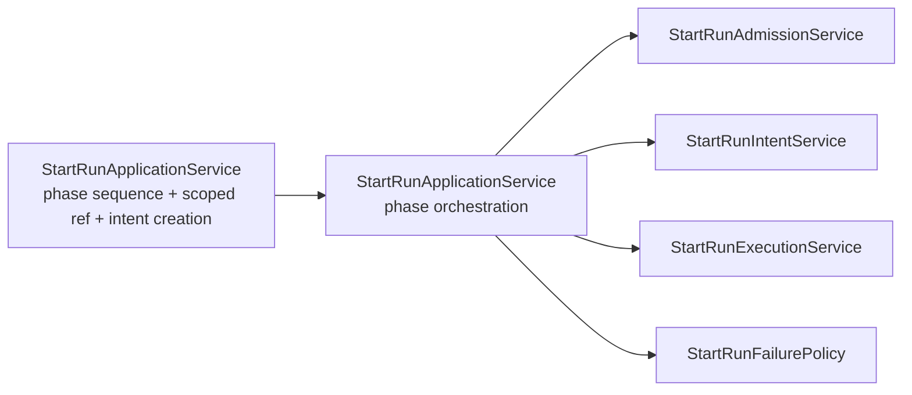

# Fowler Analysis And Remediation For WE-HX-3 Start-Run Decomposition

## Scope

This mailbox record reviews the WE-HX-3 branch in the context of the
`WorkflowEngine` hexagonal derivation. The slice follows WE-HX-2, where
`WorkflowEngine` became a compatibility facade over explicit facade-facing use
cases.

The active question for WE-HX-3 is narrower: whether the internal
`StartRunApplicationService` still owns too much semantic work, and whether the
start-run flow resembles a mature application-service design.

## Fowler Architecture Analysis

The branch started from a partly improved design. Dispatch and failure policy
already had named collaborators, and `WorkflowEngine` no longer hosted
start-run tracing or direct service orchestration. The remaining smell was a
responsibility overload in `StartRunApplicationService`: it sequenced the flow
but also implemented the scoped artifact conversion and deterministic intent
creation directly.

That is Fowler's "long method / transaction script pressure" in a service that
should be an application coordinator. The method was not large enough to be a
classic god object, but it still had multiple reasons to change: admission
rules, provider/capability rules, artifact integrity wiring, intent identity,
dispatch sequencing, and failure policy routing.

The remediation keeps the application service as a Service Layer coordinator
and extracts two semantic phase owners:

- `StartRunAdmissionService`: pre-dispatch admission, provider resolution,
  scoped integrity validation, and execution policy checks.
- `StartRunIntentService`: deterministic pre-dispatch intent creation.

Dispatch and failure policy remain with the existing `StartRunExecutionService`
and `StartRunFailurePolicy`.

## Mature-System Comparison

| Concern                 | Previous branch posture                                        | Mature-system expectation                                      | WE-HX-3 posture                                                                 |
| ----------------------- | -------------------------------------------------------------- | -------------------------------------------------------------- | ------------------------------------------------------------------------------- |
| Application coordinator | Sequenced phases and implemented scoped plan/intention details | Coordinates named phase services                               | `StartRunApplicationService` delegates admission, intent, dispatch, and failure |
| Admission               | Guard plus coordinator carried the full path                   | A named policy/application phase owns pre-dispatch admission   | `StartRunAdmissionService` owns the phase boundary                              |
| Intent creation         | Private coordinator method                                     | Deterministic identity and persistence behind a small service  | `StartRunIntentService` owns intent creation                                    |
| Dispatch                | Already isolated                                               | Adapter side effects behind one dispatch service               | retained in `StartRunExecutionService`                                          |
| Failure policy          | Already isolated                                               | Failure reporting and lifecycle compensation behind one policy | retained in `StartRunFailurePolicy`                                             |
| Fitness function        | WE-HX-2 guard protected facade semantics                       | Architecture tests assert semantic ownership and docs          | new guard checks phase ownership, docs, stories, and module headers             |

## Improved Patterns

- **Service Layer:** `StartRunApplicationService` now coordinates named phase
  services rather than carrying phase-specific implementation.
- **Policy Object:** validation, admission, and failure policies stay explicit
  and testable.
- **Gateway/Port discipline:** artifact reading remains behind the
  artifacts-owned reader and engine-owned integrity validator.
- **Parameter Object:** admission receives a `StartRunAdmissionRequest` instead
  of a loose argument train inside the coordinator.
- **Architecture fitness function:** the test rejects drift where provider
  resolution, scoped plan integrity, or intent creation returns to the
  coordinator.

## Antipatterns Detected

| Antipattern             | Risk                                                                                                               | Remediation                                              |
| ----------------------- | ------------------------------------------------------------------------------------------------------------------ | -------------------------------------------------------- |
| Responsibility overload | start-run coordinator changes for admission, integrity, intent, dispatch, and failure reasons                      | extract admission and intent services                    |
| Duplicate semantics     | scoped plan ref conversion was embedded in the coordinator, while docs describe a phase model                      | move scoped conversion into `StartRunAdmissionService`   |
| Hidden authority        | private intent creation hid the ADR-0030 identity rule inside a larger method                                      | move deterministic creation into `StartRunIntentService` |
| Test-only confidence    | previous architecture guards could pass while start-run phases regrew in the coordinator                           | add semantic architecture guard and behavior tests       |
| Documentation drift     | StartRun protocol still described `WorkflowEngine` as building trace context and did not name WE-HX-3 phase owners | update protocol, component docs, and target architecture |

## Components To Group

- `application/workflow-engine-use-cases/WorkflowStartRunUseCase.ts`: facade
  adaptation, resolved context, and tracing.
- `application/StartRunApplicationService.ts`: start-run phase orchestration.
- `services/startRun/StartRunAdmissionService.ts`: pre-dispatch admission,
  provider resolution, scoped integrity, and capability checks.
- `services/startRun/StartRunIntentService.ts`: deterministic intent creation.
- `services/startRun/StartRunExecutionService.ts`: provider dispatch,
  bootstrap, reconciliation, and compensation.
- `services/startRun/StartRunFailurePolicy.ts`: failure telemetry, intent
  cleanup, and guarded `RunFailed` emission.
- `services/startRun/StartRunEventFactory.ts`: deterministic metadata and event
  construction.

## Repetitions Fixed

- `ScopedPlanRef` construction no longer sits in the application coordinator.
- Deterministic start-run intent derivation is no longer a private method hidden
  beside dispatch orchestration.
- The start-run component guide and stories now live beside the engine
  architecture docs instead of only being implied by the protocol document.

## Drift Fixed

- `StartRunProtocol.v1.md` is updated to account for the WE-HX-2 facade use case
  and WE-HX-3 application phase services.
- `workflow-engine-target-architecture.v1.md` now records the current
  start-run posture as phase-decomposed instead of still describing the
  coordinator and guard as mixed concerns.
- Start-run phase modules now have owned-concern headers so a reader can tell
  which semantic concern each module owns before reading imports.

## Opportunities

- `WE-HX-5` should consolidate provider resolution and telemetry policy across
  start, control, maintenance, and enrichment paths.
- `WE-HX-6` should extend semantic architecture guards to test doubles and
  fixture builders so fixture convenience does not become a second semantic
  model.
- The remaining constructor composition inside `StartRunApplicationService`
  can be moved to a dedicated assembler if a future slice needs stronger
  composition-root purity.

## Future Lessons

- A decomposition is not complete when collaborators exist; the coordinator must
  stop implementing the rules those collaborators claim to own.
- Architecture tests should name forbidden semantic drift, not only required
  files or exports.
- Component docs should describe API, invariants, transitions, and consumers in
  the same slice that changes ownership.
- ADRs are not required for every internal extraction, but the accepted ADR
  invariants must be restated when the extraction touches execution semantics.

## Patterns Applied

## ADR Decision

No new ADR is required. This slice does not change a public contract,
cross-context ownership decision, provider model, event-sourcing model, or
compatibility policy. It implements the already accepted direction from
ADR-0003, ADR-0004, ADR-0012, ADR-0014, ADR-0030, and ADR-0034.
