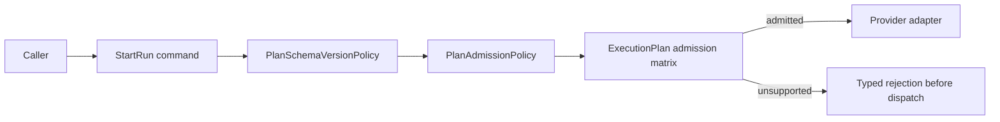
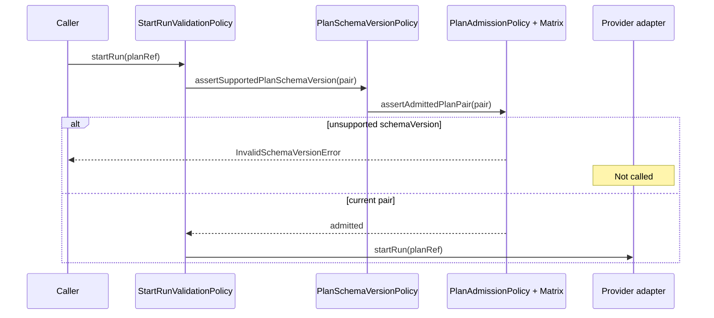

# EA-20260429-01 Fowler Schema-Version Admission Analysis

## Fowler Architecture Analysis

The branch already improved the mature-system posture by moving plan admission
from loose literals toward a governed matrix. The remaining smell is semantic
encapsulation: `StartRunValidationPolicy` knows it must assert a plan pair, but
the runtime task is specifically schema-version admission before adapter
dispatch. A local component should make that concern explicit without creating
a second compatibility source.

Applied pattern: **Encapsulate Policy**. The policy owns fail-closed admission
language and delegates compatibility truth to the existing matrix.

## Mature-System Comparison

Mature event-driven runtime systems reject incompatible payload formats at the
ingress command boundary. The command service fails before persistence,
workflow bootstrap, or provider dispatch. Compatibility data lives in one
registry, while domain-facing policy methods express the operational intent.

DVT now has the registry and negative matrix tests. The improvement needed here
is the intention-revealing engine boundary: schema-version admission as a named
component rather than a generic assertion call inside start-run validation.

## Improved Patterns

- Exact admission matrix replaces broad `v1.*` compatibility.
- Engine ingress rejects before provider dispatch.
- Typed errors remain caller-visible.
- Component docs and architecture tests make the policy reviewable.

## Antipatterns

- Primitive obsession: raw `schemaVersion` strings can look like semver but are
  not semver admission.
- Duplicate semantics: plan pair admission and schema-version admission can
  drift if both become authorities.
- Test-only confidence: barrel or source-string checks alone do not prove
  fail-closed semantics.
- Documentation drift: target diagrams can say "schema-version policy" while
  code exposes only generic plan admission language.

## Component Grouping

Group admission behavior under:

- `PlanAdmission.v1.ts`: shared-kernel matrix data and pure pair lookup.
- `PlanAdmissionPolicy.ts`: engine-level typed error mapping for admitted
  pairs.
- `PlanSchemaVersionPolicy.ts`: schema-version admission language used by
  start-run preconditions.
- `StartRunValidationPolicy.ts`: command precondition orchestration.

## Repetitions Fixed

The fix keeps one compatibility authority. `PlanSchemaVersionPolicy` does not
copy supported versions or matrix rows; it delegates to `assertAdmittedPlanPair`.

## Drift Fixed

Docs, tests, and code all name schema-version admission as a component. The
runtime sequence remains: tenant access, plan-ref validation, schema-version
admission, run-id validation, duplicate-run check, plan fetch, provider
dispatch.

## Future Lessons

- Name the policy by the business invariant, not by the helper it calls.
- Do not infer format compatibility from prefix or semver shape.
- For versioned payloads, add both negative behavior tests and architecture
  tests that verify semantic ownership.
- Keep one source of truth and add intention-revealing facades around it.

## Opportunities

- Later reduce the broad `@dvt/engine` public barrel into public, testing, and
  internal surfaces.
- Extend provider conformance only when a second provider exists.
- Promote any future plan/schema pair only through ADR, matrix, tests,
  evidence, and risk updates.

## Diagrams

