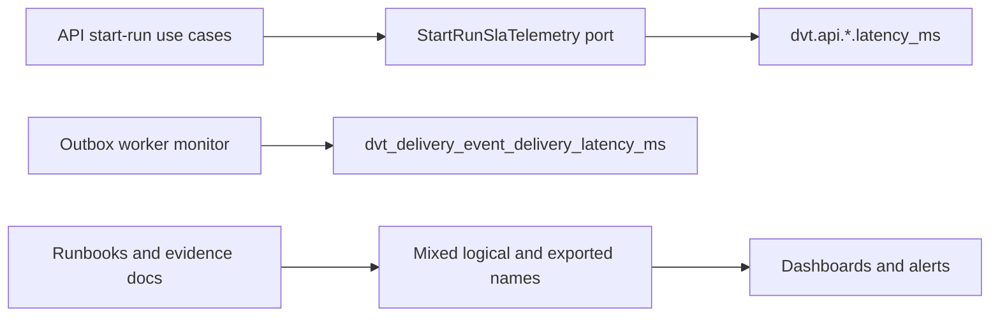
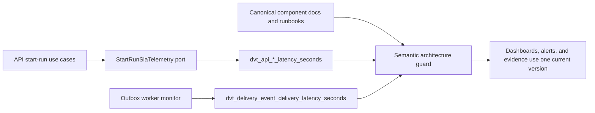

# Fowler Analysis - AR-C2 Prometheus SLA Hardcut

## Context

`AR-C2` defines operational SLA targets for run start latency, plan compile
latency, snapshot freshness, event delivery latency, and outbox drain lag. The
branch now focuses on the Prometheus expression of those signals, not on
OpenLineage lineage semantics.

The user decision is a hard cut: maintain the current metric version only and
do not add compatibility aliases for legacy metric names.

## External Baseline

Prometheus naming guidance says metric names should carry one base unit and use
base units such as seconds rather than milliseconds. Prometheus histogram
examples and mature client libraries use names such as
`http_request_duration_seconds` and expose `_bucket`, `_sum`, and `_count`
series from the base metric.

The SRE pattern that fits this slice is not a new telemetry backend. It is a
small semantic contract: stable signal identity, bounded labels, PromQL that
queries histogram buckets, and alert windows whose thresholds match the
canonical SLA documentation.

References:

- https://prometheus.io/docs/practices/naming/
- https://prometheus.io/docs/practices/histograms/
- https://prometheus.io/docs/instrumenting/writing_exporters/
- https://pkg.go.dev/github.com/prometheus/client_golang/prometheus
- https://sre.google/workbook/alerting-on-slos/

## Fowler View

| Observation                                                                    | Fowler/DDD interpretation                                                                | Action                                                                                      |
| ------------------------------------------------------------------------------ | ---------------------------------------------------------------------------------------- | ------------------------------------------------------------------------------------------- |
| API and outbox latency metrics use milliseconds in metric names.               | Semantic drift between ubiquitous language and infrastructure metric identity.           | Rename AR-C2 latency histograms to Prometheus base-unit `_seconds`.                         |
| Canonical docs, runbooks, evidence artifacts, and code repeat metric names.    | Repetition is acceptable only when guarded; unguarded repetition becomes parallel truth. | Add a semantic architecture test that checks docs and code agree.                           |
| Telemetry modules emit correct values but do not state their owned concern.    | Missing module boundary language.                                                        | Add short owned-concern docblocks to AR-C2 telemetry modules.                               |
| Existing docs describe signals but not one local component API.                | Feature envy across runbooks and code anchors.                                           | Add a component guide with public API, invariants, transitions, consumers, and diagrams.    |
| Labels are low cardinality today (`outcome`, `kind`, `status`, worker totals). | Good mature-system pattern.                                                              | Preserve bounded labels and guard against tenant/run identifiers in exported metric labels. |
| Millisecond thresholds remain useful to humans.                                | Presentation concern, not Prometheus storage identity.                                   | Keep thresholds written as human-facing milliseconds while PromQL uses seconds.             |

## Improved Patterns Already Present

- `StartRunSlaTelemetry` is an application port, so API use cases do not depend
  directly on Prometheus rendering.
- The outbox worker already owns a dedicated monitor object and renders
  Prometheus text from an internal snapshot.
- Snapshot freshness counters already avoid tenant and run identifiers in label
  sets.
- AR-C2 has canonical runbooks and evidence documents, so the work can be
  tightened instead of invented.

## Antipatterns Detected

- Unit suffix drift: `_ms` metric names conflict with Prometheus base-unit
  convention and make PromQL examples less portable.
- Parallel naming surfaces: code constants, runbooks, ops docs, evidence docs,
  and tests repeat signal names without one semantic guard.
- Weak semantic encapsulation: modules expose behavior but not the owned concern
  they govern.
- Dashboard/evidence drift: generated evidence still references old metric
  names and can lag behind canonical metric identity.

## Components To Group

`AR-C2 Prometheus SLA Component` should group these surfaces:

- API telemetry port and adapter for run start and plan compile latency.
- Run status staleness telemetry.
- Outbox worker monitor and delivery telemetry renderer.
- Canonical SLA runbook and signal-threshold mapping.
- Generated evidence artifact and component guide.
- Semantic architecture test for metric identity, unit, labels, and docs.

## Lessons For Future Work

1. A metric rename is a contract change even when no TypeScript interface
   changes.
2. Human thresholds and storage units can differ; docs must say where conversion
   happens.
3. Prometheus labels are part of the domain contract because cardinality changes
   affect operational cost.
4. Repeated metric names are manageable when a guard checks the full set.
5. Do not close operational SLA tasks from documentation intent alone; require
   executable evidence or explicit open blockers.

## Drift And Fixes

| Drift                                          | Fix                                                         |
| ---------------------------------------------- | ----------------------------------------------------------- |
| `dvt.api.run_start.latency_ms`                 | `dvt_api_run_start_latency_seconds`                         |
| `dvt.api.plan_compile.latency_ms`              | `dvt_api_plan_compile_latency_seconds`                      |
| `dvt_delivery_event_delivery_latency_ms`       | `dvt_delivery_event_delivery_latency_seconds`               |
| API duration parameters named `durationMs`     | Rename to `durationSeconds` at the telemetry port boundary. |
| Outbox buckets expressed as `50`, `100`, `250` | Express as `0.05`, `0.1`, `0.25` seconds.                   |
| Docs list old PromQL bucket names              | Update PromQL to `_seconds_bucket`.                         |
| Modules lack owned-concern docblocks           | Add concise module docblocks.                               |

## Opportunities

- Later AR-C2 work can add burn-rate alert examples once sustained evidence
  exists. That is separate from this hard-cut metric identity slice.
- Non-AR-C2 metrics such as workspace graph draft latency still use
  millisecond-style names. They are intentionally out of this slice and should
  be handled by their owning component, not hidden inside AR-C2.
- Native histograms may be evaluated later, but classic buckets are sufficient
  for current Prometheus compatibility and evidence generation.

## Current-State Diagram

## Target-State Diagram

