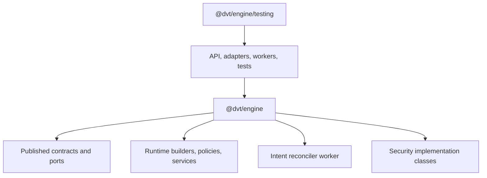
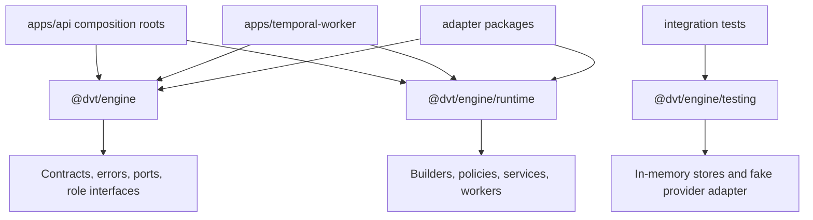
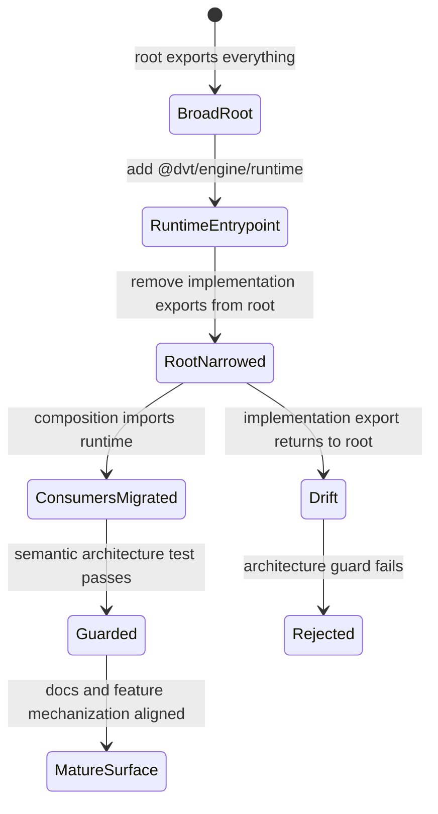

# Fowler Analysis For EA-20260429-05 Engine Public API Surface

## Scope

This analysis reviews the engine package public surface after the engine audit
identified `packages/@dvt/engine/src/index.ts` as a broad root barrel. The
slice focuses on package API semantics, not on changing `WorkflowEngine`
runtime behavior.

## Fowler Architecture Analysis

The current root barrel mixes a Published Interface with a Service Layer,
workers, policies, provider-selection helpers, and test-adjacent
implementations. In Fowler terms, the smell is boundary drift and duplicate
semantics: consumers cannot tell whether a symbol is a stable contract, a
composition helper, or a test double by looking at the import path.

Mature systems make package entrypoints intention-revealing. Stable contracts
are imported from the root, composition roots use a named runtime entrypoint,
and test doubles live behind a testing entrypoint. The same code can remain
available, but the import path records the architectural promise.

## Current Shape

Today the root entrypoint is doing three jobs:

The problem is not that those runtime symbols are bad. The problem is that the
root import path makes all of them look equally stable.

## Target Shape

The fix is an entrypoint split, not a behavior rewrite:

The package still exposes the capabilities consumers need, but the import path
now says which promise is being consumed:

- `@dvt/engine`: stable published interface.
- `@dvt/engine/runtime`: composition/runtime service layer.
- `@dvt/engine/testing`: test-double surface.

## Concrete Fix Plan

| Step | Change                                                          | Why it fixes the drift                                                                                                     | Proof                                                                  |
| ---- | --------------------------------------------------------------- | -------------------------------------------------------------------------------------------------------------------------- | ---------------------------------------------------------------------- |
| 1    | Add `./runtime` to `packages/@dvt/engine/package.json` exports. | Runtime composition gets a governed entrypoint instead of using root.                                                      | package-surface architecture test requires `./runtime`.                |
| 2    | Create `packages/@dvt/engine/src/runtime.ts`.                   | Builders, policies, services, workers, clocks, idempotency, and security implementations move behind Service Layer import. | architecture test checks runtime exports include composition modules.  |
| 3    | Narrow `packages/@dvt/engine/src/index.ts`.                     | Root becomes Fowler Published Interface: contracts, errors, ports, role interfaces.                                        | architecture test rejects forbidden implementation families from root. |
| 4    | Keep `packages/@dvt/engine/src/testing.ts` test-only.           | In-memory stores and fake provider adapter remain explicit Test Doubles.                                                   | architecture test rejects testing exports from root/runtime.           |
| 5    | Migrate production composition consumers.                       | API/worker code that assembles runtime imports from `@dvt/engine/runtime`; pure type consumers keep root.                  | package/app typechecks.                                                |
| 6    | Add component docs, stories, and this analysis.                 | Documentation states the current implementation truth and the invariant.                                                   | architecture test requires docs, stories, proposal, and mailbox.       |

## Export Movement Map

| Symbol family                                                | Before                | After                 | Rationale                                             |
| ------------------------------------------------------------ | --------------------- | --------------------- | ----------------------------------------------------- |
| `ExecutionPlan`, `EngineRunRef`, errors, ports               | `@dvt/engine`         | `@dvt/engine`         | Stable public contract and role interface.            |
| `IProviderAdapter`, state-store ports                        | `@dvt/engine`         | `@dvt/engine`         | Adapter and store packages need stable port types.    |
| `buildWorkflowEngineFacade`, `buildWorkflowEngineUseCases`   | `@dvt/engine`         | `@dvt/engine/runtime` | Runtime composition builders, not stable root API.    |
| `StartRunAdmissionGuard`, `RunAccessPolicy`, `PlanRefPolicy` | `@dvt/engine`         | `@dvt/engine/runtime` | Concrete policies/services used by composition roots. |
| `RunMaintenanceService`, `IntentReconcilerWorker`            | `@dvt/engine`         | `@dvt/engine/runtime` | Worker/runtime implementation surface.                |
| `InMemoryTxStore`, `InMemoryProviderAdapter`                 | `@dvt/engine/testing` | `@dvt/engine/testing` | Test doubles remain test-only.                        |

## Transition Diagram

## Mature-System Comparison

| Concern             | Current posture                                               | Mature-system expectation                               | Remediation                                                 |
| ------------------- | ------------------------------------------------------------- | ------------------------------------------------------- | ----------------------------------------------------------- |
| Root package API    | Contracts and implementation classes share one barrel.        | Root is a stable Published Interface.                   | Keep root to contracts, errors, ports, and role interfaces. |
| Runtime composition | API imports builders and workers from root.                   | Composition roots use a named Service Layer entrypoint. | Add `@dvt/engine/runtime` and migrate composition imports.  |
| Test support        | `./testing` exists but root still has implementation leakage. | Test doubles are isolated and named as testing API.     | Keep in-memory helpers behind `@dvt/engine/testing`.        |
| Regression proof    | Existing test checks one alias and package export shape.      | Fitness test validates semantic families and docs.      | Add architecture guard for root/runtime/testing semantics.  |

## Improved Patterns

- **Published Interface:** root package import becomes the stable engine-facing
  contract surface.
- **Service Layer:** runtime composition symbols move to a named runtime
  entrypoint.
- **Test Double:** in-memory stores and fake provider adapters remain
  test-only through `./testing`.
- **Semantic Fitness Function:** architecture test validates intent, not only
  barrel length.

## Antipatterns Detected

| Antipattern              | Risk                                                      | Remediation                                                               |
| ------------------------ | --------------------------------------------------------- | ------------------------------------------------------------------------- |
| Broad barrel             | Consumers depend on semi-internal implementation classes. | Split root, runtime, and testing entrypoints.                             |
| Hidden stability promise | Import path does not reveal whether a symbol is stable.   | Use entrypoint names as API promises.                                     |
| Test-only confidence     | A thin barrel test can miss semantic leakage.             | Guard forbidden export families and consumer import paths.                |
| Documentation drift      | Audit finding remains true after later engine work.       | Add component guide, stories, plan, and mailbox record in the same slice. |

## Component Grouping

- `packages/@dvt/engine/src/index.ts` owns stable public contracts, errors,
  ports, and role interfaces.
- `packages/@dvt/engine/src/runtime.ts` owns runtime builders, policies,
  services, workers, and composition helpers.
- `packages/@dvt/engine/src/testing.ts` owns in-memory state stores and provider
  test doubles.
- `packages/@dvt/engine/test/architecture/enginePublicApiSurface.architecture.test.ts`
  owns semantic package-surface fitness.

## Repetition Register

| Repetition                                               | Owner after this slice      | Fix                                                             |
| -------------------------------------------------------- | --------------------------- | --------------------------------------------------------------- |
| Runtime builders exported one-by-one from root           | `runtime.ts`                | Move implementation exports behind runtime entrypoint.          |
| Root barrel used for both contracts and runtime assembly | entrypoint split            | Update production composition imports to `@dvt/engine/runtime`. |
| Package-surface tests checking single aliases            | semantic architecture guard | Validate forbidden families and required docs.                  |

## Opportunity Register

| Opportunity                                                          | Follow-up posture                                                                                     |
| -------------------------------------------------------------------- | ----------------------------------------------------------------------------------------------------- |
| Some consumers still need many root type imports.                    | Keep stable role interfaces in root; do not churn consumers without a narrower package contract task. |
| Runtime entrypoint may later split into `runtime` and `maintenance`. | Leave as one named Service Layer until consumer pressure proves a second surface is useful.           |
| Package exports are private today.                                   | Keep semantics strict now so a future publish does not require emergency breaking changes.            |

## Drift Register

| Drift                                                              | Fix                                                                 |
| ------------------------------------------------------------------ | ------------------------------------------------------------------- |
| Audit says root barrel is broad.                                   | Add runtime entrypoint and remove implementation exports from root. |
| Existing docs lack public/runtime/testing component semantics.     | Add component guide, stories, and plan diagrams.                    |
| Existing package-surface test checks only `IWorkflowEngine` alias. | Add semantic architecture test for entrypoint families.             |

## Applied Fixes

The branch applies these fixes in code:

1. `packages/@dvt/engine/package.json`
   - adds the governed `./runtime` export beside `.` and `./testing`.
1. `packages/@dvt/engine/src/runtime.ts`
   - exports runtime builders, policies, services, workers, clocks, and
     idempotency utilities.
1. `packages/@dvt/engine/src/index.ts`
   - removes implementation builders/workers/services from root and leaves
     contracts, errors, ports, role interfaces, and public adapter interfaces.
1. `packages/@dvt/engine/src/testing.ts`
   - declares the test-only owned concern and keeps in-memory doubles there.
1. Consumer imports
   - runtime composition files move value imports to `@dvt/engine/runtime`;
     type-only contract/port imports remain on `@dvt/engine`.
1. `enginePublicApiSurface.architecture.test.ts`
   - enforces the semantic split and requires docs/stories/mailbox evidence.

## Future Lessons

- A package barrel is an architectural promise, not a convenience list.
- In a mature system, import paths encode stability, ownership, and intended
  consumer type.
- Tests should fail on semantic leakage families such as workers, in-memory
  stores, and security implementation classes, not only on individual strings.

## ADR Decision

No new ADR is required. The slice applies ADR-0003 execution model sovereignty,
ADR-0014 run-driven adapter separation, ADR-0034 bounded-context communication,
and the repository command/query and Fowler governance rules. It changes
entrypoint presentation and consumer imports without changing engine runtime
semantics.
