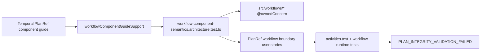

# Fowler Architecture Authority Analysis For AR-D-PLAN-POINTER

## Scope and system context

This analysis reviews the active AR-D plan-pointer line in the Temporal runtime
context:

- workflow input and continuation model (`PlanRef plus compact cursor`);
- segment-resolution and integrity behavior at runtime boundaries;
- semantic encapsulation across workflow modules, docs, and architecture tests.

Primary surfaces reviewed:

- `packages/@dvt/adapter-temporal/src/workflows/**`
- `packages/@dvt/adapter-temporal/test/workflow-component-semantics.architecture.test.ts`
- `docs/architecture/components/engine/adapters/temporal/temporal-planref-workflow-boundary.md`
- `docs/architecture/components/engine/adapters/temporal/temporal-planref-workflow-boundary-user-stories.md`
- `docs/architecture/components/engine/adapters/temporal/temporal-planref-capacity-sla.md`

## Mature-system comparison

Compared with mature orchestration systems (Temporal/Cadence-style durable
workflow boundaries, and pointer-backed storage models used in large-scale
runtime systems), the healthy pattern is:

1. immutable pointer ingress (`PlanRef`);
2. bounded durable state for continuation;
3. fail-closed integrity checks before side effects;
4. semantic architecture fitness functions tied to component docs.

AR-D now matches this shape materially:

- no durable full-plan payload at workflow ingress;
- bounded continuation cursor model;
- integrity validation before segment execution;
- explicit semantic component documentation and fitness tests.

## Improved patterns

1. **Pointer authority boundary**
   `PlanRef` remains execution authority instead of moving full `ExecutionPlan`
   through durable provider payload.
2. **Workflow state compression**
   continuation state is governed around cursor/facts instead of
   full-result-map accumulation.
3. **Semantic module ownership**
   workflow modules declare `@ownedConcern` and map to a local component guide.
4. **Operational capacity codification**
   AR-D2 capacity profile is explicit and testable.

## Antipatterns detected

1. **String-fragile architecture assertions**
   The prior architecture test depended on hardcoded duplicated concern maps and
   broad `toContain` checks.
2. **Story matrix gap on integrity drift**
   User-story coverage documented expiration/unavailability/overflow but not the
   PlanRef hash-drift integrity scenario already validated in runtime tests.
3. **Documentation-to-code repetition**
   Concern ownership lived both in guide tables and duplicated test constants.

## Component grouping opportunities

Current grouping is mostly healthy; the remaining opportunity is to keep
semantic ownership convergence explicit:

- workflow boundary modules (`src/workflows/**`) as one component;
- capacity policy (`temporalPlanRefCapacitySlaPolicy.ts`) as adjacent AR-D2
  policy component;
- user stories as executable semantic acceptance matrix.

## Drift and repetition found

### Drift

- Story matrix omitted a first-class integrity mismatch scenario even though
  behavior existed (`PLAN_INTEGRITY_VALIDATION_FAILED` path).

### Repetition

- Test-level concern map duplicated the component-map ownership already
  documented in component guide markdown.

## Patterns applied in this slice

1. **Semantic fitness by documented source of truth**
   Architecture test now parses component-map rows from the guide and validates
   file-level `@ownedConcern` against that source.
2. **Coverage-complete story matrix**
   Added `US-TPW-007` for PlanRef hash drift and linked it to existing runtime
   tests.
3. **Diagram-level consistency**
   Story scenario mermaid flow now includes the integrity mismatch fail-closed
   branch.

## Remediation implemented

### Code / tests

- Added markdown parser support for component semantics:
  - `packages/@dvt/adapter-temporal/test/helpers/workflowComponentGuideSupport.ts`
- Hardened architecture semantic guard:
  - `packages/@dvt/adapter-temporal/test/workflow-component-semantics.architecture.test.ts`
    - parses component-map rows from guide;
    - enforces doc-to-module set parity for workflow modules and the adjacent
      capacity policy module;
    - enforces complete governed user-story IDs matrix including `US-TPW-007`.
- Added direct runtime ordering coverage:
  - `packages/@dvt/adapter-temporal/test/runPlanWorkflow.layers.order.test.ts`
    - proves initial segment integrity failure prevents workflow layer
      execution.

### Documentation

- Updated user-story matrix and acceptance:
  - `docs/architecture/components/engine/adapters/temporal/temporal-planref-workflow-boundary-user-stories.md`
    - added `US-TPW-007` integrity-drift scenario;
    - expanded scenario diagram with integrity-failure branch.

## User stories now covered

- `US-TPW-001` expired pointer
- `US-TPW-002` unavailable artifact
- `US-TPW-003` cursor overflow
- `US-TPW-004` control-signal retention bound
- `US-TPW-005` architecture docs executable
- `US-TPW-006` AR-D2 capacity SLA posture
- `US-TPW-007` PlanRef hash drift fail-closed

## Future teachings

1. Prefer parsing structured docs (tables/sections) in architecture tests over
   free-text `contains` assertions.
2. Keep story matrices aligned with already implemented failure semantics; this
   avoids hidden behavior that lacks explicit operational language.
3. When adding workflow modules, fail fast unless the component-map table is
   updated in the same change.

## ADR assessment

No new ADR is required for this slice:

- behavior semantics did not introduce a new product-level contract;
- this change hardens semantic guardrails and documentation coverage for an
  accepted AR-D line.

## Architecture diagram

