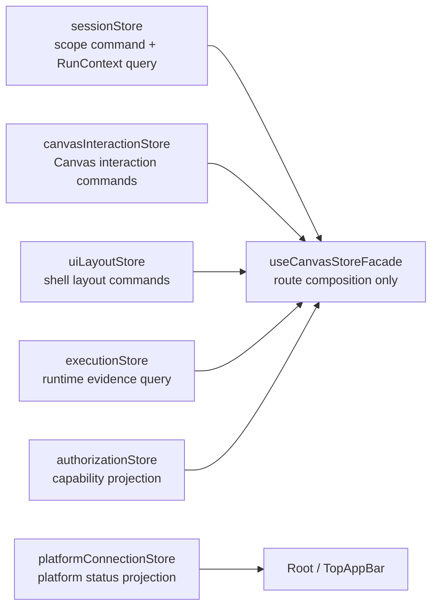

# Fowler F-05 Store Domain Ownership Hard Review

## Scope

This review re-checks Lane E `F-05` against the current branch, the accepted
F-05 plan, active component docs, implementation, and semantic tests. It does
not reopen product behavior: it verifies whether the branch can be closed
canonically.

## Fowler Architecture View

The original smell was a frontend version of Fowler's **Large Class** and
**Divergent Change**: one retired aggregate store used to look like the place
for session, Canvas, layout, runtime evidence, platform health, and
authorization posture. The current branch has improved that posture.

The branch now applies:

- **Separated Read Model** for platform connection state:
  `platformConnectionStore` owns `ProjectPlatformConnectionStatus`.
- **Separated Read Model** for authorization:
  `authorizationStore` owns effective UI capabilities.
- **Explicit Facade** for route composition:
  `useCanvasStoreFacade` composes stores for Canvas without becoming a durable
  replacement aggregate.
- **Semantic Fitness Function**:
  `webStoreDomainOwnership.architecture.test.ts` checks docblocks, component
  docs, hard-cut language, and forbidden ownership drift.
- **Whitelist Hydration**:
  `uiLayoutStore` hydrates only shell layout and visual preferences.

## Mature-System Comparison

Mature frontend systems separate local command state from read-model
projections and remote-cache state. F-05 now matches that pattern for the active
stores:

The branch avoids the common immature pattern of replacing one global store with
another route-local global store. The Canvas facade is still a risk surface, but
the current implementation keeps it as composition, not authority.

## Improved Patterns

- Store ownership is documented by DDD owner and command/query role.
- Active modules start with short owned-concern docblocks.
- The component guide records public API, invariants, transitions, consumers,
  diagrams, and verification surfaces.
- User stories cover session scope, Canvas interaction, shell layout, platform
  status, runtime evidence, authorization capability display, and reviewer
  semantic guards.
- Architecture tests validate semantics, not only barrel thinness or file
  existence.

## Antipatterns Removed

- `appStore.ts` no longer exists as active runtime truth.
- `connectionStatus` is not shell layout state.
- `userPermissions` is not runtime evidence.
- No store barrel exposes a generic app-state API.
- No compatibility alias routes authorization back through `executionStore`.

## Remaining Risks And Opportunities

No open F-05 ownership drift remains in the current branch. Residual risks are
future evolution risks, not accepted debt:

| Risk                                 | Trigger                                                             | Required future response                                                         |
| ------------------------------------ | ------------------------------------------------------------------- | -------------------------------------------------------------------------------- |
| Canvas facade gravity                | Facade starts owning product decisions or durable state             | Extract named view model or policy module before adding behavior.                |
| Authorization source hardening       | UI permissions move from local projection to real backend authority | Define/update the command/query rail and add negative authorization tests first. |
| Manual inventory drift               | Store method count grows beyond reviewable table size               | Generate or mechanically validate the inventory.                                 |
| Repeated semantic architecture tests | More components copy the same doc/docblock assertions               | Promote a shared helper only after repetition is proven.                         |

## Repetitions

The branch does not introduce repeated product commands. The main repetition
left is documentary: component docs and architecture tests both name the same
store surfaces. That repetition is acceptable at current size because it acts as
a semantic guard. It should become a helper only if a second component repeats
the same structure.

## Drift Review

Fixed drift:

- Planning and component docs route to the current store topology.
- `uiLayoutStore` no longer owns or hydrates platform connection state.
- `platformConnectionStore` owns the shell connection projection.
- `executionStore` exposes only current plan and current run.
- `authorizationStore` owns `userPermissions`.
- Semantic tests reject the old store ownership story.

Drift found by this review:

- Planning DB still had F-05 as `in_progress 70%` while the branch already had
  an accepted closeout and passing F-05 evidence.

Fix applied by this review:

- Close F-05 through the planning DB rail after evidence verification.

## TDD And Validation Posture

No new production behavior was required in this hard review, so no new red/green
cycle was created. The accepted F-05 plan already records the red/green cycles
for store component map, lane truth reconciliation, semantic architecture, and
authorization-store hard cut. This review reran the resulting green gates:

- `pnpm --filter @dvt/web test -- authorizationStore.test.ts platformConnectionStore.test.ts uiLayoutStore.test.ts webStoreDomainOwnership.architecture.test.ts`
- `pnpm --filter @dvt/web test -- canvasStartupAndDraftRecovery.architecture.test.ts queryKeyPolicy.architecture.test.ts`
- `pnpm docs:feature-mechanization --feature F05-STORE-DOMAIN-OWNERSHIP`

## ADR Decision

No new ADR is needed. F-05 applies existing command/query rail governance and
the accepted F-05 component plan. The change is component-local and does not
create a new repository-wide architectural decision.
