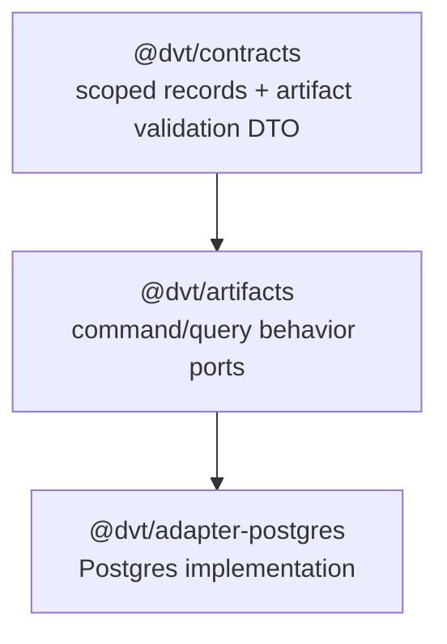

# S08 Lifecycle Contract Retirement Fowler Analysis

## Fowler Architecture Analysis

The S08 plan-store work has already improved the main pattern: plan-store
behavior now sits behind explicit command/query ports in `@dvt/artifacts`,
while serializable scoped records remain in `@dvt/contracts`. The remaining
drift was semantic, not structural: `PlanValidationLifecycle.v1.ts` still made
the retired lifecycle language look like an active planner contract.

From a Fowler perspective, that file was a small but costly "parallel model".
It preserved a lifecycle-oriented name beside the scoped record model, so future
work could accidentally treat `PENDING_VALIDATION -> VALID -> INVALID` as the
plan-store aggregate lifecycle instead of artifact validation metadata.

## Mature-System Comparison

Mature systems normally separate:

- tenant-owned records and admission state;
- tenant-neutral artifact blobs;
- validation or materialization metadata attached to artifacts;
- command/query ports that encode authorization context in their inputs.

S08 now follows that shape more closely. `PlanRecord`,
`PlanExecutabilityRecord`, and `PlanAdmissionLink` remain scoped tenant records.
`StoredPlanArtifactValidationRecord` is explicit artifact validation vocabulary,
not a plan lifecycle facade.

## Improved Patterns

- Replaced lifecycle naming with artifact-validation naming.
- Preserved DTO vocabulary without preserving a compatibility facade.
- Strengthened semantic architecture tests so the retired contract file cannot
  return as an active source.
- Kept behavior ports in `@dvt/artifacts` and serializable vocabulary in
  `@dvt/contracts`.

## Antipatterns Detected

| Antipattern                   | Location                                                               | Remediation                                                                         |
| ----------------------------- | ---------------------------------------------------------------------- | ----------------------------------------------------------------------------------- |
| Parallel model                | `PlanValidationLifecycle.v1.ts`                                        | Removed active lifecycle contract file.                                             |
| Documentation drift           | Planner contract index and system operations inventory                 | Regenerated index and updated active S08 inventory language.                        |
| Primitive lifecycle authority | `PlanValidationRecord` naming                                          | Replaced with `StoredPlanArtifactValidationRecord`.                                 |
| Test-only thinness risk       | Architecture test checked duplicates but not lifecycle contract source | Added semantic guard for retired contract absence and new artifact validation name. |

## Component Grouping

The component remains grouped as:

`StoredPlanArtifactValidation.v1.ts` belongs with contracts because it is
serializable vocabulary. It does not own commands, queries, persistence, or
runtime materialization.

## Repetitions

- The old lifecycle terms were repeated in active contract docs, inventory, and
  root exports.
- Current artifact validation still uses the database `validation_state` column.
  That is acceptable because the column describes stored artifact state, not
  plan-record lifecycle state.

## Drift

Closed drift:

- active `PlanValidationLifecycle.v1.ts` source;
- root-barrel export of `PlanValidationLifecycle.v1`;
- active inventory claim that the validation DTO vocabulary lived in the
  lifecycle file;
- component guide omission of the new artifact-validation DTO.

Remaining historical references in archive/evidence/review docs are left as
history unless active docs point to them as current truth.

## Future Lessons

- Retiring a behavior facade is not enough if the vocabulary file keeps the old
  behavior name.
- Architecture tests should assert semantic ownership names, not only file
  placement or absence of duplicate ports.
- Status inventories must be updated in the same slice as contract retirement.

## Opportunities

- Decompose `PostgresPlanStore` into one adapter per port if the class keeps
  growing.
- Move repeated artifact validation state literals into the contracts type if a
  second adapter needs to construct them directly.
- Add a future cleanup slice for historical reviews that still read like active
  guidance, after active governance surfaces are stable.

## Applied Fixes

- Removed `PlanValidationLifecycle.v1.ts`.
- Added `StoredPlanArtifactValidation.v1.ts`.
- Updated artifacts and Postgres ports to return
  `StoredPlanArtifactValidationRecord`.
- Updated the S08 semantic architecture test.
- Updated active S08 docs and ARC evidence/risk.
