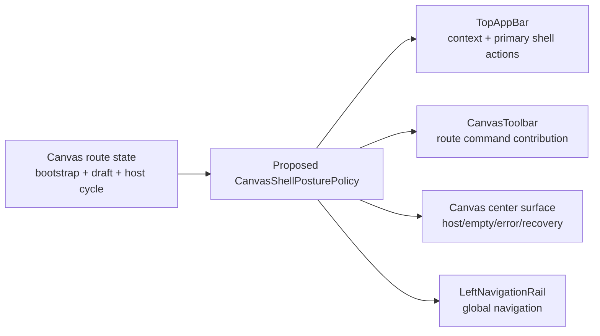
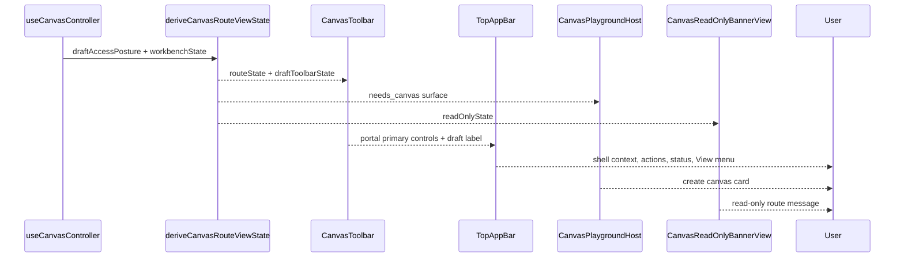
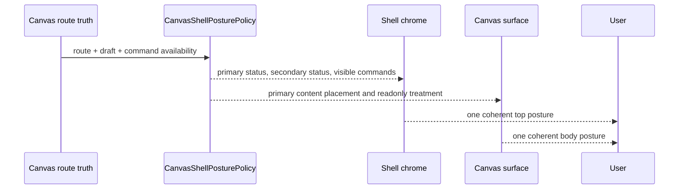

# Fowler Analysis - Canvas Screen Problems After Local Alpha And View Menu Integration

## Scope

This is analysis only. It records the architectural reading of the visible
Canvas screen problems after the merged local alpha/session-gate and Canvas
View-menu contribution work. It does not apply product code changes or promote
these findings into accepted component docs. At user request, the left
navigation rail finding has been assigned to planning DB task `E/F-15-D` under
`F-15`; the other findings remain proposals.

The analyzed work includes:

- PR `#1260`, squash commit `2ad89417`;
- `CanvasViewMenuContribution` and `CanvasViewMenuControls`;
- protected route/session gate documentation and tests;
- the observed Canvas route screenshot in read-only/no-canvas posture.

## Governing Sources

- `AGENTS.md`
- `docs/planning/status/governance-document-rule-inventory.md`
- `docs/guides/ai-work-protocol.md`
- `docs/architecture/fowler-opportunity-planning-governance.md`
- `docs/architecture/command-query-rail-governance.md`
- `docs/planning/proposals/mandatory/frontend-and-ux/dvt-workbench-ux-specification-v0-4-20260505-draft.md`
- `docs/architecture/components/web/graph/canvas-view-menu-component.md`
- `docs/architecture/components/web/graph/canvas-empty-authoring-entrypoint-component.md`

## Executive Reading

The branch improved one important boundary: Canvas visual controls moved from
the primary toolbar into the shell `View` menu through a route-owned
contribution. That is a mature direction: the route provides a contribution
read model, while the shell owns placement.

The screenshot reveals the next architectural problem. The system now has
better command placement, but still lacks a coherent shell-state priority model
for Canvas route postures. Several independently valid components publish
truth at the same time:

- shell context and connection status;
- Canvas draft access posture;
- Canvas route bootstrap posture;
- Canvas first-canvas host posture;
- Canvas read-only posture;
- primary command availability;
- global navigation rail.

In a mature workbench, those surfaces would be coordinated by a presentation
policy that decides what is primary, secondary, hidden, disabled, or deferred
for each route state. Today that decision is distributed across route state,
toolbar state, layout templates, shell chrome, and copy catalogs.

## Mature-System Comparison

| Mature system signal            | Expected behavior                                                                           | Current DVT signal                                                                                          |
| ------------------------------- | ------------------------------------------------------------------------------------------- | ----------------------------------------------------------------------------------------------------------- |
| VS Code command bars            | Primary action area is sparse; unavailable commands move to menus or command palette.       | `Exportar`, `Importar`, `Plan`, and `Ejecutar` remain visible and disabled in a no-canvas/read-only state.  |
| GitHub restrained chrome        | Context labels are compact and status does not fight page content.                          | Top bar combines project, context, git, readonly, loading, health, commands, and menu in one row.           |
| NiFi/draw.io graph workbench    | Empty graph creation is visually primary and near the graph frame.                          | `Crear canvas` appears low in a large empty surface after a strong read-only banner.                        |
| Dagster/dbt Cloud state posture | Loading, empty, readonly, and unavailable states are mutually exclusive in the main header. | `Cargando canvas` appears with `Crear canvas`, and `Solo lectura` appears in both shell and route banner.   |
| Mature DDD UI layer             | Route state becomes one presentation read model before rendering.                           | Route/draft/bootstrap/read-only labels are projected by separate modules without one visual priority owner. |

## Improved Patterns

- **Contribution Read Model**: `CanvasViewMenuContribution` is a clean local
  query-like presentation object. It prevents `ShellMenu` from importing Canvas
  controller internals.
- **Passive View Boundary**: `CanvasViewMenuControls` renders the contributed
  state and does not own graph mutation.
- **Identity-guarded cleanup**: `clearCanvasViewMenuContribution(contribution)`
  prevents stale effect cleanup from clearing an active replacement.
- **Component Guide Practice**: the Canvas View menu has API, invariants,
  transitions, consumers, diagrams, and drift warnings.
- **Semantic architecture guard**: the architecture test checks that view-owned
  labels moved out of `CanvasToolbarPrimaryControls`.

## Anti-Patterns Still Present

| Anti-pattern            | Evidence                                                                                                       | Root opportunity                                                              |
| ----------------------- | -------------------------------------------------------------------------------------------------------------- | ----------------------------------------------------------------------------- |
| Responsibility overload | `TopAppBar`, `CanvasToolbar`, and Canvas route state all decide visible shell posture.                         | Extract a Canvas route shell-state priority read model.                       |
| Duplicate semantics     | `Solo lectura` shell badge and `Canvas en solo lectura` route banner compete.                                  | Define one primary route posture and one secondary diagnostic posture.        |
| Primitive obsession     | Route states such as `needs_canvas`, `loading_graph`, `read_only`, and toolbar labels travel as loose strings. | Introduce a discriminated `CanvasShellPosture` read model.                    |
| Feature envy            | Toolbar workflow derives command labels from permission and validation fields it does not own.                 | Move command visibility/priority to a route-owned policy.                     |
| Test-only confidence    | Existing tests prove labels and placement, but not screen-level semantic exclusivity.                          | Add architecture tests asserting mutually exclusive postures.                 |
| Documentation drift     | UX spec says no permanent left navigation in workbench; current shell still shows it.                          | Decide whether the spec is target-only or the active implementation contract. |
| Layout smell            | Empty state is centered in the full remaining panel, making creation look secondary.                           | Give first-canvas host an explicit placement policy.                          |

## Responsibility Grouping

The missing component is the policy/read model between route truth and shell
rendering. Without it, each surface locally chooses what to show.

## Current-State Sequence

## Desired-State Sequence

## Findings By Element

| Element                    | Problem                                                                                               | Existing task                         | Disposition                                                 |
| -------------------------- | ----------------------------------------------------------------------------------------------------- | ------------------------------------- | ----------------------------------------------------------- |
| `CanvasShellPosture`       | `Cargando canvas` coexists with `Crear canvas`; route posture is not semantically exclusive in shell. | Partly `F-15`, `F-27`.                | Proposed: `E/F-28-A Canvas route shell posture priority`.   |
| Top-bar command density    | Disabled commands remain visible and crowd the shell.                                                 | `F-15`, `F-24`.                       | Proposed: `E/F-15-C Shell command priority matrix`.         |
| Read-only vs create canvas | Read-only messaging appears while create buttons are offered.                                         | `F-27`, `WEB-PROJECT-2` plan.         | Proposed: `E/F-28-B Read-only first-canvas policy`.         |
| Empty-state placement      | First-canvas card is visually too low and secondary.                                                  | `F-24`, Canvas empty authoring guide. | Proposed: `E/F-24-D Canvas empty-state placement contract`. |
| Left navigation rail       | Footer items are clipped and spec says workbench should not have permanent left nav.                  | `F-15`, `F-25`.                       | Created: `E/F-15-D Workbench navigation rail disposition`.  |
| Semantic tests             | Tests cover pieces, not visual-state exclusivity.                                                     | `F-14`, `F-14-A`.                     | Proposed: add to `E/F-14-A` acceptance.                     |

## Planning Assignment Result

The left-navigation rail issue is now tracked as `E/F-15-D Workbench
navigation rail disposition`, a queued child task of `F-15`. The task owns the
decision and eventual implementation path for removing, collapsing, or
otherwise governing the permanent left rail so the workbench follows the newer
no-permanent-left-rail specification without clipping footer navigation.

## Repetitions

- Multiple modules encode route labels and status labels separately:
  `canvasDraftPresentationModel.ts`, `canvasDraftAccessPostureModel.ts`,
  `canvasToolbarViewModel.ts`, `CanvasStateViews.tsx`.
- Multiple surfaces independently represent read-only:
  shell scope badge, Canvas read-only banner, command disabled state, draft
  toolbar label.
- Multiple layout surfaces decide vertical placement:
  `CanvasShellMainPanel`, `CanvasPlaygroundHostTemplate`, `CanvasSurfaceStateCard`.
- Command availability is repeated as disabled state rather than converted into
  one command-priority model.

## Drift

### Code Drift

- The View menu extraction improved toolbar scope, but the toolbar still owns
  command visibility and workflow status priority.
- `CanvasToolbarPrimaryControls` still renders disabled command buttons even
  when the route is in a no-canvas/read-only posture where commands are not
  actionable.
- `CanvasPlaygroundHostTemplate` centers the first-canvas card inside the full
  panel without a route-aware placement invariant.

### Documentation Drift

- The workbench UX draft says no permanent left navigation in the workbench
  view; current implementation has a permanent left rail.
- The Canvas View menu guide says toolbar is focused on workflow status and
  primary commands; it does not define when primary commands should be hidden,
  grouped, or disabled.
- The Canvas empty authoring guide covers graph-first first-node authoring, but
  not the earlier `needs_canvas + read_only` host posture shown in the screenshot.

## Pattern Application Plan

No code is applied in this analysis. The recommended pattern plan is:

1. **Introduce Presentation Model**:
   `CanvasShellPosture` owns primary status, secondary diagnostic status,
   visible commands, hidden commands, and body placement.
2. **Replace Conditional With Polymorphism / Policy Object**:
   route states map through a policy instead of scattered `if routeState`
   checks.
3. **Introduce Parameter Object**:
   pass one `CanvasShellPostureInput` instead of permission, draft, validation,
   and route-state argument trains.
4. **Passive View**:
   keep `TopAppBar`, `CanvasToolbarPrimaryControls`, and
   `CanvasPlaygroundHostTemplate` as renderers of the policy output.
5. **Semantic Architecture Test**:
   assert that `needs_canvas` cannot render loading label, readonly primary
   action contradiction, or clipped navigation footer.

## User Stories To Cover Later

- As an operator with read-only scope and no canvas, I see one clear primary
  state explaining whether I can create a canvas.
- As an operator with no persisted canvas but write access, I see `Create
canvas` as the dominant action and no loading state.
- As an operator with no write access, I do not see mutating create choices as
  actionable controls.
- As an operator on a narrow viewport, command overflow moves to menus without
  hiding route state.
- As an operator using the left rail, footer navigation is reachable without
  clipped labels.
- As a reviewer, I can read one component guide that explains API, invariants,
  transitions, consumers, and semantic architecture tests for shell posture.

## TDD Red/Green Plan

| Red test                                                                                                      | Expected red                                                                            | Green target                                                                  |
| ------------------------------------------------------------------------------------------------------------- | --------------------------------------------------------------------------------------- | ----------------------------------------------------------------------------- |
| `CanvasToolbar` with `routeState: needs_canvas` does not display loading draft label as primary route status. | Current toolbar can show loading-derived draft label while the center surface is ready. | Policy maps needs-canvas to ready/empty host status.                          |
| `CanvasPlaygroundHost` in read-only scope does not render enabled create buttons.                             | Current screenshot suggests possible contradiction.                                     | Host policy hides or disables create choices with read-only explanation.      |
| `TopAppBar` command priority hides unavailable Canvas commands in no-canvas posture.                          | Disabled buttons stay visible.                                                          | Primary action strip contains only meaningful actions plus menu contribution. |
| `CanvasSurfaceStateCard` placement remains upper-balanced in first viewport.                                  | Empty card is centered too low.                                                         | First-canvas host has route-specific placement class.                         |
| `LeftNavigationRail` footer items are not clipped at desktop height.                                          | Screenshot shows footer clipping.                                                       | Rail uses min-height and footer scroll/visibility policy.                     |

## ADR Assessment

No ADR is required for a local Canvas-only cleanup. An ADR becomes appropriate
if the team promotes a repository-wide `Workbench Shell Command Priority
Contract` that governs all workbench routes, not only Canvas.

## Proposed Documentation Follow-Up

If accepted, create these canonical docs:

- `docs/architecture/components/web/graph/canvas-shell-posture-component.md`
- `docs/architecture/components/web/graph/canvas-shell-posture-user-stories.md`
- update `docs/architecture/components/web/graph/canvas-view-menu-component.md`
  with command-priority integration;
- update the workbench UX spec or mark its left-navigation rules as target-only.

## Element Documents

- [Canvas Route Shell Posture](./20260516-codex-fowler-element-canvas-route-shell-posture.md)
- [Canvas Top-Bar Command Priority](./20260516-codex-fowler-element-canvas-topbar-command-priority.md)
- [Read-Only First-Canvas Policy](./20260516-codex-fowler-element-readonly-first-canvas-policy.md)
- [Canvas Empty-State Placement](./20260516-codex-fowler-element-canvas-empty-state-placement.md)
- [Workbench Navigation Rail Disposition](./20260516-codex-fowler-element-workbench-navigation-rail-disposition.md)
