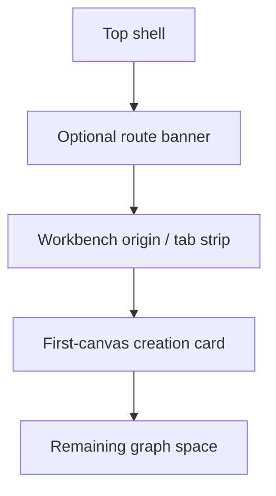

# Fowler Element - Canvas Empty-State Placement

## Observed Error

The `Crear canvas` card is vertically centered in a large empty panel and reads
as secondary to the read-only banner and empty space. The first meaningful
action should be closer to the workbench origin and visibly connected to the
Canvas surface.

## Fowler Reading

- **Opportunity**: Presentation responsibility overload.
- **Pattern**: Passive View plus route-specific Layout Policy.
- **DDD owner**: presentation-only `CanvasSurfacePlacementPolicy`.
- **Rail**: none; internal presentation behavior.

## Public API

Proposed local API:

```ts
type CanvasSurfacePlacement = {
  vertical: 'upper_balanced' | 'centered' | 'full';
  maxWidth: 'narrow' | 'wide';
  surfaceRole: 'first_canvas' | 'empty_authoring' | 'loading' | 'error';
};
```

## Invariants

- First-canvas creation is not centered in the same way as a passive loading or
  error message.
- Empty authoring and first-canvas host states may share visual primitives but
  not placement semantics.
- Placement is a route-state decision, not a hardcoded template default.

## Layout Diagram



## Consumers

- `CanvasPlaygroundHostTemplate`
- `CanvasSurfaceStateCard`
- `CanvasShellMainPanel`
- visual/user-flow tests

## Existing Task Search

- `F-24` covers operator-workbench visual system and token convergence.
- Existing Canvas empty-authoring guide covers semantic flow but not first
  viewport placement.

## Proposed Task

`E/F-24-D Canvas empty-state placement contract`: define route-state placement
rules for loading, empty, first-canvas, blocked, and recovery surfaces.

## TDD Plan

- Red: `canvas-playground-empty-state-frame` should expose a first-canvas
  placement role distinct from generic centered state cards.
- Green: first-canvas host uses an upper-balanced layout policy.
- Architecture: guard against `items-center justify-center` becoming the only
  state-card placement primitive.
