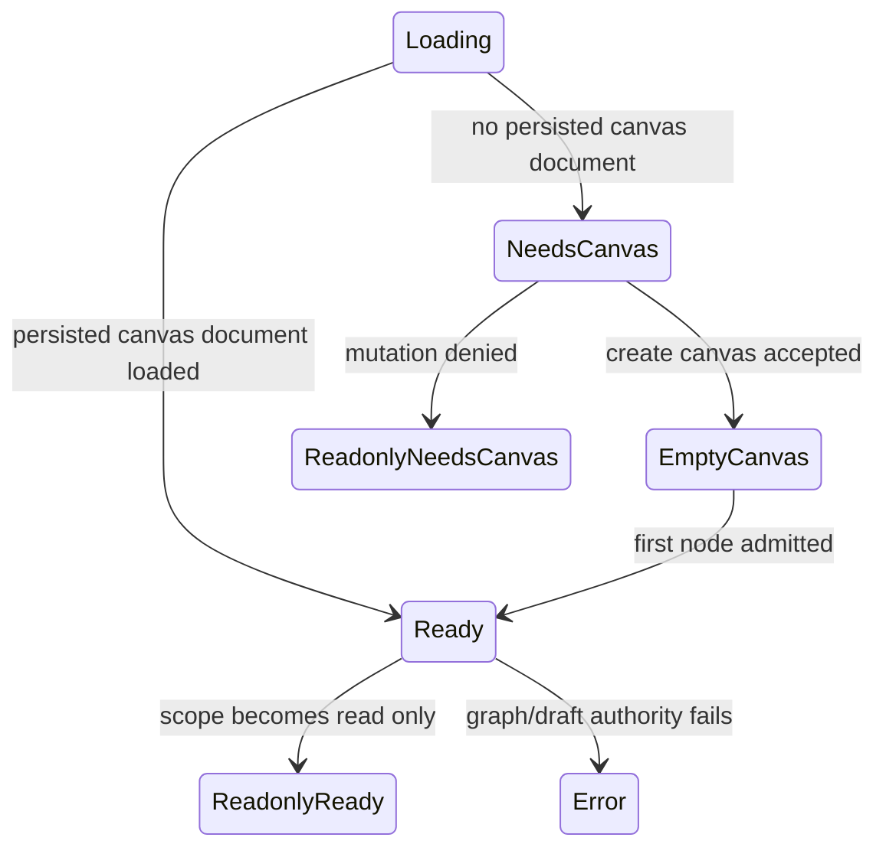

# Fowler Element - Canvas Route Shell Posture

## Observed Error

The shell shows `Cargando canvas` while the main surface already shows
`Crear canvas`. Loading and needs-canvas are separate states but appear
together in the first viewport.

## Fowler Reading

- **Opportunity**: Duplicate semantics and primitive obsession.
- **Pattern**: Presentation Model plus Policy Object.
- **DDD owner**: proposed `CanvasShellPosture` read model.
- **Rail**: no new command; internal presentation query over Canvas route state.

## Public API

Proposed local API:

```ts
type CanvasShellPosture = {
  primaryStatus: 'loading' | 'needs_canvas' | 'readonly' | 'ready' | 'blocked' | 'error';
  primaryLabel: string;
  secondaryLabel?: string;
  visibleCommandGroup: 'none' | 'readonly' | 'authoring' | 'execution';
};
```

## Invariants

- `loading` and `needs_canvas` are mutually exclusive in the shell.
- `needs_canvas` means route bootstrap is complete enough to present creation.
- Draft access labels must not become the primary route status unless draft
  access blocks the route.
- The top bar and center surface consume the same posture read model.

## Transitions



## Consumers

- `CanvasToolbar`
- `CanvasToolbarPrimaryControls`
- `CanvasPlaygroundHost`
- `CanvasReadOnlyBannerView`
- `TopAppBar`
- route-state tests and architecture tests

## Existing Task Search

- `F-15` covers workbench shell grammar.
- `F-27` covers internal alpha route-level gate.
- No specific planning DB task was found for Canvas route shell posture
  priority.

## Proposed Task

`E/F-28-A Canvas route shell posture priority`: introduce a route-owned
presentation read model that makes loading, needs-canvas, readonly, blocked,
and ready postures mutually exclusive across shell and center surface.

## TDD Plan

- Red: route state `needs_canvas` must not render `Cargando canvas` anywhere in
  top-bar Canvas controls.
- Green: `CanvasShellPosture` maps route state to one primary label and
  secondary diagnostic labels.
- Architecture: test that `CanvasToolbar` does not derive primary shell status
  directly from draft access labels.
