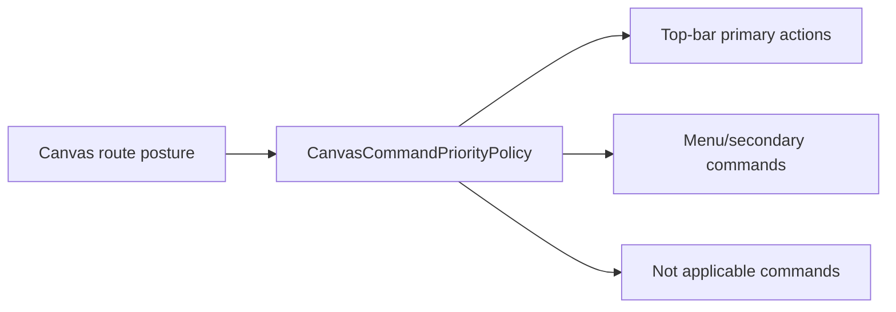

# Fowler Element - Canvas Top-Bar Command Priority

## Observed Error

The top bar shows disabled `Exportar`, `Importar`, `Plan`, and `Ejecutar`
beside status badges and the `View` menu. In no-canvas/read-only posture those
commands are not actionable, but they still occupy the highest-priority shell
space.

## Fowler Reading

- **Opportunity**: Responsibility overload and feature envy.
- **Pattern**: Command Query Separation at the presentation layer:
  command availability is queried as a command-priority read model before
  rendering.
- **DDD owner**: proposed `CanvasCommandPriorityPolicy`.
- **Rail**: no backend rail; internal Canvas route presentation query.

## Public API

Proposed local API:

```ts
type CanvasPrimaryCommandPresentation = {
  visible: boolean;
  reason?: 'not_applicable' | 'readonly' | 'missing_canvas' | 'unavailable';
  placement: 'top_bar' | 'view_menu' | 'hidden';
};
```

## Invariants

- Disabled commands are not automatically top-bar commands.
- The top bar only shows commands that are useful in the current route posture.
- Non-primary commands remain discoverable in a menu if they are relevant but
  unavailable.
- `View` remains the owner for visual controls.

## Component Flow



## Consumers

- `CanvasToolbarPrimaryControls`
- `CanvasToolbar`
- `TopAppBar`
- `ShellMenu`
- route/toolbar tests

## Existing Task Search

- `F-15` covers shell grammar.
- `F-24` covers visual system and token convergence.
- `F-25` covers plugin UX integration.
- No task was found for command priority semantics specifically.

## Proposed Task

`E/F-15-C Shell command priority matrix`: define the top-bar command priority
contract for Canvas and other workbench routes.

## TDD Plan

- Red: no-canvas/read-only posture should not render disabled execution
  commands as primary toolbar buttons.
- Green: policy hides or demotes commands based on posture.
- Architecture: guard that `CanvasToolbarPrimaryControls` receives presentation
  decisions instead of raw permission booleans.
