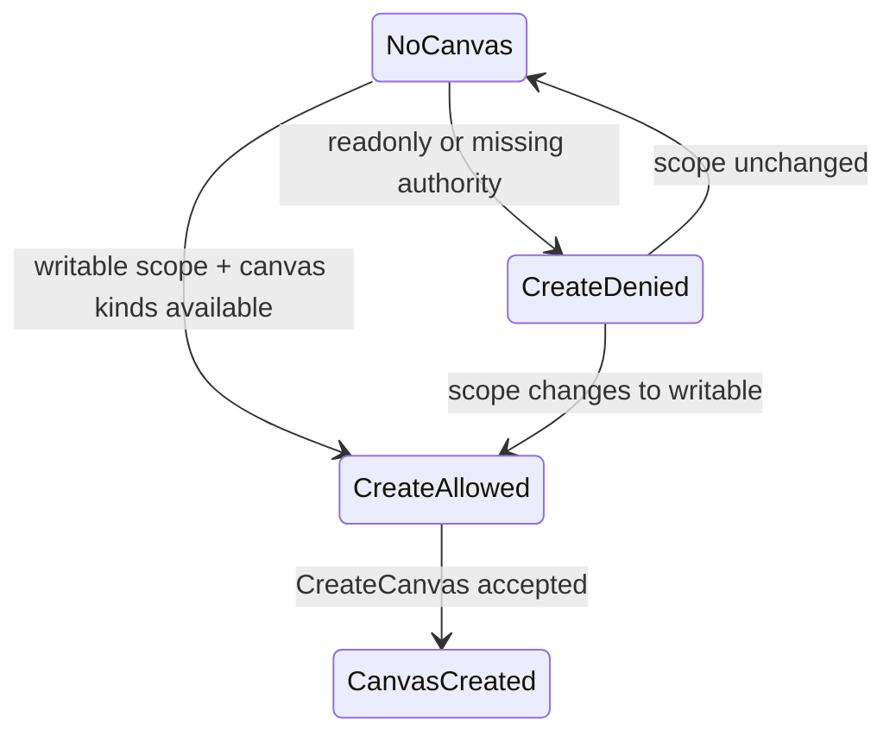

# Fowler Element - Read-Only First-Canvas Policy

## Observed Error

The screen says the Canvas is read-only while also displaying first-canvas
choices (`dbt`, `Transformation`). If those choices are actionable, the
read-only message is misleading. If they are not actionable, the buttons should
not look like normal creation actions.

## Fowler Reading

- **Opportunity**: Hidden authority and duplicate semantics.
- **Pattern**: Explicit Policy Object over `CreateCanvas` availability.
- **DDD owner**: `CanvasDocument` creation policy / `CanvasKind` availability
  read model.
- **Rail**: existing/proposed `CreateCanvas` and `ListCanvasKinds` from the
  project onboarding plan.

## Public API

Proposed local API:

```ts
type FirstCanvasCreationPolicy = {
  canCreateCanvas: boolean;
  denialReason?: 'readonly_scope' | 'missing_session' | 'capability_unavailable';
  canvasKinds: readonly CanvasKindRegistration[];
};
```

## Invariants

- Read-only scope cannot render mutating create controls as enabled.
- Canvas kind availability and create permission must be resolved together.
- The route may still show canvas-kind information in read-only mode, but it
  must not imply mutation is possible.
- Denial copy must explain the authority that blocks creation.

## Transitions



## Consumers

- `CanvasPlaygroundHost`
- `CanvasPlaygroundHostTemplate`
- `canvasShellLayoutBuilder`
- `canvasHostCycleState`
- future `CreateCanvas` adapter/API rail

## Existing Task Search

- `WEB-PROJECT-2` in the project onboarding plan already names
  `CreateCanvas`, `ListCanvasKinds`, and `CanvasDocument`.
- `F-27` covers route-level alpha gating.
- No active planning DB task was found for read-only first-canvas policy.

## Proposed Task

`E/F-28-B Read-only first-canvas policy`: align `needs_canvas` presentation with
create authority so read-only users do not see mutating choices as primary
actions.

## TDD Plan

- Red: `needs_canvas + canEditEdges=false` does not render enabled create
  buttons.
- Green: first-canvas policy returns denied posture and passive canvas-kind
  information.
- Architecture: assert `CanvasPlaygroundHostTemplate` does not decide mutation
  enablement from local props alone.
