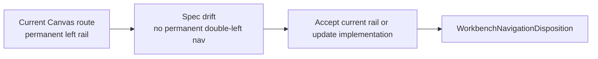

# Fowler Element - Workbench Navigation Rail Disposition

## Observed Error

The left rail footer is partially clipped in the screenshot. The UX draft also
states that the workbench should not have permanent double-left navigation,
while the current Canvas route still shows a permanent shell rail.

## Fowler Reading

- **Opportunity**: Documentation drift and boundary drift.
- **Pattern**: Shell Navigation Policy.
- **DDD owner**: App shell navigation read model.
- **Rail**: internal shell navigation query; no backend command.

## Public API

Proposed local API:

```ts
type WorkbenchNavigationDisposition = {
  railMode: 'visible' | 'collapsed' | 'hidden';
  footerMode: 'pinned' | 'scrollable' | 'menu';
  reason: 'global_route' | 'workbench_route' | 'focus_mode' | 'narrow_viewport';
};
```

## Invariants

- Footer navigation cannot be clipped in the first viewport.
- Workbench routes must have a documented decision for permanent rail vs
  collapsed/menu navigation.
- Focus mode is not the only way to reduce workbench chrome if the active UX
  contract says the rail should not be permanent.

## Current Vs Target



## Consumers

- `LeftNavigationRail`
- `AppShellFrame`
- `useShellRuntime`
- workbench route shell tests
- UX specification

## Existing Task Search

- `F-15` owns workbench UX contract.
- `F-25` owns plugin UX integration and docks.
- No pre-existing specific task was found for navigation rail disposition and
  footer clipping.

## Task Assignment

Created planning DB task `E/F-15-D Workbench navigation rail disposition` as a
queued child task of `F-15`.

Objective: resolve the workbench left-navigation rail disposition so the Canvas
workbench follows the accepted no-permanent-left-rail shell specification
without clipping footer navigation or hiding global routes.

This task should decide whether Canvas keeps, collapses, or removes the
permanent rail and add a footer visibility guard if a rail remains.

## TDD Plan

- Red: desktop-height rail footer items are visible and not clipped.
- Green: navigation disposition policy assigns footer behavior.
- Architecture: assert `LeftNavigationRail` does not encode workbench-route
  policy without `AppShellFrame`/shell runtime input.
