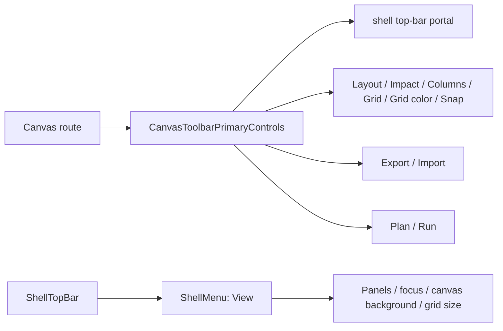
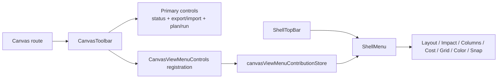

# F-15 Canvas View Menu Fowler Architecture Analysis

## Scope

This review covers the Canvas top-bar controls observed in the running
application on 2026-05-16. The active user-facing issue is that route-local
Canvas view controls are rendered directly in the top bar instead of being
available from the global `View` menu.

The governing task is `F-15`: define and implement the workbench UX contract so
the frontend converges on a VS Code-like shell grammar without cloning an IDE.
No new task is required.

## Governing Sources

- `docs/planning/status/governance-document-rule-inventory.md`
- `docs/guides/ai-work-protocol.md`
- `docs/architecture/command-query-rail-governance.md`
- `docs/architecture/fowler-opportunity-planning-governance.md`
- `docs/planning/proposals/mandatory/frontend-and-ux/dvt-workbench-ux-specification-v0-4-20260505-draft.md`
- `docs/architecture/components/web/index.md`
- `docs/architecture/components/web/graph/canvas-shell-component.md`
- `docs/architecture/components/web/graph/canvas-route-presentation-component.md`

## Current-State Diagram

## Fowler Findings

| Finding                                                                                     | Signal                                                                                       | Fowler opportunity      | Mature-system comparison                                                                                             | Fix                                                                            |
| ------------------------------------------------------------------------------------------- | -------------------------------------------------------------------------------------------- | ----------------------- | -------------------------------------------------------------------------------------------------------------------- | ------------------------------------------------------------------------------ |
| Canvas view controls live in the route toolbar                                              | Visual toggles compete with Plan/Run and draft status                                        | Responsibility overload | Mature workbenches keep view preferences in `View` and reserve the toolbar for active tool state and primary actions | Add a `CanvasViewMenuControls` semantic component consumed from `ShellMenu`    |
| `ShellMenu` lacks a Canvas extension seam                                                   | The global View menu cannot host route-local view commands without direct prop drilling      | Boundary drift          | VS Code-style systems let active editors contribute view/menu commands through a narrow contribution API             | Add a transient route-owned registration store for active Canvas view controls |
| Existing architecture test checks only thin composition                                     | `CanvasToolbar.architecture.test.tsx` proves helper imports but not the UI grammar invariant | Test-only confidence    | Mature systems guard semantic placement, not only module thinness                                                    | Add semantic architecture coverage for menu ownership and toolbar exclusion    |
| Documentation names Canvas shell and route-presentation APIs but not View-menu contribution | Docs explain toolbar posture, not route-local menu contribution                              | Documentation drift     | Component docs should document public API, invariants, transitions, consumers                                        | Add a local component guide and user stories                                   |
| Several labels are repeated across toolbar copy and menu shell copy                         | Visual preference copy is owned by Canvas but rendered in shell                              | Duplicate semantics     | One component should translate Canvas view-control labels into menu items                                            | Reuse `canvasViewCopy` inside the Canvas menu contribution component           |

## Antipatterns Detected

- **Toolbar as junk drawer**: layout, overlays, grid, file commands, run commands,
  and draft posture share one horizontal strip.
- **Feature envy**: `CanvasToolbarPrimaryControls` owns visual preference
  commands that belong to the route-local contribution into `View`.
- **Implicit extension point**: the top bar has a portal target, but the `View`
  menu has no named route-contribution API.
- **Semantic guard gap**: tests can pass while controls appear in the wrong
  command surface.

## Components To Group

The following concern should be grouped as a named component:

- `CanvasViewMenuControls`: renders route-local Canvas visual controls inside
  `ShellMenu`.
- `canvasViewMenuContributionStore`: stores the currently active Canvas view
  control contribution while the Canvas route is mounted.
- `CanvasToolbarPrimaryControls`: narrows to workflow status, project snapshot
  commands, Plan, and Run.

## Solution-Rationale Diagram

## Command And Query Rail

This slice does not introduce a new backend command or query rail. It moves
presentation-only Canvas view preferences to the existing `View` command
surface:

- owning bounded context: `web` / Canvas workbench presentation
- DDD owner: Canvas route presentation and shell chrome component
- rail posture: `none - internal presentation only`
- negative tests: architecture test must fail if Canvas view controls return to
  the top-bar toolbar or if the component guide loses API/invariant coverage

## Patterns Applied

- **Presentation Model**: menu controls receive resolved state and labels rather
  than reading route internals directly.
- **Service Layer / Contribution Registry**: active route registers a narrow
  menu contribution consumed by shell chrome.
- **Information Hiding**: `ShellMenu` knows only that an active route exposes
  Canvas view controls; it does not know Canvas controller internals.
- **Semantic Architecture Guard**: test protects placement semantics and docs.

## Repetitions To Fix

- Toolbar labels for `Layout`, `Impact`, `Columns`, `Grid`, `Grid color`, and
  `Snap` repeat the same product intent that the `View` menu should own.
- Grid state exists both as route graph projection and shell view preference.
  The fix keeps state in the existing store/controller path but renders it
  through one menu contribution.

## Drift To Fix

- Code drift: `CanvasToolbarPrimaryControls` renders controls that the workbench
  UX spec says belong in `View`.
- Documentation drift: no `Canvas View Menu` component guide documents public
  API, invariants, transitions, consumers, and diagrams.
- Test drift: current architecture test checks composition thinness but not
  menu-command semantics.

## Future Lessons

- New route-local view controls must be contributed to `View`, not appended to
  top-bar toolbar portals by default.
- A route toolbar should answer "what can I do to this work item now?", not
  "where are all preferences?".
- Architecture tests should assert command-surface ownership, not only that
  files import smaller helpers.
- Component guides must be written at the same time as new shell extension
  seams, because shell grammar is product architecture.

## Residual Opportunities

- `Export` and `Import` still deserve a canonical `File`/`Export` menu surface
  under `F-15`, but they are outside this `View`-menu correction.
- The full top-level menu grammar (`File`, `Edit`, `View`, `Insert`, `Export`,
  `Run`, `Admin`, `Help`) remains broader than this targeted fix.
- Canvas active interaction mode (`Select`, `Pan`, `Zoom`, `Fit`) is not yet
  represented as a first-class mode model in this slice.
