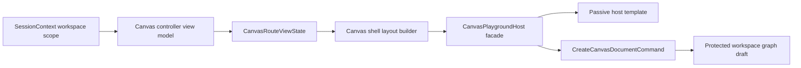

# Fowler Review F-15-E Canvas Startup Template Selection

## Context

The Canvas startup surface currently presents `dbt` and `Transformation` as the
first visible choice after the workspace route loads. In the current UI this can
read as a project-type selector. The mature-system posture should be different:
workspace, project, tenant, environment, and adapter are already resolved by the
protected session context. The empty Canvas route should ask for a canvas
template inside that active workspace.

## Fowler Reading

| Fowler lens            | Current signal                                                                                   | Target pattern                                                                      |
| ---------------------- | ------------------------------------------------------------------------------------------------ | ----------------------------------------------------------------------------------- |
| Context boundary       | Canvas template choice appears before the workspace context is visible.                          | Explicit context map: active workspace first, template choice second.               |
| Semantic encapsulation | `CanvasPlaygroundHostTemplate` renders a registry label that is too close to a project taxonomy. | Host resolves presentation copy and template title; template renders passive slots. |
| Facade                 | `CanvasPlaygroundHost` already owns command construction.                                        | Keep the facade and add workspace scope as resolved view input.                     |
| Registry               | Runtime canvas kinds are correctly contributed by plugins.                                       | Present registrations as templates, not as route or project authority.              |
| Command rail           | `CreateCanvasDocumentCommand` already persists through the protected draft boundary.             | Reuse the existing command rail without a parallel startup command.                 |

## Mature-System Comparison

Mature workbench products separate these concerns:

- account or workspace context is stable chrome, not a repeated startup decision;
- new-document creation uses templates inside the current container;
- plugin or domain registrations are internal capability catalogs, not raw
  product taxonomy shown to operators;
- destructive or authority-changing actions are explicit and CAS-protected;
- first-run onboarding copy does not imply data has moved before persistence
  succeeds.

The Canvas route already has mature command and draft persistence seams. The
gap is presentation language and local semantic guard coverage.

## Improved Patterns

- Protected draft persistence is already owned by the existing
  `CreateCanvasDocumentCommand` rail.
- The first-canvas HTML was previously moved into a passive template.
- Runtime canvas registrations are already contributed by the plugin registry.
- Route posture already distinguishes `needs_canvas`, `empty`, and `ready`.

## Antipatterns Detected

- **Leaky registry language:** `registration.label` makes the operator see
  `dbt` and `Transformation` as product/project choices.
- **Hidden context:** active workspace scope is available in the route but not
  shown at the first-authoring decision point.
- **Documentation drift:** component docs describe typed first-canvas posture
  but do not name the template-selection invariant.
- **Thin architecture guard:** the host architecture test checks passive HTML
  placement but not the domain meaning of the first-start choice.

## Components To Group

- `CanvasPlaygroundHost.tsx`: host facade, copy selection, command dispatch.
- `CanvasPlaygroundHost.templates.tsx`: passive first-start presentation.
- `canvasRouteViewState.ts`: route view state boundary that carries active
  workspace context.
- `canvasShellLayoutBuilder.tsx` and center-surface modules: route composition
  path that carries the context into the host.
- `canvasCopyCatalog.route.*`: localized first-start wording.
- `CanvasPlaygroundHost.architecture.test.tsx`: semantic guard for the
  component guide, stories, copy, and passive template boundary.

## Repetitions

- Workspace scope is already read for draft authoring, plan, run, and snapshot
  commands. The host surface repeats the same conceptual context by omission:
  it asks for a type without naming the already-selected container.
- The route has multiple "kind" terms for internal registry logic. User-facing
  first-start copy should use "template" where the decision is a new Canvas
  document template.

## Opportunities

- Use the existing session context as the visible workspace summary.
- Make `createTitle` the visible button title so the operator chooses a
  document template such as `Transformation canvas`.
- Add architecture coverage that verifies docs, stories, copy, context flow,
  and passive template invariants together.
- Keep visual work scoped to the Canvas route; no new project selector is
  introduced.

## Drift

- Code drift: workspace scope exists in the controller environment but does not
  cross the route view-state boundary for first-start presentation.
- Documentation drift: the component guide says the host owns create-canvas
  posture but does not describe the active-workspace template selection.
- Test drift: the architecture guard validates template thinness, not the
  semantic distinction between project type and canvas template.

## Applied Pattern

The slice applies a small Presenter/Template split:

## Fix Scope

- Show the active workspace scope on the first-start host card.
- Rename visible first-start copy from canvas kind selection to canvas template
  selection.
- Render `createTitle` as the option title.
- Add semantic architecture guard coverage and focused presentation tests.
- Update component and story documentation with diagrams and invariants.

## ADR Position

No ADR is required for this slice. The decision reuses the existing Canvas host
facade, plugin registry, session-context port, and protected draft command rail.
It does not introduce a new architectural style, persistence authority, adapter
contract, or cross-bounded-context policy.
