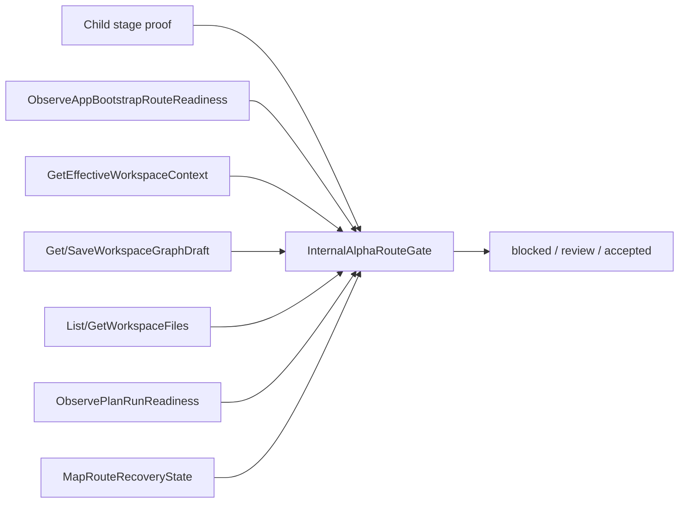
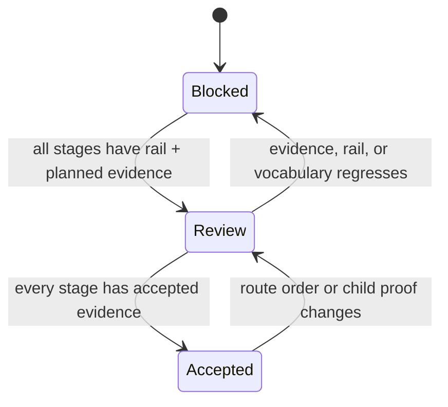

# Fowler Analysis For F-27 Alpha Route Gate Branch

## Scope

This analysis covers the current branch work around F-27:

- startup route readiness through `ObserveAppBootstrapRouteReadiness`;
- effective workspace context through `GetEffectiveWorkspaceContext`;
- the combined route gate fixture in
  `apps/web/src/app/routes/internalAlphaRouteGate.test.fixtures.ts`;
- route-level documentation and acceptance matrix updates.

It does not accept alpha-full. Canvas, Code, plan/run readiness, and recovery
states remain planned stage evidence.

## Fowler View

The strongest Fowler improvement is moving from implicit completion to an
explicit gateway. The branch replaces "a child slice passed" with a route-level
decision model: `blocked`, `review`, and `accepted`. That is closer to mature
systems where release readiness is a composed domain decision, not an accidental
side effect of a green local test.

The second improvement is Command Query Separation. Startup readiness and
workspace context now bind to named rails instead of UI-local assumptions:

- `ObserveAppBootstrapRouteReadiness` owns startup readiness observation.
- `GetEffectiveWorkspaceContext` owns protected runtime workspace scope.

The third improvement is semantic tests. The route fixture checks stage order,
rail coverage, evidence acceptance, recovery vocabulary, and fail-closed
posture. This moves the architecture guard beyond a thin barrel or import-shape
test.

## Mature-System Comparison

Mature internal-alpha systems usually have:

- one release gate that composes child evidence;
- explicit owner and rail for every externally visible behavior;
- no local browser state as product authority;
- executable evidence for both happy path and denial path;
- documentation that names API, invariants, transitions, and consumers;
- a route from user stories to tests and operational risk.

The current branch now matches the first five for startup and workspace context.
It is still behind mature systems for Canvas, Code, plan/run readiness, and
recovery vocabulary because those stages remain planned.

## Improved Patterns

| Pattern                         | Current result                                                                 |
| ------------------------------- | ------------------------------------------------------------------------------ |
| Gateway                         | `InternalAlphaRouteGate` composes child-stage evidence before alpha-full.      |
| Command Query Separation        | Startup and context use named rails instead of local route assumptions.        |
| Presentation Model              | Startup readiness resolves visible bootstrap state before DOM commands.        |
| Explicit Context Object         | Workspace context is server-owned and projected into `sessionStore`.           |
| Semantic Fitness Function       | Architecture tests assert route-stage semantics, not just file boundaries.     |
| Fail-Closed Boundary            | Missing evidence, missing rail, or incomplete recovery vocabulary blocks gate. |
| Test Fixture As Domain Evidence | The combined fixture models route acceptance without becoming product runtime. |

## Antipatterns Detected

| Antipattern                  | Evidence                                                            | Disposition                                           |
| ---------------------------- | ------------------------------------------------------------------- | ----------------------------------------------------- |
| Child-slice authority drift  | A closed child slice could imply alpha-full readiness.              | Mitigated by F-27 route gate and combined fixture.    |
| Planning rail fossilization  | `ObserveWorkspaceContext` stayed after real rail implementation.    | Fixed by switching to `GetEffectiveWorkspaceContext`. |
| Test-only confidence         | Cypress could prove a visual route while context API was unstubbed. | Fixed by stubbing `/workspace/context` in E2E.        |
| Documentation drift          | Matrix and plan named a provisional context rail.                   | Fixed in plan, component guide, stories, and matrix.  |
| Semantic under-encapsulation | Accepted evidence lacked explicit semantics in component guide.     | Fixed by `Accepted Evidence Semantics` section.       |

## Component Grouping Opportunities

The current component grouping is reasonable:

- App bootstrap policy: `apps/web/src/app/bootstrap/*`.
- Protected route context: `apps/web/src/app/services/session/*`.
- Alpha gate proof: `apps/web/src/app/routes/internalAlphaRouteGate.*`.
- Browser proof: `apps/web/cypress/e2e/shell/*` and
  `apps/web/cypress/e2e/canvas/*`.

The next grouping opportunity is not a move yet. It is a semantic package inside
`apps/web/src/app/routes/internalAlphaRouteGate.*`: keep the fixture, evaluator,
and architecture guard together while the gate remains documentary. Extracting a
runtime module now would create false product authority.

## Repetitions

- Route rail lists repeat across route plan, component guide, user stories,
  fixture, and architecture test.
- Stage names repeat across matrix, fixture, and user stories.
- Evidence acceptance language repeats between the acceptance matrix and F-27
  planning state.

These repetitions are acceptable while F-27 is a governance gate. They should
not become production constants until the route gate becomes runtime behavior.

## Drift

Fixed drift:

- `ObserveWorkspaceContext` replaced with `GetEffectiveWorkspaceContext`.
- Canvas E2E context proof now stubs the protected workspace context endpoint.
- Startup Cypress module now declares its owned concern.
- Component guide now describes accepted-evidence semantics.

Remaining drift:

- Canvas workbench, Code workbench, plan/run readiness, and recovery states are
  still `planned` evidence.
- The branch has architecture evidence, but not a dedicated ADR. ADR is not
  required because no new accepted cross-system decision was introduced; the
  branch applies ADR-0055 and existing command/query governance.

## Lessons

- A route-level gate should never infer readiness from a child-slice closeout.
- Planning rails must be retired once an implemented rail exists.
- Browser tests that claim protected route readiness must stub the same runtime
  endpoints the protected gate consumes.
- Accepted evidence needs a semantic contract, not just resolvable file paths.
- Local fixtures are evidence models; they are not product authority.

## Opportunities

1. Accept Canvas evidence next only after browser proof covers draft load,
   save denial, stale draft, and retry exhaustion.
2. Accept Code evidence only after read-only tree, content, unavailable,
   unauthorized, not-found, traversal, oversize, binary, and freshness cases are
   represented in route-level evidence.
3. Create a recovery-vocabulary component if recovery copy starts repeating
   across Canvas, Code, plan/run, and startup.
4. Keep `alpha-full` blocked until all stage evidence is accepted in one
   combined route fixture.

## Applied Patterns

## ADR Decision

No ADR is required for this slice. The branch applies existing architecture:

- command/query rail governance;
- ADR-0055 server-owned effective workspace context;
- F-27 route-level gate authority.

Create an ADR later only if `InternalAlphaRouteGate` becomes runtime product
behavior instead of a governance evidence model.
