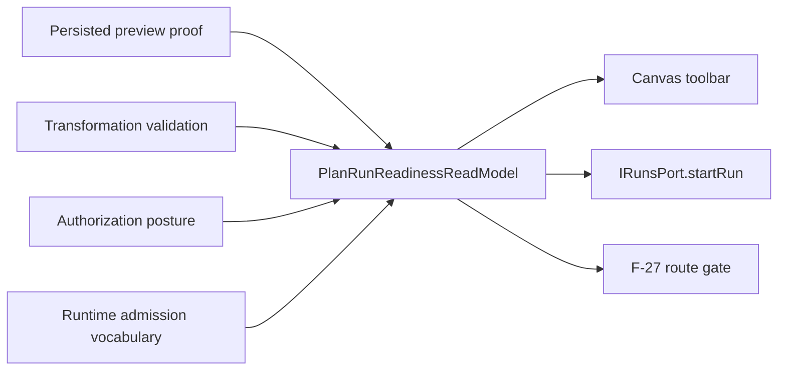

# Fowler Analysis - F-27 Plan/Run Readiness

## Scope

This analysis covers the F-27 plan/run readiness slice after startup,
workspace context, Canvas, Code, and recovery evidence were accepted. The
slice does not close alpha full. It closes the readiness evidence row and
keeps cadence and risk triage as separate alpha-full blockers.

## Mature-System Comparison

Mature product systems do not let a toolbar button own execution readiness.
They publish a read model that states whether an operation is admitted and why
it is blocked. Presentation components render that read model; runtime,
planner, authorization, and adapter concerns remain behind ports and policies.

DVT was close to that posture because run start already checked planRef,
persisted preview proof, stale preview, and permissions before calling
`IRunsPort.startRun`. The remaining immaturity was semantic: the same product
truth was represented as local strings and booleans instead of a named
`ObservePlanRunReadiness` read model.

## Fowler Opportunity Matrix

| Scenario                                        | Opportunity         | Fowler pattern                 | DDD owner                            | Command/query rail        | Implementation surfaces                      | Unit or package test                          | Architecture test                             | User-flow test                       | Out of scope                     |
| ----------------------------------------------- | ------------------- | ------------------------------ | ------------------------------------ | ------------------------- | -------------------------------------------- | --------------------------------------------- | --------------------------------------------- | ------------------------------------ | -------------------------------- |
| Start run with persisted preview                | Boundary drift      | Presentation Model             | `PlanRunReadinessReadModel`          | `ObservePlanRunReadiness` | `canvasPlanReadiness.ts`, docs, F-27 fixture | `canvasPlanReadiness.test.ts`                 | `canvasPlanRunReadiness.architecture.test.ts` | `canvas-preview-run-persisted.cy.ts` | Creating a new runtime endpoint  |
| Missing or stale plan proof                     | Primitive obsession | Value object/read model        | `PlanRunReadinessReadModel`          | `ObservePlanRunReadiness` | `canvasPlanReadiness.ts`                     | `canvasPlanReadiness.test.ts`                 | `canvasPlanRunReadiness.architecture.test.ts` | existing browser blocked-run proof   | Changing planner contract        |
| Disabled run permission                         | Duplicate semantics | Policy read model              | Authorization + readiness read model | `ObservePlanRunReadiness` | `canvasPlanReadiness.ts`, run-start tests    | `useCanvasExecutionActions.runStart.test.tsx` | `canvasPlanRunReadiness.architecture.test.ts` | existing browser proof               | RBAC redesign                    |
| Capability mismatch                             | Boundary drift      | Gateway + presentation model   | Canvas execution strategy            | `ObservePlanRunReadiness` | `canvasExecutionState.ts`                    | `canvasPlanReadiness.test.ts`                 | `canvasPlanRunReadiness.architecture.test.ts` | existing disabled-action proof       | New plugin runtime               |
| Backpressure and adapter degradation vocabulary | Documentation drift | Source-owned reason vocabulary | Runtime admission read model         | `ObservePlanRunReadiness` | component guide and read model union         | `canvasPlanReadiness.test.ts`                 | `canvasPlanRunReadiness.architecture.test.ts` | N/A - vocabulary only                | Backend admission implementation |

## Improved Patterns

- `PlanRunReadinessReadModel` gives the toolbar a source-owned posture instead
  of making buttons infer readiness from scattered booleans.
- `observePlanRunReadiness` becomes the semantic query adapter for existing
  Canvas plan/run state.
- The F-27 route fixture can now cite executable evidence instead of treating
  plan/run readiness as planned narrative.
- The architecture guard checks semantics: read model ownership, blocker
  vocabulary, evidence references, and toolbar non-ownership.

## Antipatterns Found

- Primitive obsession: readiness causes were implicit in strings and booleans.
- Feature envy: toolbar consumers could infer readiness from local props.
- Test-only confidence: route evidence could say the rail existed while no
  semantic read model proved the rail.
- Documentation drift: F-27 matrix still described plan/run readiness as
  planned after run-start and persisted-preview proofs already existed.

## Components To Group

- `canvasPlanReadiness.ts`: readiness read model, planRef and persisted preview
  proof helpers.
- `canvasExecutionState.ts`: composition of graph validation, execution
  strategy, and readiness read model.
- `useCanvasExecutionActions.*`: action orchestration and tests for plan
  preview and run start.
- `canvas-preview-run-persisted.cy.ts`: browser evidence for persisted preview
  success and fail-closed run-start posture.

## Repetitions Fixed

- Replaced implicit readiness status construction with
  `observePlanRunReadiness`.
- Centralized F-27 blocker names:
  `plan_integrity`, `backpressure`, `capability_mismatch`,
  `adapter_degraded`, and `authorization_denied`.
- Added a component guide so API, invariants, transitions, and consumers are no
  longer repeated only in route-plan prose.

## Drift Fixed

- Code now has an owned-concern docblock at the start of
  `canvasPlanReadiness.ts`.
- F-27 evidence can move from planned to accepted for plan/run readiness while
  alpha full remains blocked by cadence and risk triage.
- The component guide and user stories now match the read model and tests.

## Opportunities Left

- Backend runtime admission can later publish backpressure and adapter degraded
  states directly through an API read model.
- A future Lane C/A slice can connect runtime admission telemetry to the same
  `ObservePlanRunReadiness` vocabulary without changing toolbar semantics.
- Cadence and risk triage remain separate F-27 closeout slices.

## Solution Diagram

## Lessons

- A route gate should not accept a stage from a rail name alone. It needs a
  semantic read model and executable negative proof.
- Button disabled state is a presentation consequence, not the readiness
  source of truth.
- F-27 remains useful because it separates child-slice proof from alpha-full
  acceptance.
