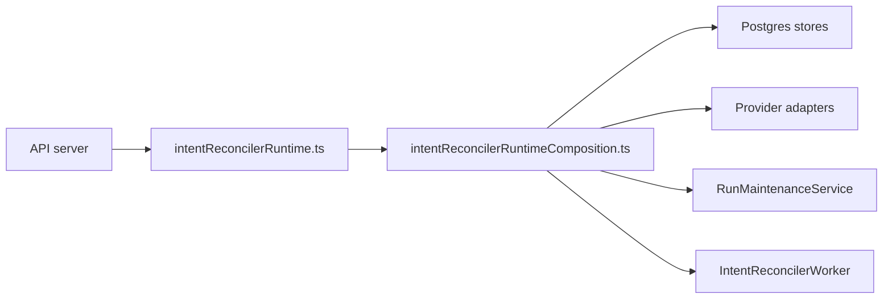

# DHM-WS2 Fowler Runtime Composition Hardening Analysis

## Context

`DHM-WS2` had already extracted a named
`IntentReconcilerRuntimeComposition`, but the public
`intentReconcilerRuntime.ts` module still contained both the caller-facing
factory and the concrete startup assembly. That left a residual semantic
collapse: the code had a class name, but the module still owned two concerns.

## Fowler Assessment

Improved patterns:

- **Composition Root** is now explicit in
  `intentReconcilerRuntimeComposition.ts`.
- **Facade** is now explicit in `intentReconcilerRuntime.ts`.
- **Architecture Fitness Function** guards the module boundary and startup
  ordering.

Antipatterns removed:

- **Responsibility overload**: the public runtime module no longer owns concrete
  Postgres, provider, maintenance, worker, and handle assembly.
- **Boundary drift**: adapter-postgres and engine-runtime construction are
  mechanically forbidden in the facade.
- **Documentation drift**: component docs now describe the two-module boundary
  and the user stories include the facade-thinness scenario.

## Mature-System Comparison

Mature runtime systems usually separate the caller contract from bootstrapping
infrastructure. The application shell exposes a small stable API, while the
composition root owns concrete wiring and can evolve without coupling callers to
startup internals. This pass moves DHM-WS2 closer to that posture without
changing HTTP routes, engine contracts, adapter contracts, or runtime behavior.

## Repetitions And Drift

Detected repetition:

- The startup sequence was represented in docs, tests, and code, but code still
  placed facade and composition in the same module.

Fix applied:

- `intentReconcilerRuntime.ts` now delegates to
  `createIntentReconcilerRuntimeComposition`.
- `intentReconcilerRuntimeComposition.ts` owns config, stores, migrations,
  adapter resolution, maintenance, worker, and handle assembly.
- The architecture test now fails if concrete assembly returns to the facade.

## Component Boundary

## Future Lessons

- A named class is not enough semantic encapsulation if the module still mixes
  caller contract and concrete assembly.
- Architecture tests should validate ownership semantics, not only symbol
  presence.
- Component docs should name public API, invariants, transitions, consumers, and
  forbidden re-couplings for every extracted runtime seam.
