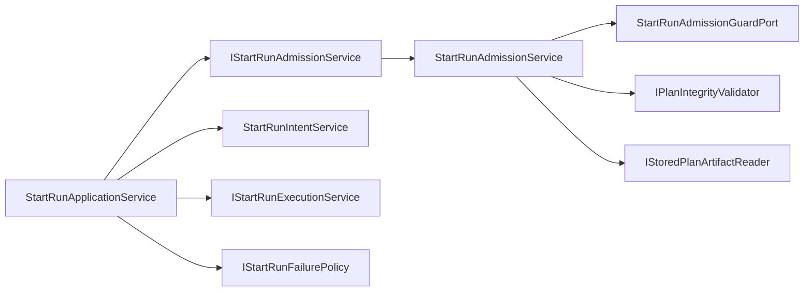

# DHM-WS3 Fowler Analysis For Start-Run Admission Semantics

## Context

`DHM-WS3` already extracted the large `WorkflowEngine.startRun` flow into named
phase services. The branch history and accepted evidence show that
`StartRunApplicationService` no longer owns adapter dispatch or failed-start
compensation directly.

The remaining drift is smaller but still architectural: the application
coordinator still constructs `StartRunAdmissionService` internally. Mature
hexagonal systems normally make each use-case phase an explicit collaborator so
the coordinator sequences phases, while phase services own their own API,
invariants, and tests.

## Fowler Reading

| Concern                 | Current signal                                                                    | Fowler / DDD reading                                                        | Target correction                                            |
| ----------------------- | --------------------------------------------------------------------------------- | --------------------------------------------------------------------------- | ------------------------------------------------------------ |
| Start-run orchestration | `StartRunApplicationService` sequences admission, intent, execution, and failure. | Application Service / Transaction Script over explicit phase collaborators. | Keep orchestration in the application service.               |
| Admission phase         | `StartRunAdmissionService` exists but is constructed by the coordinator.          | Policy coordinator and Parameter Object boundary.                           | Promote it to an injected semantic seam.                     |
| Provider dispatch       | Already behind `IStartRunExecutionService`.                                       | Strategy / Gateway over provider adapter.                                   | Preserve.                                                    |
| Failed-start handling   | Already behind `IStartRunFailurePolicy`.                                          | Policy Object.                                                              | Preserve.                                                    |
| Plan integrity          | Owned by the admission phase but still reaches the coordinator constructor.       | Application policy should not leak back into coordinator dependencies.      | Keep plan integrity inside the admission collaborator graph. |

## Comparison With Mature Systems

Mature workflow engines keep command coordinators thin. A start command normally
has separately testable phases:

1. admission and policy checks;
2. durable intent creation;
3. provider dispatch;
4. persistence and compensation;
5. telemetry and failure reporting.

DVT now has most of that shape. The remaining gap is that phase construction is
not fully symmetric: execution and failure are injected seams, while admission
is still assembled inside the coordinator. That asymmetry invites future drift:
new admission rules can leak into the coordinator constructor instead of staying
in the admission component.

## Improved Patterns

- `StartRunApplicationService` already improved from a large workflow method to
  a phase coordinator.
- `StartRunAdmissionService` already groups plan integrity, provider resolution,
  capability validation, and run-execution-context admission.
- `StartRunExecutionService` and `StartRunFailurePolicy` already isolate
  provider dispatch and failure semantics.

## Antipatterns Detected

- **Half-extracted service**: `StartRunAdmissionService` exists but is not a
  first-class injected seam.
- **Constructor drift**: plan fetcher and integrity validator still pass through
  the application coordinator even though they belong to admission.
- **Semantic asymmetry**: execution and failure have interfaces in
  `StartRunTypes`; admission does not.
- **Documentation drift**: `DHM-WS3` is marked queued in planning state even
  though earlier evidence exists; the residual slice must clarify that this is
  a continuation, not a duplicate implementation.

## Components To Group

The start-run component should be grouped as:

The application coordinator should know the admission API, not the admission
construction graph.

## Repetitions

- Admission, execution, and failure all act as start-run phase services, but
  only execution and failure currently have exported interfaces in
  `StartRunTypes`.
- Architecture docs describe phase services, but the component guide does not
  explicitly require an admission seam invariant.

## Drift

- Code drift: `StartRunApplicationService` still imports and constructs
  `StartRunAdmissionService`.
- Documentation drift: the DHM-WS3 user stories stop at execution/failure
  injection and do not describe admission injection.
- Planning drift: `DHM-WS3` effective task state needed local reconciliation
  before this continuation.

## Opportunities

- Add `IStartRunAdmissionService` to the start-run phase type surface.
- Make `StartRunApplicationService` receive `IStartRunAdmissionService`.
- Move admission construction to `buildStartRunApplicationService`.
- Add architecture tests that validate semantic phase ownership, not only
  imports or barrel thinness.
- Update component docs with the public API, invariants, transitions, and
  consumers for the admission seam.

## Decision

No new ADR is required. The correction is an implementation of existing
governance:

- `ADR-0003`: DVT owns execution semantics.
- `ADR-0004`: start-run writes remain event-sourced.
- `ADR-0012`: plan integrity remains before dispatch.
- `ADR-0030`: intent log crash consistency remains unchanged.
- `ADR-0034`: bounded context communication remains explicit through ports.
- `ADR-0039`: start-run orchestration belongs in application services with
  concrete collaborator construction moved to composition seams.

## Implementation Guidance

Use TDD:

1. RED: architecture test fails while `StartRunApplicationService` constructs
   `StartRunAdmissionService`.
2. RED: service test fails while a supplied admission seam is not invoked.
3. GREEN: add `IStartRunAdmissionService`, inject it into
   `StartRunApplicationService`, and construct the default admission service in
   `buildStartRunApplicationService`.
4. REFACTOR: align docs and symbols so the seam is documented and guarded.

## Future Lessons

- When extracting a phase service, extract both the implementation and its
  semantic interface in the same slice.
- Component docs should state construction ownership, not only runtime behavior.
- Planning reconciliation must happen before reopening a task with historical
  evidence, otherwise a continuation can look like duplicate work.
