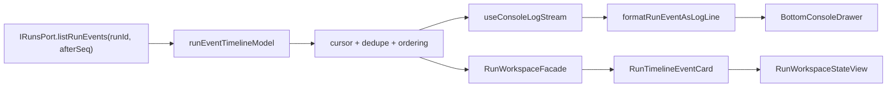

# F-10 Fowler Analysis - Run Event Convergence

## Scope

This analysis covers the work already present after F-07 through F-09 and the
F-10 closure needed for run event timeline and console convergence.

Governing sources:

- `docs/planning/status/governance-document-rule-inventory.md`
- `docs/architecture/command-query-rail-governance.md`
- `docs/architecture/fowler-opportunity-planning-governance.md`
- `docs/architecture/components/web/runs/frontend-runtime-contract-technical-manual.md`
- `docs/architecture/components/web/runs/dvt-runs-frontend-architecture.md`
- `docs/architecture/components/web/appshell/app-shell.md`
- `docs/architecture/components/web/runs/component-runs.md`
- `docs/architecture/components/web/runs/user-stories-runs.md`

## Fowler Reading

The current Runs work is moving in the right direction:

- `IRunsPort` is a gateway/port boundary over runtime command and query rails.
- `RunWorkspaceFacade` is a service-layer facade that composes snapshot and
  event queries into a route view model.
- `runWorkbenchStateModel` is a Presentation Model for route state.
- `runEventPresentationModel` is a Presentation Model for raw runtime events.
- `BottomConsoleDrawer` has its own shell model and does not claim snapshot
  authority.

Compared with mature operational systems such as Grafana Explore, Temporal UI,
Datadog Logs, and VS Code terminal/problem surfaces, the current design is
missing one important layer: a stable event-stream semantic model. Mature
systems separate raw event transport from presentation and from cursor/dedupe
semantics. They do not let a terminal drawer, timeline card list, or snapshot
workspace each decide independently how to order, merge, and resume events.

## Improved Patterns Already Present

The branch history improved several patterns:

- Command/query rail clarity: `GET /runs/:runId/events` is the single query
  rail for event chronology.
- Authority separation: snapshot truth remains `GET /runs/:runId`; events are
  chronology support, not result-evidence authority.
- Presentation reuse: console lines and timeline cards share event headline and
  severity mapping.
- Workbench state modelling: list, loading, missing, degraded, and workspace
  states are explicit instead of being scattered conditionals.
- React Query usage: status refresh now lives in query policy instead of local
  ad hoc effects.

## Antipatterns Detected

1. **Implicit Stream Model**
   `useConsoleLogStream` owns live polling, cursor state, line accumulation,
   reset semantics, and formatting. That mixes transport, stream state, and
   terminal presentation.

2. **Duplicate Timeline Semantics**
   `RunWorkspaceFacade` and `useConsoleLogStream` both consume
   `listRunEvents`, but only the console path has incremental `afterSeq`
   behavior. The workspace path receives whatever order/deduplication the
   backend returns.

3. **Large Component Gravity**
   `RunWorkspaceStateView.tsx` renders snapshot, provenance, materialization,
   diagnostics, and timeline cards in one component. This is understandable
   historically but weakens local semantic ownership.

4. **Documentation Ahead Of Code**
   Docs already describe convergence and typed live-log behavior as target
   direction. Code still lacks a shared timeline merge/dedupe/cursor model, so
   the docs are directionally right but ahead of the implementation.

5. **Architecture Test Too Structural**
   `runsDomainBoundary.architecture.test.ts` validates docblocks, rails, and
   boundary isolation. It does not yet prove the semantic invariant that both
   Runs and Console consume one shared event timeline model.

## Components To Group

The Runs event work should be grouped as a local component:

- **Run event transport:** `IRunsPort.listRunEvents`
- **Run event stream model:** timeline ordering, dedupe, cursor preservation,
  active-status polling decision
- **Run event presentation model:** severity, headline key, detail, step ID
- **Run event copy:** shared headline copy
- **Console rendering:** terminal line formatting and shell drawer state
- **Runs rendering:** structured timeline cards inside durable workspace detail

The missing component is the run event stream model. It should sit beside
`runEventPresentationModel.ts` under `services/runs/`, because it is not a
React concern and both route and shell consumers need it.

## Repetitions

- Event formatting is shared, but event ordering and dedupe are not.
- Event live-state logic is repeated conceptually between F-09 status refresh
  and F-10 console polling.
- Timeline empty/degraded/available state exists in the facade, while console
  state only has idle/loading/streaming.
- Docs describe the same authority split in Runs and App Shell pages; a local
  run event timeline component guide should become the concise owner.

## Drift

Code drift:

- `useConsoleLogStream` appends fetched event lines directly and has no
  protection against overlapping pages after reconnect.
- `RunWorkspaceFacade` does not normalize event order or duplicate event IDs.
- `RunWorkspaceStateView` owns too much timeline card rendering detail.

Documentation drift:

- `app-shell.md` says richer live-stream semantics remain future work.
- `frontend-runtime-contract-technical-manual.md` says F-10 owns convergence.
- `component-runs.md` has API/invariants for Runs broadly, but not a local API
  and invariants section specifically for event stream semantics.
- `user-stories-runs.md` covers list/run/events basics, but not reconnect,
  overlap, dedupe, ordered rendering, and terminal-vs-structured consumers.

## Opportunities

1. Add a `runEventTimelineModel` with public API for:
   - live status decision;
   - page normalization;
   - merge/dedupe across pages;
   - cursor preservation.
2. Use that model in both `RunWorkspaceFacade` and `useConsoleLogStream`.
3. Extract a `RunTimelineEventCard` component so structured event rendering has
   an owned concern separate from snapshot/provenance rendering.
4. Add a semantic architecture test proving both Console and Runs use the shared
   timeline model, not just that files are thin or barrels are clean.
5. Add a component-specific guide and user stories for run event timeline
   convergence.

## Future Lessons

- Do not call an event stream "converged" until ordering, dedupe, cursor, and
  reconnect behavior are explicit.
- Keep terminal-style log rendering separate from durable operational timeline
  rendering; they can share semantics without sharing UI.
- Make architecture tests semantic: validate the invariant the system cares
  about, not only import shape.
- When docs say "future convergence", create the local component guide before
  implementation so the next code change has a named owner.
- Prefer small pure models for cross-surface behavior. React hooks should
  subscribe and render; they should not own domain stream rules.

## Target Pattern

The stream model should not infer snapshot truth, result evidence, or failure
diagnostics. It owns chronology semantics only.
