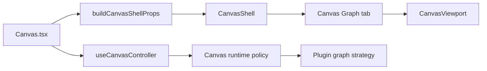

# F-12 Fowler Canvas Legacy Retirement Analysis

## Context

F-12 closes the old `GraphCanvas.tsx` ambiguity. The active Canvas route now
uses `Canvas.tsx`, `CanvasShell`, `useCanvasController`, and the plugin graph
strategy registry. The remaining drift was not a live component file; it was
semantic residue in naming and documentation that still made reviewers ask
whether a second graph renderer existed.

## Mature-System Comparison

Mature workbench systems such as VS Code, Temporal UI, Grafana, and Datadog keep
renderer ownership and route composition separate:

- a route or workspace shell owns placement and chrome;
- a controller or service facade owns state composition;
- a renderer consumes a normalized model;
- legacy renderer names are not kept as active API names after the replacement
  path becomes canonical.

The current DVT Canvas stack is closer to that model after F-12 because the
route has one active graph surface and the default Graph tab no longer exposes a
`GraphCanvas`-shaped factory name.

## Improved Patterns

- **Presentation Model**: `CanvasWorkbenchTabsReadModel` remains the route-local
  read model for tab state.
- **Service Facade / Application Controller**: `useCanvasController` remains the
  route facade. The retired graph renderer does not bypass it.
- **Passive View**: `CanvasShell` and tab strip rendering consume grouped
  contracts instead of owning draft semantics.
- **Plugin Strategy**: graph behavior belongs to the active canvas runtime
  registration and graph strategy registry.
- **Semantic API**: `createCanvasGraphWorkbenchTab` names the product intent as
  "Canvas Graph tab" instead of suggesting a resurrected `GraphCanvas`
  component.

## Antipatterns Detected

- **Documentation Drift**: planning docs still said `GraphCanvas.tsx` existed
  after the source file had already been removed.
- **Semantic Ghost**: `createGraphCanvasWorkbenchTab` was not wrong at runtime,
  but the name preserved the retired component vocabulary.
- **Ambiguous Ownership**: older diagrams described graph rendering as a direct
  UI component that talked to API, while the current system routes through
  Canvas shell, controller, protected draft projection, and plugin strategy.

## Component Grouping

The active component grouping should stay:

`GraphCanvas.tsx` has no role in the current grouping.

## Repetitions

- "GraphCanvas still exists" appeared in planning surfaces after the component
  had already been removed.
- The Graph tab concept was repeated as `GraphCanvas` in a factory name, while
  docs and UI labels already used "Graph".

## Code And Documentation Drift

Drift fixed in this slice:

- source API now uses `createCanvasGraphWorkbenchTab`;
- architecture tests require the source file to remain retired;
- a local component guide documents the F-12 retirement boundary;
- F-12 user stories document positive and negative scenarios.

Remaining historical references under `docs/archive/**` are intentionally not
active governance.

## Opportunities

- Keep future Canvas component names aligned with product concepts, not retired
  implementation names.
- Prefer architecture tests that check semantic ownership: route, shell,
  controller, strategy, and retired-file absence.
- Treat old analysis docs as historical unless a current status or architecture
  document points to them.

## Teachings For Future Work

- Removing a file is not enough if active APIs and docs retain the old name.
- A small rename can remove ambiguity when it encodes a retired architecture.
- Legacy retirement should include both negative proof and positive replacement
  proof.

## ADR Decision

No ADR is required. This work applies existing Canvas architecture, command and
query rail governance, and Fowler opportunity governance. It does not introduce
a new cross-system decision or change an accepted contract.
