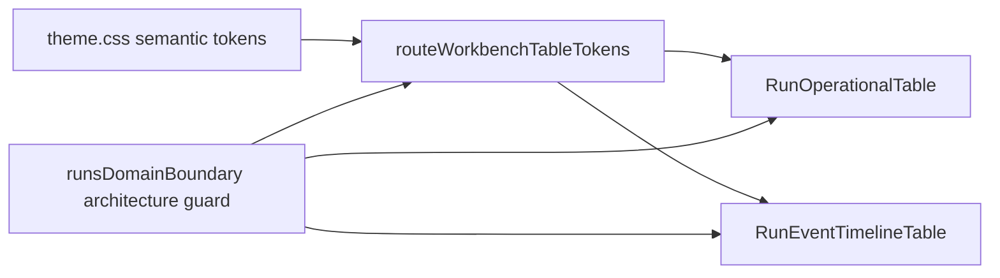

# F-24 Fowler Analysis - Runs Dense Table Token Convergence

## Scope

This analysis covers the work introduced by the dense Runs tables and evaluates
it inside the operator-workbench visual-system task F-24. The slice is internal
presentation architecture only: no backend rail, runtime authority, event
contract, or run lifecycle behavior changes.

## Mature-System Comparison

Mature operator systems such as GitHub Actions, Temporal Web, Datadog, and
Grafana use dense tables for execution scanning, but they do not let each table
invent its own color grammar. They separate row semantics, table rendering
primitives, status tone policy, global semantic tokens, and route-local copy.

F-16 improved row and event semantics, but its first implementation still left
visual authority inside route components. F-24 should move that authority into a
named component-token boundary.

## Improved Patterns

| Area             | Improvement                                        | Fowler view                          |
| ---------------- | -------------------------------------------------- | ------------------------------------ |
| Runs list        | Rows now use TanStack Table and URL-stable filters | Presentation Model                   |
| Event chronology | Events moved from card chronology to dense rows    | Replace ad hoc view with table model |
| Row identity     | `runId` and `eventId` are explicit row IDs         | Stable identity boundary             |
| Docs             | F-16 added local component and user-story docs     | Documentation as architecture        |

## Anti-Patterns Detected

| Anti-pattern         | Evidence                                                           | Risk                                          |
| -------------------- | ------------------------------------------------------------------ | --------------------------------------------- |
| Primitive obsession  | route components encode colors as Tailwind strings                 | status meaning depends on local CSS literals  |
| Duplicate semantics  | run status and event level tone policies live in separate places   | tables can diverge under future token changes |
| Documentation drift  | component docs discuss dense tables but not visual-token ownership | future F-24 work has no local guard           |
| Test-only confidence | architecture guard proves table presence, not token semantics      | hardcoded `slate-*` can return unnoticed      |

## Components To Group

- `RunOperationalTable` and `RunEventTimelineTable` consume visual tokens.
- `runStatesModel` owns run status tone semantics.
- `routeWorkbenchTableTokens` owns table field, muted text, empty cell, and
  event-level badge class names.
- `runsDomainBoundary.architecture.test.ts` owns the semantic guard.

## Repetition

Repeated route-level classes found in the dense tables:

- `border-slate-700 bg-slate-950 text-slate-100`;
- `text-slate-400`;
- `text-slate-500`;
- `bg-red-600`, `bg-yellow-600`, `bg-green-600`, `bg-blue-600`.

The repeated strings should become named component tokens that compose existing
CSS variables from `theme.css`.

## Opportunities

1. Introduce a small route-workbench dense table token module.
2. Use semantic CSS variables for statuses and text instead of slate/color
   families.
3. Add architecture tests that reject route-level visual hardcodes in Runs dense
   table view modules.
4. Document the token ownership so later Monaco and Canvas slices reuse the same
   posture instead of inventing local color systems.

## Drift

Code drift:

- table models are semantically mature;
- visual classes still bypass the F-24 token convergence path.

Documentation drift:

- dense table docs describe rows, filters, and consumers;
- they do not yet describe visual-token API, invariants, transitions, or
  consumers.

## Applied Pattern

Apply **Introduce Presentation Token Object** at the component boundary. The
token module is not a new design system; it is a narrow component-token adapter
over the existing semantic token layer.

## Lessons

- Dense operational UI needs component-token ownership immediately after table
  extraction, not as a future polish pass.
- Architecture tests should assert semantic token posture directly, not only
  the absence of retired card components.
- Route-level tables can stay pragmatic while still consuming governed visual
  primitives.

## ADR Decision

No new ADR is required. This implements existing F-24 visual-system governance
and the active design-token contract.
