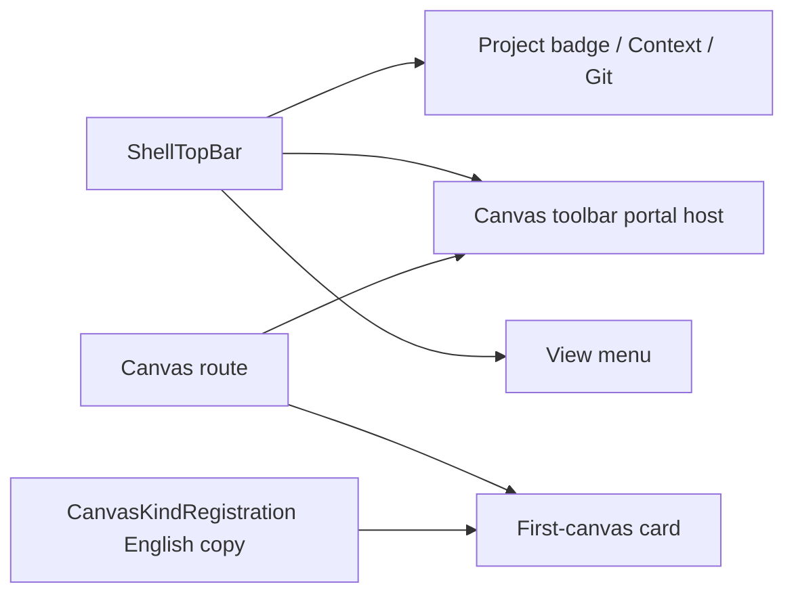
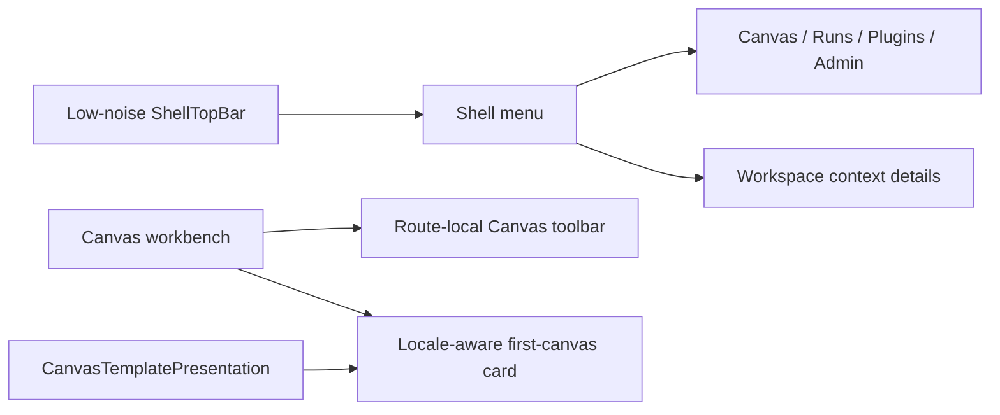
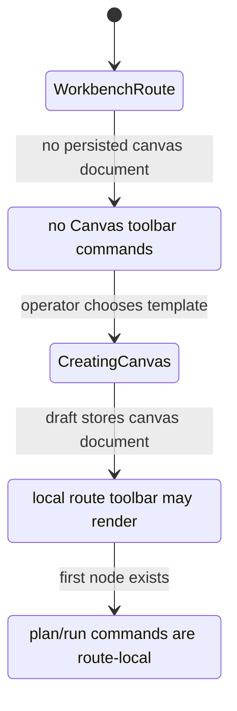

# F-15-F Fowler Analysis - Canvas Workbench Screen Consolidation

## Problem Summary

The current `/canvas` entry screen removed the permanent left rail, but the
screen is still not behaving like one coherent workbench. The top bar contains
global context, Git context, route status, project snapshot commands, planning
commands, health, and the `View` menu at the same time. The first-canvas card is
Spanish while plugin-provided canvas template titles and descriptions remain in
English. Admin and Plugins are technically available in the `View` menu after
F-15-D, but they are not discoverable enough once the rail disappears.

## Root Cause

The root cause is responsibility overload across shell chrome and Canvas route
chrome:

- `ShellTopBar` still hosts global context and a Canvas toolbar portal.
- `CanvasToolbar` still supports a top-bar placement and Canvas uses it.
- `ShellMenu` mixes global navigation, workspace details, view preferences, and
  Canvas visual commands without making the global destinations prominent.
- `CanvasKindRegistration` supplies English route-visible template copy while
  Canvas route copy is locale-aware.
- F-15-D owned rail disposition and F-15-E owned first-canvas template posture,
  but no slice owned the whole `/canvas` screen composition after those changes.

## Mature-System Comparison

Mature workbench systems keep one persistent global shell with low-noise
navigation, then keep route-owned commands inside the active workbench. VS Code,
JetBrains IDEs, and mature observability consoles do not put disabled
route-local commands into the global chrome before a document exists. They use:

- global menu/navigation for app destinations;
- local workbench toolbars for document or graph commands;
- contextual empty states for first action;
- a single locale-aware presentation layer for visible copy;
- architecture guards that prevent shell and route concerns from drifting back
  together.

## Improved Patterns Already Present

| Area                   | Improvement                                                                    | Remaining Gap                                                    |
| ---------------------- | ------------------------------------------------------------------------------ | ---------------------------------------------------------------- |
| Navigation rail        | F-15-D added `ResolveShellNavigationDisposition` and hides the rail on Canvas. | Global destinations are menu-only and still weakly discoverable. |
| First-canvas selection | F-15-E renamed project-type choices as canvas templates.                       | Template title and description still leak registry English copy. |
| View menu              | Canvas visual controls moved from toolbar into `CanvasViewMenuControls`.       | Route primary commands still portal into global top bar.         |
| Component docs         | Component guides exist for shell navigation and first-canvas host.             | No component guide owns full Canvas screen composition.          |

## Antipatterns

| Antipattern                    | Evidence                                                                                  | Fowler Reading                                   | Correction                                                                              |
| ------------------------------ | ----------------------------------------------------------------------------------------- | ------------------------------------------------ | --------------------------------------------------------------------------------------- |
| Responsibility overload        | `ShellTopBar` composes brand, context, Git, Canvas toolbar host, health, and menu.        | Large Class / divergent change.                  | Keep Canvas top bar minimal and move route commands local.                              |
| Boundary drift                 | `CanvasShellMainPanel` renders `CanvasToolbar placement="top-bar"`.                       | Feature envy between route and shell.            | Canvas owns its toolbar placement inside Canvas workbench.                              |
| Duplicate navigation semantics | Left rail removed, but Admin/Plugins rely on a mixed View menu.                           | Duplicate semantics / hidden navigation.         | Make menu navigation a first group with shell destinations visible.                     |
| Registry language leak         | `registration.createTitle` and `description` appear in English beside Spanish route copy. | Primitive obsession / leaking technical catalog. | Add Canvas template presentation resolver.                                              |
| Test-only confidence           | Existing tests prove menu links exist, not that shell/route concerns remain separated.    | Test-only confidence.                            | Add semantic architecture tests for no top-bar Canvas portal and menu-owned navigation. |
| Documentation drift            | F-28 says residual i18n/visual work needs its own task, while F-15 still remains open.    | Documentation drift.                             | Create F-15-F and bind code/docs/tests to it.                                           |

## Components To Group

| Component                           | Owned Concern                                                  | Files                                                                           |
| ----------------------------------- | -------------------------------------------------------------- | ------------------------------------------------------------------------------- |
| Canvas workbench screen composition | Whole `/canvas` shell plus route chrome contract.              | `TopAppBar.tsx`, `ShellMenu.tsx`, `CanvasShellMainPanel.tsx`, component guide.  |
| Canvas toolbar placement            | Route-local command surface, not global shell.                 | `CanvasToolbar.tsx`, `CanvasShellMainPanel.tsx`, toolbar tests.                 |
| Canvas template presentation        | Locale-aware first-canvas template labels from registry input. | `CanvasPlaygroundHost.tsx`, `CanvasPlaygroundHost.templates.tsx`, new resolver. |
| Shell menu navigation               | Global destinations when rail is hidden.                       | `ShellMenu.tsx`, `shellNavigationModel.ts`, shell tests.                        |
| Shell copy                          | Locale-aware shell chrome labels.                              | `components/shell/copy.ts`, shell context components.                           |

## Opportunities

| Scenario                                            | Opportunity            | Pattern                      | DDD Owner                          | Rail                                    |
| --------------------------------------------------- | ---------------------- | ---------------------------- | ---------------------------------- | --------------------------------------- |
| Canvas opens without a document                     | Disabled command noise | Presentation Model           | `CanvasWorkbenchScreenComposition` | none - presentation query only          |
| Canvas route commands appear in top bar             | Boundary drift         | Move Method / Compose Method | `CanvasToolbarPlacement`           | existing Canvas commands only           |
| Admin/Plugins disappear with rail                   | Hidden navigation      | Gateway / Shell read model   | `ShellNavigationReadModel`         | `ListShellNavigationItems`              |
| Spanish route text plus English template copy       | Registry language leak | Presentation Model           | `CanvasTemplatePresentation`       | `CreateCanvasDocumentCommand` unchanged |
| Docs say chrome is simplified but code keeps portal | Documentation drift    | Semantic fitness function    | `CanvasWorkbenchScreenComposition` | `VerifyCanvasWorkbenchVisualPosture`    |

## Current State Diagram

## Target Diagram

## Target State Machine

## Lessons For Future Work

- A closed child task can remove one symptom while the parent system still
  violates the target composition. Screen-level slices need their own owner.
- A rail-hidden navigation model needs discoverability proof, not only DOM
  existence proof.
- Plugin catalog strings are not always route presentation strings. If the
  route is locale-aware, registry-visible copy needs a presenter.
- Toolbar placement is architecture, not CSS. A portal is a shell boundary
  decision and needs a semantic guard.

## Proposed Task

Created Planning DB task `E/F-15-F` under `F-15`:

- objective: reconcile Canvas entry workbench screen as one governed shell
  composition;
- scope: top bar, shell menu, Canvas toolbar placement, template presentation
  copy, docs and semantic tests;
- out of scope: backend routes, protected draft semantics, project switching,
  new Admin/Plugins behavior.
