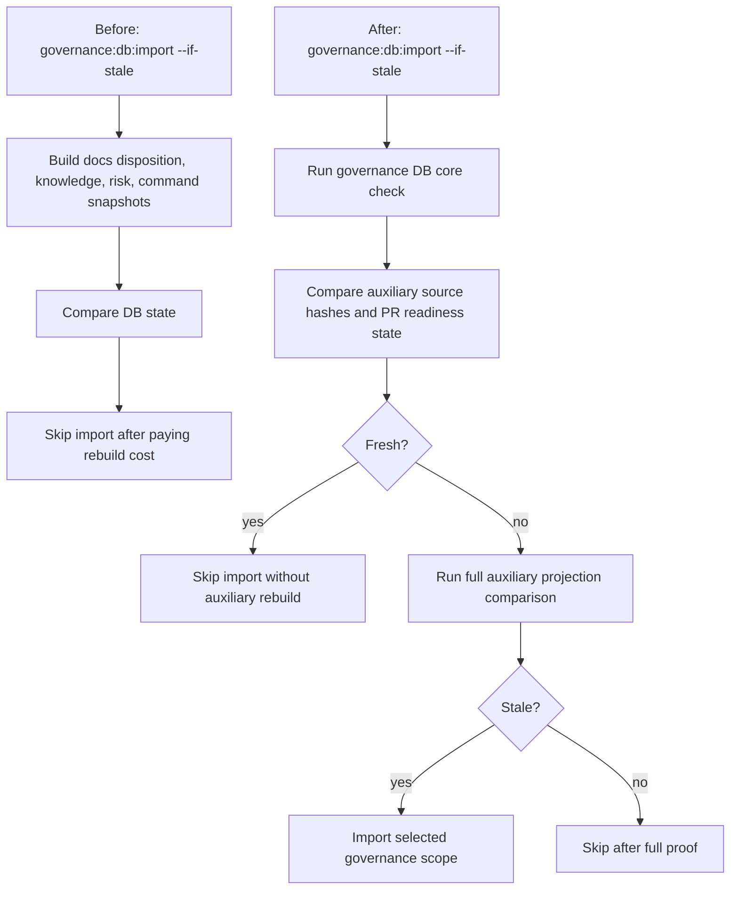

# Fowler Analysis - Documentation Governance Latency Reduction

## Context

The repository governance model is intentionally document-first. The current
pain is not the existence of traceability, coverage, or documentation checks;
the pain is that no-op and repeated closeout paths still pay the cost of
rebuilding large governance read models.

The same pattern appeared remotely in `PR Quality Gate`: the workflow computed
scope but still ran global governance maps, ADR-0000 traceability, feature
mechanization, QA artifact validation, and architecture dependency checks for
unrelated pull requests. That made CI carry a fixed governance tax instead of a
scope-routed one.

Measured on a clean `main` worktree:

- `pnpm governance:db:check` passed.
- `pnpm planning:db:check` passed.
- `pnpm governance:db:import -- --if-stale` skipped governance import but still
  took about 46 seconds before reporting `skipped fresh scopes: governance`.

After the stale-aware source-freshness split:

- The first run after code/docs changes still performs a full governance import,
  as intended.
- The second fresh run of `pnpm governance:db:import -- --if-stale` reported
  `skipped fresh scopes: governance` in about 9.8 seconds.
- PR Quality now exposes prepush-equivalent scope outputs and gates the
  expensive PR-only commands by `governance_global_relevant`,
  `traceability_adr0_relevant`, `feature_mechanization_relevant`, and
  `code_validation_relevant`.

## Fowler View

### Improved Patterns

- The repository already uses explicit command rails for governance refresh and
  DB import instead of ad hoc local scripts.
- `--if-stale` expresses a good command intent: import only stale selected
  scopes.
- Generated governance reports are represented as DB-backed projections, which
  is closer to a mature read-model pipeline than file-only drift management.

### Antipatterns Detected

- **Expensive no-op:** the stale-aware command still builds auxiliary
  projections before it can decide they are fresh.
- **Temporal coupling:** `governance:refresh` imports governance before and
  after report generation, then imports again during final DB validation.
- **Pipeline duplication:** repeated import stages are correct for safety, but
  the final duplicate was full-cost instead of stale-aware.
- **Responsibility leak:** source freshness and projection rebuild lived in the
  same path, so a cheap decision could not protect the expensive path.
- **Computed-but-unused scope:** PR Quality calculated workflow scope but did
  not let that scope own the expensive governance and traceability decisions.

### Mature-System Comparison

Mature CI/governance systems keep two layers:

1. a cheap invalidation layer based on source fingerprints and policy version;
2. a full materialization layer only when the invalidation layer proves staleness.

The previous shape had layer 2 before layer 1 for governance auxiliary
projections. The target shape restores the usual order.

## Current vs Target Flow

## Applied Pattern

Apply **separate invalidation from materialization**:

- Source-hash freshness covers planning lane YAML, repository command sources,
  PR readiness policy state, docs disposition documents, knowledge documents,
  and risk debt documents.
- Full auxiliary projection comparison remains available when hashes are stale.
- `governance:refresh` repeated import stages become `--if-stale`, so repeated
  safety checks stay in place without forcing full re-import.
- `PR Quality Gate` now applies **scope-owned validation routing**: the shared
  CI scope read model decides which expensive governance gates are relevant for
  PRs, while pushes and explicit manual full gates retain the full posture.

## User Stories

- As a contributor, I can rerun governance closeout after no material changes
  without paying the cost of rebuilding auxiliary documentation projections.
- As CI, I still get full DB import behavior when source hashes or PR readiness
  state differ.
- As a maintainer, I can distinguish a stale source from a stale projection
  when debugging governance drift.
- As a PR author, a web-only change does not run global governance maps or
  ADR-0000 traceability when those surfaces are unrelated.

## Remaining Opportunities

- Route `closeout:changed` through the same repository scope classifier used by
  `verify:prepush`.
- Measure and cap `buildGovernanceFileSnapshot()` cost separately from docs
  disposition and knowledge snapshot cost.
- Add timing output to governance commands so regressions are visible in PR
  logs without manual stopwatch runs.
- Split PR Quality into separate lightweight jobs if the single job remains
  wall-clock bound by dependency installation rather than command runtime.
