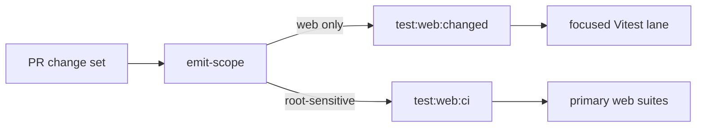

# F-14-B Fowler Analysis - Web Vitest PR Changed Suite Routing

## Context

The web suite was already partitioned into semantic Vitest lanes, but ordinary
web pull requests still executed `test:web:ci`, which expands to every primary
web suite. That made a small Canvas or route change pay for unrelated web test
files.

## Fowler View

The mature-system pattern is a change-set query backed by a fail-closed full
suite. The query accelerates the inner and review loop; the full route remains
available where the blast radius is unknown.

## Improved Patterns

- Reused `WebVitestChangedSuiteRouter` instead of adding another workflow
  taxonomy.
- Kept root-sensitive changes fail-closed with `test:web:ci`.
- Preserved full primary-suite coverage on `main` and manual workflow runs.
- Added a semantic architecture guard so workflow routing cannot drift from the
  suite catalog.

## Anti-Patterns Removed

- **Feedback-loop drag**: ordinary web PRs no longer run every web primary
  suite when the changed-file route is sufficient.
- **Duplicate command semantics**: the workflow delegates to `test:web:changed`
  instead of carrying inline globs.
- **Documentation drift**: component guides now describe the actual PR route.

## Future Rule

When a test lane is split, the workflow must consume the catalog-owned command
or query. Do not copy suite include/exclude globs into GitHub Actions.
