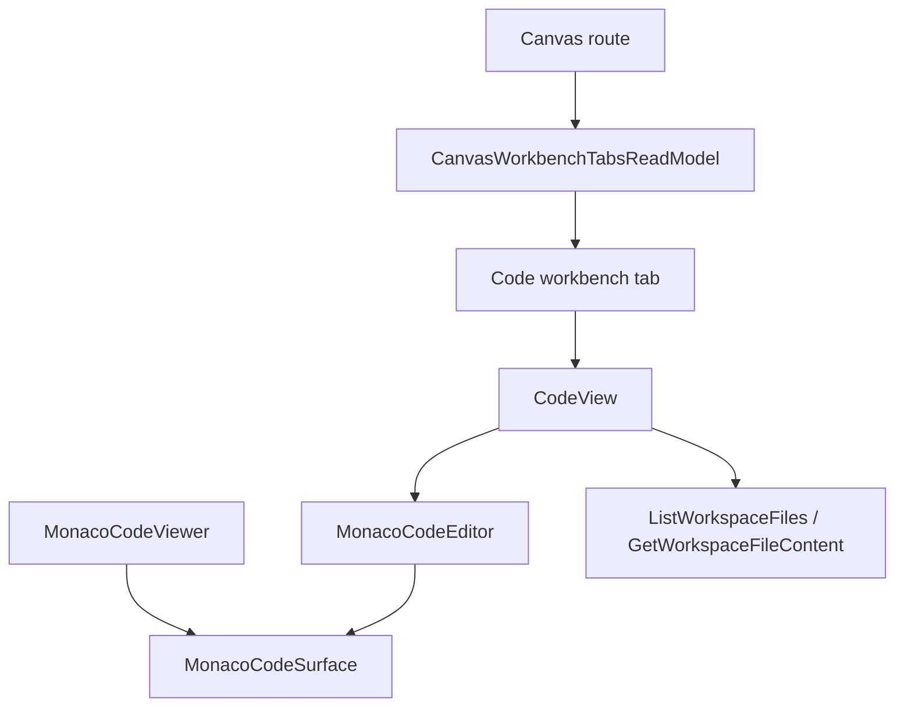

# F-17-G Fowler Analysis - Code Monaco Editable Workspace Access

## Problem Summary

The current `Code` workbench already uses Monaco, but the user-visible posture is
read-only and the tab is hidden when the Canvas route has no persisted canvas
document. This creates two immediate failures:

1. users on the Canvas entry screen see `Grafo` but cannot reach the Monaco
   surface beside it;
2. users who reach Monaco cannot type because `MonacoCodeSurface` is hard-coded
   with `readOnly` and `domReadOnly`.

The requested behavior is narrower than full file persistence: a user must be
able to access Monaco from the Canvas workbench and type in the editor. Saving
edited file content remains out of scope until a governed command rail exists.

## Mature-System Comparison

Mature workbench systems separate editor buffer authority from persistence
authority. VS Code, JetBrains IDEs, and browser-based workbenches allow a local
editor buffer to be dirty before a save command is admitted. They do not treat a
read query as proof that a write command exists.

DVT should follow that split:

- `ListWorkspaceFiles` and `GetWorkspaceFileContent` remain query rails;
- Code owns a local editable buffer presentation model;
- no `SaveWorkspaceFileContent` command is invented in this slice;
- the Canvas tab strip may expose workspace-scoped Code before a canvas document
  exists because workspace files do not depend on graph draft existence.

## Improved Patterns

| Current pattern                                  | Improved pattern                                                              |
| ------------------------------------------------ | ----------------------------------------------------------------------------- |
| Monaco surface hard-coded as read-only           | Mode-aware Monaco gateway with explicit viewer/editor consumers               |
| Code tab hidden behind missing Canvas document   | Workspace-scoped Code tab remains selectable when workspace context exists    |
| Broad changed-file route runs presentation suite | Monaco focus suite covers editor consumers without running unrelated UI tests |
| Docs say all Code Monaco is read-only            | Docs distinguish local editable buffer from non-existent persistence command  |

## Antipatterns Detected

| Antipattern             | Evidence                                                                     | Correction                                                       |
| ----------------------- | ---------------------------------------------------------------------------- | ---------------------------------------------------------------- |
| Primitive obsession     | `scope: 'selection'` cannot express Code's workspace-only dependency         | Extend tab scope to `workspace` for Code                         |
| Hidden authority        | Monaco read-only flags live in the shared surface instead of consumer intent | Add explicit `MonacoCodeViewer` and `MonacoCodeEditor` consumers |
| Documentation drift     | Monaco rationale and Code docs claim read-only first                         | Update rationale, component guide, and stories                   |
| Test-only confidence    | Cypress proves Code preview but not typing                                   | Add browser proof that a user types in Monaco                    |
| Over-broad verification | `test:changed` routes Monaco changes to all presentation tests               | Add Monaco focus suite and changed-file routing                  |

## Component Grouping

## Code And Documentation Drift

- `docs/planning/proposals/monaco-workbench-integration-rationale-20260402.md`
  says Monaco v1 is read-only and diff only.
- `docs/architecture/components/web/code-workbench-workspace-files-component.md`
  says the Code workbench stays read-only after the file route works.
- `docs/architecture/components/web/code-workbench-workspace-files-user-stories.md`
  expects a read-only Monaco preview and read-only banner.
- `canvasWorkbenchTabs.ts` treats missing Canvas document as a blocker for every
  plugin tab, including Code.

## Opportunities

| Scenario                         | Opportunity             | Fowler pattern               | DDD owner                            | Command/query rail             |
| -------------------------------- | ----------------------- | ---------------------------- | ------------------------------------ | ------------------------------ |
| Code visible before first canvas | Boundary drift          | Context Object               | `CanvasWorkbenchTabsReadModel`       | `ListCanvasWorkbenchTabs`      |
| Select Code from Canvas header   | Hidden authority        | Command Object               | `CanvasWorkbenchTabSelectionCommand` | `SelectCanvasWorkbenchTab`     |
| Type into Monaco                 | Responsibility overload | Gateway + Presentation Model | `CodeEditableBuffer`                 | none - local presentation only |
| Avoid broad tests                | Test-only confidence    | Test Suite Partition         | `WebVitestChangedSuiteRouter`        | `RouteChangedWebVitestSuites`  |

## Decision

F-17-G changes Monaco from "read-only everywhere" to "consumer-owned mode":

- `MonacoCodeViewer` remains read-only for Artifacts and other inspection
  surfaces.
- `MonacoCodeEditor` provides an editable local buffer for Code.
- Code's local buffer does not persist, save, apply, or patch workspace files.
- The Code tab is `workspace` scoped and can appear beside `Grafo` before the
  first canvas document exists.
- Cypress must prove the browser flow: `/canvas` entry -> `Codigo` tab -> Monaco
  editor -> typed text appears in the editor.

## Semantic Fitness Function

- `CodeView` must consume `MonacoCodeEditor`, not `MonacoCodeViewer`.
- `MonacoCodeViewer` must keep read-only ownership for Artifacts and other
  inspection surfaces.
- `dbt.code` must be a `workspace` scoped Canvas workbench tab.
- Cypress must prove that Code is visible beside Graph before first-canvas
  creation and that typed Monaco text appears in the editor.
- No save/apply command or API write route may appear in this slice.

## Residual Risk

The missing product capability is file persistence. It must not be hidden under
this slice. A future slice may introduce `SaveWorkspaceFileContent`, but it must
define command ownership, authorization, concurrency, path policy, negative
tests, and API/storage behavior before any save button appears.
