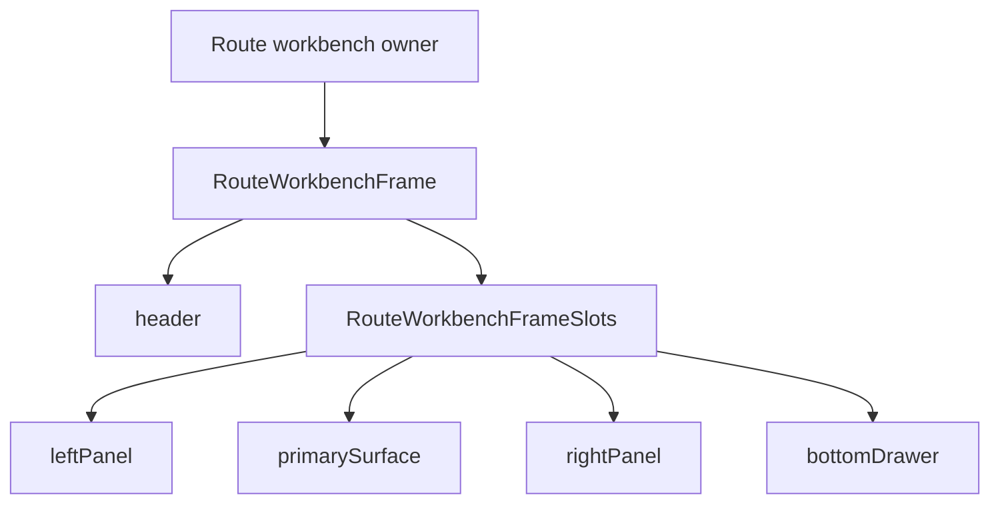
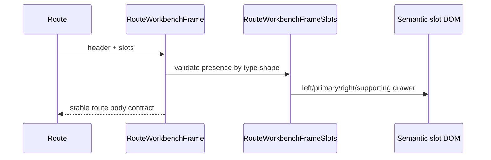

# Route Workbench Frame Fowler Analysis And Remediation

## Scope

This review covers the F-15 workbench UX contract as it applies to the shared
`RouteWorkbenchFrame` primitive in `apps/web`. The architectural analysis uses
the active F-15 planning state, web component docs, and the route workbench code
changed in this slice.

## Mature-System Comparison

Mature route workbenches such as VS Code, JetBrains IDE shells, Snowflake Snowsight,
and data control planes keep the global shell stable and make route panels
explicit slots. They do not let every screen invent its own left panel, primary
surface, right inspector, and supporting drawer structure.

The DVT shell already has the mature global posture: one persistent shell, a
route outlet, optional bottom console drawer, and Canvas-specific navigation
recovery. The remaining gap is local route encapsulation: `RouteWorkbenchFrame`
exposed styling tokens and a body wrapper, but not the semantic slot grammar
that F-15 describes.

## Improved Patterns

| Improvement                                       | Fowler pattern                 | Result                                                                           |
| ------------------------------------------------- | ------------------------------ | -------------------------------------------------------------------------------- |
| Shared route frame owns named slots               | Presentation Model             | Routes can express layout intent without duplicating DOM semantics.              |
| Slots are grouped under one parameter object      | Introduce Parameter Object     | `leftPanel`, `primarySurface`, `rightPanel`, and `bottomDrawer` travel together. |
| Frame rejects anonymous route body content        | Replace Implicit With Explicit | Direct route consumers must name their body as slots.                            |
| Architecture test validates docs and semantic API | Semantic Fitness Function      | Regression guard checks behavior and documentation, not only barrel thinness.    |

## Antipatterns Detected

| Antipattern          | Signal                                                                   | Remediation                                                |
| -------------------- | ------------------------------------------------------------------------ | ---------------------------------------------------------- |
| Primitive obsession  | Panel intent was encoded as arbitrary `children` plus CSS classes.       | Add `RouteWorkbenchFrameSlots`.                            |
| Duplicate semantics  | Route files could repeat left/right panel DOM names locally.             | Centralize slot data attributes and layout names.          |
| Documentation drift  | F-15 docs promised stable slots, while code only exposed a frame body.   | Add component guide, user stories, and architecture guard. |
| Test-only confidence | Existing tests proved scroll behavior but not route-workbench semantics. | Add semantic behavior and architecture tests.              |

## Component Grouping

The grouping is intentionally small. `RouteWorkbenchFrame` owns the slot grammar;
Canvas, Runs, Lineage, Code, Diff, and Artifacts still own their domain-specific
content and command rails.

## Teachings For Future Work

- A shared frame should expose product semantics before routes duplicate DOM
  structure.
- A short-lived compatibility path is useful only until the route migration is
  ready; the final F-15 frame should reject anonymous body composition.
- Architecture tests should validate the local component guide, stories, owned
  concern, and semantic API together.
- A route-level shell component is still presentation-only; it must not own
  domain commands, API calls, or route data loading.

## Repetitions

Repeated route concerns currently appear as local panel wrappers, header bands,
and body scroll choices. This slice fixes the common slot vocabulary and moves
direct `RouteWorkbenchFrame` consumers to that vocabulary.

## Opportunities

| Opportunity                                                 | Next action                                                                                      |
| ----------------------------------------------------------- | ------------------------------------------------------------------------------------------------ |
| Context panels still need a reusable component.             | Add `ContextPanel` after one route adopts slots.                                                 |
| Route toolbars are still route-local.                       | Extract `RouteToolbar` once two routes share command placement.                                  |
| Responsive panel behavior is documented but not enforced.   | Add a follow-up semantic test when panel migration starts.                                       |
| Bottom console and route bottom drawer need clearer naming. | Keep shell console in `AppShellFrame`; route support drawer stays in `RouteWorkbenchFrameSlots`. |

## Code And Documentation Drift

Before this slice, `UX Implementation Guide` and `Workbench UI Contract And
Component Inventory` described stable workbench slots, while `RouteWorkbenchFrame`
only offered header/body scaffolding. The drift made it easy for routes to keep
inventing local layout structure.

This remediation aligns code and docs by adding:

- `RouteWorkbenchFrameSlots` as the local semantic API;
- behavior tests for named slot rendering;
- a component guide with public API, invariants, transitions, and consumers;
- user stories covering no-legacy slot adoption;
- an architecture test that validates semantics and documentation together.
- `CodeView` as the first route consumer proving the slot API is not only a
  documented abstraction.
- direct route workbench consumers migrated to `slots.primarySurface`.

## Applied Patterns

Applied patterns:

- Presentation Model for route-level layout semantics.
- Introduce Parameter Object for grouped slot inputs.
- Replace Implicit With Explicit for removing anonymous route body content.
- Semantic Fitness Function for architecture regression coverage.

## ADR Decision

No ADR is required for this slice. The governing architectural decision already
exists in the active web UX docs: one persistent shell, one active route-level
workbench, and contextual route panels. This change implements that accepted
posture inside the local component API without changing system-wide architecture,
runtime contracts, persistence, API behavior, or command/query rails.
