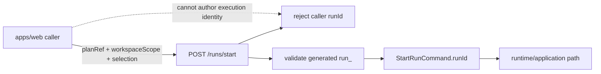
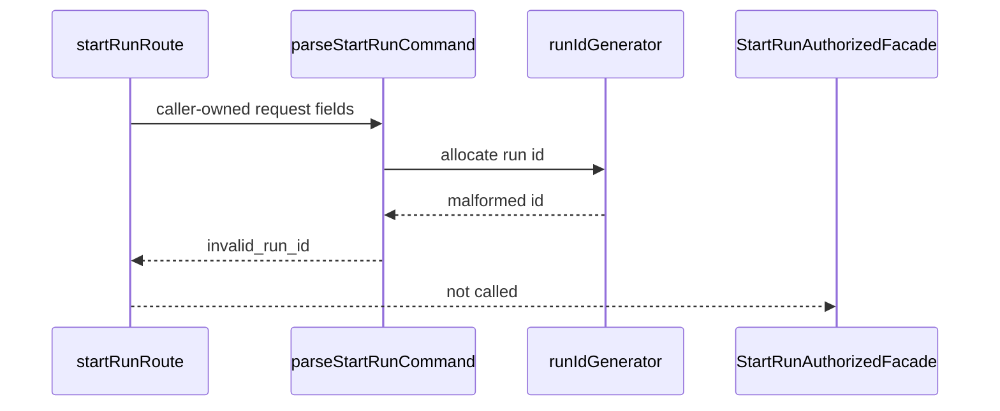
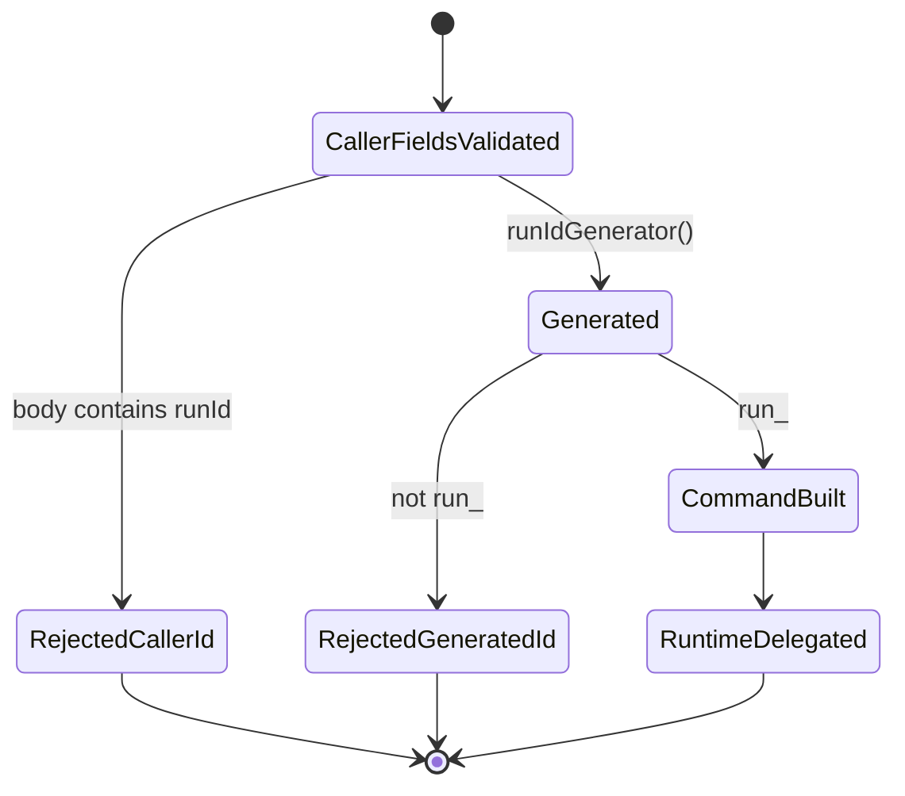

---
review_by: Codex
review_date: 2026-05-23
branch: current
slice: AR-C11-RUN-ID-CANON
status: remediated
---

# Fowler architecture analysis - AR-C11 start-run identity follow-up

## Scope

This follow-up reviews the platform-owned start-run identity work in the
current branch and compares it with the mature-system posture expected for DVT
runtime admission.

The branch already had the major remediation in place:

- `ADR-0050` makes start-run `runId` platform-owned.
- `apps/api` owns `run_<UUIDv7>` allocation at the protected HTTP boundary.
- `apps/web` sends caller-owned `StartRunInput` only.
- local component guides document API and web identity boundaries.
- semantic architecture tests guard both sides.

This pass looked for remaining drift, repetition, weak encapsulation, and
test-only confidence.

## Mature-System Comparison

Mature workflow control planes separate caller intent from resource identity:

- callers submit intent, scope, and selection;
- the protected API allocates canonical resource identity;
- application/runtime components own admission, lifecycle, event ordering, and
  recovery;
- persistence remains the final uniqueness guard;
- clients treat returned ids as opaque handles.

DVT now matches that shape for `POST /runs/start`. The web side is a caller of
the runtime boundary, not an execution host. The API side is an identity
allocator and transport adapter, not a second engine.

## Fowler Findings

| Finding                                                                    | Fowler signal                              | Status             | Applied pattern                           |
| -------------------------------------------------------------------------- | ------------------------------------------ | ------------------ | ----------------------------------------- |
| Browser-authored runtime id                                                | Hidden authority                           | Fixed earlier      | Gateway + Published Language              |
| External request mirrored internal command                                 | Boundary drift                             | Fixed earlier      | Separated Interface                       |
| Selection traversal hidden in run orchestration                            | Responsibility overload                    | Fixed earlier      | Extract Function / semantic seam          |
| `run_<UUIDv7>` promised in docs but injected generator accepted any string | Documentation drift + test-only confidence | Fixed in this pass | Guard Clause + semantic architecture test |
| Retry-safe start semantics absent                                          | Explicit residual opportunity              | Deferred           | Future idempotency command contract       |

## Improvement Applied In This Pass

The default generator already emitted `run_<UUIDv7>`, but
`parseGeneratedStartRunRunId(...)` accepted any non-empty string when a
deterministic generator was injected. That meant the documented invariant lived
mostly in the default allocator and architecture test, not in the command
builder that crosses into `StartRunCommand`.

The fix moves the invariant to the boundary:

- the route returns `400 invalid_run_id` when the injected platform generator
  violates `run_<UUIDv7>`;
- the facade is not called for malformed generated identity;
- the architecture test now verifies that the command builder owns format
  validation, not only the allocator.

## Updated Component Grouping

### API start-run platform identity

- `apps/api/src/entrypoints/http/startRunIdentity.ts`
- `apps/api/src/entrypoints/http/startRunRouteCommandBuilder.ts`
- `apps/api/docs/start-run-platform-identity-component.md`
- `apps/api/test/entrypoints/http/startRunIdentity.architecture.test.ts`
- `apps/api/test/entrypoints/http/startRunRoute.validation.test.ts`

Owned concern: allocate and admit only platform-owned `run_<UUIDv7>` execution
identity before the command enters application/runtime semantics.

### Web start-run client identity

- `apps/web/src/app/ports/runs.ts`
- `apps/web/src/app/services/runs/runsService.api.ts`
- `apps/web/src/app/views/canvas/canvasRunStartAction.ts`
- `apps/web/src/app/views/canvas/canvasRunSelection.ts`
- `docs/architecture/components/web/runs/start-run-client-identity-boundary.md`

Owned concern: express caller-owned start intent without authoring or parsing
canonical execution identity.

## Diagrams

### Correct Authority Boundary

### Failure-Closed Generator Validation

### State Model

## Repetitions Reduced

- The id-shape invariant no longer exists only as prose and generator behavior.
  It is enforced at the command-building boundary.
- The architecture test now checks the semantic guard instead of relying on the
  default generator test to imply all injected paths are safe.

## Remaining Opportunities

1. Add a governed start-run idempotency key if callers need retry-safe command
   semantics.
2. Promote `POST /runs/start` request/response JSON schema if the API becomes
   externally public beyond the current protected product boundary.
3. Reuse this platform-owned identity pattern for other protected resources
   where callers currently supply canonical ids.

## Lessons For Future Work

- A generated-id invariant belongs at the boundary that consumes the injected
  generator, not only inside the default generator.
- Architecture tests should prove the semantic failure mode: malformed
  platform identity must fail before application orchestration.
- Documentation that states "MUST use shape X" should have a runtime guard at
  the nearest trust boundary.
