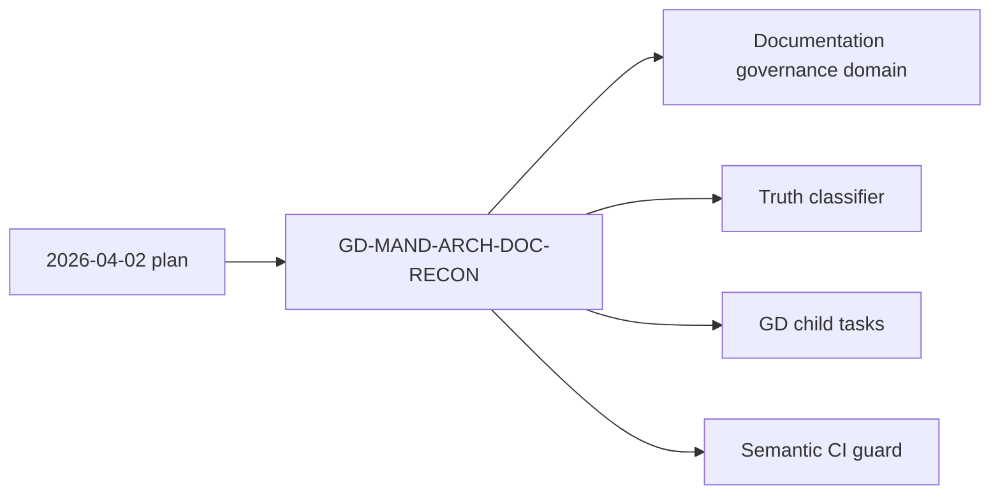

# Architecture Documentation Reconciliation Canon Analysis

## Fowler Analysis

The 2026-04-02 architecture documentation reconciliation plan correctly
identified the core modeling issue: the repository had multiple architecture
surfaces with different truth levels. From a Fowler and DDD view, the missing
piece is an explicit classification model and command/query rail that routes
each surface to one owner.

## Mature-System Comparison

Mature engineering repositories separate normative decisions, current
implementation status, domain guides, generated indexes, and historical
snapshots. They also avoid treating proposal documents as queues. This canon
aligns DVT with that model by assigning reconciliation work to Planning DB and
making truth-level classification explicit.

## Antipatterns

- Parallel truth sources: readers can over-trust draft or snapshot documents.
- Orphan mandatory proposal: a proposal can remain active after child work is
  created.
- Hidden child backlog: downstream work can exist without a parent component
  that explains ownership.
- Drift by accumulation: indexes, domain pages, and review boards can diverge
  when doc movement is not classified first.

## Drift

The documentation-governance domain linked the original plan but did not state
that `GD-MAND-ARCH-DOC-RECON` now owns its canonization. The workboard had child
tasks, but the architecture component index did not expose a local guide with
public API, invariants, transitions, consumers, and semantic proof.

## Applied Pattern

- Planning Aggregate:
  `RecordArchitectureDocumentationReconciliationCanon` records disposition.
- Query Model: `ClassifyArchitectureDocumentationDisposition` classifies truth
  level and owner.
- Semantic Fitness Function:
  `architecture-doc-reconciliation-canon.test.mjs` validates the canon surfaces.
- Explicit Boundaries: child remediation tasks remain separate from the parent
  canon task.

## Component Grouping

## Future Lessons

- Every architecture doc movement should start by classifying the truth level.
- Parent governance proposals should close into Planning DB child tasks.
- Component guides need public API and invariants even when the component is a
  documentation-governance component.
- Semantic architecture tests should validate ownership and task posture, not
  only index presence.

## Validation

- Red: `node --test tools/ci/architecture-doc-reconciliation-canon.test.mjs`
  failed on the missing canon plan.
- Green: the same test passes after adding plan, component guide, stories,
  domain disposition, component index link, and this analysis.
