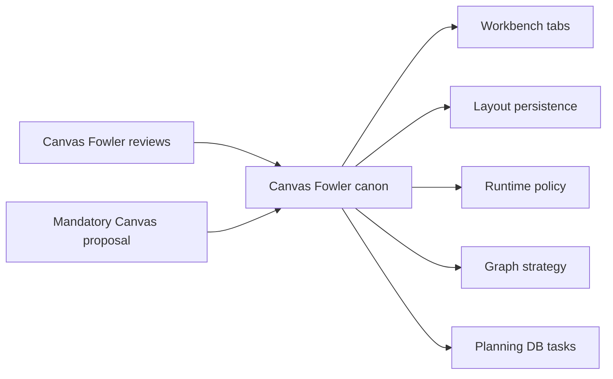

# Canvas Workbench Fowler Canon Analysis

## Fowler Analysis

The Canvas workbench has moved toward Fowler-compatible component ownership:
tabs are presentation read models, layout persistence is projection state, and
runtime policy is a route-level boundary. The remaining issue is governance
shape, not a missing runtime abstraction: the mandatory Fowler remediation
proposal needs a canonical disposition so it cannot become a hidden backlog.

## Mature-System Comparison

Mature IDE and data-workbench systems keep global navigation, editor-local
tabs, layout preferences, execution evidence, and project file I/O as separate
models. Canvas now follows that direction through existing command/query rails.
The canon component adds the mature-system missing piece: historical review
inputs are classified into owners instead of being reread as new queues.

## Antipatterns

- Orphan proposal backlog: a mandatory plan can imply open work without a task.
- Review-as-queue drift: older Fowler reviews can appear active after closure.
- Duplicate semantics: tab placement, layout proof, and visual proof can be
  renamed in tests or docs without updating the catalog.
- Acceptance ambiguity: Cypress proof and architecture tests can be treated as
  optional unless the canon guide names them.

## Drift

Code and docs have improved around Canvas runtime policy, graph strategy, tab
placement, and layout persistence, but the portfolio map and review board did
not yet say that the Canvas Fowler remediation proposal is canonized by
`F-MAND-CANVAS-FOWLER`.

Documentation drift is fixed by linking the plan, component guide, stories,
review board, command/query catalog, and graph architecture index.

## Applied Pattern

- Semantic Fitness Function: `canvas-fowler-canon.test.mjs` validates ownership
  and artifact alignment.
- Planning Aggregate: `RecordCanvasFowlerCanon` records disposition rather than
  leaving reviews as execution queues.
- Query Model: `ClassifyCanvasFowlerDisposition` resolves owner, proof, and
  task posture.
- Presentation Model: existing Canvas tab and layout components continue to own
  runtime UI behavior.

## Component Grouping

## Future Lessons

- Mandatory proposals need task ownership before implementation claims.
- Component guides should say what they do not own.
- Browser proof should be named as a query read model before Cypress asserts
  geometry.
- Fowler reviews should close into component guides, Planning DB tasks, or
  reference evidence.

## Validation

- Red: `node --test tools/ci/canvas-fowler-canon.test.mjs` failed on the missing
  canon plan.
- Green: the same test passes after adding plan, guide, stories, catalog links,
  review-board disposition, and this analysis.
