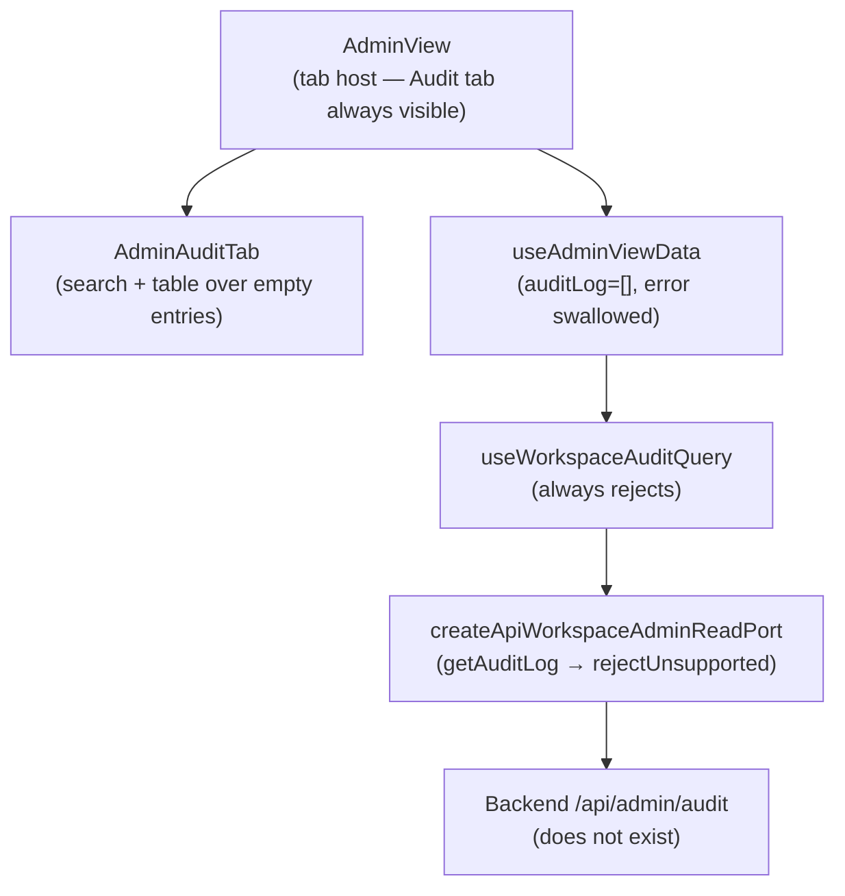

# Fowler Analysis — Admin Audit Log Permanent Stub

## Scope

This analysis reviews the gap that prevents the Admin Audit tab from ever
showing real audit events.

The review covers:

- `createApiWorkspaceAdminReadPort().getAuditLog()` in `workspacePorts.api.ts`
  (L126-128) calling `rejectUnsupportedApiWorkspaceCapability` unconditionally;
- `useWorkspaceAuditQuery()` returning `[]` silently on every call because the
  query always rejects;
- `AdminAuditTab.tsx` rendering a live search input and table over an always-
  empty `entries` array with no error or empty state distinguishing "no events"
  from "load failed".

It does not cover:

- Admin RBAC dead buttons (separate analysis);
- backend audit event persistence and indexing;
- audit event streaming or real-time push;
- export or download of audit logs.

## Governing Sources

- `AGENTS.md`
- `docs/planning/status/governance-document-rule-inventory.md`
- `docs/guides/ai-work-protocol.md`
- `docs/architecture/command-query-rail-governance.md`
- `docs/architecture/fowler-opportunity-planning-governance.md`
- `docs/architecture/components/web/frontend-fowler-implementation-pattern.md`
- `apps/web/src/app/views/admin/AdminAuditTab.tsx`
- `apps/web/src/app/services/workspace/workspacePorts.api.ts`
- `apps/web/src/app/views/admin/useAdminViewData.ts`

## Mature-System Comparison

Mature audit UIs enforce three invariants:

1. **Port completeness before surface visibility** — if the backend audit route
   does not yet exist, the Audit tab is hidden behind a capability flag rather
   than rendering a ghost table with a functional search box.
2. **Error / empty state distinction** — a loaded-but-empty audit log and a
   failed audit load are two distinct states; the UI communicates both clearly.
3. **Search is not a substitute for data** — a search input over an empty
   dataset is misleading UX; the search field is rendered only when there are
   entries to search, or is disabled with a clear reason.

The current implementation violates all three: the Audit tab is always visible,
always empty, the search field is always active, and no error or empty state
explains the situation.

## Improved Patterns

| Area          | Improvement                                                                                                         | Mature-system pattern     |
| ------------- | ------------------------------------------------------------------------------------------------------------------- | ------------------------- |
| Port stub     | Implement real `GET /api/admin/audit` HTTP adapter; gate tab behind capability flag if route not deployed.          | Adapter / Capability gate |
| Error state   | Expose `auditError` from `useAdminViewData`; render `AdminAuditErrorState` when query rejects.                      | Explicit error boundary   |
| Empty state   | When audit log loads as `[]`, render "No audit events recorded yet" rather than an empty search-over-nothing table. | Explicit empty state      |
| Search gating | Disable or hide search input when entries array is empty and there is no active search query.                       | Progressive disclosure    |

## Antipatterns Detected

| Antipattern         | Evidence                                                                                                           | Fowler signal          | Impact                                                                               |
| ------------------- | ------------------------------------------------------------------------------------------------------------------ | ---------------------- | ------------------------------------------------------------------------------------ |
| Permanent stub      | `createApiWorkspaceAdminReadPort().getAuditLog()` calls `rejectUnsupportedApiWorkspaceCapability` unconditionally. | Dead code path         | Audit log query always rejects; `filteredAuditLog` is always `[]`.                   |
| Silent failure      | `useAdminViewData` returns `auditLog = auditQuery.data ?? []`; `auditQuery.error` is never surfaced.               | Hidden failure         | User cannot distinguish "no events" from "load failed".                              |
| Misleading UI       | `AdminAuditTab` renders a functional search input over an always-empty entries array.                              | Ghost interaction      | User types a search query and sees no results; no feedback that data is unavailable. |
| Responsibility void | `useAdminViewData` swallows the error and returns only `filteredAuditLog`; the view has no error signal to act on. | Missing responsibility | Error handling belongs in the view data hook, not silently in the fallback.          |

## Component Grouping

| Component                         | Owned concern                                                  | Current state                                            | Target state                                                                  |
| --------------------------------- | -------------------------------------------------------------- | -------------------------------------------------------- | ----------------------------------------------------------------------------- |
| `AdminAuditTab`                   | Render audit event table with search.                          | Renders over empty entries with no empty or error state. | Accepts `isLoading`, `error`, `entries`; renders appropriate state for each.  |
| `createApiWorkspaceAdminReadPort` | Adapt `/api/admin/audit` backend to `IWorkspaceAdminReadPort`. | Always rejects.                                          | Implements real `GET /api/admin/audit` HTTP call; parses `AuditLogEntry[]`.   |
| `useAdminViewData`                | Load and expose audit log data.                                | Silently swallows `auditQuery.error`.                    | Returns `auditError: auditQuery.error` for the view to render an error state. |
| Backend `/api/admin/audit`        | Persist and serve audit events.                                | Does not exist.                                          | New backend route returning paginated `AuditLogEntry[]` for the workspace.    |

## Repetitions

- The `rejectUnsupportedApiWorkspaceCapability` pattern for `getAuditLog` is
  identical to the `getRoles` stub in the same factory function. The entire
  admin read port is a stub factory; fixing one should fix both.
- The `data ?? []` silent-fallback pattern in `useAdminViewData` duplicates
  the same pattern in the roles query: both swallow errors and return empty
  arrays. A shared `useAdminViewData` error surface refactor covers both.

## Opportunities

1. **Implement `getAuditLog()` in `createApiWorkspaceAdminReadPort`**
   — replace the `rejectUnsupportedApiWorkspaceCapability` call with a real
   `GET /api/admin/audit` HTTP adapter; gate the tab behind a capability
   flag if the backend is not yet deployed.

2. **Surface `auditError` in `useAdminViewData`**
   — return `auditError: auditQuery.error` from the hook; `AdminView`
   renders an `AdminAuditErrorState` component when the query rejects.

3. **Add an explicit empty state to `AdminAuditTab`**
   — when `entries` is empty and there is no active search, render "No audit
   events recorded yet" instead of an empty table with a visible search bar.

4. **Gate search input on entry availability**
   — disable the search input when entries are empty and no search is active
   so users are not prompted to search over nothing.

## Drift To Fix

| Drift                                                                                             | Fix                                                                                           |
| ------------------------------------------------------------------------------------------------- | --------------------------------------------------------------------------------------------- |
| `workspacePorts.api.ts` L126-128 — `getAuditLog` calls `rejectUnsupportedApiWorkspaceCapability`. | Implement `GET /api/admin/audit` HTTP adapter or gate tab behind capability flag.             |
| `useAdminViewData.ts` — `auditQuery.error` never returned to the view.                            | Add `auditError: auditQuery.error` to the return object; wire to `AdminView` error rendering. |
| `AdminAuditTab.tsx` — no empty state component.                                                   | Add explicit empty state when `entries.length === 0` and search query is empty.               |
| `AdminAuditTab.tsx` — search input renders over always-empty entries.                             | Conditionally disable search input when entries are unavailable.                              |

## ADR Assessment

No ADR is required for implementing the HTTP adapter or adding error/empty
states. An ADR is required if the audit log introduces a new retention model,
event schema, or streaming contract that changes how audit data is stored or
transmitted across the system boundary.

## Fowler Opportunity Matrix

| scenario                                                                                        | opportunity                                                                                  | Fowler pattern                              | DDD owner                                                | command/query rail                                                       | implementation surfaces                                                                | unit or package test                                                             | architecture test                                                                                       | user-flow test                                                   | out of scope                   |
| ----------------------------------------------------------------------------------------------- | -------------------------------------------------------------------------------------------- | ------------------------------------------- | -------------------------------------------------------- | ------------------------------------------------------------------------ | -------------------------------------------------------------------------------------- | -------------------------------------------------------------------------------- | ------------------------------------------------------------------------------------------------------- | ---------------------------------------------------------------- | ------------------------------ |
| User navigates to Admin → Audit tab; table is always empty; no explanation shown.               | Permanent stub — `getAuditLog()` always rejects; `filteredAuditLog` is always `[]`.          | Stub as permanent state / Missing adapter.  | `createApiWorkspaceAdminReadPort` (port adapter).        | Query rail: `ListAdminAuditLog` — read model against `/api/admin/audit`. | `workspacePorts.api.ts` (implement HTTP call), backend `/api/admin/audit` route.       | Unit: mock API returns entries; `useWorkspaceAuditQuery` resolves correct data.  | Architecture: no production port factory calls `rejectUnsupportedApiWorkspaceCapability` for audit log. | Playwright: Admin Audit tab shows real entries from API.         | Audit event streaming; export. |
| API rejects; user sees empty table identical to "no events" state — cannot tell if load failed. | Silent failure — `useAdminViewData` swallows `auditQuery.error`; no error state is rendered. | Hidden failure / Missing error state.       | `useAdminViewData` (data hook) + `AdminAuditTab` (view). | Same `ListAdminAuditLog` query rail.                                     | `useAdminViewData.ts` (expose `auditError`), `AdminAuditTab.tsx` (render error state). | Unit: when query rejects, hook returns non-null `auditError`.                    | Architecture: `useAdminViewData` return type includes `auditError`.                                     | Playwright: when API returns 500, Audit tab shows error message. | Backend error categorisation.  |
| User types into search field over empty entries; no results appear; no feedback on why.         | Misleading UI — search input is always active regardless of data availability.               | Ghost interaction / Progressive disclosure. | `AdminAuditTab` (presentation).                          | None — UI only.                                                          | `AdminAuditTab.tsx` (gate search input on entry availability).                         | Unit: search input is disabled when entries array is empty and no search active. | None.                                                                                                   | Playwright: search is disabled until entries are loaded.         | Backend search or filter API.  |
