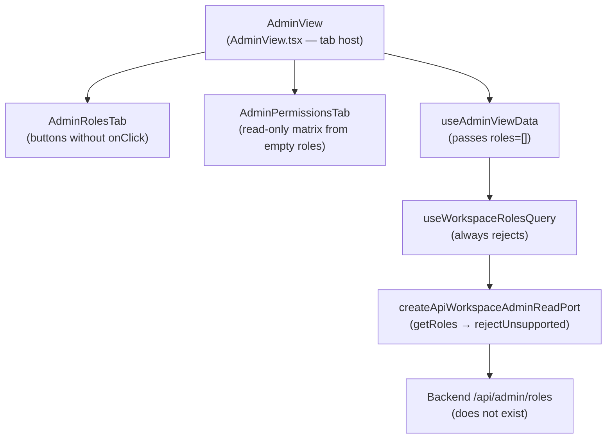

# Fowler Analysis — Admin RBAC Dead Action Buttons

## Scope

This analysis reviews the gap that prevents users from creating or editing
roles through the Admin interface.

The review covers:

- `AdminRolesTab.tsx` rendering "Create Role" (L18) and "Edit" (L36) buttons
  with no `onClick` handler and no navigation action;
- `createApiWorkspaceAdminReadPort()` in `workspacePorts.api.ts` (L122-129)
  calling `rejectUnsupportedApiWorkspaceCapability` for both `getRoles` and
  `getAuditLog`, returning an empty roles array on every load;
- the Permissions tab (`AdminPermissionsTab.tsx`) rendering a read-only matrix
  from the same empty roles array — no way for the user to change any
  permission.

It does not cover:

- backend RBAC implementation (authorization service, role persistence);
- session token scoping by role;
- multi-tenant role inheritance;
- audit log gap (covered in a separate analysis).

## Governing Sources

- `AGENTS.md`
- `docs/planning/status/governance-document-rule-inventory.md`
- `docs/guides/ai-work-protocol.md`
- `docs/architecture/command-query-rail-governance.md`
- `docs/architecture/fowler-opportunity-planning-governance.md`
- `docs/architecture/components/web/frontend-fowler-implementation-pattern.md`
- `apps/web/src/app/views/admin/AdminRolesTab.tsx`
- `apps/web/src/app/views/admin/AdminPermissionsTab.tsx`
- `apps/web/src/app/services/workspace/workspacePorts.api.ts`
- `apps/web/src/app/views/admin/useAdminViewData.ts`

## Mature-System Comparison

Mature admin UIs apply three rules around role management:

1. **No orphan buttons** — every button that mutates state either has a wired
   handler or is hidden behind a capability flag. A button that renders but
   has no handler is treated as a regression, not a placeholder.
2. **Port contract completeness** — a port factory that always rejects is
   acceptable as a stub during initial wiring but must be replaced before the
   surface is visible in production. Stubs are tracked as open tasks and
   gated behind a capability flag; they do not ship as the default runtime
   behaviour.
3. **Empty-state clarity** — when roles cannot be loaded, the UI shows an
   explicit empty state or error state, not a ghost interface where buttons
   appear functional but are not.

The current state violates all three rules: buttons render with no handler,
the port is permanently rejected, and the roles list appears empty without
an error that would tell the user why.

## Improved Patterns

| Area            | Improvement                                                                                                              | Mature-system pattern          |
| --------------- | ------------------------------------------------------------------------------------------------------------------------ | ------------------------------ |
| Button handlers | "Create Role" and "Edit" buttons receive `onClick` props from a command handler or a route navigation action.            | Command / Event handler wiring |
| Port stub       | `createApiWorkspaceAdminReadPort()` implements real HTTP calls to `/api/admin/roles`; stub is replaced by real adapter.  | Adapter / Port implementation  |
| Capability gate | If the backend endpoint does not exist, `canManageRoles` capability flag hides the buttons rather than rendering ghosts. | Capability-gated UI            |
| Empty state     | If roles load as empty, the UI renders a "No roles configured" empty state instead of a blank list.                      | Explicit empty state           |

## Antipatterns Detected

| Antipattern         | Evidence                                                                                                             | Fowler signal          | Impact                                                                                      |
| ------------------- | -------------------------------------------------------------------------------------------------------------------- | ---------------------- | ------------------------------------------------------------------------------------------- |
| Ghost UI            | `AdminRolesTab.tsx` L18 and L36 render `<Button>` elements with no `onClick` handler; clicks produce no action.      | Incomplete behaviour   | User believes functionality is available; clicking produces no feedback; trust is eroded.   |
| Permanent stub      | `createApiWorkspaceAdminReadPort().getRoles()` calls `rejectUnsupportedApiWorkspaceCapability` unconditionally.      | Dead code path         | The roles query always returns `[]`; the tab always shows an empty list regardless of data. |
| Silent failure      | `useWorkspaceRolesQuery()` rejects silently and the view renders `roles = []`; no error state is shown to the user.  | Hidden failure         | User sees an empty roles list and cannot distinguish "no roles" from "load failed".         |
| Responsibility void | The `AdminRolesTab` owns button rendering but has no command dependency injected; it cannot even navigate to a form. | Missing responsibility | No route or modal exists that a Create/Edit button could target.                            |

## Component Grouping

The RBAC command surface spans three layers:

| Component                         | Owned concern                                                           | Current state                                                 | Target state                                                                                |
| --------------------------------- | ----------------------------------------------------------------------- | ------------------------------------------------------------- | ------------------------------------------------------------------------------------------- |
| `AdminRolesTab`                   | Render role cards and wire Create/Edit actions.                         | Buttons render with no `onClick`.                             | Buttons receive `onCreateRole` / `onEditRole` handlers; navigate to a form or open a modal. |
| `createApiWorkspaceAdminReadPort` | Adapt `/api/admin/roles` backend endpoint to `IWorkspaceAdminReadPort`. | Always rejects with `WorkspaceApiCapabilityUnsupportedError`. | Implements real `GET /api/admin/roles` HTTP call; parses and returns a typed `Role[]`.      |
| `useAdminViewData`                | Load roles from the port and expose them to the view.                   | Passes `roles = rolesQuery.data ?? []` silently on reject.    | Exposes `rolesError` to the view so an error state can be rendered when the port rejects.   |
| Backend `/api/admin/roles`        | Persist and serve role definitions.                                     | Does not exist.                                               | New backend route that returns role definitions for the current workspace tenant.           |

## Repetitions

- The `rejectUnsupportedApiWorkspaceCapability` pattern is reused for both
  `getRoles` and `getAuditLog` inside the same `createApiWorkspaceAdminReadPort`
  factory. The entire admin read port is a permanent stub factory.
- The silent `data ?? []` fallback in `useAdminViewData` is the same pattern
  used in `useWorkspaceAuditQuery`. Both produce empty lists from rejected
  ports with no user-visible error state.

## Opportunities

1. **Wire `onCreateRole` and `onEditRole` handlers in `AdminRolesTab`**
   — add typed `onCreateRole` and `onEditRole?: (roleId: string) => void`
   props; initially navigate to a placeholder form route so buttons are no
   longer dead.

2. **Implement `createApiWorkspaceAdminReadPort().getRoles()`**
   — replace the stub with a real `GET /api/admin/roles` call; parse the
   response into `Role[]`; gate the Roles tab behind a `canManageRoles`
   capability flag if the backend route is not yet deployed.

3. **Surface load errors in `useAdminViewData`**
   — expose `rolesError` from `useWorkspaceRolesQuery`; render an
   `AdminRolesErrorState` component when the query rejects.

4. **Add an explicit empty state for roles**
   — when roles load as `[]` without an error, render "No roles configured"
   with a "Create your first role" call-to-action rather than a blank list.

5. **Architecture test — assert no `onClick`-less command buttons**
   — a test that finds `<Button>` elements in admin surfaces that have no
   `onClick` and no `disabled` attribute and fails the build prevents this
   class of ghost UI from re-appearing.

## Drift To Fix

| Drift                                                                                           | Fix                                                                                                                     |
| ----------------------------------------------------------------------------------------------- | ----------------------------------------------------------------------------------------------------------------------- |
| `AdminRolesTab.tsx` L18 — `<Button>` with no `onClick`.                                         | Add `onCreateRole: () => void` prop; pass a handler from `AdminView` that navigates to the role creation route.         |
| `AdminRolesTab.tsx` L36 — `<Button variant="outline">` with no `onClick`.                       | Add `onEditRole: (roleId: string) => void` prop; pass a handler from `AdminView` that navigates to the role edit route. |
| `createApiWorkspaceAdminReadPort().getRoles()` calls `rejectUnsupportedApiWorkspaceCapability`. | Implement real `GET /api/admin/roles` HTTP adapter; fall back to capability gate if backend route is not deployed.      |
| `useAdminViewData` silently swallows `rolesQuery.error`.                                        | Return `rolesError: rolesQuery.error` from the hook; `AdminView` renders an error state instead of an empty roles list. |

## ADR Assessment

No ADR is required for wiring button handlers or implementing the HTTP
adapter if the backend route already exists. An ADR is required if the role
management feature introduces a new authorization boundary (e.g., role-scoped
JWT claims, tenant-level permission overrides) that changes the security
contract of the existing session model.

## Fowler Opportunity Matrix

| scenario                                                                                                                | opportunity                                                                                                      | Fowler pattern                             | DDD owner                                                           | command/query rail                                                            | implementation surfaces                                                                                                  | unit or package test                                                                 | architecture test                                                                                                  | user-flow test                                                                       | out of scope                                          |
| ----------------------------------------------------------------------------------------------------------------------- | ---------------------------------------------------------------------------------------------------------------- | ------------------------------------------ | ------------------------------------------------------------------- | ----------------------------------------------------------------------------- | ------------------------------------------------------------------------------------------------------------------------ | ------------------------------------------------------------------------------------ | ------------------------------------------------------------------------------------------------------------------ | ------------------------------------------------------------------------------------ | ----------------------------------------------------- |
| User clicks "Create Role" button in Admin → Roles tab; nothing happens; no modal or navigation occurs.                  | Ghost UI — button renders with no `onClick` handler; there is no target route or modal for role creation.        | Dead code / Incomplete behaviour.          | `AdminRolesTab` (presentation) + `AdminView` (command host).        | New command rail: `CreateAdminRole` — command owned by admin bounded context. | `AdminRolesTab.tsx` (add `onCreateRole` prop), `AdminView.tsx` (add handler), new role creation route or modal.          | Unit: `AdminRolesTab` calls `onCreateRole` when "Create Role" is clicked.            | Architecture: no `<Button>` in admin surfaces without an `onClick` or `disabled` prop.                             | Playwright: user clicks "Create Role"; role creation form opens.                     | Backend role persistence and RBAC enforcement.        |
| User clicks "Edit" button on a role card; nothing happens.                                                              | Ghost UI — "Edit" button renders with no `onClick`; there is no target route or modal for role editing.          | Dead code / Incomplete behaviour.          | `AdminRolesTab` (presentation) + `AdminView` (command host).        | Same `CreateAdminRole` or new `UpdateAdminRole` command rail.                 | `AdminRolesTab.tsx` (add `onEditRole` prop), `AdminView.tsx` (add handler).                                              | Unit: `AdminRolesTab` calls `onEditRole(role.id)` when "Edit" is clicked.            | Architecture: same as above.                                                                                       | Playwright: user clicks "Edit" on a role; role edit form opens with pre-filled data. | Backend role update persistence.                      |
| Admin Roles tab always shows empty list because `getRoles()` permanently rejects.                                       | Permanent stub — `createApiWorkspaceAdminReadPort().getRoles()` calls `rejectUnsupportedApiWorkspaceCapability`. | Stub as permanent state / Missing adapter. | `createApiWorkspaceAdminReadPort` (workspace port adapter).         | Query rail: `ListAdminRoles` — read model query against `/api/admin/roles`.   | `workspacePorts.api.ts` (implement real HTTP call), backend `/api/admin/roles` route.                                    | Unit: mock API returns role list; `useWorkspaceRolesQuery` resolves correct data.    | Architecture: no production port factory that calls `rejectUnsupportedApiWorkspaceCapability` for core RBAC rails. | Playwright: Admin Roles tab shows at least one role from real API.                   | Multi-tenant role inheritance; session token scoping. |
| Roles tab shows empty list on query failure with no error message; user cannot distinguish "no roles" from "API error". | Silent failure — `useAdminViewData` returns `roles = []` on error without surfacing `rolesQuery.error`.          | Hidden failure / Missing error state.      | `useAdminViewData` (view data hook) + `AdminView` (error boundary). | Same `ListAdminRoles` query rail.                                             | `useAdminViewData.ts` (expose `rolesError`), `AdminView.tsx` (render error state), new `AdminRolesErrorState` component. | Unit: when `rolesQuery` rejects, `useAdminViewData` returns a non-null `rolesError`. | Architecture: `useAdminViewData` return type includes `rolesError` field.                                          | Playwright: when API returns 500, Admin Roles tab shows error message.               | Backend error categorisation.                         |
