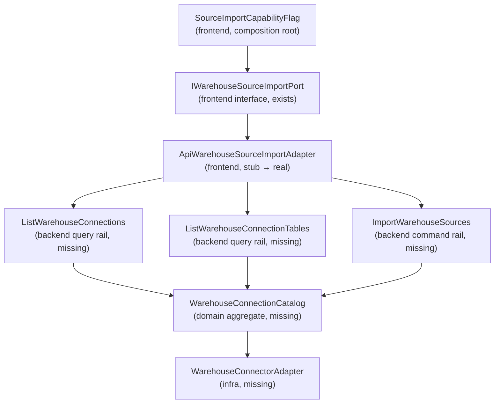

# Fowler Analysis — Canvas Source Import Backend Gap

## Scope

This analysis reviews the full-stack capability gap that prevents the Canvas
source import wizard from operating in API mode.

The review covers:

- the `sourceImportAvailable: false` hardcoded capability flag in the
  frontend composition root;
- the `createApiWarehouseSourceImportPort()` stub that throws on all three
  methods instead of implementing real transport;
- the complete absence of backend routes, use cases, and infrastructure for
  warehouse connection discovery and source import;
- the frontend `SOURCE_TYPE_OPTIONS` constants where file, API, and stream
  sources are permanently disabled;
- the documentation drift between wizard UI maturity and backend readiness.

It does not cover:

- changes to the canvas graph draft authoring rail;
- new ADR authorship (recorded as a future gate);
- backend warehouse adapter selection (Snowflake, BigQuery, Redshift, Postgres);
- frontend UI redesign of the source import wizard;
- other capability flags in the workspace ports composition root.

## Governing Sources

- `AGENTS.md`
- `docs/planning/status/governance-document-rule-inventory.md`
- `docs/guides/ai-work-protocol.md`
- `docs/architecture/command-query-rail-governance.md`
- `docs/architecture/fowler-opportunity-planning-governance.md`
- `docs/architecture/components/web/frontend-fowler-implementation-pattern.md`
- `docs/architecture/components/web/workspace/workspace-port-decomposition-component.md`
- `docs/architecture/components/web/workspace/workspace-domain-specification.md`
- `apps/web/src/app/services/workspace/workspacePorts.api.ts`
- `apps/web/src/app/services/workspace/workspacePorts.ts`
- `apps/web/src/app/components/sourceImportWizard/constants.ts`
- `apps/web/src/app/views/canvas/useCanvasController.ts`
- `apps/api/src/entrypoints/http/registerProtectedRuntimeRoutes.ts`
- `buzon/20260510-codex-fowler-workspace-port-decomposition-analysis.md`

## Mature-System Comparison

Mature hexagonal systems distinguish between four capability states:

1. **Implemented and available** — port interface, API adapter, and backend
   rail all exist and are tested.
2. **Implemented and unavailable** — port interface exists; backend rail
   missing; adapter rejects before transport with a named, testable error.
3. **Configuration-driven unavailability** — a registry or server capability
   query decides whether a feature is accessible, not a hardcoded boolean in
   the composition root.
4. **Primitive flag-driven unavailability** — a boolean in a module decides
   product behavior; no governed registry, no audit trail, no test hook.

The canvas source import is currently in state 4. A mature system would use
state 2 (fail-closed, testable adapter) and move the availability decision to
a server-owned capability registry (state 3) once the backend rails are ready.

Mature systems also never leave a product-visible wizard UI with zero backend
support without a clear, testable readiness boundary that CI enforces. The
current state has the wizard UI functional in mock mode and completely absent
from API mode, with no CI gate preventing the gap from widening.

## Improved Patterns

| Area                         | Improvement                                                                                                                   | Mature-system pattern                                |
| ---------------------------- | ----------------------------------------------------------------------------------------------------------------------------- | ---------------------------------------------------- |
| Workspace port decomposition | `IWarehouseSourceImportPort` is a named, concern-specific port, not part of the broad `IWorkspacePort`.                       | Hexagonal port per capability boundary               |
| Fail-closed adapter          | `createApiWarehouseSourceImportPort()` throws before any transport call rather than returning empty data or silently failing. | Explicit unavailability / Null Object with rejection |
| Architecture documentation   | `workspace-port-decomposition-component.md` acknowledges `IWarehouseSourceImportPort` as unavailable in product runtime.      | Documentation as architecture record                 |
| Wizard UI isolation          | The wizard reads from the port and is not coupled to the mock service runtime directly.                                       | Dependency injection / port consumer pattern         |

## Antipatterns Detected

| Antipattern          | Evidence                                                                                                                                                                       | Fowler signal        | Impact                                                                           |
| -------------------- | ------------------------------------------------------------------------------------------------------------------------------------------------------------------------------ | -------------------- | -------------------------------------------------------------------------------- |
| Hidden authority     | `sourceImportAvailable: false` hardcoded in `workspacePorts.api.ts:48`. A boolean literal in the composition root controls user capability.                                    | Hidden authority     | Capability change requires a code edit with no test hook or observability.       |
| Primitive obsession  | `SOURCE_TYPE_OPTIONS` in `constants.ts` uses `available: boolean` to disable file, API, and stream source types. No policy object, no rule owner, no test.                     | Primitive obsession  | Disabling or enabling source types requires editing UI constants directly.       |
| Anemic domain        | No bounded context owns `WarehouseConnection` or `SourceRegistration` in the backend. No aggregate, policy, domain service, or repository exists.                              | Anemic domain        | Adding the feature requires inventing domain ownership from scratch.             |
| Boundary drift       | `createApiWarehouseSourceImportPort()` lives in the API adapter file alongside real transport adapters but it only throws. The API surface looks implemented but is empty.     | Boundary drift       | Consumers and tests cannot distinguish a stub from a real adapter by inspection. |
| Test-only confidence | The wizard works in mock mode with fixtures but there are no integration or contract tests for the API adapter path.                                                           | Test-only confidence | Mock tests give false confidence; API mode is untested.                          |
| Documentation drift  | `workspace-port-decomposition-component.md` documents `IWarehouseSourceImportPort` as a designed and owned port; the implementation is a throw stub and the backend is absent. | Documentation drift  | Documentation describes a target that code does not ship.                        |

## Component Grouping

The source import capability crosses three bounded concerns. Each must become
an owned, named component:

| Component                         | Owned concern                                                          | Current state                                                                 | Target state                                                                                                                     |
| --------------------------------- | ---------------------------------------------------------------------- | ----------------------------------------------------------------------------- | -------------------------------------------------------------------------------------------------------------------------------- |
| `SourceImportCapabilityFlag`      | Decide whether source import is available to the session user.         | Hardcoded `false` literal in composition root.                                | Server-owned capability query or config-driven flag wired at composition time.                                                   |
| `IWarehouseSourceImportPort`      | Frontend port contract for warehouse discovery and source import.      | Defined — `listWarehouseConnections`, `listWarehouseTables`, `importSources`. | Keep as is.                                                                                                                      |
| `ApiWarehouseSourceImportAdapter` | Real HTTP calls for the three warehouse rails.                         | Throws `Error('not implemented')` on all methods.                             | Implements port against `GET /workspace/connections`, `GET /workspace/connections/:id/tables`, `POST /workspace/sources/import`. |
| `SourceTypeAvailabilityPolicy`    | Which source types are enabled at runtime.                             | `available: boolean` literals in `constants.ts`.                              | Policy object with a named owner and a testable decision function.                                                               |
| `WarehouseConnectionCatalog`      | Backend domain aggregate: discover and validate warehouse connections. | Does not exist.                                                               | New domain aggregate with `listConnections`, `listTables`.                                                                       |
| `SourceRegistrationCommand`       | Backend command: import selected tables as workspace sources.          | Does not exist.                                                               | New command with invariants, authorization scope, and negative tests.                                                            |
| `WarehouseConnectorAdapter`       | Backend infra: bridge to Snowflake/BigQuery/Redshift/Postgres.         | Does not exist.                                                               | Adapter implementing a connector port per warehouse type.                                                                        |

## Repetitions

- The `available: false` pattern appears in `SOURCE_TYPE_OPTIONS` for three
  source types (file, API, stream) with no shared policy object.
- The `unavailable until backend` pattern repeats across three workspace ports
  (`IWorkspacePluginCatalogQueryPort`, `IWorkspaceAdminReadPort`,
  `IWarehouseSourceImportPort`) with no shared capability readiness registry.
- The "stub that throws" adapter pattern appears in `workspacePorts.api.ts`
  for warehouse import alongside the same pattern described for diff and admin
  in the workspace port decomposition analysis.

## Opportunities

1. **Backend — implement three warehouse command/query rails**
   — `ListWarehouseConnections`, `ListWarehouseConnectionTables`,
   `ImportWarehouseSources` — with a `WarehouseConnectionCatalog` domain
   aggregate, a connector adapter port, and integration tests per rail.

2. **Frontend — replace the throw stub with a real HTTP adapter**
   — `createApiWarehouseSourceImportAdapter()` calling the three backend
   routes with typed request/response contracts.

3. **Frontend — move `sourceImportAvailable` out of the composition root**
   — derive it from the session capability query or an explicit configuration
   registry rather than a hardcoded literal.

4. **Frontend — introduce `SourceTypeAvailabilityPolicy`**
   — replace the `available: boolean` flags in `SOURCE_TYPE_OPTIONS` with a
   named policy object that can be tested and extended without editing UI
   constants.

5. **Architecture — add a semantic architecture test**
   — assert that no `IWarehouseSourceImportPort` consumer can reach the
   throw stub in a non-test context; assert that `sourceImportAvailable` is
   not a hardcoded literal in the composition root.

6. **Documentation — add a component guide for `WarehouseSourceImport`**
   — once the backend rail is accepted, record public API, invariants,
   backend readiness state, and a Mermaid state diagram.

## Drift To Fix

| Drift                                                                                                                                                          | Fix                                                                                                                                                                                |
| -------------------------------------------------------------------------------------------------------------------------------------------------------------- | ---------------------------------------------------------------------------------------------------------------------------------------------------------------------------------- |
| `sourceImportAvailable: false` literal in `workspacePorts.api.ts:48`.                                                                                          | Replace with a config-driven or server-query-driven capability flag at the composition boundary.                                                                                   |
| `createApiWarehouseSourceImportPort()` throws on all methods without a named error type.                                                                       | Introduce `WarehouseSourceImportUnavailableError` and throw it from the unavailable adapter so callers can test for it explicitly.                                                 |
| `SOURCE_TYPE_OPTIONS` uses raw `available: boolean` for source type gating.                                                                                    | Extract to `SourceTypeAvailabilityPolicy` with a named decision function.                                                                                                          |
| Backend `registerProtectedRuntimeRoutes.ts` has no warehouse, connection, or source-import route group.                                                        | Add `registerWarehouseConnectionsRouteGroup` and `registerSourceImportRouteGroup` once domain objects and use cases exist.                                                         |
| `workspace-port-decomposition-component.md` lists `IWarehouseSourceImportPort` as a designed port with three rails; zero backend routes implement those rails. | Update the component doc to explicitly record `Implementation status: unavailable — backend rails not yet implemented` and reference the planning task that owns the backend work. |
| No architecture test asserts that the wizard cannot call transport when `sourceImportAvailable: false`.                                                        | Add architecture guard in the workspace port decomposition test suite.                                                                                                             |

## ADR Assessment

No ADR is required for the frontend cleanup (capability flag extraction,
named error type, policy object). Those apply existing governance from
`fowler-opportunity-planning-governance.md`, `command-query-rail-governance.md`,
and `workspace-port-decomposition-component.md`.

An ADR is required when the backend warehouse source import rails are accepted.
The ADR should cover:

- the authorization scope for warehouse connection access (which RBAC roles
  may discover and import warehouse sources);
- the connector adapter port contract and which warehouse types are supported
  in the initial implementation;
- the `WarehouseConnectionCatalog` aggregate invariants (connection identity,
  connection health, table enumeration bounds);
- the `ImportWarehouseSources` command lifecycle and rollback semantics if
  import fails mid-execution.

## Fowler Opportunity Matrix

| scenario                                                                                                    | opportunity                                                                                       | Fowler pattern                                               | DDD owner                                                                        | command/query rail                                                                                                           | implementation surfaces                                                                                               | unit or package test                                                                                       | architecture test                                                             | user-flow test                                    | out of scope                                                                          |
| ----------------------------------------------------------------------------------------------------------- | ------------------------------------------------------------------------------------------------- | ------------------------------------------------------------ | -------------------------------------------------------------------------------- | ---------------------------------------------------------------------------------------------------------------------------- | --------------------------------------------------------------------------------------------------------------------- | ---------------------------------------------------------------------------------------------------------- | ----------------------------------------------------------------------------- | ------------------------------------------------- | ------------------------------------------------------------------------------------- |
| User opens canvas and source import button is disabled with no explanation.                                 | Hidden authority — `sourceImportAvailable: false` literal decides UI capability.                  | Capability Port / Feature Flag from server-owned read model. | `WorkspaceCapabilityReadModel` (frontend projection of server state).            | `QueryWorkspaceCapabilities` — reuse or extend existing workspace context rail.                                              | `workspacePorts.api.ts:48`, `workspacePorts.ts`, composition root.                                                    | Unit test: `sourceImportAvailable` is derived, not hardcoded.                                              | Architecture guard: no hardcoded capability boolean in composition root.      | Cypress: import button state reflects capability. | Backend capability endpoint implementation.                                           |
| API adapter throws untyped `Error('not implemented')` at runtime.                                           | Boundary drift — stub occupies an adapter slot without implementing the port contract.            | Null Object with Explicit Rejection / Named Error.           | `IWarehouseSourceImportPort` port interface.                                     | `ListWarehouseConnections`, `ListWarehouseConnectionTables`, `ImportWarehouseSources` — new, not yet accepted.               | `workspacePorts.api.ts` — `createApiWarehouseSourceImportPort()`.                                                     | Unit test: adapter throws `WarehouseSourceImportUnavailableError`; caller can catch by type.               | Architecture guard: no `throw new Error('not implemented')` in adapter files. | None until backend exists.                        | Implementing real HTTP transport.                                                     |
| Source types file, API, and stream are permanently disabled with raw booleans.                              | Primitive obsession — no policy object owns source type availability.                             | Policy Object / Replace Conditional with Strategy.           | `SourceTypeAvailabilityPolicy` (new frontend value object).                      | None — internal presentation only.                                                                                           | `apps/web/src/app/components/sourceImportWizard/constants.ts`.                                                        | Unit test: policy returns correct availability per source type; can be extended without editing constants. | None required; presentation-only.                                             | None required; presentation-only.                 | Backend source type validation.                                                       |
| Backend returns 404 for any warehouse or source import request.                                             | Anemic domain — no aggregate, policy, or rail owns warehouse connection semantics in the backend. | Service Layer + Repository + Hexagonal Adapter (backend).    | `WarehouseConnectionCatalog` aggregate (new), `SourceRegistrationCommand` (new). | `ListWarehouseConnections` (new query), `ListWarehouseConnectionTables` (new query), `ImportWarehouseSources` (new command). | `apps/api/src/entrypoints/http/` — new route groups; new use cases; new domain objects; new connector infrastructure. | Unit tests per use case; integration tests per route; negative tests for auth, not-found, malformed input. | Architecture guard: no warehouse route exists without a domain object owner.  | Full wizard E2E in API mode.                      | Warehouse connector implementations beyond scope of initial rail acceptance.          |
| Documentation describes `IWarehouseSourceImportPort` as a designed port but the backend rails do not exist. | Documentation drift — component guide shows implemented shape; code ships a stub.                 | Documentation as Architecture Record companion.              | `workspace-port-decomposition-component.md`.                                     | No new rail.                                                                                                                 | `docs/architecture/components/web/workspace/workspace-port-decomposition-component.md`.                               | None — documentation check.                                                                                | Semantic architecture test validates doc status field.                        | None.                                             | Full component guide for warehouse source import (requires backend completion first). |
