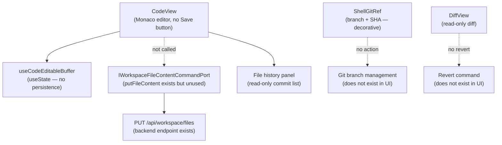

# Fowler Analysis — CodeView Git Save Gap

## Scope

This analysis reviews the gap that makes the code editor read-only: the user
can open files, view Git history, and review diffs, but cannot save edits,
commit changes, or push to Git.

The review covers:

- `CodeView.tsx` hosting a Monaco SQL/YAML editor whose buffer is stored in
  local component state only — there is no Save button and no call to a file
  write API;
- `useCodeEditableBuffer.ts` managing the editor buffer as `useState` with no
  persistence path;
- `IWorkspaceFileContentCommandPort` existing in `workspace.ts` and wired in
  `workspacePorts.api.ts` (L173-183) with a real `PUT /api/workspace/files`
  endpoint — but nothing in the UI calls it;
- `ShellGitRef.tsx` displaying the current branch and commit SHA in the
  shell header but offering no commit, push, or branch switch actions;
- `DiffView.tsx` and the file history panel being read-only review surfaces
  with no "accept", "revert", or "commit" actions.

It does not cover:

- Backend Git server implementation (Gitea, GitLab, etc.);
- branch management, merge, or pull request workflows;
- conflict resolution UI;
- code review or approval workflows.

## Governing Sources

- `AGENTS.md`
- `docs/planning/status/governance-document-rule-inventory.md`
- `docs/guides/ai-work-protocol.md`
- `docs/architecture/command-query-rail-governance.md`
- `docs/architecture/fowler-opportunity-planning-governance.md`
- `docs/architecture/components/web/frontend-fowler-implementation-pattern.md`
- `apps/web/src/app/views/CodeView.tsx`
- `apps/web/src/app/views/DiffView.tsx`
- `apps/web/src/app/views/code/useCodeEditableBuffer.ts`
- `apps/web/src/app/components/shell/ShellGitRef.tsx`
- `apps/web/src/app/ports/workspace.ts`
- `apps/web/src/app/services/workspace/workspacePorts.api.ts`

## Mature-System Comparison

Mature browser-based code editors follow a minimal write loop:

1. **Edit → Save → Commit** as three distinct, explicit user actions with
   clear affordances for each step.
2. **Unsaved changes indicator** — an asterisk or dot in the tab title, a
   "You have unsaved changes" banner, or a browser unload warning prevents
   silent data loss when the user navigates away.
3. **Commit message is a first-class field** — the user writes a message
   before committing; the message is not auto-generated or empty.
4. **Git ref is actionable** — the branch display in the header is a button
   that opens branch management, not a static text label.

The current state has none of these: edits are silently discarded on
navigation, the Git ref is decorative text, and the save path exists in the
port contract but is never called.

## Improved Patterns

| Area                  | Improvement                                                                                       | Mature-system pattern        |
| --------------------- | ------------------------------------------------------------------------------------------------- | ---------------------------- |
| Save action           | "Save" button in `CodeView` toolbar calls `IWorkspaceFileContentCommandPort.putFileContent()`.    | Edit → Save → Commit loop    |
| Unsaved changes guard | When buffer differs from last saved content, show unsaved indicator and warn on navigation.       | Dirty state indicator        |
| Commit action         | "Commit" button opens a commit message dialog; calls a Git commit command port.                   | Explicit commit with message |
| Git ref interactivity | `ShellGitRef` becomes a button opening branch picker; current branch and SHA are still displayed. | Actionable Git ref           |
| Diff → Revert action  | `DiffView` adds a "Revert" action that calls a reset command for the changed file.                | Actionable diff view         |

## Antipatterns Detected

| Antipattern             | Evidence                                                                                                                    | Fowler signal         | Impact                                                                                        |
| ----------------------- | --------------------------------------------------------------------------------------------------------------------------- | --------------------- | --------------------------------------------------------------------------------------------- |
| Dead write path         | `IWorkspaceFileContentCommandPort.putFileContent()` exists and has a backend endpoint but is called from nowhere in the UI. | Unused infrastructure | Users cannot persist any edits made in the Monaco editor; all changes are lost on navigation. |
| Silent data loss        | `useCodeEditableBuffer.ts` stores edits in `useState`; no dirty state, no save guard, no unload warning.                    | Hidden failure        | User edits a SQL model, navigates to another view, and loses all changes with no warning.     |
| Decorative Git ref      | `ShellGitRef.tsx` renders branch name and commit SHA as static text with no action on click.                                | Ghost interaction     | The Git ref display promises Git awareness but offers no Git actions.                         |
| Read-only diff view     | `DiffView.tsx` shows changes but has no accept, revert, or stage action.                                                    | Incomplete behaviour  | User can see what changed but cannot act on it; the diff view is informational only.          |
| Infrastructure / UI gap | The port contract and HTTP endpoint for file writes exist; the UI layer simply never calls them.                            | Boundary drift        | Backend is ready; frontend is the only blocker. The gap is purely a wiring problem.           |

## Component Grouping

| Component                          | Owned concern                       | Current state                                                   | Target state                                                                                          |
| ---------------------------------- | ----------------------------------- | --------------------------------------------------------------- | ----------------------------------------------------------------------------------------------------- |
| `CodeView`                         | Edit and save workspace files.      | Monaco editor present; no Save button; buffer discarded on nav. | Adds Save button; calls `putFileContent()`; shows dirty indicator; warns on unsaved navigation.       |
| `useCodeEditableBuffer`            | Manage editor buffer state.         | `useState` only; no dirty tracking; no persistence.             | Tracks dirty state (`isDirty`); exposes `save()` action that calls the port; shows unsaved indicator. |
| `IWorkspaceFileContentCommandPort` | Write file content to backend.      | Interface and HTTP endpoint exist; no UI caller.                | Called by `useCodeEditableBuffer.save()` when user clicks Save.                                       |
| `ShellGitRef`                      | Display and act on current Git ref. | Static text with branch icon and SHA tooltip.                   | Becomes a button; clicking opens branch picker or Git actions panel.                                  |
| `DiffView`                         | Review file changes.                | Read-only diff with no actions.                                 | Adds "Revert file" action for changed files.                                                          |

## Repetitions

- The `useState` buffer pattern in `useCodeEditableBuffer` mirrors how the
  canvas inspector manages draft state — both accumulate edits in local state
  with no explicit save path. A shared "dirty buffer + save" pattern could
  cover both.
- The read-only pattern in `DiffView` and the file history panel is consistent
  — both surfaces could gain action buttons in the same pass.

## Opportunities

1. **Wire `putFileContent()` to a Save button in `CodeView`**
   — the backend endpoint exists; this is a pure UI wiring task. Add a Save
   button to the `CodeView` toolbar; call `putFileContent(path, content)` on
   click; show a success toast.

2. **Add dirty state tracking to `useCodeEditableBuffer`**
   — compare current buffer to last-saved content; expose `isDirty: boolean`;
   show an asterisk in the CodeView header; add a `beforeunload` warning.

3. **Add a commit action to `CodeView`**
   — after saving, offer a "Commit" button that opens a commit message dialog
   and calls a Git commit command port (new port if it does not exist).

4. **Make `ShellGitRef` interactive**
   — clicking the branch name opens a branch picker or Git status panel;
   at minimum shows a list of recent branches.

5. **Add "Revert file" to `DiffView`**
   — a revert button calls a reset command port for the currently viewed file;
   confirms with the user before discarding changes.

## Drift To Fix

| Drift                                                          | Fix                                                                                                 |
| -------------------------------------------------------------- | --------------------------------------------------------------------------------------------------- |
| `CodeView.tsx` — no Save button; buffer never persisted.       | Add Save button to toolbar; call `IWorkspaceFileContentCommandPort.putFileContent()` on click.      |
| `useCodeEditableBuffer.ts` — no dirty tracking; no save guard. | Add `isDirty` computed from buffer vs last-saved; expose `save()` action; add `beforeunload` guard. |
| `ShellGitRef.tsx` — static decorative text.                    | Add `onClick` handler; open branch picker or Git actions panel.                                     |
| `DiffView.tsx` — no revert or accept actions.                  | Add "Revert file" button; call reset command port with confirmation dialog.                         |

## ADR Assessment

No ADR is required for wiring the Save button to the existing port. An ADR
is required if a new Git commit command port is introduced that changes the
write contract between the frontend and the backend Git service — particularly
if the commit flow introduces signing, tagging, or a new push protocol that
did not previously exist.

## Fowler Opportunity Matrix

| scenario                                                                                          | opportunity                                                                                                                              | Fowler pattern                             | DDD owner                                                          | command/query rail                                                        | implementation surfaces                                                                 | unit or package test                                                      | architecture test                                                                                       | user-flow test                                                                                        | out of scope                              |
| ------------------------------------------------------------------------------------------------- | ---------------------------------------------------------------------------------------------------------------------------------------- | ------------------------------------------ | ------------------------------------------------------------------ | ------------------------------------------------------------------------- | --------------------------------------------------------------------------------------- | ------------------------------------------------------------------------- | ------------------------------------------------------------------------------------------------------- | ----------------------------------------------------------------------------------------------------- | ----------------------------------------- |
| User edits a SQL model in CodeView, navigates to canvas, and loses all changes with no warning.   | Dead write path — `putFileContent()` port exists and has a backend endpoint but is never called from the UI; buffer is local state only. | Unused infrastructure / Silent data loss.  | `CodeView` (presentation) + `useCodeEditableBuffer` (buffer hook). | Command rail: `SaveWorkspaceFile` — write via `PUT /api/workspace/files`. | `CodeView.tsx` (add Save button), `useCodeEditableBuffer.ts` (add save + dirty).        | Unit: clicking Save calls `putFileContent()` with current buffer content. | Architecture: `IWorkspaceFileContentCommandPort.putFileContent` is called from at least one UI surface. | Playwright: user edits file, clicks Save, refreshes page, file content persists.                      | Backend Git server; conflict resolution.  |
| User edits a file, navigates away; no "unsaved changes" warning appears; edits are silently lost. | Silent data loss — no dirty state tracking; no beforeunload guard; no unsaved indicator.                                                 | Hidden failure / Missing dirty state.      | `useCodeEditableBuffer` (buffer hook).                             | Same `SaveWorkspaceFile` rail.                                            | `useCodeEditableBuffer.ts` (add isDirty, beforeunload), `CodeView.tsx` (show asterisk). | Unit: after editing, `isDirty` is true; after save, `isDirty` is false.   | Architecture: `useCodeEditableBuffer` has an `isDirty` export.                                          | Playwright: editing a file then navigating away triggers a "You have unsaved changes" browser dialog. | Backend conflict detection.               |
| User sees the current branch and commit SHA in the header but cannot switch branches or commit.   | Decorative Git ref — `ShellGitRef` is static text; no Git actions are available from this surface.                                       | Ghost interaction / Incomplete behaviour.  | `ShellGitRef` (presentation).                                      | New command rail: `SwitchGitBranch` or `CommitWorkspaceChanges`.          | `ShellGitRef.tsx` (add onClick, branch picker panel).                                   | Unit: clicking ShellGitRef opens branch picker.                           | Architecture: `ShellGitRef` has an onClick handler.                                                     | Playwright: user clicks branch name; branch picker opens with recent branches.                        | Merge; pull request; conflict resolution. |
| User reviews a file diff but cannot revert or accept the change from the diff view.               | Read-only diff — `DiffView` shows changes but has no revert or accept action.                                                            | Incomplete behaviour / Missing affordance. | `DiffView` (presentation).                                         | Command rail: `RevertWorkspaceFile` — reset via Git backend.              | `DiffView.tsx` (add revert button), new revert command port.                            | Unit: clicking Revert triggers confirmation dialog then revert call.      | Architecture: `DiffView` has at least one mutation action.                                              | Playwright: user clicks Revert on a changed file; file reverts to last committed state.               | Merge conflict resolution.                |
