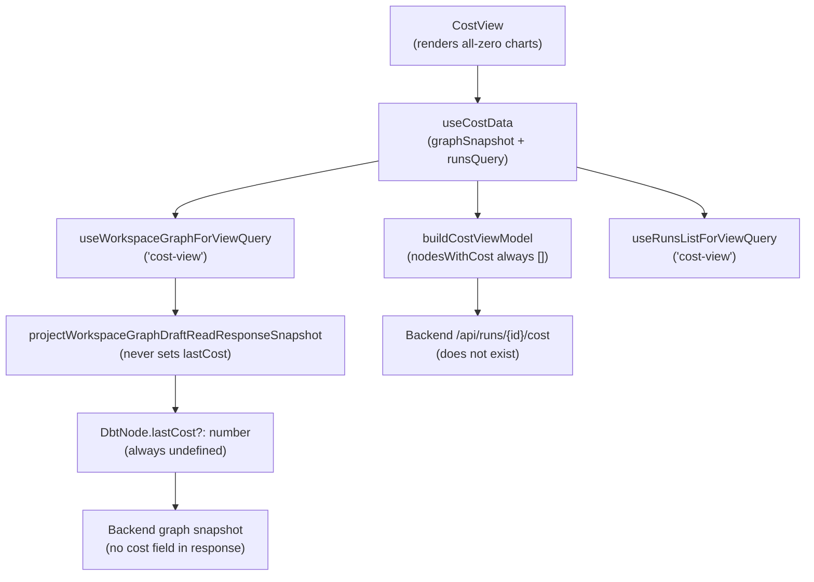

# Fowler Analysis — Cost View Node Field Missing From Backend

## Scope

This analysis reviews the gap that causes the Cost view to always show zero
cost and empty charts because the backend does not return `lastCost` or
`lastDuration` on graph node objects.

The review covers:

- `costViewModel.ts:38` filtering workspace nodes by
  `typeof node.lastCost === 'number'` — the filter always returns an empty
  array because the backend graph snapshot response does not include a
  `lastCost` field on node objects;
- `DbtNode.lastCost?: number` and `DbtNode.lastDuration?: number` being
  declared as optional in `types/dbt.ts` but never populated by
  `projectWorkspaceGraphDraftReadResponseSnapshot.ts`;
- all downstream cost metrics (`totalCost`, `averageCostPerRun`, `costByModel`,
  `durationByModel`, `costAlerts`) resolving to zero or empty because they
  derive from `nodesWithCost` which is always empty;
- `costByRun` using `averageCostPerRun * 0.15` as a proxy for current-run
  cost — a fabricated estimate rather than a real observed cost.

It does not cover:

- backend cost attribution service or billing integration;
- real-time cost tracking during a run;
- multi-run cost comparison or cost forecasting;
- run history persistence (separate concern).

## Governing Sources

- `AGENTS.md`
- `docs/planning/status/governance-document-rule-inventory.md`
- `docs/guides/ai-work-protocol.md`
- `docs/architecture/command-query-rail-governance.md`
- `docs/architecture/fowler-opportunity-planning-governance.md`
- `docs/architecture/components/web/frontend-fowler-implementation-pattern.md`
- `apps/web/src/app/views/cost/costViewModel.ts`
- `apps/web/src/app/views/cost/useCostData.ts`
- `apps/web/src/app/types/dbt.ts`
- `apps/web/src/app/services/workspace/workspaceGraphDraftSnapshotProjection.ts`

## Mature-System Comparison

Mature cost analytics UIs follow three patterns:

1. **Cost data has an explicit source** — cost per node comes from a dedicated
   cost read model (e.g., a run result payload or a separately queried cost
   endpoint) rather than being an optional field on a graph snapshot object.
2. **Absence is distinguished from zero** — a node that was never costed
   renders differently from a node that was costed at $0.00. The UI does not
   collapse "no data" into "zero cost".
3. **Fabricated estimates are labelled** — when an estimate is derived rather
   than observed (e.g., `averageCostPerRun * 0.15`) it is explicitly labelled
   as an estimate; the view does not present derived numbers as observed values.

The current implementation violates all three: cost data is an optional field
on the graph object with no dedicated source, zero and absent are
indistinguishable, and `currentRunCost` is a fabricated formula presented
without a label.

## Improved Patterns

| Area                  | Improvement                                                                                                             | Mature-system pattern               |
| --------------------- | ----------------------------------------------------------------------------------------------------------------------- | ----------------------------------- |
| Cost data source      | Cost data comes from run result payloads or a `/api/runs/{id}/cost` read model, not from graph node optional fields.    | Dedicated cost read model           |
| Null/zero distinction | Distinguish `lastCost === undefined` (never costed) from `lastCost === 0` (costed at zero) in the view model.           | Explicit nullable vs zero state     |
| Fabricated estimate   | Label `currentRunCost` as "estimated" in the UI copy; add a backend-observed value when available.                      | Labelled estimate vs observed value |
| Coverage card         | "Nodes with cost data" count reflects real coverage; zero coverage shows an actionable message, not an empty dashboard. | Coverage / completeness indicator   |

## Antipatterns Detected

| Antipattern        | Evidence                                                                                                                                | Fowler signal         | Impact                                                                                       |
| ------------------ | --------------------------------------------------------------------------------------------------------------------------------------- | --------------------- | -------------------------------------------------------------------------------------------- |
| Missing field      | `DbtNode.lastCost` is declared in `types/dbt.ts` but never set by `projectWorkspaceGraphDraftReadResponseSnapshot`; always `undefined`. | Incomplete data model | Cost view always shows $0.00 because `nodesWithCost` is always empty.                        |
| Fabricated data    | `costByRun` uses `averageCostPerRun` (which is zero) as cost per run; `currentRunCost` uses `averageCostPerRun * 0.15`.                 | Fabricated metric     | Cost charts show identical zero bars; current run cost badge shows $0.00.                    |
| Null/zero collapse | `costViewModel` does not distinguish `lastCost === undefined` from `lastCost === 0`; both produce zero in charts.                       | Hidden absence        | User cannot tell if cost is genuinely zero or if cost data is simply unavailable.            |
| Wrong data source  | Cost data is read from graph node optional fields rather than from a run result or dedicated cost endpoint.                             | Wrong authority       | Graph snapshots are authoring objects; they are not the correct carrier for execution costs. |

## Component Grouping

| Component                                        | Owned concern                                                    | Current state                                             | Target state                                                                                                |
| ------------------------------------------------ | ---------------------------------------------------------------- | --------------------------------------------------------- | ----------------------------------------------------------------------------------------------------------- |
| `buildCostViewModel`                             | Derive cost metrics from nodes and run list.                     | Derives from `node.lastCost` which is always `undefined`. | Derives from a dedicated cost read model returned by the run results or a cost query endpoint.              |
| `projectWorkspaceGraphDraftReadResponseSnapshot` | Map backend graph response to frontend `WorkspaceGraphSnapshot`. | Never maps cost fields.                                   | If cost fields exist in the backend response, map them; otherwise do not declare them on the node type.     |
| `DbtNode` (types/dbt.ts)                         | Type definition for graph nodes.                                 | `lastCost?: number` declared but never populated.         | Either remove the field from the graph node type and source cost from a run result payload, or populate it. |
| `useCostData`                                    | Load data for the cost view.                                     | Loads graph snapshot and runs; no cost-specific query.    | Adds a dedicated `useCostReadModelQuery` that fetches cost data from the run results endpoint.              |
| Backend cost endpoint                            | Serve per-node cost data for a given run.                        | Does not exist.                                           | New `/api/runs/{id}/cost` endpoint returning per-node cost and duration for completed runs.                 |

## Repetitions

- `averageCostPerRun` is used both as a chart data point and as the base for
  the `currentRunCost` estimate. The same fabricated value feeds two
  different UI elements, multiplying the misleading output.
- The `node.lastCost ?? 0` pattern appears in three places in
  `costViewModel.ts` (L39, L42, L50). Replacing the data source fixes all
  three at once.

## Opportunities

1. **Define a dedicated cost read model query (`useCostReadModelQuery`)**
   — fetch cost data from run result payloads or a new
   `/api/runs/{id}/cost` endpoint rather than reading optional node fields.

2. **Remove `lastCost` and `lastDuration` from `DbtNode` graph type**
   — these fields belong on a run result object, not on a graph authoring
   snapshot; removing them from the type eliminates the false assumption
   that graph nodes carry execution cost.

3. **Distinguish "no cost data" from "zero cost" in the view model**
   — add a `hasCostData: boolean` flag to `CostViewModel`; the view renders
   a "No cost data available — run a job to see cost metrics" empty state
   when `hasCostData` is false.

4. **Label `currentRunCost` as "estimated" in UI copy**
   — until a real per-run cost is available, label the badge "Estimated"
   to avoid presenting a derived formula as an observed value.

5. **Add a "cost data unavailable" state to `CostStatGrid`**
   — when all cost fields are zero because data is missing, render a banner
   explaining that cost data appears after the first completed run.

## Drift To Fix

| Drift                                                                             | Fix                                                                                                                          |
| --------------------------------------------------------------------------------- | ---------------------------------------------------------------------------------------------------------------------------- |
| `DbtNode.lastCost?: number` in `types/dbt.ts` — never populated by the backend.   | Move cost fields to a run result type; remove from graph node type; update `buildCostViewModel` to read from the new source. |
| `costViewModel.ts:38` — `typeof node.lastCost === 'number'` always false.         | Replace with cost read model; `nodesWithCost` derives from a real data source.                                               |
| `costViewModel.ts:43` — `currentRunCost = averageCostPerRun * 0.15` — fabricated. | Replace with observed run cost from the cost endpoint; label as "estimated" until the endpoint exists.                       |
| `useCostData.ts` — loads graph snapshot as cost data source.                      | Add `useCostReadModelQuery`; graph snapshot is not a cost data source.                                                       |

## ADR Assessment

No ADR is required for moving cost fields to a run result type if no new
backend contract boundary is introduced. An ADR is required if a new
`/api/runs/{id}/cost` endpoint introduces a new data shape, a new cost
attribution model, or a new billing integration boundary that did not
previously exist in the system contracts.

## Fowler Opportunity Matrix

| scenario                                                                                  | opportunity                                                                                                            | Fowler pattern                             | DDD owner                                                                                              | command/query rail                                                                                  | implementation surfaces                                                                                               | unit or package test                                                           | architecture test                                                                       | user-flow test                                                                               | out of scope                                   |
| ----------------------------------------------------------------------------------------- | ---------------------------------------------------------------------------------------------------------------------- | ------------------------------------------ | ------------------------------------------------------------------------------------------------------ | --------------------------------------------------------------------------------------------------- | --------------------------------------------------------------------------------------------------------------------- | ------------------------------------------------------------------------------ | --------------------------------------------------------------------------------------- | -------------------------------------------------------------------------------------------- | ---------------------------------------------- |
| User opens Cost view after running a job; all metrics show $0.00; charts are flat.        | Missing field — `node.lastCost` is always `undefined` because the backend graph snapshot does not include cost data.   | Incomplete data model / Wrong data source. | `buildCostViewModel` (view model) + `DbtNode` type + `projectWorkspaceGraphDraftReadResponseSnapshot`. | Query rail: `GetRunCostReadModel` — read model against `/api/runs/{id}/cost` or run result payload. | `costViewModel.ts` (use run result cost), `types/dbt.ts` (remove cost fields), `useCostData.ts` (add cost query).     | Unit: `buildCostViewModel` with real run cost input produces non-zero metrics. | Architecture: `buildCostViewModel` does not read `node.lastCost` from a graph snapshot. | Playwright: after completing a run, Cost view shows non-zero per-node cost metrics.          | Backend billing integration; cost forecasting. |
| Cost view shows "current run cost" badge displaying $0.00 as a calculated number.         | Fabricated data — `currentRunCost` is `averageCostPerRun * 0.15`; a derived formula is presented as an observed value. | Fabricated metric / Misleading display.    | `buildCostViewModel` (view model) + `CostView` (badge display).                                        | Same `GetRunCostReadModel` rail.                                                                    | `costViewModel.ts` (remove fabricated formula), `CostView.tsx` (label as "estimated" or hide until real data exists). | Unit: `currentRunCost` is null when no real cost data is available.            | Architecture: no fabricated `* 0.15` formula in the view model.                         | Playwright: current run cost badge is absent or labelled "estimated" until real data exists. | Real-time cost tracking during active run.     |
| User cannot tell if cost is zero because nothing ran or because cost data is unavailable. | Null/zero collapse — `costViewModel` treats `undefined` and `0` identically; no "no data" state exists.                | Hidden absence / Missing state.            | `buildCostViewModel` (view model) + `CostStatGrid` (presentation).                                     | None — UI only.                                                                                     | `costViewModel.ts` (add `hasCostData`), `CostStatGrid.tsx` (render empty state).                                      | Unit: `buildCostViewModel` with no nodes returns `hasCostData: false`.         | Architecture: `CostViewModel` has a `hasCostData` field.                                | Playwright: after first-time setup with no runs, Cost view shows "no cost data" message.     | Backend cost source.                           |
