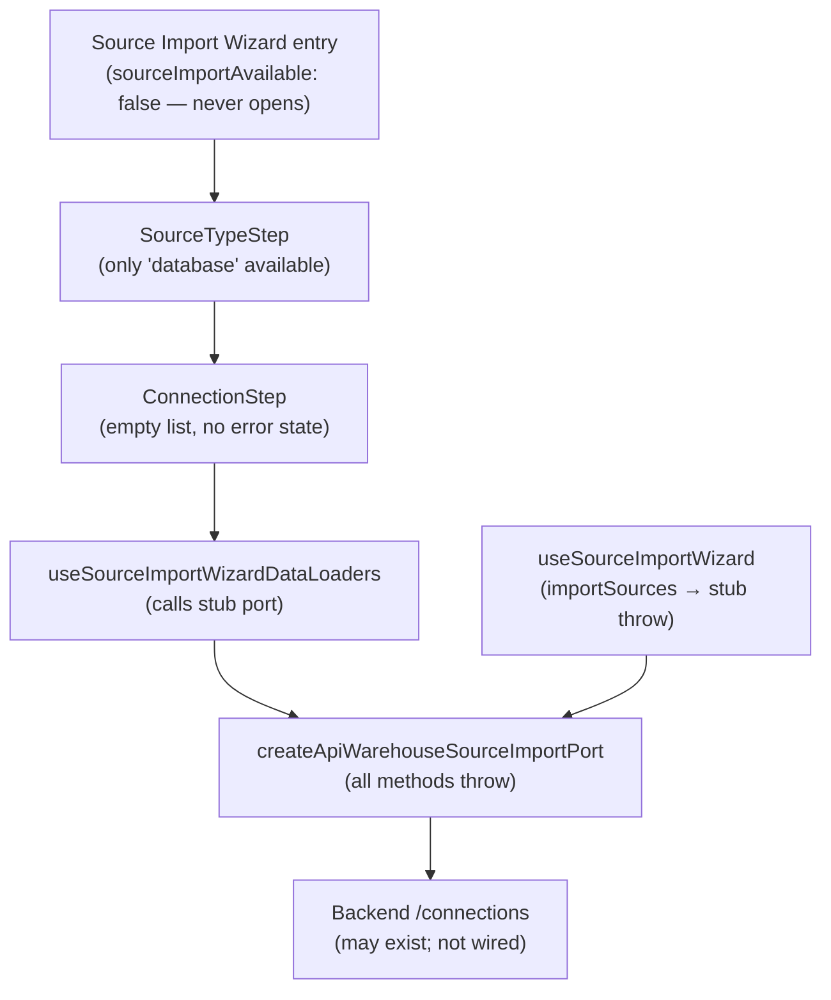

# Fowler Analysis — Database Connection Flow Permanently Stubbed

## Scope

This analysis reviews the gap that makes it impossible for a user to connect a
database as a data source. The wizard UI is fully built but the backend port
throws on every method.

The review covers:

- `createApiWarehouseSourceImportPort()` in `workspacePorts.api.ts` (L131-149):
  all three methods (`listWarehouseConnections`, `listWarehouseTables`,
  `importSources`) throw `warehouseImportApiModeUnavailable`;
- `useSourceImportWizardDataLoaders.ts` calling the stub port on wizard load,
  triggering immediate failure before the user sees any connection list;
- `ConnectionStep.tsx` rendering a connection selector over an always-empty
  connection list with no explanation;
- the absence of a "Test Connection" button — there is no way to validate
  credentials before committing to an import.

It does not cover:

- File, API, and Stream source types (separate analysis);
- canvas source import entry point (`sourceImportAvailable: false` flag);
- backend warehouse connector service implementation;
- credential storage security model.

## Governing Sources

- `AGENTS.md`
- `docs/planning/status/governance-document-rule-inventory.md`
- `docs/guides/ai-work-protocol.md`
- `docs/architecture/command-query-rail-governance.md`
- `apps/web/src/app/components/sourceImportWizard/ConnectionStep.tsx`
- `apps/web/src/app/components/sourceImportWizard/useSourceImportWizardDataLoaders.ts`
- `apps/web/src/app/components/sourceImportWizard/useSourceImportWizard.ts`
- `apps/web/src/app/services/workspace/workspacePorts.api.ts`

## Mature-System Comparison

Mature database connection UIs enforce four rules:

1. **Connection list loads before the wizard opens** — if the backend has no
   connections, the wizard shows "No connections configured" with a CTA to add
   one, not an empty selector with no explanation.
2. **Test Connection before import** — users can validate credentials and
   reachability before triggering a potentially long import operation.
3. **Port stub is a temporary state** — a stub that unconditionally throws is
   acceptable in early development but must not ship as the default runtime
   behaviour on a visible route.
4. **Error state is distinguished from empty state** — "could not load
   connections" and "you have no connections" are different messages.

The current implementation violates all four: the wizard opens over an empty
list produced by an unconditional throw, there is no test button, the stub
is the production runtime, and error and empty states are collapsed.

## Improved Patterns

| Area                 | Improvement                                                                                                   | Mature-system pattern          |
| -------------------- | ------------------------------------------------------------------------------------------------------------- | ------------------------------ |
| Port stub            | Implement real `GET /connections` and `GET /connections/{id}/tables` HTTP calls.                              | Adapter / Port implementation  |
| Pre-wizard check     | Before opening the wizard, check if connections exist; redirect to "Add Connection" if none.                  | Capability-gated wizard entry  |
| Test Connection      | Add a "Test Connection" step or button that calls a `POST /connections/{id}/test` endpoint before proceeding. | Pre-flight validation          |
| Error vs empty state | Distinguish connection load failure from empty connection list in `ConnectionStep`.                           | Explicit state differentiation |

## Antipatterns Detected

| Antipattern          | Evidence                                                                                                    | Fowler signal     | Impact                                                                                   |
| -------------------- | ----------------------------------------------------------------------------------------------------------- | ----------------- | ---------------------------------------------------------------------------------------- |
| Permanent stub       | `listWarehouseConnections`, `listWarehouseTables`, `importSources` all throw unconditionally.               | Dead code path    | Every wizard session fails at the first async call; user sees error immediately on load. |
| Ghost wizard         | `ConnectionStep.tsx` renders a connection selector over an always-empty list; no error or empty state.      | Ghost interaction | User sees a blank connection list and cannot progress; no explanation why.               |
| No pre-flight        | No "Test Connection" step exists; users cannot validate credentials before a potentially expensive import.  | Missing guard     | User discovers a bad connection only after the import fails, not before.                 |
| Error/empty collapse | `useSourceImportWizardDataLoaders` returns `[]` on error and on empty; `ConnectionStep` cannot distinguish. | Hidden failure    | "No connections" and "load failed" look identical to the user.                           |

## Component Grouping

| Component                            | Owned concern                                                              | Current state                                    | Target state                                                                                  |
| ------------------------------------ | -------------------------------------------------------------------------- | ------------------------------------------------ | --------------------------------------------------------------------------------------------- |
| `createApiWarehouseSourceImportPort` | Adapt `/connections` and `/connections/{id}/tables` to the port interface. | All methods throw unconditionally.               | Implements real HTTP calls; returns typed connection and table lists.                         |
| `ConnectionStep`                     | Display available connections and allow selection.                         | Renders empty list with no error or empty state. | Shows error state when load fails; shows "Add Connection" CTA when list is empty.             |
| `useSourceImportWizardDataLoaders`   | Load connections and tables for the wizard.                                | Returns `[]` silently when port throws.          | Returns `{ connections, connectionsError }` so `ConnectionStep` can render the correct state. |
| `useSourceImportWizard`              | Orchestrate wizard state and import submission.                            | Calls stub `importSources` — always throws.      | Calls real `importSources`; handles success and error states with user feedback.              |

## Repetitions

- The three-method stub pattern (`listWarehouseConnections`, `listWarehouseTables`,
  `importSources`) mirrors the three-method stub for `getRoles` / `getAuditLog`
  in the admin port. The same `rejectUnsupportedApiWorkspaceCapability` helper
  pattern is reused. Fixing all stubs together is more efficient than fixing them
  one by one.
- The silent `data ?? []` fallback in `useSourceImportWizardDataLoaders`
  (returning `[]` on error) duplicates the same pattern in `useAdminViewData`
  for roles and audit log.

## Opportunities

1. **Implement `listWarehouseConnections()` and `listWarehouseTables()`**
   — replace stubs with real `GET /connections` and
   `GET /connections/{id}/tables` HTTP calls; gate the wizard behind the
   `sourceImportAvailable` capability flag.

2. **Add a "Test Connection" pre-flight step**
   — after the user selects a connection, call `POST /connections/{id}/test`;
   show success/failure feedback before the table selection step.

3. **Differentiate empty vs. error states in `ConnectionStep`**
   — return `connectionsError` from `useSourceImportWizardDataLoaders`;
   `ConnectionStep` renders an error state ("Could not load connections") or an
   empty state ("No connections configured — add one first").

4. **Pre-wizard connection check**
   — before opening the wizard, query `listWarehouseConnections`; if empty,
   show a modal with a "Configure a connection" CTA instead of opening an
   empty wizard.

## Drift To Fix

| Drift                                                                                      | Fix                                                                                                  |
| ------------------------------------------------------------------------------------------ | ---------------------------------------------------------------------------------------------------- |
| `workspacePorts.api.ts` L131-149 — all three warehouse port methods throw unconditionally. | Implement real HTTP adapters for `listWarehouseConnections`, `listWarehouseTables`, `importSources`. |
| `ConnectionStep.tsx` — no error or empty state; renders blank connection list.             | Add `isError` and `isEmpty` branches; render appropriate states with actionable messages.            |
| `useSourceImportWizardDataLoaders.ts` — swallows connection load error.                    | Return `connectionsError` from the hook; surface in `ConnectionStep`.                                |
| No "Test Connection" button in the wizard.                                                 | Add `POST /connections/{id}/test` API call; insert test step after connection selection.             |

## ADR Assessment

No ADR is required for implementing the HTTP adapters if the backend
connection endpoints already exist. An ADR is required if a new credential
storage model (e.g., encrypted secrets service, OAuth token flow for warehouse
connections) is introduced that changes the security contract of the existing
workspace session model.

## Fowler Opportunity Matrix

| scenario                                                                                               | opportunity                                                                                              | Fowler pattern                                  | DDD owner                                                                          | command/query rail                                                              | implementation surfaces                                                                       | unit or package test                                                                  | architecture test                                                                      | user-flow test                                                            | out of scope                           |
| ------------------------------------------------------------------------------------------------------ | -------------------------------------------------------------------------------------------------------- | ----------------------------------------------- | ---------------------------------------------------------------------------------- | ------------------------------------------------------------------------------- | --------------------------------------------------------------------------------------------- | ------------------------------------------------------------------------------------- | -------------------------------------------------------------------------------------- | ------------------------------------------------------------------------- | -------------------------------------- |
| User opens source import wizard and selects Database; connection list is always empty; no error shown. | Permanent stub — `listWarehouseConnections` throws unconditionally; `ConnectionStep` renders blank list. | Stub as permanent state / Ghost interaction.    | `createApiWarehouseSourceImportPort` (adapter) + `ConnectionStep` (presentation).  | Query rail: `ListWarehouseConnections` — read model against `GET /connections`. | `workspacePorts.api.ts` (implement HTTP call), `ConnectionStep.tsx` (add error/empty states). | Unit: mock API returns connections; `useSourceImportWizardDataLoaders` resolves list. | Architecture: no production port factory throws unconditionally for core import rails. | Playwright: connection list shows real connections from API.              | Backend connection credential storage. |
| User selects a connection and proceeds; discovers a bad connection only when import fails.             | No pre-flight validation — no "Test Connection" step exists before table selection.                      | Missing guard / Pre-flight validation.          | `useSourceImportWizard` (orchestration) + new `TestConnectionStep` (presentation). | Command rail: `TestWarehouseConnection` — POST `/connections/{id}/test`.        | New `TestConnectionStep.tsx`, `workspacePorts.api.ts` (add test method).                      | Unit: test connection failure shows error state, does not proceed to table selection. | Architecture: wizard flow includes a test step before table selection.                 | Playwright: user tests connection; failure shows error before table step. | Backend connection service.            |
| API fails to load connections; `ConnectionStep` shows same blank list as "no connections" state.       | Error/empty collapse — `useSourceImportWizardDataLoaders` returns `[]` on both error and empty.          | Hidden failure / Missing state differentiation. | `useSourceImportWizardDataLoaders` (data hook) + `ConnectionStep` (presentation).  | Same `ListWarehouseConnections` query rail.                                     | `useSourceImportWizardDataLoaders.ts` (expose error), `ConnectionStep.tsx` (error state).     | Unit: when API returns 500, hook exposes `connectionsError`.                          | Architecture: `ConnectionStep` receives and renders `connectionsError`.                | Playwright: 500 response shows "Could not load connections" message.      | Backend error categorisation.          |
