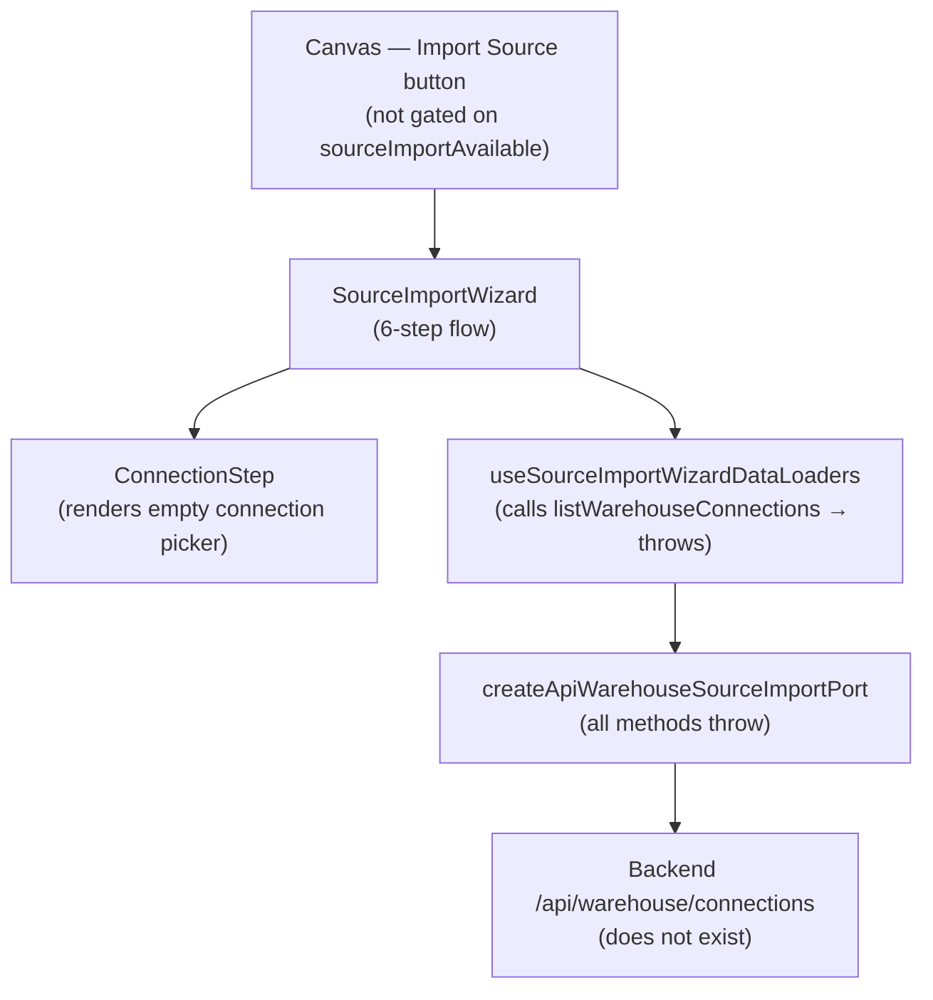

# Fowler Analysis — Database Connection Port Permanent Stub

## Scope

This analysis reviews the gap that prevents users from connecting to a
warehouse database through the source import wizard.

The review covers:

- `createApiWarehouseSourceImportPort()` in `workspacePorts.api.ts` (L131-149)
  throwing "warehouseImportApiModeUnavailable" on all three methods:
  `listWarehouseConnections`, `listWarehouseTables`, and `importSources`;
- `useSourceImportWizardDataLoaders.ts` attempting to call these three methods
  and receiving immediate errors on every wizard open;
- the connection selection step (`ConnectionStep.tsx`) rendering a fully built
  UI — connection cards, loading states, error handling — that never receives
  data because the port throws before any response can arrive;
- the absence of a "test connection" action anywhere in the wizard flow.

It does not cover:

- File, API, and Stream source types (separate analysis: source type policy);
- backend warehouse connector service implementation;
- credential storage or secrets management;
- multi-tenant connection isolation.

## Governing Sources

- `AGENTS.md`
- `docs/planning/status/governance-document-rule-inventory.md`
- `docs/guides/ai-work-protocol.md`
- `docs/architecture/command-query-rail-governance.md`
- `docs/architecture/fowler-opportunity-planning-governance.md`
- `docs/architecture/components/web/frontend-fowler-implementation-pattern.md`
- `apps/web/src/app/services/workspace/workspacePorts.api.ts`
- `apps/web/src/app/components/sourceImportWizard/ConnectionStep.tsx`
- `apps/web/src/app/components/sourceImportWizard/useSourceImportWizardDataLoaders.ts`
- `apps/web/src/app/components/sourceImportWizard/useSourceImportWizard.ts`

## Mature-System Comparison

Mature warehouse connection UIs apply three rules:

1. **Port is never permanently broken** — either the feature works end-to-end
   or the entry point is hidden behind a capability flag. A wizard that opens
   and immediately fails is worse than a wizard that is not yet accessible.
2. **Connection selection is async and resilient** — loading connections shows
   a skeleton state; an empty list shows an "Add connection" call-to-action;
   a failed load shows a retry option.
3. **Test connection is a first-class action** — before the user commits to an
   import, they can verify the connection is reachable. This is a standard
   affordance in every mature ETL and BI tool.

The current state violates all three: the wizard opens, immediately throws
an error from the port, and the user sees a broken loading state with no
recovery path.

## Improved Patterns

| Area                   | Improvement                                                                                                         | Mature-system pattern         |
| ---------------------- | ------------------------------------------------------------------------------------------------------------------- | ----------------------------- |
| Port stub              | Implement `listWarehouseConnections`, `listWarehouseTables`, `importSources` with real HTTP calls.                  | Adapter / Port implementation |
| Capability gate        | If backend is not ready, hide the "Import from warehouse" entry point rather than letting the wizard open and fail. | Capability-gated feature      |
| Connection empty state | When no connections exist, render "Add your first connection" CTA instead of an empty connection picker.            | Explicit empty state          |
| Test connection        | Add a "Test connection" button on the connection step that fires a lightweight reachability check.                  | First-class diagnostic action |
| Error recovery         | When connection load fails, show a "Retry" option and a "Contact support" link instead of a dead spinner.           | Graceful degradation          |

## Antipatterns Detected

| Antipattern         | Evidence                                                                                                                                        | Fowler signal        | Impact                                                                                              |
| ------------------- | ----------------------------------------------------------------------------------------------------------------------------------------------- | -------------------- | --------------------------------------------------------------------------------------------------- |
| Permanent stub      | `createApiWarehouseSourceImportPort()` throws on all three methods unconditionally.                                                             | Dead code path       | Wizard is permanently broken; no user can complete a warehouse import regardless of backend state.  |
| Ghost wizard        | `ConnectionStep.tsx` renders a fully interactive connection picker that can never receive data.                                                 | Incomplete behaviour | User opens the wizard expecting to connect; sees a loading state that never resolves.               |
| Missing test action | No "Test connection" button exists anywhere in the wizard flow.                                                                                 | Missing affordance   | User cannot verify a connection before committing to an import; no feedback on credential validity. |
| Silent entry point  | The canvas "Import source" button opens the wizard without checking `sourceImportAvailable`; the flag exists but the button is not gated on it. | Boundary confusion   | `apiWorkspacePortCapabilities.sourceImportAvailable = false` is set but the entry point ignores it. |

## Component Grouping

| Component                            | Owned concern                                            | Current state                                                  | Target state                                                                                            |
| ------------------------------------ | -------------------------------------------------------- | -------------------------------------------------------------- | ------------------------------------------------------------------------------------------------------- |
| `createApiWarehouseSourceImportPort` | Adapt warehouse backend to `IWarehouseSourceImportPort`. | All three methods throw immediately.                           | Implements `GET /api/warehouse/connections`, `GET /api/warehouse/tables`, `POST /api/warehouse/import`. |
| `ConnectionStep`                     | Display available connections and allow selection.       | Renders loading skeleton; never receives data.                 | Shows real connections; renders empty state CTA when none exist; includes "Test connection" button.     |
| `useSourceImportWizardDataLoaders`   | Load connections and tables for the wizard.              | Error swallowed silently; wizard stays in loading state.       | Surfaces `connectionsError`; wizard renders error + retry state.                                        |
| Canvas entry point                   | Open the import wizard when the user clicks "Import".    | Opens wizard regardless of `sourceImportAvailable` capability. | Checks `sourceImportAvailable`; shows "Coming soon" tooltip when false instead of opening wizard.       |

## Repetitions

- The `throw new Error(warehouseImportApiModeUnavailable)` pattern is repeated
  in all three methods of the same factory. A single fix to the factory
  eliminates all three stubs at once.
- The `sourceImportAvailable: false` flag in `apiWorkspacePortCapabilities`
  already provides the right capability gate — it just is not consumed by the
  canvas button that opens the wizard.

## Opportunities

1. **Gate the canvas "Import Source" button on `sourceImportAvailable`**
   — read `apiWorkspacePortCapabilities.sourceImportAvailable`; render a
   disabled button with a tooltip ("Warehouse import not available in this
   workspace") when false. Prevents the broken wizard from opening at all
   until the port is implemented.

2. **Implement `listWarehouseConnections()` in the warehouse port**
   — replace the throw with a real `GET /api/workspace/connections` HTTP call;
   return a typed `WarehouseConnection[]`.

3. **Implement `listWarehouseTables()` and `importSources()`**
   — complete the remaining two methods to enable the full import flow.

4. **Add "Test connection" to `ConnectionStep`**
   — a lightweight `GET /api/workspace/connections/{id}/test` call that shows
   a green check or red error inline before the user proceeds to table selection.

5. **Add empty state and retry to `ConnectionStep`**
   — when connections load as `[]`, render "No connections configured — add a
   warehouse connection in workspace settings"; when the load fails, render
   "Failed to load connections" with a Retry button.

## Drift To Fix

| Drift                                                                    | Fix                                                                                                      |
| ------------------------------------------------------------------------ | -------------------------------------------------------------------------------------------------------- |
| `workspacePorts.api.ts` L131-149 — all methods throw.                    | Implement real HTTP adapters for `listWarehouseConnections`, `listWarehouseTables`, `importSources`.     |
| Canvas import button — not gated on `sourceImportAvailable`.             | Check `apiWorkspacePortCapabilities.sourceImportAvailable`; show disabled state with tooltip when false. |
| `ConnectionStep.tsx` — no empty state, no retry, no test connection.     | Add CTA for empty list, retry button for failed load, test connection action with inline feedback.       |
| `useSourceImportWizardDataLoaders.ts` — `connectionsError` not surfaced. | Return `connectionsError` from the hook; `ConnectionStep` renders error state.                           |

## ADR Assessment

No ADR is required for implementing HTTP adapters if the backend endpoints
already exist. An ADR is required if the warehouse connection model introduces
a new credential storage boundary, a new connection pooling contract, or a
new multi-tenant isolation model that does not already exist in the system.

## Fowler Opportunity Matrix

| scenario                                                                                                       | opportunity                                                                                                                      | Fowler pattern                                | DDD owner                                                                         | command/query rail                                                                            | implementation surfaces                                                                               | unit or package test                                                           | architecture test                                                               | user-flow test                                                                              | out of scope                                        |
| -------------------------------------------------------------------------------------------------------------- | -------------------------------------------------------------------------------------------------------------------------------- | --------------------------------------------- | --------------------------------------------------------------------------------- | --------------------------------------------------------------------------------------------- | ----------------------------------------------------------------------------------------------------- | ------------------------------------------------------------------------------ | ------------------------------------------------------------------------------- | ------------------------------------------------------------------------------------------- | --------------------------------------------------- |
| User clicks "Import from warehouse" on canvas; wizard opens; connection list never loads; spinner never stops. | Ghost wizard — `createApiWarehouseSourceImportPort` throws on `listWarehouseConnections`; UI is complete but permanently broken. | Permanent stub / Ghost wizard.                | `createApiWarehouseSourceImportPort` (adapter) + `ConnectionStep` (presentation). | Query rail: `ListWarehouseConnections` — read model against `GET /api/workspace/connections`. | `workspacePorts.api.ts` (implement HTTP call), `useSourceImportWizardDataLoaders.ts` (surface error). | Unit: mock API returns connections; `ConnectionStep` renders connection cards. | Architecture: no production wizard adapter method throws synchronously.         | Playwright: user opens import wizard; connection list loads within 2s.                      | Backend connection pooling; multi-tenant isolation. |
| Warehouse import entry point is always accessible even though `sourceImportAvailable = false`.                 | Silent entry point — canvas button does not check capability flag; wizard opens in broken state.                                 | Capability gate missing / Boundary confusion. | Canvas toolbar (presentation) + `apiWorkspacePortCapabilities`.                   | None — capability flag already exists.                                                        | Canvas import button (add capability check), tooltip component.                                       | Unit: when `sourceImportAvailable` is false, button is disabled.               | Architecture: canvas import button reads capability flag before opening wizard. | Playwright: when capability false, clicking import shows tooltip not wizard.                | Backend source adapters.                            |
| User selects a connection but has no way to verify it is reachable before importing.                           | Missing test action — no "Test connection" button exists; user cannot validate credentials before committing.                    | Missing affordance / Incomplete flow.         | `ConnectionStep` (presentation) + new `TestConnectionCommand` rail.               | New command rail: `TestWarehouseConnection` — `GET /api/workspace/connections/{id}/test`.     | `ConnectionStep.tsx` (add test button), new API call.                                                 | Unit: test button triggers test call; inline result shown.                     | Architecture: `ConnectionStep` has a test connection action.                    | Playwright: user clicks "Test connection"; inline green check appears for valid connection. | Credential storage; secrets management.             |
