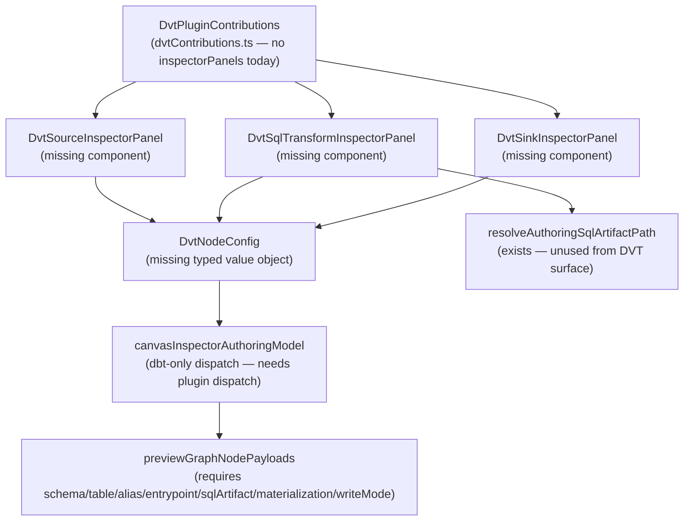

# Fowler Analysis — DVT Inspector UI Gap

## Scope

This analysis reviews the frontend capability gap that prevents users of the
`dvt` plugin from authoring a complete transformation graph on the Canvas.

The review covers:

- `canvasInspectorAuthoringModel.ts` only generating draft metadata for `dbt`
  nodes, leaving `dvt:source`, `dvt:sql_transform`, and `dvt:sink` nodes with
  no inspector configuration panel;
- `previewGraphNodePayloads.ts` requiring `metadata.config` fields
  (`schema`, `table`, `alias`, `entrypoint`, `sqlArtifact`,
  `materialization`, `writeMode`) that are never populated for DVT nodes;
- `dvtContributions.ts` declaring no `inspectorPanels` contribution while the
  analogous `dbtContributions.ts` wires `dbtInspectorPanels` covering all
  node types;
- the `resolveAuthoringSqlArtifactPath()` and
  `resolveAuthoringSqlIdentifier()` utilities already existing but being
  unreachable from the DVT node authoring surface.

It does not cover:

- backend plan compiler changes for DVT nodes;
- changes to the `GenericGraphSourceV1` contract or planner boundary;
- new SQL execution runtime for DVT transforms;
- UI redesign of inspector panel layout or styling;
- dbt plugin inspector changes.

## Governing Sources

- `AGENTS.md`
- `docs/planning/status/governance-document-rule-inventory.md`
- `docs/guides/ai-work-protocol.md`
- `docs/architecture/command-query-rail-governance.md`
- `docs/architecture/fowler-opportunity-planning-governance.md`
- `docs/architecture/components/web/frontend-fowler-implementation-pattern.md`
- `apps/web/src/app/views/canvas/canvasInspectorAuthoringModel.ts`
- `apps/web/src/app/views/canvas/previewGraphNodePayloads.ts`
- `apps/web/src/app/plugins/dvt/dvtContributions.ts`
- `apps/web/src/app/plugins/dbt/DbtNodeRenderer.tsx`
- `apps/web/src/app/plugins/dbt/dbtContributions.ts`
- `apps/web/src/app/views/canvas/resolveAuthoringSqlArtifactPath.ts`

## Mature-System Comparison

Mature plugin-extensible canvas systems enforce a uniform authoring contract
for every registered node type:

1. **Registered and authorable** — the plugin contributes inspector panels
   that populate `metadata.config`; the canvas payload builder reads those
   fields without defensive fallbacks.
2. **Registered and preview-ready** — the canvas payload builder can construct
   a valid preview request from the authored metadata with no missing-field
   errors.
3. **Registered but author-incomplete** — the node renders on the canvas but
   the inspector prompts the user to complete required fields; preview is
   gated on completion.
4. **Registered but not authorable** — the node has no inspector
   contribution; runtime preview always fails; no feedback path exists.

DVT nodes are currently in state 4. Every dbt node is in state 2 or 3 because
`dbtContributions.ts` wires `dbtInspectorPanels`. DVT nodes share the same
canvas and preview infrastructure but have no inspector contribution at all.

Mature systems also enforce the plugin contract at registration time: a plugin
that registers a node type but contributes no inspector panels for it should
either be rejected at development time or produce a typed "incomplete" marker
that prevents silent runtime failures.

## Improved Patterns

| Area                    | Improvement                                                                                                                                                       | Mature-system pattern                |
| ----------------------- | ----------------------------------------------------------------------------------------------------------------------------------------------------------------- | ------------------------------------ |
| Plugin contract         | `dvtContributions.ts` should mirror `dbtContributions.ts` with typed `inspectorPanels` for each registered node type.                                             | Plugin manifest / contribution point |
| Authoring model         | `canvasInspectorAuthoringModel.ts` discriminates on `pluginId` with a named builder per plugin rather than an ad-hoc ternary.                                     | Strategy / plugin dispatch           |
| Payload builder         | `previewGraphNodePayloads.ts` receives a fully-populated config object; it does not guess defaults for missing fields.                                            | Validated value object / data class  |
| SQL artifact resolution | `resolveAuthoringSqlArtifactPath()` and `resolveAuthoringSqlIdentifier()` are already correct; they need to be called from the DVT inspector panel on draft save. | Utility / domain service reuse       |

## Antipatterns Detected

| Antipattern             | Evidence                                                                                                                                                                   | Fowler signal           | Impact                                                                                                         |
| ----------------------- | -------------------------------------------------------------------------------------------------------------------------------------------------------------------------- | ----------------------- | -------------------------------------------------------------------------------------------------------------- |
| Hidden authority        | `canvasInspectorAuthoringModel.ts:25` — `node.pluginId === 'dbt'` string literal controls which nodes receive authoring metadata. DVT nodes get an empty config silently.  | Hidden authority        | Adding any plugin requires editing this file; plugin authors cannot extend without forking the authoring core. |
| Feature envy            | `canvasInspectorAuthoringModel.ts` reaches into `dbt`-specific domain knowledge (`createDbtNodeAuthoringMetadata`) but has no equivalent seam for DVT or future plugins.   | Feature envy            | Every new plugin kind requires a new branch here rather than a dispatch to the plugin's own contribution.      |
| Anemic domain           | DVT nodes carry no `metadata.config` state because no inspector panel exists to write it. The draft node object is structurally valid but semantically empty.              | Anemic domain           | The plan preview fails at runtime because the payload builder requires fields the authoring model never sets.  |
| Boundary drift          | `resolveAuthoringSqlArtifactPath()` and `resolveAuthoringSqlIdentifier()` are implemented and correct but have no caller path from any DVT UI surface.                     | Boundary drift          | Real infrastructure exists but is unreachable; the boundary between authoring and artifact resolution is open. |
| Primitive obsession     | `previewGraphNodePayloads.ts` reads `metadata.config.schema`, `metadata.config.table`, `metadata.config.alias` etc. with no typed config shape enforced at authoring time. | Primitive obsession     | Silent `undefined` fields cause runtime preview errors rather than compile-time or form-validation errors.     |
| Responsibility overload | `canvasInspectorAuthoringModel.ts` owns both node type discrimination and plugin-specific metadata construction. These are two separate concerns.                          | Responsibility overload | Adding a third plugin requires yet another branch inside a file that was not designed for extension.           |

## Component Grouping

The DVT inspector authoring capability crosses three owned concerns:

| Component                                                           | Owned concern                                                                                 | Current state                                                    | Target state                                                                                                                            |
| ------------------------------------------------------------------- | --------------------------------------------------------------------------------------------- | ---------------------------------------------------------------- | --------------------------------------------------------------------------------------------------------------------------------------- |
| `DvtPluginContributions`                                            | Register DVT node inspector panels in the canvas plugin system.                               | No `inspectorPanels` key in `dvtContributions.ts`.               | Add `inspectorPanels` array with one panel per node type, mirroring the `dbtContributions.ts` pattern.                                  |
| `DvtSourceInspectorPanel`                                           | Render and validate `schema`, `table`, `alias` fields for a `dvt:source` node.                | Does not exist.                                                  | New React component contributing schema/table/alias form fields to the inspector; saves to node draft config on change.                 |
| `DvtSqlTransformInspectorPanel`                                     | Render a governed SQL editor and `entrypoint` + `sqlArtifact` wiring for `dvt:sql_transform`. | Does not exist.                                                  | New React component with an inline SQL editor; calls `resolveAuthoringSqlArtifactPath()` and `resolveAuthoringSqlIdentifier()` on save. |
| `DvtSinkInspectorPanel`                                             | Render and validate `schema`, `table`, `materialization`, `writeMode` for a `dvt:sink` node.  | Does not exist.                                                  | New React component with schema/table/materialization select/writeMode select; saves to node draft config on change.                    |
| `DvtNodeConfig`                                                     | Typed config shape shared by the three DVT inspector panels.                                  | Implicit — fields exist only as string keys in payload builders. | Typed interface or Zod schema owned by the DVT plugin; consumed by inspector panels and payload builders.                               |
| `canvasInspectorAuthoringModel`                                     | Dispatch node draft generation to the correct plugin.                                         | Hard-coded `pluginId === 'dbt'` ternary; DVT nodes return `{}`.  | Plugin dispatch: each plugin registers a `buildAuthoringMetadata` function; the model calls it by pluginId.                             |
| `resolveAuthoringSqlArtifactPath` / `resolveAuthoringSqlIdentifier` | Generate stable SQL artifact path and SQL identifier from node draft.                         | Implemented correctly in `resolveAuthoringSqlArtifactPath.ts`.   | Call from `DvtSqlTransformInspectorPanel` on save to populate `sqlArtifact` and `entrypoint` in the draft config.                       |

## Repetitions

- The `pluginId === 'dbt'` pattern in `canvasInspectorAuthoringModel.ts` is
  the same style of plugin discrimination as `pluginId === 'dbt'` checks
  found in `previewGraphNodePayloads.ts` for node kind routing. The system
  has no shared plugin dispatch table.
- The "inspector panels contribute to draft config, draft config feeds payload
  builder" pattern exists fully for dbt but must be replicated for DVT rather
  than being derived from a shared, extensible plugin contract.
- `schema` / `table` fields appear in both `dvt:source` and `dvt:sink`
  inspector requirements. A shared `SchemaTableField` component or typed
  pair would prevent duplication between the two panels.

## Opportunities

1. **Add `DvtSourceInspectorPanel` with `schema`, `table`, `alias` fields**
   — wire to `dvtContributions.ts`; save to node draft config; test that
   `previewGraphNodePayloads.requireSourcePayload()` succeeds after form fill.

2. **Add `DvtSqlTransformInspectorPanel` with inline SQL editor**
   — call `resolveAuthoringSqlArtifactPath()` and
   `resolveAuthoringSqlIdentifier()` on save; populate `entrypoint` and
   `sqlArtifact` in draft config; test that
   `previewGraphNodePayloads.requireTransformPayload()` succeeds.

3. **Add `DvtSinkInspectorPanel` with `schema`, `table`, `materialization`,
   `writeMode` fields**
   — wire to `dvtContributions.ts`; test that
   `previewGraphNodePayloads.requireSinkPayload()` succeeds.

4. **Introduce `DvtNodeConfig` typed interface**
   — replace implicit string key access in payload builders with a typed
   config shape owned by the DVT plugin; eliminates silent `undefined` fields.

5. **Refactor `canvasInspectorAuthoringModel.ts` to a plugin dispatch table**
   — remove the `pluginId === 'dbt'` ternary; each plugin registers its own
   `buildAuthoringMetadata()` function; `canvasInspectorAuthoringModel` calls
   it by pluginId with a fallback to empty draft for unknown plugins.

6. **Architecture test — assert inspector panel completeness per plugin**
   — every registered plugin node type must have an inspector panel entry in
   the plugin's contributions; a test that fails if a plugin node type has no
   inspector panel prevents this class of gap from re-appearing.

## Drift To Fix

| Drift                                                                                                                                                                                         | Fix                                                                                                                                                                      |
| --------------------------------------------------------------------------------------------------------------------------------------------------------------------------------------------- | ------------------------------------------------------------------------------------------------------------------------------------------------------------------------ |
| `canvasInspectorAuthoringModel.ts:25` — `node.pluginId === 'dbt'` ternary returns `{}` for all non-dbt nodes.                                                                                 | Replace ternary with plugin-dispatch table; DVT plugin registers `buildDvtAuthoringMetadata(node)` that reads from draft config; authoring model calls it.               |
| `dvtContributions.ts` — no `inspectorPanels` key.                                                                                                                                             | Add `inspectorPanels` array with three entries: one per DVT node type.                                                                                                   |
| `previewGraphNodePayloads.ts` — `requireSourcePayload()` reads `metadata.config.schema` and `metadata.config.table` from draft without a fallback error message tied to incomplete authoring. | Once `DvtSourceInspectorPanel` exists, add a form-validation gate that prevents node save until required fields are filled; payload builder remains strict.              |
| `resolveAuthoringSqlArtifactPath()` is implemented but has no caller path from the DVT transform inspector.                                                                                   | `DvtSqlTransformInspectorPanel` calls `resolveAuthoringSqlArtifactPath(node)` on save and writes the result to `draft.config.sqlArtifact` and `draft.config.entrypoint`. |
| No typed `DvtNodeConfig` shape — config fields exist only as string keys in payload builders.                                                                                                 | Define a `DvtNodeConfig` interface in the DVT plugin package; use it in inspector panels and payload builders to get compile-time safety.                                |

## ADR Assessment

No ADR is required for adding inspector panels or the plugin dispatch
refactor. These apply existing governance from
`fowler-opportunity-planning-governance.md` and
`frontend-fowler-implementation-pattern.md` without introducing new
architectural boundaries, new data contracts, or new backend rails.

An ADR is required if the DVT SQL transform inspector introduces a new
artifact storage model (e.g., inline SQL blobs in the canvas graph rather
than workspace file artifacts). The current assumption is that
`resolveAuthoringSqlArtifactPath()` already defines the correct artifact path
pattern and no new storage model is needed.

## Fowler Opportunity Matrix

| scenario                                                                                                                                                                                  | opportunity                                                                                                                        | Fowler pattern                                      | DDD owner                                            | command/query rail                      | implementation surfaces                                                                           | unit or package test                                                                                                                | architecture test                                                                            | user-flow test                                                                      | out of scope                                          |
| ----------------------------------------------------------------------------------------------------------------------------------------------------------------------------------------- | ---------------------------------------------------------------------------------------------------------------------------------- | --------------------------------------------------- | ---------------------------------------------------- | --------------------------------------- | ------------------------------------------------------------------------------------------------- | ----------------------------------------------------------------------------------------------------------------------------------- | -------------------------------------------------------------------------------------------- | ----------------------------------------------------------------------------------- | ----------------------------------------------------- |
| User creates a `dvt:source` node on the canvas and opens the inspector; no config fields appear; preview fails with missing `schema` and `table`.                                         | Hidden authority — `canvasInspectorAuthoringModel` returns `{}` for DVT nodes; no inspector panel is registered for the node type. | Plugin Contribution Point / Dispatch Table.         | `DvtPluginContributions` (in `dvtContributions.ts`). | None — authoring-only; no backend rail. | `dvtContributions.ts`, new `DvtSourceInspectorPanel`, `canvasInspectorAuthoringModel.ts`.         | Unit: inspector panel saves `schema`, `table`, `alias` to draft config; `requireSourcePayload()` succeeds.                          | Architecture: every DVT node type has an inspector panel entry.                              | Playwright: user fills source fields; preview completes without error.              | Backend source adapter connection.                    |
| User creates a `dvt:sql_transform` node; no SQL editor appears; preview fails with missing `entrypoint` and `sqlArtifact`.                                                                | Boundary drift — `resolveAuthoringSqlArtifactPath()` exists and is correct but has no caller path from any DVT UI surface.         | Utility Reuse / Caller Wiring.                      | `DvtSqlTransformInspectorPanel` (new component).     | None — authoring-only; no backend rail. | New `DvtSqlTransformInspectorPanel`, `dvtContributions.ts`, `resolveAuthoringSqlArtifactPath.ts`. | Unit: panel calls `resolveAuthoringSqlArtifactPath(node)`; draft config contains correct `sqlArtifact` and `entrypoint` after save. | Architecture: sql_transform panel references `resolveAuthoringSqlArtifactPath` at call site. | Playwright: user writes SQL in inline editor; preview generates plan without error. | SQL execution runtime; file persistence to workspace. |
| User creates a `dvt:sink` node; no materialization or writeMode fields appear; preview fails with missing sink config.                                                                    | Anemic domain — `dvt:sink` draft node carries no authored config; the payload builder requires it at preview time.                 | Inspector Panel / Validated Draft.                  | `DvtSinkInspectorPanel` (new component).             | None — authoring-only; no backend rail. | New `DvtSinkInspectorPanel`, `dvtContributions.ts`.                                               | Unit: panel saves `schema`, `table`, `materialization`, `writeMode` to draft config; `requireSinkPayload()` succeeds.               | Architecture: every DVT node type has an inspector panel entry.                              | Playwright: user fills sink fields; full three-node graph previews without error.   | Backend sink write execution.                         |
| `canvasInspectorAuthoringModel.ts` uses a `pluginId === 'dbt'` ternary to dispatch authoring metadata; adding a third plugin requires editing the core authoring file.                    | Responsibility overload — the authoring model owns both dispatch logic and plugin-specific knowledge.                              | Strategy / Plugin Dispatch Table.                   | `canvasInspectorAuthoringModel` (refactor).          | None — internal authoring surface only. | `canvasInspectorAuthoringModel.ts`; each plugin registers `buildAuthoringMetadata`.               | Unit: authoring model calls the correct plugin builder for each pluginId; falls back to empty draft for unknown plugins.            | Architecture: no `pluginId === 'dbt'` string literal in `canvasInspectorAuthoringModel.ts`.  | None — no user-visible change from this refactor alone.                             | Plugin registry persistence or versioning.            |
| DVT node config fields (`schema`, `table`, `alias`, `entrypoint`, `sqlArtifact`, `materialization`, `writeMode`) are accessed as raw string keys in payload builders with no typed shape. | Primitive obsession — no typed config object; silent `undefined` fields cause runtime preview errors.                              | Typed Value Object / Replace Primitive with Object. | `DvtNodeConfig` (new typed interface in DVT plugin). | None — compile-time safety only.        | New `DvtNodeConfig` interface; updated payload builder imports.                                   | Unit: TypeScript compile check — `DvtNodeConfig` fields are typed; missing fields produce a compile error.                          | Architecture: payload builders use typed config imports, not string-indexed access.          | None — compile-time change only.                                                    | Runtime config persistence schema change.             |
