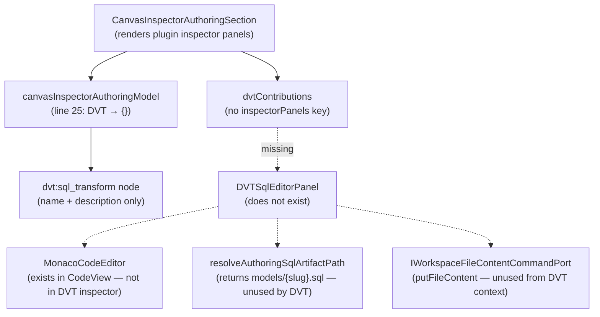

# Fowler Analysis — DVT SQL Transform Authoring Gap

## Scope

This analysis reviews the gap that prevents users from writing SQL — including
window functions, CTEs, and custom logic — inside a DVT SQL transform node on
the canvas.

The review covers:

- `dvtContributions.ts` — the DVT plugin has no `inspectorPanels` key; a
  `dvt:sql_transform` node renders only name and description fields in the
  inspector, with no SQL editor;
- `canvasInspectorAuthoringModel.ts:25` — the `draft.dbt` ternary generates
  dbt-specific config fields for dbt nodes and returns `{}` for DVT nodes,
  so the authoring model never produces SQL configuration state;
- `MonacoCodeEditor.tsx` existing as a capable SQL editor component used in
  `CodeView` but not registered in any DVT inspector panel contribution;
- `dvtNodeTypeCatalog.ts` defining `dvt:sql_transform` with `supportsColumns: false`
  and no reference to a SQL editor panel;
- `resolveAuthoringSqlArtifactPath(node)` already implemented and returning
  `models/{slug}.sql` — the path resolution infrastructure exists but is
  never called from the DVT inspector.

It does not cover:

- dbt node SQL authoring (separate flow — already partially implemented);
- SQL execution or preview (requires a run, separate gap);
- window function syntax validation or linting;
- schema-aware autocomplete (requires backend metadata, future scope).

## Governing Sources

- `AGENTS.md`
- `docs/planning/status/governance-document-rule-inventory.md`
- `docs/guides/ai-work-protocol.md`
- `docs/architecture/command-query-rail-governance.md`
- `docs/architecture/fowler-opportunity-planning-governance.md`
- `docs/architecture/components/web/frontend-fowler-implementation-pattern.md`
- `apps/web/src/app/plugins/dvt/dvtContributions.ts`
- `apps/web/src/app/plugins/dvt/dvtNodeTypeCatalog.ts`
- `apps/web/src/app/views/canvas/canvasInspectorAuthoringModel.ts`
- `apps/web/src/app/components/monaco/MonacoCodeEditor.tsx`
- `apps/web/src/app/views/canvas/resolveAuthoringSqlArtifactPath.ts`

## Mature-System Comparison

Mature SQL transform authoring in canvas-style data tools follows three rules:

1. **Clicking a transform node opens a SQL editor** — this is the primary
   authoring surface; it is never a form with text fields. The SQL is the
   model definition; the editor is the central affordance.
2. **The editor knows the node's context** — the SQL file path, the upstream
   column list, and the materialization strategy are all visible without
   leaving the editor panel.
3. **Window functions are just SQL** — the editor does not need special window
   function support beyond correct SQL syntax highlighting and indentation.
   Schema-aware autocomplete is desirable but not required for basic authoring.

The current state violates the first rule entirely: clicking a DVT SQL
transform node shows only name and description text fields. There is no SQL
editor, no file path, and no way to write logic.

## Improved Patterns

| Area             | Improvement                                                                                                           | Mature-system pattern              |
| ---------------- | --------------------------------------------------------------------------------------------------------------------- | ---------------------------------- |
| Inspector panels | `dvtContributions.ts` adds a `inspectorPanels` array with a `DVTSqlEditorPanel` contribution for `dvt:sql_transform`. | Plugin-contributed inspector panel |
| Authoring model  | `canvasInspectorAuthoringModel.ts` generates DVT-specific draft fields (`sqlContent`, `sqlPath`, `materialization`).  | Complete authoring model           |
| SQL editor       | `DVTSqlEditorPanel` embeds `MonacoCodeEditor` with `language="sql"`; reads from and writes to the DVT node draft.     | Monaco-backed SQL editor           |
| Context display  | The inspector panel shows the resolved SQL file path (`models/{slug}.sql`) and the materialization strategy.          | Context-aware editor panel         |
| Save path        | SQL content changes are saved via `IWorkspaceFileContentCommandPort.putFileContent()` to the resolved path.           | Edit → Save loop                   |

## Antipatterns Detected

| Antipattern                 | Evidence                                                                                                                   | Fowler signal         | Impact                                                                                                |
| --------------------------- | -------------------------------------------------------------------------------------------------------------------------- | --------------------- | ----------------------------------------------------------------------------------------------------- |
| Missing plugin contribution | `dvtContributions.ts` has `nodeRenderers`, `connectionRules`, `views` but no `inspectorPanels`.                            | Incomplete plugin     | DVT SQL transform nodes have no authoring surface; users cannot write any SQL logic.                  |
| Ternary data loss           | `canvasInspectorAuthoringModel.ts:25` — `draft.dbt ? dbtFields : {}` — DVT nodes produce an empty config object.           | Hidden authority      | All DVT node configuration is silently discarded; no DVT authoring state is ever generated.           |
| Unused infrastructure       | `resolveAuthoringSqlArtifactPath(node)` exists and returns the correct path but is never called from the DVT inspector.    | Unused infrastructure | The path resolution is implemented and correct; the wiring to call it is the only missing step.       |
| Unused component            | `MonacoCodeEditor.tsx` is a capable SQL editor present in `CodeView` but never imported in any DVT inspector contribution. | Component isolation   | The SQL editor component exists; it just is not registered in the plugin contribution system.         |
| supportsColumns: false      | `dvtNodeTypeCatalog.ts` — `dvt:sql_transform` has `supportsColumns: false`; column-level metadata is not modelled.         | Incomplete data model | Window function column references cannot be driven by node metadata; user must hardcode column names. |

## Component Grouping

| Component                           | Owned concern                                               | Current state                                                       | Target state                                                                                   |
| ----------------------------------- | ----------------------------------------------------------- | ------------------------------------------------------------------- | ---------------------------------------------------------------------------------------------- |
| `dvtContributions.ts`               | Register all DVT inspector panel contributions.             | No `inspectorPanels` key.                                           | Adds `inspectorPanels: [{ nodeKind: 'dvt:sql_transform', component: DVTSqlEditorPanel }]`.     |
| `canvasInspectorAuthoringModel.ts`  | Generate authoring draft state for any node type.           | L25 ternary returns `{}` for DVT nodes.                             | DVT branch generates `{ sqlContent, sqlPath, materialization, schema }` draft fields.          |
| `DVTSqlEditorPanel` (new component) | Provide the SQL authoring UI for `dvt:sql_transform` nodes. | Does not exist.                                                     | Embeds `MonacoCodeEditor` with SQL language; reads/writes `draft.sqlContent`; shows `sqlPath`. |
| `resolveAuthoringSqlArtifactPath`   | Return the SQL file path for a DVT node.                    | Implemented; returns correct path; never called from DVT inspector. | Called by `DVTSqlEditorPanel` to display and save the file path.                               |
| `dvt:sql_transform` node type       | Define the node kind and its capabilities.                  | `supportsColumns: false`; no SQL editor reference.                  | Consider `supportsColumns: true` once column metadata is available from SQL parsing.           |

## Repetitions

- The `inspectorPanels` contribution pattern is already used by the dbt plugin.
  The DVT plugin needs to follow the same registration pattern — no new
  infrastructure is needed, only a new panel component and a registration entry.
- `resolveAuthoringSqlArtifactPath` is already used in `canvasInspectorAuthoringModel`
  for dbt nodes. Extending the DVT branch to call the same function is a
  one-line addition.

## Opportunities

1. **Create `DVTSqlEditorPanel` component**
   — a new component that embeds `MonacoCodeEditor` with `language="sql"`;
   reads `draft.sqlContent`; calls `onDraftChange` on every keystroke
   (debounced); shows the resolved SQL file path and materialization selector.

2. **Register `DVTSqlEditorPanel` in `dvtContributions.ts`**
   — add `inspectorPanels: [{ nodeKind: 'dvt:sql_transform', component: DVTSqlEditorPanel }]`
   to the contributions object.

3. **Extend `canvasInspectorAuthoringModel.ts` DVT branch**
   — replace `{}` with a proper DVT draft object: `{ sqlContent, sqlPath,
materialization, schema }` derived from the node's existing config.

4. **Wire `putFileContent()` from `DVTSqlEditorPanel`**
   — when the user saves (Ctrl+S or Save button), call
   `IWorkspaceFileContentCommandPort.putFileContent(sqlPath, sqlContent)`.

5. **Add materialization selector to `DVTSqlEditorPanel`**
   — a dropdown for `table | view | incremental` that writes to
   `draft.materialization`; this is the minimum viable authoring surface for
   a window function model (which typically requires `incremental` or `table`).

## Drift To Fix

| Drift                                                                                | Fix                                                                                            |
| ------------------------------------------------------------------------------------ | ---------------------------------------------------------------------------------------------- |
| `dvtContributions.ts` — no `inspectorPanels` key.                                    | Add `inspectorPanels` with `DVTSqlEditorPanel` for `dvt:sql_transform`.                        |
| `canvasInspectorAuthoringModel.ts:25` — DVT nodes return `{}`.                       | Generate proper DVT draft fields; call `resolveAuthoringSqlArtifactPath(node)` for `sqlPath`.  |
| `MonacoCodeEditor` — not imported or used in any DVT inspector context.              | Import and embed in `DVTSqlEditorPanel`.                                                       |
| `resolveAuthoringSqlArtifactPath` — implemented but never called from DVT inspector. | Call from `canvasInspectorAuthoringModel` DVT branch and from `DVTSqlEditorPanel` for display. |

## ADR Assessment

No ADR is required for adding a new inspector panel component to the DVT
plugin contribution system. An ADR is required if the DVT SQL authoring
surface introduces a new SQL dialect contract, a new SQL artifact persistence
model, or a new inter-plugin dependency (e.g., DVT nodes that reference dbt
model outputs as upstream columns) that changes the existing plugin contract
boundaries.

## Fowler Opportunity Matrix

| scenario                                                                                                         | opportunity                                                                                                                         | Fowler pattern                                  | DDD owner                                                                 | command/query rail                                                  | implementation surfaces                                                               | unit or package test                                                               | architecture test                                                                      | user-flow test                                                                  | out of scope                                 |
| ---------------------------------------------------------------------------------------------------------------- | ----------------------------------------------------------------------------------------------------------------------------------- | ----------------------------------------------- | ------------------------------------------------------------------------- | ------------------------------------------------------------------- | ------------------------------------------------------------------------------------- | ---------------------------------------------------------------------------------- | -------------------------------------------------------------------------------------- | ------------------------------------------------------------------------------- | -------------------------------------------- |
| User creates a `dvt:sql_transform` node and clicks it; inspector shows only name and description; no SQL editor. | Missing plugin contribution — `dvtContributions.ts` has no `inspectorPanels`; no SQL authoring surface is registered.               | Incomplete plugin / Missing contribution.       | `dvtContributions.ts` (plugin) + `DVTSqlEditorPanel` (new component).     | Command rail: `SaveDVTSqlTransform` — write via `putFileContent()`. | `dvtContributions.ts` (add inspectorPanels), new `DVTSqlEditorPanel.tsx`.             | Unit: `dvt:sql_transform` node renders a Monaco SQL editor in the inspector.       | Architecture: every node kind with `role: transform` has a registered inspector panel. | Playwright: user clicks DVT SQL node; Monaco SQL editor opens in inspector.     | SQL execution; schema autocomplete.          |
| User writes a window function in the SQL editor; no save action exists; SQL is lost on navigation.               | Dead write path — `putFileContent()` port exists; DVT inspector has no save action wired.                                           | Unused infrastructure / Silent data loss.       | `DVTSqlEditorPanel` (new component) + `IWorkspaceFileContentCommandPort`. | Same `SaveDVTSqlTransform` command rail.                            | `DVTSqlEditorPanel.tsx` (add save), `useCodeEditableBuffer.ts` (reuse dirty pattern). | Unit: pressing Ctrl+S in DVT inspector calls `putFileContent()` with current SQL.  | Architecture: `DVTSqlEditorPanel` has a save action wired to `putFileContent`.         | Playwright: user writes SQL, saves, refreshes, SQL persists.                    | SQL execution; conflict resolution.          |
| DVT authoring model returns `{}` for all DVT nodes; no node state is ever initialised.                           | Ternary data loss — `canvasInspectorAuthoringModel.ts:25` discards DVT config with `draft.dbt ? dbtFields : {}`.                    | Hidden authority / Ternary antipattern.         | `canvasInspectorAuthoringModel` (view model).                             | None — UI initialisation only.                                      | `canvasInspectorAuthoringModel.ts` (add DVT branch).                                  | Unit: DVT node produces non-empty authoring draft with `sqlContent` and `sqlPath`. | Architecture: no `{}` return for nodes with kind prefixed `dvt:`.                      | Playwright: DVT node inspector initialises with file path and empty SQL editor. | SQL execution.                               |
| User wants to define a window function but has no materialization selector; cannot set model to incremental.     | Missing materialization context — DVT inspector panel (when it exists) needs a materialization selector for window function models. | Incomplete authoring surface / Missing context. | `DVTSqlEditorPanel` (new component).                                      | Same `SaveDVTSqlTransform` rail.                                    | `DVTSqlEditorPanel.tsx` (add materialization dropdown).                               | Unit: materialization selector writes to `draft.materialization`.                  | Architecture: DVT inspector panel has a materialization field.                         | Playwright: user selects "incremental"; run uses correct materialization.       | SQL validation; incremental strategy config. |
