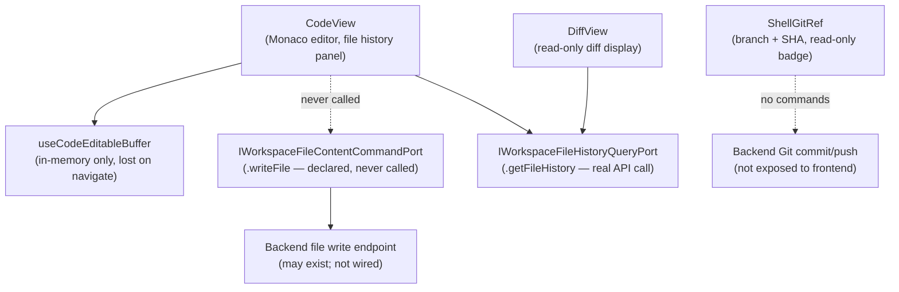

# Fowler Analysis — Git File Write Gap (Read-Only Code View)

## Scope

This analysis reviews the gap that prevents users from saving or committing
changes made in the Code view editor. The Monaco editor, file history panel,
and diff view all exist, but the write path is missing.

The review covers:

- `CodeView.tsx` hosting a Monaco SQL/YAML editor with a local buffer state
  that is never persisted — no save button, no file write call;
- `IWorkspaceFileContentCommandPort` declared in `ports/workspace.ts` with a
  `writeFile` method — the port exists but is not wired to any UI action;
- `ShellGitRef.tsx` displaying the current branch and commit SHA — read-only
  display with no commit or push action;
- `useCodeEditableBuffer.ts` managing editor state in component memory only —
  changes are lost on navigation.

It does not cover:

- backend Git service implementation (push, commit, branch management);
- conflict resolution UI;
- pull request or review workflow;
- real-time collaborative editing.

## Governing Sources

- `AGENTS.md`
- `docs/planning/status/governance-document-rule-inventory.md`
- `docs/guides/ai-work-protocol.md`
- `docs/architecture/command-query-rail-governance.md`
- `apps/web/src/app/views/CodeView.tsx`
- `apps/web/src/app/views/code/useCodeEditableBuffer.ts`
- `apps/web/src/app/components/shell/ShellGitRef.tsx`
- `apps/web/src/app/ports/workspace.ts`
- `apps/web/src/app/services/workspace/workspacePorts.api.ts`

## Mature-System Comparison

Mature code-editor-in-browser UIs apply three rules:

1. **Edit → Save → Persist** — a visible save action (button or keyboard
   shortcut) writes the buffer to the backend; the user has a clear affordance
   for persistence.
2. **Unsaved changes warning** — navigating away from an unsaved editor shows
   a confirmation dialog; changes are not silently lost.
3. **Git surface is command-capable** — the Git ref display (branch + SHA) is
   a navigable surface that exposes commit and push actions, not a read-only
   badge.

The current implementation violates all three: the editor buffer is local and
ephemeral, navigating away discards changes silently, and the Git ref is a
read-only display.

## Improved Patterns

| Area                  | Improvement                                                                                          | Mature-system pattern       |
| --------------------- | ---------------------------------------------------------------------------------------------------- | --------------------------- |
| Save action           | Add a "Save" button (and Ctrl+S shortcut) that calls `IWorkspaceFileContentCommandPort.writeFile()`. | Edit → Save → Persist       |
| Unsaved changes guard | Show a confirmation dialog when navigating away from a modified buffer.                              | Unsaved changes warning     |
| Git commit surface    | Extend `ShellGitRef` or add a Git panel with commit message input and commit/push actions.           | Command-capable Git surface |
| Buffer persistence    | Replace in-memory buffer with a persisted draft state (localStorage or backend draft endpoint).      | Persistent draft            |

## Antipatterns Detected

| Antipattern             | Evidence                                                                                                    | Fowler signal       | Impact                                                                           |
| ----------------------- | ----------------------------------------------------------------------------------------------------------- | ------------------- | -------------------------------------------------------------------------------- |
| Write port never called | `IWorkspaceFileContentCommandPort.writeFile` is declared in `ports/workspace.ts` but no UI action calls it. | Dead code path      | User can edit files but all changes are lost on navigation; no persistence path. |
| Ephemeral buffer        | `useCodeEditableBuffer.ts` manages editor state in component state only; no draft storage, no write-back.   | Hidden loss of work | Navigating away silently discards all edits; user has no warning.                |
| Read-only Git badge     | `ShellGitRef.tsx` renders branch + SHA as a static display with no interactive commands.                    | Ghost affordance    | User can see they are on a branch but cannot act on it from the UI.              |
| Command port orphan     | `IWorkspaceFileContentCommandPort` is defined but never instantiated in the production port registry.       | Responsibility void | The write contract exists in the type system but has no runtime implementation.  |

## Component Grouping

| Component                          | Owned concern                                   | Current state                                             | Target state                                                                                 |
| ---------------------------------- | ----------------------------------------------- | --------------------------------------------------------- | -------------------------------------------------------------------------------------------- |
| `useCodeEditableBuffer`            | Manage editor content and persistence.          | In-memory state; lost on unmount.                         | Persists to backend via `writeFile`; exposes `isDirty`, `save()`, and unsaved-changes guard. |
| `IWorkspaceFileContentCommandPort` | Write file content to the workspace.            | Declared in port types; never instantiated or called.     | Implemented in `workspacePorts.api.ts`; called from `useCodeEditableBuffer.save()`.          |
| `CodeView`                         | Host code editor with save and history actions. | No save button; no keyboard shortcut; no dirty indicator. | Save button (Ctrl+S); dirty indicator in tab title; unsaved-changes navigation guard.        |
| `ShellGitRef`                      | Display and act on current Git context.         | Static branch + SHA badge.                                | Clickable surface opening a Git panel with commit message and commit/push actions.           |

## Repetitions

- `useCodeEditableBuffer` and the canvas draft buffer (`useCanvasDraftBuffer`
  if it exists) likely share the same "in-memory only" pattern. A shared
  `useEditableBuffer(persistFn)` hook would cover both surfaces.
- The read-only `ShellGitRef` pattern is repeated across the shell — the
  same lack of command surface appears wherever Git metadata is displayed.

## Opportunities

1. **Wire `IWorkspaceFileContentCommandPort.writeFile()` to a Save action**
   — add a "Save" button and Ctrl+S handler in `CodeView`; call `writeFile`
   from `useCodeEditableBuffer`; show a success/error toast on completion.

2. **Add unsaved-changes navigation guard**
   — `useCodeEditableBuffer` exposes `isDirty`; `CodeView` shows a
   confirmation dialog when the user navigates away with unsaved changes.

3. **Implement `IWorkspaceFileContentCommandPort` in `workspacePorts.api.ts`**
   — the port contract exists; create the HTTP adapter that calls
   `PUT /workspace/files/{path}` with the new content.

4. **Extend `ShellGitRef` into a Git command surface**
   — clicking the branch/SHA badge opens a panel with a commit message
   input and commit/push actions; starts as a minimal "Save to Git" flow.

## Drift To Fix

| Drift                                                                                          | Fix                                                                                                                      |
| ---------------------------------------------------------------------------------------------- | ------------------------------------------------------------------------------------------------------------------------ |
| `useCodeEditableBuffer.ts` — in-memory state only, no save path.                               | Add `save()` that calls `IWorkspaceFileContentCommandPort.writeFile()`; expose `isDirty` flag.                           |
| `IWorkspaceFileContentCommandPort` declared but never implemented in production port registry. | Add `createApiWorkspaceFileContentCommandPort()` factory in `workspacePorts.api.ts`; call `PUT /workspace/files/{path}`. |
| `CodeView.tsx` — no save button, no Ctrl+S handler, no dirty indicator.                        | Add save affordance; wire to `useCodeEditableBuffer.save()`; show `isDirty` in tab title or button state.                |
| `ShellGitRef.tsx` — read-only badge, no command actions.                                       | Extend to a clickable Git panel with commit message input and push action.                                               |

## ADR Assessment

No ADR is required for implementing the file write HTTP adapter if the backend
endpoint already exists. An ADR is required if the Git commit/push flow
introduces a new backend Git integration boundary (e.g., OAuth token for
GitHub/GitLab, webhook-based CI trigger on push) that changes the workspace
security model.

## Fowler Opportunity Matrix

| scenario                                                                                      | opportunity                                                                                             | Fowler pattern                              | DDD owner                                                                            | command/query rail                                                     | implementation surfaces                                                                                                            | unit or package test                                                        | architecture test                                                                              | user-flow test                                                                     | out of scope                     |
| --------------------------------------------------------------------------------------------- | ------------------------------------------------------------------------------------------------------- | ------------------------------------------- | ------------------------------------------------------------------------------------ | ---------------------------------------------------------------------- | ---------------------------------------------------------------------------------------------------------------------------------- | --------------------------------------------------------------------------- | ---------------------------------------------------------------------------------------------- | ---------------------------------------------------------------------------------- | -------------------------------- |
| User edits a SQL file in CodeView; navigates to canvas; all changes are lost with no warning. | Ephemeral buffer — `useCodeEditableBuffer` is in-memory only; no save path exists; no navigation guard. | Hidden loss of work / Write port orphan.    | `useCodeEditableBuffer` (state) + `IWorkspaceFileContentCommandPort` (command port). | Command rail: `WriteWorkspaceFile` — PUT `/workspace/files/{path}`.    | `useCodeEditableBuffer.ts` (add save + isDirty), `workspacePorts.api.ts` (implement write port), `CodeView.tsx` (add save button). | Unit: `useCodeEditableBuffer.save()` calls `writeFile` with buffer content. | Architecture: `IWorkspaceFileContentCommandPort` has a production implementation (not orphan). | Playwright: user edits file, saves, navigates away, returns — change is persisted. | Backend Git commit/push.         |
| User navigates away from an edited file; no confirmation dialog; changes silently discarded.  | Missing unsaved-changes guard — `CodeView` does not warn before navigation when buffer is dirty.        | Hidden loss of work / Missing guard.        | `CodeView` (view) + `useCodeEditableBuffer` (state).                                 | None — UI only.                                                        | `CodeView.tsx` (add navigation guard), `useCodeEditableBuffer.ts` (expose isDirty).                                                | Unit: navigating away when isDirty triggers a confirmation event.           | Architecture: CodeView has a beforeUnload or router-leave guard.                               | Playwright: editing then clicking away shows "Unsaved changes" dialog.             | Backend file persistence.        |
| User sees branch name and SHA in shell header; no way to commit or push from the UI.          | Read-only Git badge — `ShellGitRef` displays Git metadata but exposes no commit or push commands.       | Ghost affordance / Command surface missing. | `ShellGitRef` (presentation) + new Git command surface.                              | Command rail: `CommitWorkspaceChanges` — POST `/workspace/git/commit`. | `ShellGitRef.tsx` (extend to panel), new `GitCommitPanel.tsx`.                                                                     | Unit: Git panel opens on click; commit message input is required.           | Architecture: ShellGitRef has an interactive command mode, not just a display badge.           | Playwright: user clicks branch badge, opens Git panel, enters message, commits.    | GitHub/GitLab OAuth integration. |
