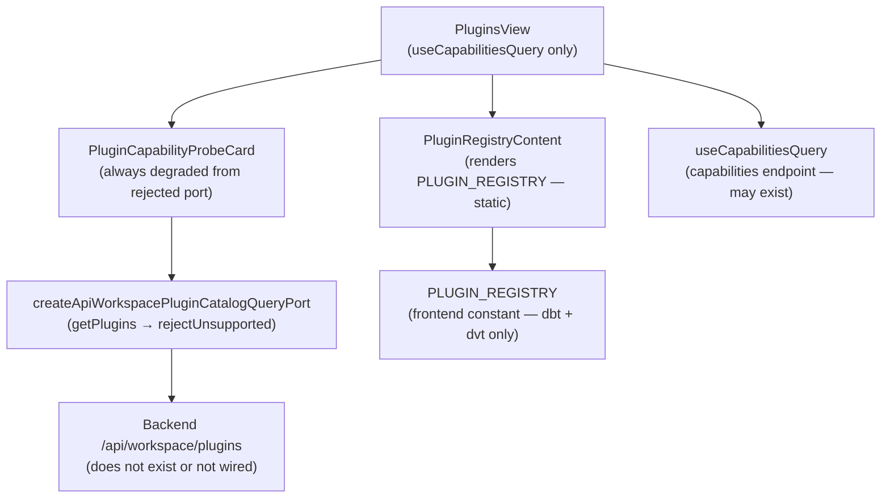

# Fowler Analysis — Plugin Catalog Permanent Stub

## Scope

This analysis reviews the gap that prevents the Plugins view from ever showing
real plugin catalog data from the backend.

The review covers:

- `createApiWorkspacePluginCatalogQueryPort()` in `workspacePorts.api.ts`
  (L115-120) returning a port whose `getPlugins()` method calls
  `rejectUnsupportedApiWorkspaceCapability('workspace.plugins', 'ListWorkspacePlugins')`;
- `PluginsView.tsx` using `useCapabilitiesQuery()` to load plugin capability
  data; the capabilities endpoint may exist but returns no plugin catalog;
- `PluginsRouteWorkbench.tsx` rendering the `PLUGIN_REGISTRY` (static
  frontend array) as the authoritative plugin list, making backend-registered
  plugins invisible;
- the `PluginCapabilityProbeCard` always rendering a warning or error state
  because the `IWorkspacePluginCatalogQueryPort` never resolves.

It does not cover:

- plugin installation or upgrade workflows;
- plugin marketplace or remote discovery;
- plugin sandboxing or permission model;
- dbt or dvt plugin authoring surface (separate analyses).

## Governing Sources

- `AGENTS.md`
- `docs/planning/status/governance-document-rule-inventory.md`
- `docs/guides/ai-work-protocol.md`
- `docs/architecture/command-query-rail-governance.md`
- `docs/architecture/fowler-opportunity-planning-governance.md`
- `docs/architecture/components/web/frontend-fowler-implementation-pattern.md`
- `apps/web/src/app/views/PluginsView.tsx`
- `apps/web/src/app/views/plugins/PluginsRouteWorkbench.tsx`
- `apps/web/src/app/services/workspace/workspacePorts.api.ts`
- `apps/web/src/app/plugins/registry.ts`

## Mature-System Comparison

Mature plugin catalog UIs enforce two structural rules:

1. **Backend is the registry of record** — the frontend static registry is a
   development convenience; the production UI fetches the authoritative list
   from the backend and merges it with any locally registered contributions.
2. **Capability probe reflects reality** — the capability probe card on the
   Plugins view shows the real state of the plugin system as seen by the
   backend, not a permanently degraded state caused by a stub port.

The current implementation inverts both: the static `PLUGIN_REGISTRY` array
is the only list shown to users, and the capability probe is permanently
degraded because `getPlugins()` always rejects.

## Improved Patterns

| Area             | Improvement                                                                                                  | Mature-system pattern          |
| ---------------- | ------------------------------------------------------------------------------------------------------------ | ------------------------------ |
| Port stub        | Implement real `GET /api/workspace/plugins` HTTP adapter in `createApiWorkspacePluginCatalogQueryPort`.      | Adapter / Port implementation  |
| Registry source  | Merge backend plugin list with `PLUGIN_REGISTRY`; backend is authoritative; local registry is additive only. | Backend-authoritative registry |
| Capability probe | Capability probe reflects actual backend plugin system health from `getPlugins()` response.                  | Real-time health probe         |
| Empty state      | When plugins cannot be loaded, show explicit error/empty state instead of silently showing zero plugins.     | Explicit error state           |

## Antipatterns Detected

| Antipattern              | Evidence                                                                                                                | Fowler signal     | Impact                                                                                      |
| ------------------------ | ----------------------------------------------------------------------------------------------------------------------- | ----------------- | ------------------------------------------------------------------------------------------- |
| Permanent stub           | `createApiWorkspacePluginCatalogQueryPort().getPlugins()` calls `rejectUnsupportedApiWorkspaceCapability`.              | Dead code path    | Backend-registered plugins are never surfaced; catalog is always the static local list.     |
| Data authority confusion | `PluginsRouteWorkbench.tsx` renders `PLUGIN_REGISTRY` (frontend constant) as the plugin list. Backend is not consulted. | Wrong authority   | Any plugin registered only in the backend is invisible to the user.                         |
| Probe misrepresentation  | `PluginCapabilityProbeCard` renders a degraded state because the port that feeds it always rejects.                     | Misleading status | The probe always shows "error" or "warning" even when the backend plugin system is healthy. |
| Boundary confusion       | The plugins view has two unrelated data sources (capabilities query + plugin catalog query) that are not reconciled.    | Boundary drift    | User sees inconsistent information: capabilities may be OK but catalog is always empty.     |

## Component Grouping

| Component                                         | Owned concern                                                         | Current state                             | Target state                                                                      |
| ------------------------------------------------- | --------------------------------------------------------------------- | ----------------------------------------- | --------------------------------------------------------------------------------- |
| `createApiWorkspacePluginCatalogQueryPort`        | Adapt `/api/workspace/plugins` to `IWorkspacePluginCatalogQueryPort`. | Always rejects.                           | Implements real HTTP call; returns `PluginDescriptor[]`.                          |
| `PluginsRouteWorkbench` / `PluginRegistryContent` | Render authoritative plugin list.                                     | Renders `PLUGIN_REGISTRY` static array.   | Merges backend plugin list with `PLUGIN_REGISTRY`; backend data is authoritative. |
| `PluginCapabilityProbeCard`                       | Show real-time plugin system health.                                  | Permanently degraded from stub rejection. | Shows real health from `getPlugins()` response metadata.                          |

## Repetitions

- `rejectUnsupportedApiWorkspaceCapability` appears in `getPlugins`,
  `getRoles`, and `getAuditLog`. Three separate product surfaces are degraded
  by the same stub pattern. A single pass through `workspacePorts.api.ts`
  could lift all three.
- `PLUGIN_REGISTRY` is consulted in `PluginsRouteWorkbench` but also
  referenced in node palette and inspector panel wiring. If backend plugins
  can differ from the static list, every surface that reads `PLUGIN_REGISTRY`
  needs to be audited.

## Opportunities

1. **Implement `getPlugins()` in `createApiWorkspacePluginCatalogQueryPort`**
   — replace stub with real `GET /api/workspace/plugins` HTTP call;
   gate the catalog behind a capability flag if the route is not deployed.

2. **Merge backend plugin list with `PLUGIN_REGISTRY`**
   — `PluginRegistryContent` queries the port and merges backend descriptors
   with the static local registry; duplicates are resolved by ID.

3. **Drive `PluginCapabilityProbeCard` from real port data**
   — pass the `getPlugins()` result or its error to the probe card so it
   reflects actual backend health.

4. **Add error and empty states to `PluginRegistryContent`**
   — render explicit error or empty states when the catalog query fails or
   returns zero plugins, distinct from the static "zero local plugins" state.

## Drift To Fix

| Drift                                                                                            | Fix                                                                                        |
| ------------------------------------------------------------------------------------------------ | ------------------------------------------------------------------------------------------ |
| `workspacePorts.api.ts` L115-120 — `getPlugins` calls `rejectUnsupportedApiWorkspaceCapability`. | Implement real HTTP adapter or capability-gated stub with explicit empty state.            |
| `PluginsRouteWorkbench.tsx` — `PluginRegistryContent` renders only `PLUGIN_REGISTRY`.            | Merge backend catalog response with static registry; surface backend-registered plugins.   |
| `PluginCapabilityProbeCard` — always degraded from port rejection.                               | Feed real `getPlugins()` result to probe card; remove dependency on always-rejecting port. |

## ADR Assessment

No ADR is required for implementing the HTTP adapter or merging the plugin
list if the backend already has a `/api/workspace/plugins` endpoint. An ADR
is required if the plugin catalog introduces a new plugin lifecycle model
(install, enable, disable, version pinning) that changes the plugin contract
boundary between frontend and backend.

## Fowler Opportunity Matrix

| scenario                                                                                                          | opportunity                                                                                                            | Fowler pattern                                    | DDD owner                                                                                      | command/query rail                                                                | implementation surfaces                                                                             | unit or package test                                                 | architecture test                                                                                     | user-flow test                                                                | out of scope                         |
| ----------------------------------------------------------------------------------------------------------------- | ---------------------------------------------------------------------------------------------------------------------- | ------------------------------------------------- | ---------------------------------------------------------------------------------------------- | --------------------------------------------------------------------------------- | --------------------------------------------------------------------------------------------------- | -------------------------------------------------------------------- | ----------------------------------------------------------------------------------------------------- | ----------------------------------------------------------------------------- | ------------------------------------ |
| User opens Plugins view; catalog shows only static dbt and dvt entries; backend-registered plugins are invisible. | Data authority confusion — `PluginRegistryContent` renders only `PLUGIN_REGISTRY`; backend catalog is never consulted. | Wrong authority / Backend-authoritative registry. | `PluginRegistryContent` (presentation) + `createApiWorkspacePluginCatalogQueryPort` (adapter). | Query rail: `ListWorkspacePlugins` — read model against `/api/workspace/plugins`. | `workspacePorts.api.ts` (implement HTTP call), `PluginsRouteWorkbench.tsx` (merge backend list).    | Unit: backend returns plugins; merged list includes backend entries. | Architecture: `PluginRegistryContent` does not render `PLUGIN_REGISTRY` without merging backend data. | Playwright: Plugins view shows backend-registered plugin not in static array. | Plugin installation; marketplace.    |
| `PluginCapabilityProbeCard` always shows degraded status even when backend plugin system is healthy.              | Probe misrepresentation — probe reads from a port that always rejects; health status is never real.                    | Misleading status / Stub as permanent state.      | `PluginCapabilityProbeCard` (presentation) + port adapter.                                     | Same `ListWorkspacePlugins` query rail.                                           | `workspacePorts.api.ts` (implement adapter), `PluginsRouteWorkbench.tsx` (pass real data to probe). | Unit: when port resolves, probe shows "ok" state.                    | Architecture: `PluginCapabilityProbeCard` does not receive data from a permanently-rejecting port.    | Playwright: probe card shows "ok" when backend responds normally.             | Plugin sandboxing; permission model. |
| Plugin catalog fails to load; user sees static list with no indication that dynamic catalog is unavailable.       | Silent failure — catalog port rejection is not surfaced; static list appears as if it is complete.                     | Hidden failure / Missing error state.             | `PluginsView` (view) + `useCapabilitiesQuery` (query hook).                                    | Same `ListWorkspacePlugins` query rail.                                           | `PluginsView.tsx` and `PluginsRouteWorkbench.tsx` (add error state).                                | Unit: when port rejects, view renders error state.                   | Architecture: catalog view has an error state component.                                              | Playwright: when API returns 500, Plugins view shows error message.           | Backend error categorisation.        |
