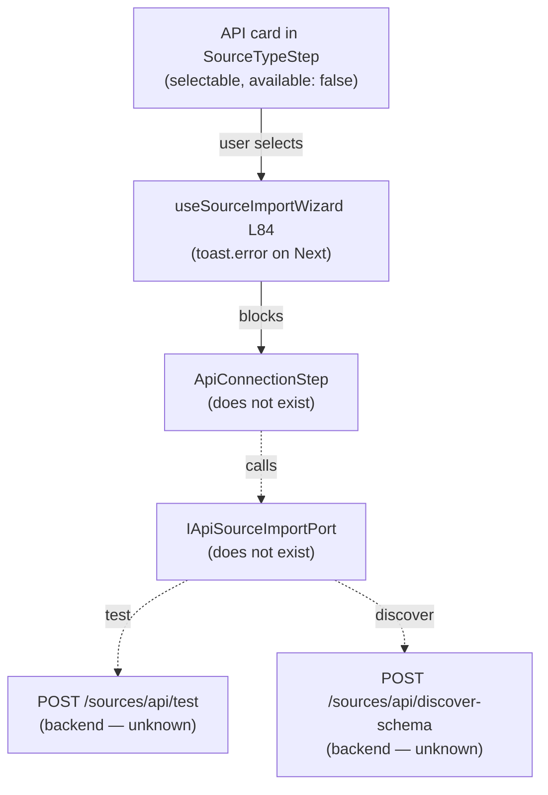

# Fowler Analysis — API Source Type Unimplemented (REST / GraphQL)

## Scope

The wizard declares `api` as a `DataObjectSourceType` and renders an "API"
card with badge `not available yet`. The card is selectable, but selecting it
and pressing Next fires a `toast.error`. There is no API connection step, no
endpoint configuration form, no schema discovery, and no port contract for API
sources.

The review covers:

- `SOURCE_TYPE_OPTIONS` in `constants.ts` — `api` entry, `available: false`;
- `useSourceImportWizard.ts` L84 — same `!== 'database'` hard-stop guard;
- `WizardStepContent.tsx` — no branch for an API configuration step;
- `workspace.ts` port interface — no `IApiSourceImportPort` or API-specific
  DTOs (endpoint, auth scheme, schema shape);
- the `WarehouseConnection` DTO — typed for relational warehouse connections
  only; not extensible to REST/GraphQL endpoint config without a new type.

It does not cover:

- backend API connector service (OAuth token exchange, pagination, rate limits);
- incremental sync or refresh scheduling;
- response transformation (JSONPath, field mapping);
- GraphQL introspection.

## Governing Sources

- `AGENTS.md`
- `docs/planning/status/governance-document-rule-inventory.md`
- `docs/guides/ai-work-protocol.md`
- `docs/architecture/command-query-rail-governance.md`
- `apps/web/src/app/components/sourceImportWizard/constants.ts`
- `apps/web/src/app/components/sourceImportWizard/useSourceImportWizard.ts`
- `apps/web/src/app/components/sourceImportWizard/WizardStepContent.tsx`
- `apps/web/src/app/ports/workspace.ts`

## Mature-System Comparison

Mature API-source import flows enforce four rules:

1. **Endpoint config replaces Connection** — the user provides a base URL,
   auth scheme (API Key, Bearer, OAuth), and optionally a schema definition
   URL (OpenAPI / GraphQL introspection); no pre-configured "connection" list
   is required for ad-hoc API sources.
2. **Test before schema discovery** — a "Test Endpoint" pre-flight verifies
   reachability and auth before schema discovery is attempted.
3. **Schema is discovered from introspection** — for OpenAPI endpoints, schema
   is inferred from the spec; for untyped REST, the user maps response fields
   manually; for GraphQL, the schema comes from introspection.
4. **Auth credentials are never stored in client state** — API keys and OAuth
   tokens are submitted server-side; the frontend holds only opaque references.

The current implementation has none of these: no endpoint form, no test step,
no schema discovery surface, and no auth field.

## Improved Patterns

| Area             | Improvement                                                                                              | Mature-system pattern   |
| ---------------- | -------------------------------------------------------------------------------------------------------- | ----------------------- |
| Endpoint config  | `ApiConnectionStep`: base URL, auth type selector (API Key / Bearer / OAuth), optional OpenAPI spec URL. | Capability-scoped step  |
| Test pre-flight  | "Test Endpoint" button calls `POST /sources/api/test`; shows success/failure before schema step.         | Pre-flight validation   |
| Schema discovery | After test, call `POST /sources/api/discover-schema`; present discovered endpoints/fields.               | Schema-driven selection |
| Port contract    | `IApiSourceImportPort` with `testEndpoint`, `discoverSchema`, `importApiSources`.                        | Capability-scoped port  |

## Antipatterns Detected

| Antipattern                  | Evidence                                                                                                                  | Fowler signal           | Impact                                                                                             |
| ---------------------------- | ------------------------------------------------------------------------------------------------------------------------- | ----------------------- | -------------------------------------------------------------------------------------------------- |
| Ghost source type card       | `api` card is clickable; pressing Next shows a toast but no actionable path.                                              | Ghost interaction       | User is invited to select API, then immediately blocked with an error.                             |
| WarehouseConnection DTO leak | `SourceImportWizardState.connections` is typed as `WarehouseConnection[]`; API sources need a different connection model. | DTO scope creep         | Extending API source import requires either polluting `WarehouseConnection` or a new state field.  |
| No auth field                | No auth UI exists anywhere in the wizard; API sources require credentials.                                                | Responsibility void     | Implementing API source import without an auth step would silently call unauthenticated endpoints. |
| Hardcoded type guard         | Same `!== 'database'` guard in `useSourceImportWizard` blocks all API paths.                                              | Hardcoded discriminator | Each new source type requires editing the guard.                                                   |

## Component Grouping

| Component                        | Owned concern                                      | Current state                                    | Target state                                                                                   |
| -------------------------------- | -------------------------------------------------- | ------------------------------------------------ | ---------------------------------------------------------------------------------------------- | --------------------------- |
| `SOURCE_TYPE_OPTIONS` (`api`)    | Declare API source availability.                   | `available: false`; card is clickable.           | Disabled card until port is ready.                                                             |
| `useSourceImportWizard` L84      | Guard against unimplemented types.                 | Hardcoded `!== 'database'` toast.                | Capability registry check.                                                                     |
| `WizardStepContent` `connection` | Render correct step for source type.               | Always renders `ConnectionStep`.                 | Branches: renders `ApiConnectionStep` for `api`.                                               |
| `IApiSourceImportPort` (new)     | Typed boundary for API endpoint config and schema. | Does not exist.                                  | Declares `testEndpoint`, `discoverSchema`, `importApiSources`; auth handled server-side.       |
| `ApiConnectionStep` (new)        | Collect endpoint URL and auth type.                | Does not exist.                                  | Base URL input, auth type selector, optional OpenAPI/GraphQL spec URL, "Test Endpoint" button. |
| `SourceImportWizardState`        | Hold wizard state for the active source type.      | `connections: WarehouseConnection[]` — DB-typed. | Extend with `apiConfig: ApiEndpointConfig                                                      | null` for API source state. |

## Repetitions

- The same ghost-card + toast-on-Next pattern appears for `file`, `api`, and
  `stream`. A single capability registry fix resolves all three simultaneously.
- The `SourceImportWizardState` extension for API config follows the same
  pattern needed for file (`fileUploadResult`) and stream (`streamConfig`);
  consider a union-typed `sourceConfig` field keyed by `selectedSourceType`.

## Opportunities

1. **Disable unimplemented source type cards at the UI level**
   — prevents the ghost-card + toast pattern from appearing for any type.

2. **Add `IApiSourceImportPort` to `workspace.ts`**
   — `testEndpoint(config: ApiEndpointConfig): Promise<TestResult>`,
   `discoverSchema(config): Promise<ApiSchema>`,
   `importApiSources(input: ApiImportInput): Promise<ImportSourcesResult>`.

3. **Add `ApiConnectionStep` with auth fields and test pre-flight**
   — base URL, auth type (API Key header / Bearer / OAuth PKCE), optional spec
   URL; "Test Endpoint" button calls port before allowing Next.

4. **Extend `WizardStepContent` to branch on `selectedSourceType`**
   — `case 'connection'` renders `ApiConnectionStep` when source type is `api`.

5. **Add `apiConfig` to `SourceImportWizardState`**
   — holds endpoint URL, auth type, and discovered schema reference;
   reviewed in `ReviewStep` alongside options.

## Drift To Fix

| Drift                                                                   | Fix                                                           |
| ----------------------------------------------------------------------- | ------------------------------------------------------------- | ------------------------------------------------ |
| `constants.ts` — `api` card clickable despite `available: false`.       | Disable card interaction when `!available`.                   |
| `useSourceImportWizard.ts` L84 — hardcoded guard blocks api path.       | Capability registry.                                          |
| `workspace.ts` — no `IApiSourceImportPort`.                             | Add port interface with test, discover, import methods.       |
| `WizardStepContent` — no `ApiConnectionStep` branch.                    | Add branch for `api` source type in the connection step case. |
| `SourceImportWizardState.connections` — WarehouseConnection-typed only. | Add `apiConfig: ApiEndpointConfig                             | null`field; do not pollute`WarehouseConnection`. |

## ADR Assessment

An ADR is required if the API source import flow introduces an OAuth PKCE
exchange or a new credential storage boundary not already present in the
workspace. An ADR is also required if API schema discovery uses a new
background job model (e.g., async schema fetch with polling) that changes the
request/response contract of the source import port.

## Fowler Opportunity Matrix

| scenario                                                                                | opportunity                                                                                   | Fowler pattern                        | DDD owner                                                  | command/query rail                                        | implementation surfaces                                                                             | unit or package test                                          | architecture test                                                                   | user-flow test                                                               | out of scope                 |
| --------------------------------------------------------------------------------------- | --------------------------------------------------------------------------------------------- | ------------------------------------- | ---------------------------------------------------------- | --------------------------------------------------------- | --------------------------------------------------------------------------------------------------- | ------------------------------------------------------------- | ----------------------------------------------------------------------------------- | ---------------------------------------------------------------------------- | ---------------------------- |
| User selects API card, presses Next, gets a toast — no path to configure an endpoint.   | Ghost source type — API card is selectable but has no implementation behind it.               | Ghost interaction / Dead source type. | `SourceTypeStep` + `useSourceImportWizard`.                | None — UI guard only.                                     | `constants.ts` (disable), `useSourceImportWizard.ts` (capability check).                            | Unit: API card is not clickable when available is false.      | Architecture: no selectable card has available: false.                              | Playwright: API card shows "Coming soon" tooltip.                            | OAuth backend.               |
| User wants to configure a REST endpoint and auth credentials before discovering schema. | No ApiConnectionStep — wizard jumps from source type to warehouse connection step regardless. | Step-flow rigidity / Missing step.    | `ApiConnectionStep` (new) + `IApiSourceImportPort` (new).  | Command rail: `TestApiEndpoint` — POST /sources/api/test. | New `ApiConnectionStep.tsx`, `IApiSourceImportPort` in workspace.ts, branch in `WizardStepContent`. | Unit: ApiConnectionStep shows test result after calling port. | Architecture: WizardStepContent branches on selectedSourceType for connection step. | Playwright: user enters URL + API key, tests endpoint, sees success.         | OAuth PKCE flow.             |
| User submits an API source without testing credentials; fails silently at import.       | No pre-flight validation — no "Test Endpoint" step before schema discovery.                   | Missing guard / Late failure.         | `ApiConnectionStep` + `IApiSourceImportPort.testEndpoint`. | Same TestApiEndpoint rail.                                | `ApiConnectionStep.tsx` (add Test button), `IApiSourceImportPort` (testEndpoint method).            | Unit: Next is disabled until test passes.                     | Architecture: ApiConnectionStep has a test pre-flight before allowing Next.         | Playwright: bad API key shows inline error, does not advance to schema step. | Backend auth token exchange. |
