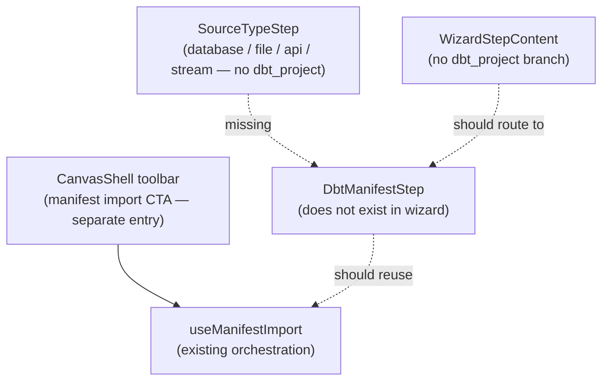

# Fowler Analysis — dbt Project Source Import Not Exposed as a Source Type

## Scope

A dbt project manifest import flow already exists (`ImportManifestWizard` /
`useManifestImport`) and is accessible via a separate entry point in the canvas
toolbar. However, it is not represented as a source type in the DataObject
Registry wizard (`DataObjectSourceType` in `types.ts`), and there is no
`dbt_project` card in `SourceTypeStep`.

This creates an asymmetry: a user wanting to bring in dbt models as DataObject
nodes must find a separate, unlabelled entry point (the manifest import CTA in
the canvas), while CSV, REST API, and stream sources are at least visible as
future options in the wizard. The dbt project flow — the most common onboarding
path — is the least discoverable.

The review covers:

- `DataObjectSourceType` in `types.ts` — four values: `database`, `file`,
  `api`, `stream`; no `dbt_project`;
- `SOURCE_TYPE_OPTIONS` in `constants.ts` — no dbt entry;
- `CanvasShell.tsx` — the manifest import CTA is rendered as a separate toolbar
  button, not as part of the source type wizard;
- `useManifestImport.ts` — the existing import orchestration hook;
- `canvasShellPanelsBuilder.ts` — source import availability flag
  `sourceImportAvailable: false` prevents the wizard from opening from the
  toolbar;
- the absence of a dbt project entry point in the wizard creates a
  discoverability gap for the primary onboarding path.

It does not cover:

- the manifest import wizard implementation (covered in separate Fowler
  analysis `20260530-codex-fowler-canvas-source-import-backend-gap-analysis.md`);
- dbt Cloud connection vs local project file;
- CI/CD-triggered manifest refresh;
- dbt model freshness or test result import.

## Governing Sources

- `AGENTS.md`
- `docs/planning/status/governance-document-rule-inventory.md`
- `docs/guides/ai-work-protocol.md`
- `docs/architecture/command-query-rail-governance.md`
- `apps/web/src/app/components/sourceImportWizard/types.ts`
- `apps/web/src/app/components/sourceImportWizard/constants.ts`
- `apps/web/src/app/views/canvas/CanvasShell.tsx`
- `apps/web/src/app/views/canvas/canvasShellPanelsBuilder.ts`
- `buzon/20260530-codex-fowler-canvas-source-import-backend-gap-analysis.md`

## Mature-System Comparison

Mature data orchestration platforms apply two rules for source discoverability:

1. **All import paths are surfaced from a single entry point** — whether the
   source is a warehouse, a file, an API, or an existing data modelling project,
   the user starts from one "Add Source" wizard; parallel entry points erode
   discoverability.
2. **The most common onboarding path is the most prominent option** — if the
   majority of users connect a dbt project first, that option should appear at
   the top of the source type list, not be hidden in a separate toolbar button.

The current implementation inverts both rules: the dbt manifest import is the
most common path but has the lowest discoverability (toolbar button, not the
wizard), and the wizard only lists source types that are all either broken or
unimplemented.

## Improved Patterns

| Area                  | Improvement                                                                                           | Mature-system pattern      |
| --------------------- | ----------------------------------------------------------------------------------------------------- | -------------------------- |
| Source type entry     | Add `dbt_project` to `DataObjectSourceType` and to `SOURCE_TYPE_OPTIONS` with `available: true`.      | Unified import entry point |
| Wizard routing        | `WizardStepContent` for `dbt_project` routes to `DbtManifestStep` (file upload or dbt Cloud URL).     | Source-type-driven step    |
| Manifest import reuse | `DbtManifestStep` reuses `useManifestImport` orchestration, not a parallel implementation.            | Reuse existing rail        |
| CTA rationalisation   | Remove the standalone manifest import CTA from the canvas toolbar; the wizard is the canonical entry. | Single source of entry     |

## Antipatterns Detected

| Antipattern                    | Evidence                                                                                                     | Fowler signal             | Impact                                                                                              |
| ------------------------------ | ------------------------------------------------------------------------------------------------------------ | ------------------------- | --------------------------------------------------------------------------------------------------- |
| Parallel import entry points   | Manifest import is accessible via toolbar CTA; DataObject wizard has no dbt entry; two surfaces for imports. | Responsibility duplicated | Users don't know which entry point to use; the primary path is less discoverable than stub entries. |
| Missing primary source type    | `DataObjectSourceType` has `database`, `file`, `api`, `stream` but not `dbt_project`.                        | Incomplete model          | The type system does not represent the most-used source type.                                       |
| Toolbar CTA as primary UX      | `CanvasShell` renders the manifest import CTA as a toolbar button outside the wizard flow.                   | Ghost affordance          | Toolbar button is visually minor; users may dismiss it as a power-user feature.                     |
| `sourceImportAvailable: false` | The DataObject Registry wizard is gated behind this flag, but the dbt manifest import bypasses this gate.    | Inconsistent gating       | Two source import paths have different availability gates, creating inconsistent UX.                |

## Component Grouping

| Component                 | Owned concern                                       | Current state                                    | Target state                                                                                        |
| ------------------------- | --------------------------------------------------- | ------------------------------------------------ | --------------------------------------------------------------------------------------------------- | --- | -------- | ------------------ |
| `DataObjectSourceType`    | Define valid source types.                          | `database                                        | file                                                                                                | api | stream`. | Add `dbt_project`. |
| `SOURCE_TYPE_OPTIONS`     | Declare source type cards.                          | No dbt entry.                                    | Add `dbt_project` card, `available: true`, positioned first (primary onboarding path).              |
| `WizardStepContent`       | Route wizard steps by source type.                  | No `dbt_project` branch.                         | `connection` step for `dbt_project` renders `DbtManifestStep`.                                      |
| `DbtManifestStep` (new)   | Accept dbt manifest (file upload or dbt Cloud URL). | Does not exist.                                  | File picker for `manifest.json` + optional dbt Cloud project URL; reuses `useManifestImport`.       |
| `CanvasShell` toolbar CTA | Provide manifest import entry point.                | Standalone toolbar button, separate from wizard. | Deprecated in favour of wizard entry; or kept as a shortcut that opens the wizard at `dbt_project`. |
| `useSourceImportWizard`   | Orchestrate wizard state.                           | Guards all non-database types with toast.        | `dbt_project` bypasses warehouse port; delegates to `useManifestImport` for the import step.        |

## Repetitions

- `useManifestImport` already implements manifest parsing, node creation, and
  error handling. `DbtManifestStep` should call this hook directly — not
  duplicate it. The only new code is the step UI (file picker + dbt Cloud URL
  input) and the routing in `WizardStepContent`.
- The `SOURCE_TYPE_OPTIONS` `available: true` / `false` flag already drives
  card styling; making `dbt_project` available requires only a new entry and
  the `DbtManifestStep` component.

## Opportunities

1. **Add `dbt_project` to `DataObjectSourceType` and `SOURCE_TYPE_OPTIONS`**
   — mark `available: true`; position it first in the list as the primary
   onboarding path; use the dbt logo icon.

2. **Add `DbtManifestStep` that reuses `useManifestImport`**
   — file picker for `manifest.json` or text input for dbt Cloud project URL;
   on submit, calls `useManifestImport.importManifest()`; shows progress and
   result in the existing `ResultStep`.

3. **Route `dbt_project` in `WizardStepContent`**
   — the wizard goes `sourceType → dbt_project_config → review → result`
   (skipping warehouse-specific steps); `WizardStepContent` renders
   `DbtManifestStep` for the config step.

4. **Rationalise the toolbar CTA**
   — either remove the standalone manifest import CTA from `CanvasShell` and
   direct users to the wizard, or keep it as a shortcut that opens the wizard
   pre-selected on `dbt_project`.

5. **Update `sourceImportWizardModel.ts` step flow for `dbt_project`**
   — the wizard skips `connection`, `selection`, `grouping`, `options` steps
   for `dbt_project`; goes directly to `review` after manifest upload.

## Drift To Fix

| Drift                                                                                       | Fix                                                                                                  |
| ------------------------------------------------------------------------------------------- | ---------------------------------------------------------------------------------------------------- |
| `types.ts` — `dbt_project` not in `DataObjectSourceType`.                                   | Add `'dbt_project'` to the union.                                                                    |
| `constants.ts` — no dbt card in `SOURCE_TYPE_OPTIONS`.                                      | Add entry: `{ id: 'dbt_project', label: 'dbt Project', available: true, … }`.                        |
| `WizardStepContent` — no `dbt_project` branch.                                              | Add branch; render `DbtManifestStep` for the config step.                                            |
| `sourceImportWizardModel.ts` — step flow is linear; dbt project skips most steps.           | Add `getNextStep` override for `dbt_project`: `sourceType → dbtConfig → review → result`.            |
| `CanvasShell` — parallel manifest import CTA creates two entry points.                      | Rationalise: remove or redirect to wizard.                                                           |
| `useSourceImportWizard` — `importSources` calls warehouse port; dbt needs a different path. | For `dbt_project`, delegate import step to `useManifestImport.importManifest()`, not warehouse port. |

## ADR Assessment

No ADR is required for adding `dbt_project` as a source type if the existing
`useManifestImport` hook is reused without changes to the manifest import
contract. An ADR is required if a dbt Cloud connection (OAuth or API token for
dbt Cloud project access) is added, as this introduces a new external
authentication boundary.

## Fowler Opportunity Matrix

| scenario                                                                                                                   | opportunity                                                                                                                            | Fowler pattern                                 | DDD owner                                                             | command/query rail                                                    | implementation surfaces                                                                                               | unit or package test                                                               | architecture test                                                                | user-flow test                                                                                   | out of scope     |
| -------------------------------------------------------------------------------------------------------------------------- | -------------------------------------------------------------------------------------------------------------------------------------- | ---------------------------------------------- | --------------------------------------------------------------------- | --------------------------------------------------------------------- | --------------------------------------------------------------------------------------------------------------------- | ---------------------------------------------------------------------------------- | -------------------------------------------------------------------------------- | ------------------------------------------------------------------------------------------------ | ---------------- |
| New user opens the app; wants to connect their dbt project; cannot find the import option in the wizard.                   | Missing primary source type — dbt_project not in DataObjectSourceType or SOURCE_TYPE_OPTIONS; only accessible via a minor toolbar CTA. | Incomplete model / Parallel entry points.      | `SOURCE_TYPE_OPTIONS` + `DataObjectSourceType` + `WizardStepContent`. | Command rail: `ImportDbtManifest` — reuse existing useManifestImport. | `types.ts` (add dbt_project), `constants.ts` (add card), `WizardStepContent` (add branch), new `DbtManifestStep.tsx`. | Unit: dbt_project card appears first in SourceTypeStep; is selectable.             | Architecture: DataObjectSourceType includes dbt_project.                         | Playwright: user opens wizard, selects dbt Project, uploads manifest.json, sees nodes in canvas. | dbt Cloud OAuth. |
| User imports dbt manifest via toolbar CTA; wizard user imports via DataObject Registry; two entry points, one workflow.    | Parallel import entry points — CanvasShell toolbar CTA and DataObject wizard both lead to manifest import but via different UI paths.  | Responsibility duplicated / Parallel surfaces. | `CanvasShell` (toolbar) + `WizardStepContent` (wizard).               | Same ImportDbtManifest rail.                                          | `CanvasShell.tsx` (remove or redirect CTA), `DbtManifestStep.tsx` (wizard entry).                                     | Unit: manifest import can be triggered from wizard only (or toolbar opens wizard). | Architecture: only one entry point for manifest import.                          | Playwright: toolbar CTA opens wizard at dbt_project step.                                        | None.            |
| User selects dbt_project in wizard; wizard advances through all database-specific steps (connection, selection, grouping). | Uniform wizard steps — step flow is linear and designed for warehouse import; dbt project skips most steps.                            | Step-flow rigidity.                            | `sourceImportWizardModel.ts` + `useSourceImportWizard`.               | Same ImportDbtManifest rail.                                          | `sourceImportWizardModel.ts` (add dbt_project step override: sourceType → dbtConfig → review → result).               | Unit: getNextStep('sourceType', 'dbt_project') returns 'dbtConfig'.                | Architecture: dbt_project wizard path skips connection/selection/grouping steps. | Playwright: user selects dbt_project; wizard shows only config and review steps.                 | None.            |
