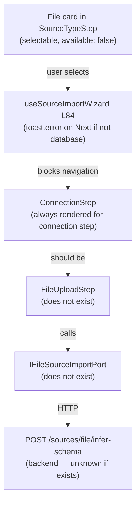

# Fowler Analysis — File Source Type Unimplemented (CSV / JSON / Parquet)

## Scope

The wizard surface declares `file` as a valid `DataObjectSourceType` in
`types.ts` and shows a "File" card in `SourceTypeStep.tsx` with badge
`not available yet`. Clicking the card does nothing. There is no
`FileSourceConnectionStep`, no upload component, no schema inference, and no
port method for file-backed source import.

The review covers:

- `SOURCE_TYPE_OPTIONS` in `constants.ts` — `file` entry, `available: false`;
- `useSourceImportWizard.ts` L84 — `sourceType !== 'database'` guard that
  fires a `toast.error` and aborts navigation when any non-database type is
  selected and the user presses Next;
- `WizardStepContent.tsx` — `case 'connection'` renders `ConnectionStep`
  unconditionally; no branch for file upload;
- the port interface `IWarehouseSourceImportPort` — only declares
  `listWarehouseConnections`, `listWarehouseTables`, `importSources`; no file
  methods exist;
- absence of a file upload UI component anywhere in
  `apps/web/src/app/components/`.

It does not cover:

- backend file storage or schema inference service;
- format-specific parsing (CSV delimiter detection, Parquet schema reading);
- large-file streaming or chunked upload;
- data quality / profiling on upload.

## Governing Sources

- `AGENTS.md`
- `docs/planning/status/governance-document-rule-inventory.md`
- `docs/guides/ai-work-protocol.md`
- `docs/architecture/command-query-rail-governance.md`
- `apps/web/src/app/components/sourceImportWizard/constants.ts`
- `apps/web/src/app/components/sourceImportWizard/useSourceImportWizard.ts`
- `apps/web/src/app/components/sourceImportWizard/WizardStepContent.tsx`
- `apps/web/src/app/ports/workspace.ts`

## Mature-System Comparison

Mature file-import flows follow three rules:

1. **Upload replaces Connection** — for file sources, the "connection" step is
   replaced by a file upload step (drag-and-drop or file picker); no persistent
   connection is required.
2. **Schema inference is immediate** — after upload the system parses the first
   N rows, infers column names and types, and presents them for the user to
   confirm before registering.
3. **Supported formats are explicit** — the UI lists accepted formats (CSV,
   JSON, Parquet, Excel) and enforces them at the upload step, not silently at
   submission.

The current implementation skips all three: no upload step, no inference, and
the format guard is a dead toast that fires only after the user can already
see a card labelled "File" and select it.

## Improved Patterns

| Area             | Improvement                                                                                     | Mature-system pattern    |
| ---------------- | ----------------------------------------------------------------------------------------------- | ------------------------ |
| Upload step      | Replace `ConnectionStep` with `FileUploadStep` when `selectedSourceType === 'file'`.            | Source-type-driven step  |
| Schema inference | After upload call `POST /sources/file/infer-schema`; present inferred columns in SelectionStep. | Immediate schema preview |
| Format guard     | Validate file extension at upload; show inline error, not a toast on Next.                      | Input-level validation   |
| Port extension   | Add `IFileSourceImportPort` with `uploadFile(file)` and `inferSchema(fileId)` methods.          | Capability-scoped port   |

## Antipatterns Detected

| Antipattern           | Evidence                                                                                                 | Fowler signal           | Impact                                                                                                             |
| --------------------- | -------------------------------------------------------------------------------------------------------- | ----------------------- | ------------------------------------------------------------------------------------------------------------------ |
| Dead source type card | `file` card in `SourceTypeStep` is selectable but triggers `toast.error` on Next.                        | Ghost interaction       | User selects File, presses Next, gets an error — the card should never be selectable if the flow is unimplemented. |
| Hard-coded type guard | `useSourceImportWizard.ts` L84: `selectedSourceType !== 'database'` blocks all non-database paths.       | Hardcoded discriminator | Every future source type requires editing this guard rather than a capability check.                               |
| Missing port contract | No `IFileSourceImportPort` or file-specific methods exist in `workspace.ts`.                             | Responsibility void     | The file import capability has no type boundary; implementing it will require ad-hoc additions.                    |
| Uniform wizard steps  | All source types share the same 6-step flow; file import needs different steps (upload, not connection). | Step-flow rigidity      | `WizardStepContent` cannot render the correct step without branching on source type.                               |

## Component Grouping

| Component                        | Owned concern                                        | Current state                           | Target state                                                                                                     |
| -------------------------------- | ---------------------------------------------------- | --------------------------------------- | ---------------------------------------------------------------------------------------------------------------- |
| `SOURCE_TYPE_OPTIONS` (`file`)   | Declare file source availability.                    | `available: false`; card is selectable. | `available: false` until port is ready; card is disabled (non-clickable, not just opacity-reduced).              |
| `useSourceImportWizard` L84      | Guard against unimplemented source types.            | Hardcoded `!== 'database'` toast.       | Capability check: `!sourceTypeRegistry.isAvailable(selectedSourceType)`.                                         |
| `WizardStepContent` `connection` | Render correct step for source type.                 | Always renders `ConnectionStep`.        | Branches on `state.selectedSourceType`: renders `FileUploadStep` for `file`.                                     |
| `IFileSourceImportPort` (new)    | Typed contract for file upload and schema inference. | Does not exist.                         | Declares `uploadFile(file: File): Promise<FileUploadResult>` and `inferSchema(fileId): Promise<InferredSchema>`. |
| `FileUploadStep` (new)           | Accept file from user; validate format.              | Does not exist.                         | Drag-and-drop or file picker; validates extension; calls upload port; shows progress.                            |

## Repetitions

- The `sourceType !== 'database'` guard in `useSourceImportWizard` will need
  the same update for `api` and `stream` when those types are implemented.
  A capability registry (`sourceTypeRegistry.isAvailable(type)`) removes the
  need to touch this file for each new source type.
- The `ConnectionStep` render in `WizardStepContent` is already source-type-
  specific by accident (it only makes sense for `database`); the pattern of
  branching on `selectedSourceType` for the connection/upload step will be
  repeated for every new source type.

## Opportunities

1. **Replace `available: false` with a disabled state that prevents selection**
   — the card should not be clickable until the source type is implemented;
   replace `opacity-70` with a `cursor-not-allowed` and remove the `onClick`
   handler when `!sourceType.available`.

2. **Replace the hardcoded type guard with a capability registry**
   — `sourceTypeRegistry.isAvailable(selectedSourceType)` returns `false` for
   unimplemented types; the wizard uses this to show a "coming soon" message
   instead of a toast on Next.

3. **Add `IFileSourceImportPort` to `workspace.ts`**
   — declare `uploadFile`, `inferSchema`, `importFileSources`; the port is
   a capability-scoped boundary that prevents file logic from leaking into the
   warehouse port.

4. **Add `FileUploadStep` and branch in `WizardStepContent`**
   — when `selectedSourceType === 'file'`, the connection step renders
   `FileUploadStep` (drag-and-drop, format validation, upload progress) instead
   of `ConnectionStep`.

5. **Post-upload schema inference in SelectionStep**
   — after upload, call `inferSchema(fileId)`; show inferred columns in a
   modified `SelectionStep` with column checkboxes instead of table checkboxes.

## Drift To Fix

| Drift                                                                        | Fix                                                                                |
| ---------------------------------------------------------------------------- | ---------------------------------------------------------------------------------- |
| `constants.ts` — `file` card is clickable despite `available: false`.        | Remove `onClick` when `!sourceType.available`; add `cursor-not-allowed` class.     |
| `useSourceImportWizard.ts` L84 — hardcoded `!== 'database'` guard.           | Extract `sourceTypeRegistry`; guard checks `isAvailable(selectedSourceType)`.      |
| `WizardStepContent.tsx` — `connection` case always renders `ConnectionStep`. | Branch on `state.selectedSourceType`; render `FileUploadStep` for `file`.          |
| `workspace.ts` — no file port interface.                                     | Add `IFileSourceImportPort` with `uploadFile`, `inferSchema`, `importFileSources`. |
| No `FileUploadStep` component.                                               | Create `FileUploadStep.tsx` with drag-and-drop, format guard, upload progress.     |

## ADR Assessment

An ADR is required if file upload introduces a new storage boundary
(e.g., S3 presigned URLs, object storage service) not already present in the
workspace port layer. If files are uploaded directly to the API server and
stored ephemerally for schema inference only, no ADR is needed.

## Fowler Opportunity Matrix

| scenario                                                                                         | opportunity                                                                                                                    | Fowler pattern                                | DDD owner                                                                  | command/query rail                                              | implementation surfaces                                                       | unit or package test                                                             | architecture test                                                                              | user-flow test                                                                 | out of scope              |
| ------------------------------------------------------------------------------------------------ | ------------------------------------------------------------------------------------------------------------------------------ | --------------------------------------------- | -------------------------------------------------------------------------- | --------------------------------------------------------------- | ----------------------------------------------------------------------------- | -------------------------------------------------------------------------------- | ---------------------------------------------------------------------------------------------- | ------------------------------------------------------------------------------ | ------------------------- |
| User sees "File" card, clicks it, presses Next — gets a toast error with no explanation.         | Ghost interaction — card is selectable but the flow is unimplemented; toast fires after selection, not before.                 | Ghost interaction / Dead source type.         | `SourceTypeStep` (presentation) + `useSourceImportWizard` (orchestration). | None — UI guard only.                                           | `constants.ts` (disable card), `useSourceImportWizard.ts` (capability check). | Unit: clicking a disabled source type card does not call `onSelectSourceType`.   | Architecture: no selectable source type card has `available: false`.                           | Playwright: File card is not clickable and shows "Coming soon" tooltip.        | Backend file storage.     |
| File source type is implemented but the wizard still shows the Connection step (warehouse-only). | Uniform wizard steps — `WizardStepContent` always renders `ConnectionStep` for the connection step; no branch for file upload. | Step-flow rigidity / Hardcoded discriminator. | `WizardStepContent` (routing) + `FileUploadStep` (new presentation).       | Command rail: `UploadFileSource` — POST `/sources/file/upload`. | `WizardStepContent.tsx` (add branch), new `FileUploadStep.tsx`.               | Unit: when selectedSourceType is 'file', connection step renders FileUploadStep. | Architecture: WizardStepContent branches on selectedSourceType for the connection/upload step. | Playwright: user selects File, uploads CSV, sees inferred schema in next step. | Backend schema inference. |
| User uploads a non-CSV file; error only fires at submission, not at upload.                      | Missing input-level validation — no format guard at the upload step.                                                           | Missing guard / Late validation.              | `FileUploadStep` (new).                                                    | Same `UploadFileSource` rail.                                   | `FileUploadStep.tsx` (validate extension before calling port).                | Unit: non-accepted file extension shows inline error, does not call upload port. | Architecture: FileUploadStep validates format before calling the port.                         | Playwright: user drops a .xlsx file; inline error appears immediately.         | Backend format detection. |
