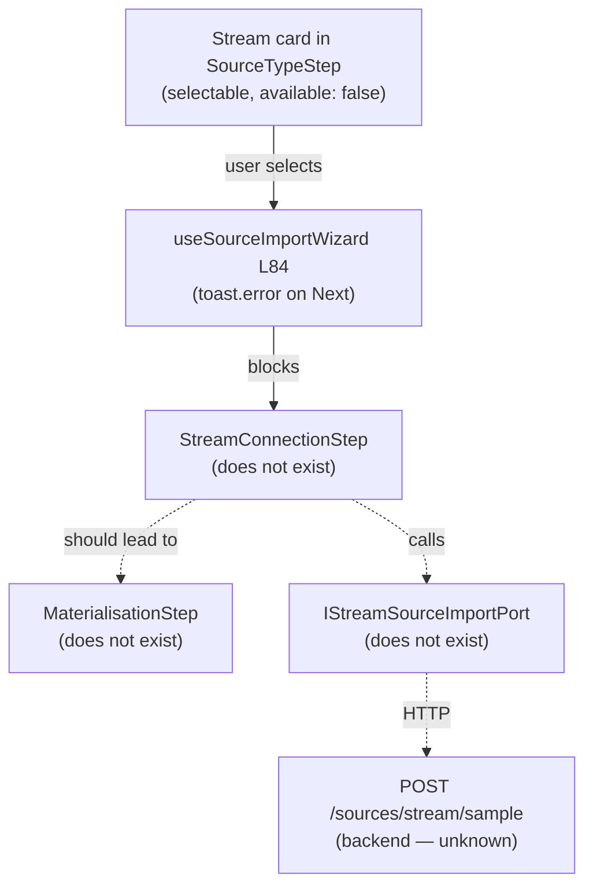

# Fowler Analysis — Stream Source Type Unimplemented (Kafka / Kinesis / Event Streams)

## Scope

The wizard declares `stream` as a `DataObjectSourceType` and renders a
"Stream" card with badge `not available yet`. Like `file` and `api`, the card
is selectable but pressing Next fires `toast.error`. There is no stream
configuration step, no topic/broker form, no schema sampling surface, and no
port contract for stream sources.

Stream import is architecturally more complex than file or API import because:

- streams are continuous, not request/response;
- schema may be embedded in each message (JSON) or centrally registered
  (Avro/Protobuf via a Schema Registry);
- materialising a stream as a static DataObject node requires a policy
  decision: snapshot semantics, latest-message semantics, or micro-batch.

The review covers:

- `SOURCE_TYPE_OPTIONS` — `stream` entry, `available: false`;
- `useSourceImportWizard.ts` L84 — same `!== 'database'` block;
- `WizardStepContent.tsx` — no stream step;
- `workspace.ts` — no `IStreamSourceImportPort` or stream DTOs;
- absence of any stream configuration UI or broker connectivity concept.

It does not cover:

- backend stream broker connectors (Kafka consumer, Kinesis SDK);
- schema registry integration;
- real-time event replay or backfill;
- stream processing or aggregation.

## Governing Sources

- `AGENTS.md`
- `docs/planning/status/governance-document-rule-inventory.md`
- `docs/guides/ai-work-protocol.md`
- `docs/architecture/command-query-rail-governance.md`
- `apps/web/src/app/components/sourceImportWizard/constants.ts`
- `apps/web/src/app/components/sourceImportWizard/useSourceImportWizard.ts`
- `apps/web/src/app/components/sourceImportWizard/WizardStepContent.tsx`
- `apps/web/src/app/ports/workspace.ts`

## Mature-System Comparison

Mature stream-source registration flows enforce three rules:

1. **Broker + topic config, not a persistent connection** — the user provides
   broker address, topic name, and auth (SASL, TLS, IAM); the system samples N
   messages to infer schema; no long-lived connection is stored in the same
   model as warehouse connections.
2. **Materialisation policy is explicit** — the user chooses how the stream
   maps to a static DataObject: "latest snapshot", "windowed aggregate", or
   "continuous". The choice drives how DVT runs are triggered.
3. **Schema is sampled, not assumed** — the system reads a sample of messages
   (e.g., 100 events) and presents the inferred schema; for Avro/Protobuf, it
   fetches from the schema registry.

The current implementation has no broker config form, no sampling step, and no
materialisation policy selector. A stream node cannot be represented in the
canvas because there is no way to configure one.

## Improved Patterns

| Area                   | Improvement                                                                                          | Mature-system pattern  |
| ---------------------- | ---------------------------------------------------------------------------------------------------- | ---------------------- |
| Broker config step     | `StreamConnectionStep`: broker URL, topic, auth type, optional schema registry URL.                  | Capability-scoped step |
| Schema sampling        | After connection test, sample N messages via `POST /sources/stream/sample`; show inferred schema.    | Schema sampling        |
| Materialisation policy | New `MaterialisationStep`: choose snapshot / windowed / continuous; stored in `ImportSourcesResult`. | Policy-explicit import |
| Port contract          | `IStreamSourceImportPort` with `testBroker`, `sampleSchema`, `importStreamSource`.                   | Capability-scoped port |

## Antipatterns Detected

| Antipattern                | Evidence                                                                                               | Fowler signal       | Impact                                                                                          |
| -------------------------- | ------------------------------------------------------------------------------------------------------ | ------------------- | ----------------------------------------------------------------------------------------------- |
| Ghost source type card     | `stream` card is selectable; Next fires toast error.                                                   | Ghost interaction   | User sees a real product surface, clicks it, gets an error — erodes trust.                      |
| No materialisation concept | Stream-to-DataObject mapping is undefined; there is no materialisation step or policy field anywhere.  | Responsibility void | Even if a stream were imported, the canvas node would have no semantic for how it maps to data. |
| Broker ≠ Connection        | `SourceImportWizardState.connections` is `WarehouseConnection[]`; a Kafka broker is a different shape. | DTO scope creep     | A broker config cannot be stored in the existing connections field without polluting the type.  |
| No schema registry concept | No `schemaRegistry` field, no Avro/Protobuf handling, no mention of schema versioning.                 | Missing concept     | Avro streams would require the user to manually describe their own schema — a major UX gap.     |

## Component Grouping

| Component                        | Owned concern                                       | Current state                         | Target state                                                      |
| -------------------------------- | --------------------------------------------------- | ------------------------------------- | ----------------------------------------------------------------- | ----------------------------------------- |
| `SOURCE_TYPE_OPTIONS` (`stream`) | Declare stream source availability.                 | `available: false`; card clickable.   | Disabled card.                                                    |
| `useSourceImportWizard` L84      | Guard against unimplemented types.                  | Hardcoded toast.                      | Capability registry.                                              |
| `WizardStepContent` `connection` | Render correct config step.                         | Always renders `ConnectionStep`.      | Renders `StreamConnectionStep` for `stream`.                      |
| `IStreamSourceImportPort` (new)  | Typed boundary for broker config, sampling, import. | Does not exist.                       | `testBroker`, `sampleSchema`, `importStreamSource`.               |
| `StreamConnectionStep` (new)     | Collect broker config and auth.                     | Does not exist.                       | Broker URL, topic, auth (SASL/TLS/IAM), optional schema registry. |
| `MaterialisationStep` (new)      | Capture stream-to-DataObject mapping policy.        | Does not exist.                       | Radio: snapshot / windowed / continuous; stored in import config. |
| `SourceImportWizardState`        | Hold wizard state.                                  | `connections: WarehouseConnection[]`. | Add `streamConfig: StreamBrokerConfig                             | null`; union-typed alongside `apiConfig`. |

## Repetitions

- The disabled-card fix and capability registry are shared with `file` and
  `api` (same guard, same antipattern).
- The `WizardStepContent` branching for the connection/config step is repeated
  for each source type; a `renderConfigStep(selectedSourceType)` helper
  dispatches to the correct component once, rather than a growing `case`.
- The `SourceImportWizardState` extension follows the same pattern for all
  non-database source types; a union `sourceConfig` field avoids accumulating
  separate nullable fields for each type.

## Opportunities

1. **Disable stream card and use capability registry** — same fix as `file`
   and `api`; a single change covers all three types.

2. **Add `IStreamSourceImportPort` to `workspace.ts`**
   — `testBroker(config: StreamBrokerConfig): Promise<TestResult>`,
   `sampleSchema(config, sampleSize): Promise<StreamSchema>`,
   `importStreamSource(input: StreamImportInput): Promise<ImportSourcesResult>`.

3. **Add `StreamConnectionStep` with broker config and test pre-flight**
   — broker URL, topic, auth type; "Test Broker" button; optional schema
   registry URL for Avro/Protobuf topics.

4. **Add `MaterialisationStep` to the wizard flow for stream sources**
   — materialisation policy is critical for how DVT interprets a stream node;
   it must be captured at import time, not left implicit.

5. **Add `streamConfig` to `SourceImportWizardState`**
   — or refactor to a union `sourceConfig` field covering all non-database
   types.

## Drift To Fix

| Drift                                                                | Fix                                                                                                                              |
| -------------------------------------------------------------------- | -------------------------------------------------------------------------------------------------------------------------------- |
| `constants.ts` — `stream` card clickable despite `available: false`. | Disable card.                                                                                                                    |
| `useSourceImportWizard.ts` L84 — same guard blocks stream.           | Capability registry.                                                                                                             |
| `workspace.ts` — no `IStreamSourceImportPort`.                       | Add port interface.                                                                                                              |
| `WizardStepContent` — no `StreamConnectionStep` branch.              | Add branch for `stream`.                                                                                                         |
| No materialisation policy concept anywhere in the frontend.          | Add `MaterialisationStep` and include policy in `StreamImportInput`; backend must store and use this when creating stream nodes. |

## ADR Assessment

An ADR is required for stream sources because materialisation policy
(snapshot vs. windowed vs. continuous) is a new domain concept that changes
how DVT runs interpret stream-backed DataObject nodes. This is a behavioural
change to the execution model, not just a UI addition. The ADR must document
the chosen default materialisation policy and its effect on plan generation.

## Fowler Opportunity Matrix

| scenario                                                                                      | opportunity                                                                                            | Fowler pattern                         | DDD owner                                                        | command/query rail                                                | implementation surfaces                                                            | unit or package test                                                              | architecture test                                                           | user-flow test                                                                             | out of scope              |
| --------------------------------------------------------------------------------------------- | ------------------------------------------------------------------------------------------------------ | -------------------------------------- | ---------------------------------------------------------------- | ----------------------------------------------------------------- | ---------------------------------------------------------------------------------- | --------------------------------------------------------------------------------- | --------------------------------------------------------------------------- | ------------------------------------------------------------------------------------------ | ------------------------- |
| User selects Stream card, presses Next, gets toast — no broker config path.                   | Ghost source type — Stream card selectable but has no implementation.                                  | Ghost interaction.                     | `SourceTypeStep` + `useSourceImportWizard`.                      | None.                                                             | `constants.ts` (disable), `useSourceImportWizard.ts` (capability check).           | Unit: stream card is not clickable when available is false.                       | Architecture: no selectable card has available: false.                      | Playwright: stream card shows "Coming soon".                                               | Kafka consumer backend.   |
| User imports a Kafka topic; system has no way to express how the stream maps to a DataObject. | No materialisation policy — stream-to-DataObject semantic is undefined; node has no execution meaning. | Missing concept / Responsibility void. | `MaterialisationStep` (new) + DVT execution model.               | Command rail: `ImportStreamSource` — POST /sources/stream/import. | New `MaterialisationStep.tsx`, `StreamImportInput` DTO, `IStreamSourceImportPort`. | Unit: ImportStreamSource input includes materialisation policy.                   | Architecture: StreamImportInput has a required materialisationPolicy field. | Playwright: user selects snapshot policy; stream node appears in canvas with policy badge. | Stream processing engine. |
| User imports an Avro topic; schema is embedded in schema registry; no UI to configure it.     | No schema registry concept — only JSON schema inference by sampling; Avro/Protobuf unsupported.        | Missing concept.                       | `StreamConnectionStep` + `IStreamSourceImportPort.sampleSchema`. | Same ImportStreamSource rail.                                     | `StreamConnectionStep.tsx` (optional schema registry URL field).                   | Unit: when schemaRegistryUrl is provided, sampleSchema uses Avro deserialisation. | Architecture: StreamBrokerConfig has optional schemaRegistryUrl.            | Playwright: user provides schema registry URL; schema preview shows Avro field names.      | Schema registry backend.  |
