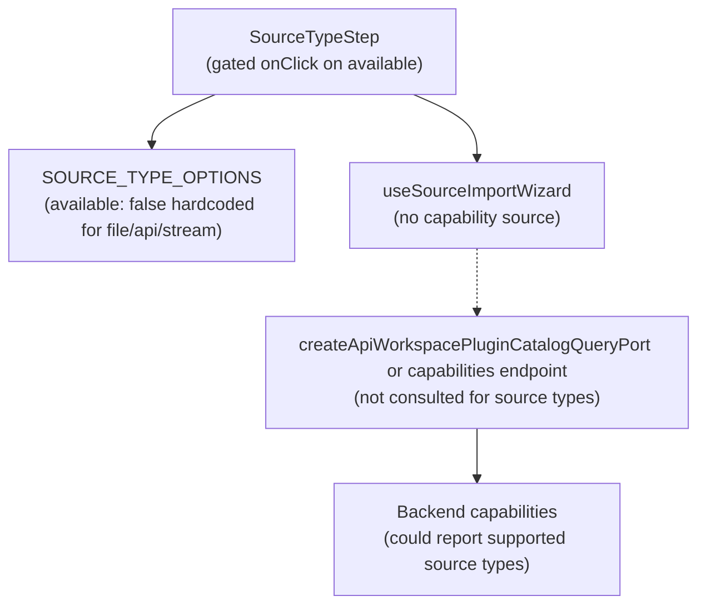

# Fowler Analysis — Source Import Wizard Source Types Hardcoded Unavailable

## Scope

This analysis reviews the gap that permanently disables File, API, and Stream
source types in the source import wizard regardless of backend capability.

The review covers:

- `sourceImportWizard/constants.ts` — `SOURCE_TYPE_OPTIONS` array has
  `available: false` hardcoded for `file`, `api`, and `stream` types;
  `database` is the only type with `available: true`;
- `SourceTypeStep.tsx` — the card `onClick` handler is gated on
  `sourceType.available`; clicking a card with `available: false` produces no
  action; the card renders with `opacity-70` and a "not available yet" badge;
- the availability policy being a compile-time constant rather than a
  runtime capability check, so even if the backend gains File/API/Stream
  support, the frontend must be manually updated;
- the absence of any capability-driven mechanism to expose or hide source types
  based on what the connected backend actually supports.

It does not cover:

- backend File/API/Stream adapter implementations;
- the warehouse database source import flow (already partially implemented);
- connection step UI for non-database sources;
- the `sourceImportAvailable: false` flag in `apiWorkspacePortCapabilities`
  (covered in the canvas source import backend gap analysis).

## Governing Sources

- `AGENTS.md`
- `docs/planning/status/governance-document-rule-inventory.md`
- `docs/guides/ai-work-protocol.md`
- `docs/architecture/command-query-rail-governance.md`
- `docs/architecture/fowler-opportunity-planning-governance.md`
- `docs/architecture/components/web/frontend-fowler-implementation-pattern.md`
- `apps/web/src/app/components/sourceImportWizard/constants.ts`
- `apps/web/src/app/components/sourceImportWizard/SourceTypeStep.tsx`
- `apps/web/src/app/components/sourceImportWizard/useSourceImportWizard.ts`
- `apps/web/src/app/services/workspace/workspacePorts.api.ts`

## Mature-System Comparison

Mature source import UIs apply two patterns for feature availability:

1. **Capability-driven availability** — source type options are enabled or
   disabled based on what the connected backend reports as supported via a
   capabilities endpoint, not based on compile-time booleans in a constants
   file.
2. **Future types are hidden, not degraded** — source types that are not yet
   available in any configuration are either hidden or rendered as a labelled
   "coming soon" state that is clearly non-interactive; they are not rendered
   as interactive-looking cards that silently ignore clicks.

The current implementation treats both patterns incorrectly: availability is
hardcoded, and the disabled cards look interactive (same card layout, visible
icon, visible text) but produce no action on click.

## Improved Patterns

| Area                  | Improvement                                                                                                                     | Mature-system pattern                          |
| --------------------- | ------------------------------------------------------------------------------------------------------------------------------- | ---------------------------------------------- |
| Availability source   | `available` field is derived from a backend capabilities response, not from a compile-time constant.                            | Capability-driven feature flag                 |
| Disabled card UX      | Unavailable source type cards are clearly non-interactive: `cursor-not-allowed`, no hover effect, explicit "Coming soon" label. | Explicit disabled state                        |
| Configuration point   | The availability constant is the fallback; the runtime availability is driven by a capability object from the workspace port.   | Runtime configuration over compile-time config |
| No click for disabled | `onClick` is not attached to disabled cards at all (not gated inside the handler); disabled cards use `aria-disabled`.          | Accessible disabled state                      |

## Antipatterns Detected

| Antipattern                | Evidence                                                                                                            | Fowler signal             | Impact                                                                                             |
| -------------------------- | ------------------------------------------------------------------------------------------------------------------- | ------------------------- | -------------------------------------------------------------------------------------------------- |
| Hardcoded configuration    | `SOURCE_TYPE_OPTIONS` sets `available: false` as a compile-time constant; backend capability has no influence.      | Configuration as code     | Adding File/API/Stream backend support requires a frontend code change; capability is not dynamic. |
| Ghost interaction          | Disabled cards render with the same card layout as enabled cards; `onClick` silently no-ops on click.               | Ghost interaction         | User clicks a card, nothing happens, and there is no feedback explaining why.                      |
| Wrong configuration owner  | Source type availability is a product configuration decision (what the backend supports) captured as a UI constant. | Wrong authority           | Frontend owns a decision that should be driven by backend capability discovery.                    |
| Missing disabled semantics | Disabled cards have no `aria-disabled`, no `cursor-not-allowed`, and no focus ring treatment for keyboard users.    | Accessibility antipattern | Keyboard users can tab to the card but receive no indication it is not actionable.                 |

## Component Grouping

| Component               | Owned concern                                                    | Current state                                                          | Target state                                                                                                    |
| ----------------------- | ---------------------------------------------------------------- | ---------------------------------------------------------------------- | --------------------------------------------------------------------------------------------------------------- |
| `SOURCE_TYPE_OPTIONS`   | Define available source type options.                            | `available: false` hardcoded for file/api/stream.                      | `available` is a fallback; runtime availability is injected from backend capability response.                   |
| `SourceTypeStep`        | Render source type selection with correct interactive semantics. | `onClick` gated on `available`; disabled cards are visually ambiguous. | Disabled cards use `aria-disabled`, `cursor-not-allowed`, no `onClick` at all; "Coming soon" badge is distinct. |
| `useSourceImportWizard` | Manage wizard state and data loading.                            | Does not consult any capability source for source type availability.   | Loads supported source types from backend capability; passes to `SourceTypeStep`.                               |
| Backend capabilities    | Report which source types the connected backend supports.        | Not consulted for source type availability.                            | Returns supported source type list; wizard derives `available` flags at runtime.                                |

## Repetitions

- The `available` boolean on `SourceTypeOption` is the same field used in
  `SourceTypeStep` to gate `onClick` and apply visual treatment. When
  availability becomes dynamic, both places need to be consistent.
- The "not available yet" badge text in `SourceTypeStep` is duplicated in
  the display logic; it should be driven by a single resolved availability
  reason string.

## Opportunities

1. **Replace hardcoded `available: false` with a capability-derived flag**
   — fetch supported source types from the backend capabilities response;
   derive `available` at runtime; `SOURCE_TYPE_OPTIONS` becomes a display
   metadata registry, not an availability authority.

2. **Apply accessible disabled semantics to unavailable cards**
   — use `aria-disabled`, `cursor-not-allowed`, `tabIndex={-1}`, and remove
   `onClick` entirely from disabled cards; add a tooltip or visible reason
   ("Not supported by this workspace configuration").

3. **Distinguish "coming soon" from "not available in this workspace"**
   — a source type that is globally unavailable (no backend support) and a
   source type that is available but not configured for this workspace are
   different states; the UI should communicate both distinctly.

4. **Architecture test — no compile-time feature availability booleans
   for backend-driven capabilities**
   — a lint or architecture test prevents new `available: false` constants
   from being introduced for capabilities that should be backend-driven.

## Drift To Fix

| Drift                                                                        | Fix                                                                                                              |
| ---------------------------------------------------------------------------- | ---------------------------------------------------------------------------------------------------------------- |
| `constants.ts` — `available: false` hardcoded for file, api, stream.         | Source `available` from backend capability response; `constants.ts` is display metadata only.                    |
| `SourceTypeStep.tsx` — `onClick` silently no-ops for unavailable cards.      | Remove `onClick` from disabled cards entirely; add `aria-disabled` and `cursor-not-allowed` to the card element. |
| No capability query in `useSourceImportWizard` for source type availability. | Add a capability query hook call; resolve `availableSourceTypes` from the response; pass to `SourceTypeStep`.    |

## ADR Assessment

No ADR is required for making availability flags dynamic if the backend
capabilities endpoint already exists. An ADR is required if a new
`/api/workspace/capabilities/source-types` endpoint is introduced that defines
a new backend contract for source type feature flags — a new contract boundary
requires an ADR and risk register entry under the ARC policy.

## Fowler Opportunity Matrix

| scenario                                                                                                                 | opportunity                                                                                                                            | Fowler pattern                                      | DDD owner                                                                | command/query rail                                                      | implementation surfaces                                                                     | unit or package test                                                              | architecture test                                                                              | user-flow test                                                                        | out of scope                             |
| ------------------------------------------------------------------------------------------------------------------------ | -------------------------------------------------------------------------------------------------------------------------------------- | --------------------------------------------------- | ------------------------------------------------------------------------ | ----------------------------------------------------------------------- | ------------------------------------------------------------------------------------------- | --------------------------------------------------------------------------------- | ---------------------------------------------------------------------------------------------- | ------------------------------------------------------------------------------------- | ---------------------------------------- |
| User opens source import wizard; File, API, and Stream tiles are visible but non-interactive; clicking produces nothing. | Ghost interaction — disabled cards render identically to enabled cards; `onClick` silently no-ops.                                     | Ghost interaction / Missing disabled semantics.     | `SourceTypeStep` (presentation).                                         | None — UI only.                                                         | `SourceTypeStep.tsx` (remove onClick from disabled, add aria-disabled, cursor-not-allowed). | Unit: clicking a disabled card does not call `onSelectSourceType`.                | Architecture: no `onClick` handler on `sourceType.available === false` cards.                  | Playwright: clicking File tile produces no state change and shows a tooltip.          | Backend File adapter.                    |
| Backend gains File source support; wizard still shows File as "not available" because constant is hardcoded.             | Hardcoded configuration — `available: false` in compile-time constant ignores backend capability.                                      | Configuration as code / Wrong authority.            | `SOURCE_TYPE_OPTIONS` (constants) + `useSourceImportWizard` (data hook). | Query rail: backend capabilities endpoint for source type availability. | `constants.ts` (make availability dynamic), `useSourceImportWizard.ts` (load capability).   | Unit: when backend reports file as available, `SourceTypeStep` enables File tile. | Architecture: `SOURCE_TYPE_OPTIONS` has no `available: false` for backend-driven capabilities. | Playwright: after backend enables File, wizard enables File tile without code change. | Backend File adapter implementation.     |
| Keyboard user tabs to a disabled source type card; no indication it is not actionable.                                   | Missing accessible disabled semantics — cards have no `aria-disabled`, `tabIndex`, or focus treatment.                                 | Accessibility antipattern / Ghost interaction.      | `SourceTypeStep` (presentation).                                         | None — UI only.                                                         | `SourceTypeStep.tsx` (add aria-disabled, tabIndex=-1, cursor-not-allowed).                  | Unit: disabled card has `aria-disabled="true"` and no tabIndex.                   | Architecture: all disabled interactive cards have aria-disabled.                               | Axe a11y test: no keyboard-accessible non-interactive elements.                       | Backend source adapters.                 |
| User sees "not available yet" badge but cannot tell if a source type will ever be available or is just not configured.   | Missing availability reason — "not available yet" does not distinguish "globally unsupported" from "not configured in this workspace". | Missing state differentiation / Misleading display. | `SourceTypeStep` (presentation) + availability model.                    | None — UI only (until backend supports reason codes).                   | `SourceTypeStep.tsx` (add reason label), `constants.ts` (add `reason` field).               | Unit: card shows correct reason label for each availability state.                | None.                                                                                          | Playwright: hovering over disabled File tile shows "Coming in a future release".      | Backend source adapter availability API. |
