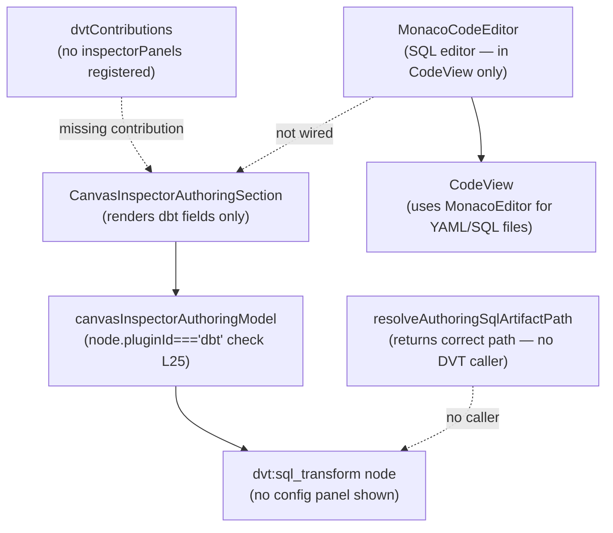

# Fowler Analysis — SQL Authoring Panel Missing From DVT Transform Nodes

## Scope

This analysis reviews the gap that prevents users from writing SQL inside a
`dvt:sql_transform` node in the canvas inspector. The Monaco SQL editor exists
in the app but is not wired to DVT transform nodes.

The review covers:

- `dvtContributions.ts` — the DVT plugin registers no `inspectorPanels`;
  `dvt:sql_transform` nodes have no authoring surface in the inspector;
- `CanvasInspectorAuthoringSection.tsx` (L71-81) — the authoring section
  renders `dbt`-specific fields only; DVT nodes receive an empty panel;
- `MonacoCodeEditor.tsx` — a fully functional SQL editor component that is
  used in `CodeView` but is not referenced from any DVT inspector panel;
- `canvasInspectorAuthoringModel.ts` (L25) — the authoring model generates
  config fields only for `node.pluginId === 'dbt'`; DVT nodes get `{}`;
- `resolveAuthoringSqlArtifactPath(node)` — a utility that already resolves
  the SQL artifact path for a node — exists but has no DVT caller.

Window function authoring is a specific case of SQL authoring: a user writing
`ROW_NUMBER() OVER (PARTITION BY … ORDER BY …)` in a transform node body. It
is not a separate feature; it is a consequence of the SQL editor not being
wired to DVT nodes at all.

It does not cover:

- dbt model authoring (partially implemented via dbt-specific inspector fields);
- SQL linting or semantic validation;
- schema-aware autocomplete for column names;
- backend SQL execution engine.

## Governing Sources

- `AGENTS.md`
- `docs/planning/status/governance-document-rule-inventory.md`
- `docs/guides/ai-work-protocol.md`
- `docs/architecture/command-query-rail-governance.md`
- `apps/web/src/app/plugins/dvt/dvtContributions.ts`
- `apps/web/src/app/plugins/dvt/dvtNodeTypeCatalog.ts`
- `apps/web/src/app/views/canvas/CanvasInspectorAuthoringSection.tsx`
- `apps/web/src/app/views/canvas/canvasInspectorAuthoringModel.ts`
- `apps/web/src/app/components/monaco/MonacoCodeEditor.tsx`
- `apps/web/src/app/views/canvas/resolveAuthoringSqlArtifactPath.ts`

## Mature-System Comparison

Mature data transformation tools apply two structural rules for SQL authoring:

1. **Each transform node type has its own authoring surface** — a SQL
   transform node always opens a SQL editor in its inspector; a YAML config
   node opens a YAML editor; the node type drives the panel, not a
   plugin-agnostic conditional.
2. **Window functions are first-class SQL** — the SQL editor does not restrict
   or template window function syntax; the user writes standard SQL and the
   editor provides syntax highlighting, basic linting, and a preview mode.

The current implementation breaks both rules: DVT transform nodes have no
authoring surface at all, and the SQL editor (which supports window functions
by default) is isolated in `CodeView` with no connection to the canvas.

## Improved Patterns

| Area                    | Improvement                                                                                                            | Mature-system pattern        |
| ----------------------- | ---------------------------------------------------------------------------------------------------------------------- | ---------------------------- |
| Inspector panel wiring  | DVT plugin registers a `dvt:sql_transform` inspector panel backed by `MonacoCodeEditor` for SQL authoring.             | Plugin-contributed inspector |
| Authoring model         | `canvasInspectorAuthoringModel.ts` generates DVT-specific config fields (entrypoint, materialization, SQL content).    | Node-type-driven authoring   |
| SQL artifact path       | `resolveAuthoringSqlArtifactPath(node)` already returns the correct path; connect it to the editor's read/write cycle. | Existing utility reuse       |
| Window function support | Standard SQL syntax in the Monaco editor natively supports window functions; no extra configuration needed.            | Language-default capability  |

## Antipatterns Detected

| Antipattern                 | Evidence                                                                                                           | Fowler signal              | Impact                                                                                                |
| --------------------------- | ------------------------------------------------------------------------------------------------------------------ | -------------------------- | ----------------------------------------------------------------------------------------------------- |
| Missing plugin contribution | `dvtContributions.ts` registers no `inspectorPanels`; `dvt:sql_transform` nodes are uneditable.                    | Responsibility void        | Users can create DVT transform nodes but cannot configure them; the node is a canvas decoration only. |
| Orphan utility              | `resolveAuthoringSqlArtifactPath(node)` returns the correct SQL file path but has no DVT caller.                   | Dead code / Orphan utility | The infrastructure for SQL path resolution exists but nothing uses it for DVT nodes.                  |
| Hardcoded plugin check      | `canvasInspectorAuthoringModel.ts` L25: `node.pluginId === 'dbt'` — DVT nodes receive `{}` config unconditionally. | Hardcoded discriminator    | Adding a new plugin requires editing the authoring model; it should dispatch to plugin contributions. |
| Component isolation         | `MonacoCodeEditor` is only imported in `CodeView` and `DiffView`; no canvas inspector imports it.                  | Boundary drift             | The SQL editor capability exists but is siloed away from the authoring surface that needs it.         |

## Component Grouping

| Component                               | Owned concern                                                 | Current state                                             | Target state                                                                                    |
| --------------------------------------- | ------------------------------------------------------------- | --------------------------------------------------------- | ----------------------------------------------------------------------------------------------- |
| `dvtContributions.ts`                   | Register DVT plugin contributions including inspector panels. | No `inspectorPanels` key.                                 | Registers a `dvt:sql_transform` inspector panel using `MonacoCodeEditor` for SQL authoring.     |
| `canvasInspectorAuthoringModel.ts`      | Generate authoring config for any node type.                  | Hardcoded `node.pluginId === 'dbt'` check; DVT gets `{}`. | Dispatches to plugin-contributed authoring model factories; DVT plugin provides its own fields. |
| `CanvasInspectorAuthoringSection`       | Render authoring fields for the selected node.                | Only renders dbt fields; DVT nodes render nothing.        | Renders plugin-contributed panels based on `node.pluginId`; DVT panel shows SQL editor.         |
| `resolveAuthoringSqlArtifactPath(node)` | Resolve the SQL artifact file path for a node.                | Exists and works; has no DVT caller.                      | Called from the DVT SQL inspector panel to load and save the SQL content.                       |
| `MonacoCodeEditor`                      | Provide SQL/YAML editor with syntax highlighting.             | Imported only in `CodeView` and `DiffView`.               | Also imported in the DVT `sql_transform` inspector panel for inline SQL authoring.              |

## Repetitions

- The `node.pluginId === 'dbt'` conditional in `canvasInspectorAuthoringModel`
  will need a parallel `node.pluginId === 'dvt'` branch unless the model is
  refactored to dispatch to plugin-registered factories. The refactor is
  preferable to growing the conditional chain with each new plugin.
- `MonacoCodeEditor` is instantiated with the same `language="sql"` prop in
  both `CodeView` and `DiffView`. The DVT inspector panel will be a third
  instantiation of the same pattern — worth extracting a shared SQL editor
  hook that manages load/save/dirty state.

## Opportunities

1. **Register a `dvt:sql_transform` inspector panel in `dvtContributions.ts`**
   — add an `inspectorPanels` key; the panel loads the SQL content from
   `resolveAuthoringSqlArtifactPath(node)` and renders `MonacoCodeEditor`
   with `language="sql"`.

2. **Refactor `canvasInspectorAuthoringModel.ts` to dispatch to plugin
   contributions**
   — replace the `node.pluginId === 'dbt'` hardcoded check with a
   `pluginRegistry.getAuthoringModel(node.pluginId)` dispatch; each plugin
   provides its own config generator; the model is no longer a switch
   statement that grows with each new plugin.

3. **Reuse `resolveAuthoringSqlArtifactPath(node)` in the DVT inspector**
   — load the SQL file content on panel mount; save on Ctrl+S or blur;
   pass the dirty state to the canvas dirty indicator.

4. **Window functions work by default**
   — once the Monaco SQL editor is wired to DVT nodes, window function
   syntax (`ROW_NUMBER() OVER (…)`) works out of the box via Monaco's SQL
   language mode; no additional implementation is required.

## Drift To Fix

| Drift                                                                               | Fix                                                                                                                                           |
| ----------------------------------------------------------------------------------- | --------------------------------------------------------------------------------------------------------------------------------------------- |
| `dvtContributions.ts` — no `inspectorPanels` key.                                   | Add `inspectorPanels: { 'dvt:sql_transform': DvtSqlTransformInspectorPanel }` using `MonacoCodeEditor`.                                       |
| `canvasInspectorAuthoringModel.ts` L25 — hardcoded `node.pluginId === 'dbt'` check. | Refactor to plugin dispatch; DVT plugin registers its own authoring model factory.                                                            |
| `resolveAuthoringSqlArtifactPath(node)` — no DVT caller.                            | Call from `DvtSqlTransformInspectorPanel.onMount` to load SQL content; call `writeFile` on save.                                              |
| `MonacoCodeEditor` — imported only in `CodeView`, not in any inspector panel.       | Import in `DvtSqlTransformInspectorPanel`; pass `language="sql"`, initial value from artifact path, and `onChange` that marks the node dirty. |

## ADR Assessment

No ADR is required for wiring the SQL editor to DVT nodes if the plugin
contribution pattern already exists in the codebase. An ADR is required if
this work introduces a new `inspectorPanels` contribution slot in the plugin
API that did not previously exist — this is a new plugin contract surface that
other plugins may depend on.

## Fowler Opportunity Matrix

| scenario                                                                                                                    | opportunity                                                                                                                             | Fowler pattern                                   | DDD owner                                                                       | command/query rail                                                                                   | implementation surfaces                                                                                                                           | unit or package test                                                                                           | architecture test                                                                    | user-flow test                                                                     | out of scope                                |
| --------------------------------------------------------------------------------------------------------------------------- | --------------------------------------------------------------------------------------------------------------------------------------- | ------------------------------------------------ | ------------------------------------------------------------------------------- | ---------------------------------------------------------------------------------------------------- | ------------------------------------------------------------------------------------------------------------------------------------------------- | -------------------------------------------------------------------------------------------------------------- | ------------------------------------------------------------------------------------ | ---------------------------------------------------------------------------------- | ------------------------------------------- |
| User creates a `dvt:sql_transform` node; clicks it in the canvas; inspector shows no config panel — the node is uneditable. | Missing plugin contribution — `dvtContributions` registers no `inspectorPanels`; authoring model returns `{}` for DVT nodes.            | Responsibility void / Orphan utility.            | `dvtContributions` (plugin) + `CanvasInspectorAuthoringSection` (presentation). | Command rail: `UpdateDvtNodeSqlContent` — write SQL artifact via `IWorkspaceFileContentCommandPort`. | `dvtContributions.ts` (add inspectorPanels), `CanvasInspectorAuthoringSection.tsx` (render DVT panel), `DvtSqlTransformInspectorPanel.tsx` (new). | Unit: DVT sql_transform node renders a SQL editor in the inspector.                                            | Architecture: dvtContributions has an inspectorPanels key.                           | Playwright: user creates DVT node, opens inspector, writes SQL, saves.             | SQL linting; schema autocomplete.           |
| User wants to write a window function in a DVT transform; there is nowhere to write SQL at all.                             | SQL editor isolation — `MonacoCodeEditor` exists but is only used in CodeView; it is not accessible from the canvas inspector.          | Boundary drift / Component isolation.            | `MonacoCodeEditor` (component) + `DvtSqlTransformInspectorPanel` (new panel).   | Same `UpdateDvtNodeSqlContent` command rail.                                                         | `DvtSqlTransformInspectorPanel.tsx` (import MonacoCodeEditor), `resolveAuthoringSqlArtifactPath.ts` (call for DVT).                               | Unit: MonacoCodeEditor renders inside inspector with SQL language mode.                                        | Architecture: MonacoCodeEditor is imported from at least one inspector panel.        | Playwright: user types window function SQL in inspector; plan preview reflects it. | Window function validation; execution cost. |
| Adding a new plugin requires editing `canvasInspectorAuthoringModel.ts` to add a new `pluginId` branch.                     | Hardcoded discriminator — `node.pluginId === 'dbt'` prevents new plugins from contributing authoring models without touching core code. | Hardcoded discriminator / Open/closed violation. | `canvasInspectorAuthoringModel` (core) + plugin contributions.                  | None — structural only.                                                                              | `canvasInspectorAuthoringModel.ts` (refactor to dispatch), `dvtContributions.ts` and `dbtContributions.ts` (register factories).                  | Unit: adding a mock plugin contribution is reflected in the authoring model without code changes to the model. | Architecture: `canvasInspectorAuthoringModel` has no string literals for plugin IDs. | None.                                                                              | Backend execution model.                    |
