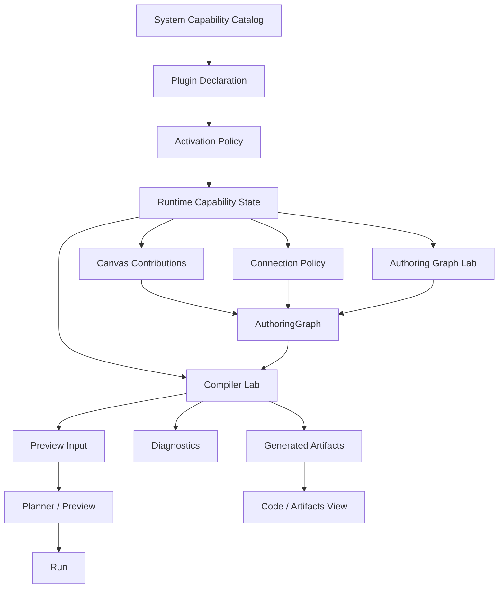
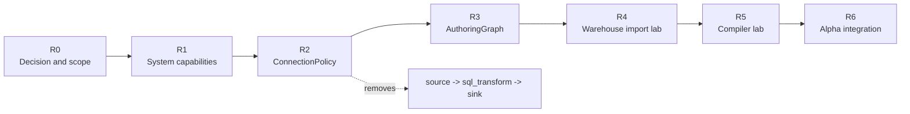

# Authoring Graph Lab Roadmap

## Decision

DVT is pre-alpha. The artificial `source -> sql_transform -> sink` profile is not a legacy mode to preserve. It is a wrong bootstrap abstraction to remove before it hardens into product architecture.

This roadmap defines a short-lived internal lab to converge:

- system-owned capabilities
- plugin declarations
- one connection policy
- one internal authoring graph
- one internal authoring graph compiler path

No public contracts are introduced in this roadmap. No `v2` contract is created. No compatibility layer is kept for the three-node transformation profile.

## Capability ownership

The system owns the capability catalog.

Plugins declare what they can contribute or request. The system activates or deactivates those capabilities according to environment, service availability, policy, health, permissions, and route context.

```txt
Plugin declaration != active capability
```

Target rule:

```txt
SystemCapabilityCatalog
  + PluginCapabilityDeclaration
  + ActivationPolicy
  + Runtime / environment state
  => ActivatedCapability[]
```

## Target map



## Phase roadmap



## R0 — Decision and scope

### Goal

Remove the three-node transformation profile as a product assumption and define the internal convergence path.

### Steps

1. Record this roadmap under `buzon/`.
2. Keep scope internal to the app/lab.
3. Forbid public contract evolution during this phase.
4. Forbid compatibility mode for the old three-node profile.

### Checks

- No changes under `packages/@dvt/contracts/**`.
- No changes under `docs/contracts/**` except future cleanup if explicitly requested.
- No `TransformationFlow*.v2` files.
- No feature work that extends the three-node profile.

### Definition of Done

- The roadmap states that the three-node profile is removed, not preserved.
- The roadmap states that capabilities are system-owned.
- The roadmap defines measurable phases, checks, and DoD.

## R1 — System capabilities

### Goal

Introduce an internal system-owned capability activation model.

### Steps

1. Create an internal system capability catalog.
2. Map coarse plugin capability declarations to system capability ids.
3. Evaluate activation from plugin declaration plus services plus environment disabled capabilities.
4. Emit explicit inactive reasons.

### Checks

- A plugin cannot activate a capability by declaration alone.
- Missing service seams produce `service_missing`.
- Environment-disabled capabilities produce `environment_disabled`.
- Non-requested capabilities produce `not_requested`.

### Definition of Done

- `SystemCapabilityCatalog` exists internally.
- Tests prove active and inactive cases.
- The current plugin manifest remains unchanged.
- No public contract is added.

## R2 — ConnectionPolicy

### Goal

Remove the special `source -> sql_transform -> sink` guard and route canvas connections through one system policy.

### Steps

1. Remove `transformationConnectionGuard` from the canvas connection aggregate.
2. Remove tests that enforce exactly three nodes and two edges.
3. Add a system-owned role policy inside the connection evaluation path.
4. Preserve shell invariants: no self-connection, no duplicate edge, no cycles.
5. Preserve plugin rule and cross-plugin bridge diagnostics.

### Checks

- `warehouse:source -> dbt:model` is allowed.
- `dbt:model -> dbt:model` is allowed.
- `dbt:model -> dbt:test` is allowed.
- `dbt:model -> dbt:exposure` is allowed.
- `warehouse:source -> dvt:sink` is rejected by role policy.
- duplicate edges are rejected.
- cycles are rejected.
- self-connections are rejected.

### Definition of Done

- No canvas code imports `transformationConnectionGuard`.
- No active test enforces the three-node graph.
- Connection rejections remain typed and UI-safe.
- No public contract is added.

## R3 — AuthoringGraph

### Goal

Create the internal graph model that lets warehouse import, canvas, code, artifacts, preview, and future compiler work converge.

### Steps

1. Define internal `AuthoringGraph`, `AuthoringNode`, `AuthoringEdge`, `AuthoringArtifactRef`, and `AuthoringDiagnostic`.
2. Map canonical canvas nodes into internal authoring nodes.
3. Preserve metadata needed by warehouse/dbt sources.
4. Add validation diagnostics for duplicate ids and broken endpoints.

### Checks

- Canonical warehouse source nodes project into `warehouse_source`.
- Metadata survives projection.
- Duplicate node ids produce diagnostics.
- Missing edge endpoints produce diagnostics.
- The model has no React dependency.

### Definition of Done

- Internal graph model exists.
- Unit tests cover projection and diagnostics.
- No public contract is added.

## R4 — Warehouse import lab

### Goal

Convert warehouse catalog metadata into internal authoring graph source nodes.

### Steps

1. Normalize connection/table/column metadata.
2. Generate stable node ids and aliases.
3. Add selected tables as `warehouse_source` nodes.
4. Keep import idempotent.
5. Project imported sources into canvas render state.

### Checks

- Same imported table does not duplicate uncontrolled nodes.
- Schema, table, alias, and columns are preserved.
- Empty catalog and failed catalog load are distinct states.
- Imported nodes can connect through ConnectionPolicy.

### Definition of Done

- A controlled catalog fixture imports to authoring nodes.
- Canvas can render imported source nodes.
- ConnectionPolicy validates imported source edges.
- No compiler work is required yet.

## R5 — Compiler lab

### Goal

Introduce an internal pure compiler from `AuthoringGraph` to artifacts, diagnostics, and preview input.

### Steps

1. Validate the graph with ConnectionPolicy and authoring diagnostics.
2. Resolve artifact paths.
3. Generate minimal dbt/source/model artifacts.
4. Emit diagnostics tied to `nodeId` or `edgeId`.
5. Prepare preview input without executing.

### Checks

- Same graph yields the same generated artifacts.
- Invalid graph blocks compile with diagnostics.
- SQL artifacts are not silently empty.
- Compiler does not query warehouse.
- Compiler does not persist state.
- Compiler does not start runs.

### Definition of Done

- Compiler is pure.
- Compiler has deterministic unit tests.
- Preview integration is still behind a controlled seam.

## R6 — Alpha integration

### Goal

Integrate the lab into the product flow after R1-R5 are green.

### Steps

1. Wire capability activation into plugin availability.
2. Wire ConnectionPolicy into canvas connection paths.
3. Wire AuthoringGraph into warehouse import and canvas projection.
4. Wire compiler output into preview.
5. Surface diagnostics in the UI.

### Checks

- User can import source, create/connect model, compile, and preview.
- No path depends on the three-node profile.
- No duplicate preview builders are introduced in views/hooks.
- Diagnostics are visible and actionable.

### Definition of Done

- One product path exists from import to preview.
- The lab is either integrated or deleted; it does not remain a parallel system.
- No compatibility mode for `source -> sql_transform -> sink` remains.

## Global DoD

The iteration is done only when:

1. No new public contract is introduced.
2. No `v2` contract is introduced.
3. No compatibility layer is added for the three-node profile.
4. The plugin does not self-activate capabilities.
5. The system activation model provides explicit active/inactive reasons.
6. The canvas connection path no longer calls the three-node guard.
7. Authoring graph types are internal and React-free.
8. Tests cover the new system-owned capability activation and connection policy.
9. Any unvalidated item is explicitly reported.

## Implementation notes for this branch

This branch starts R0, R1, R2, and the initial R3 model. R4-R6 are intentionally left for follow-up slices because they require end-to-end integration with the warehouse import UI, artifact persistence, and preview orchestration.
